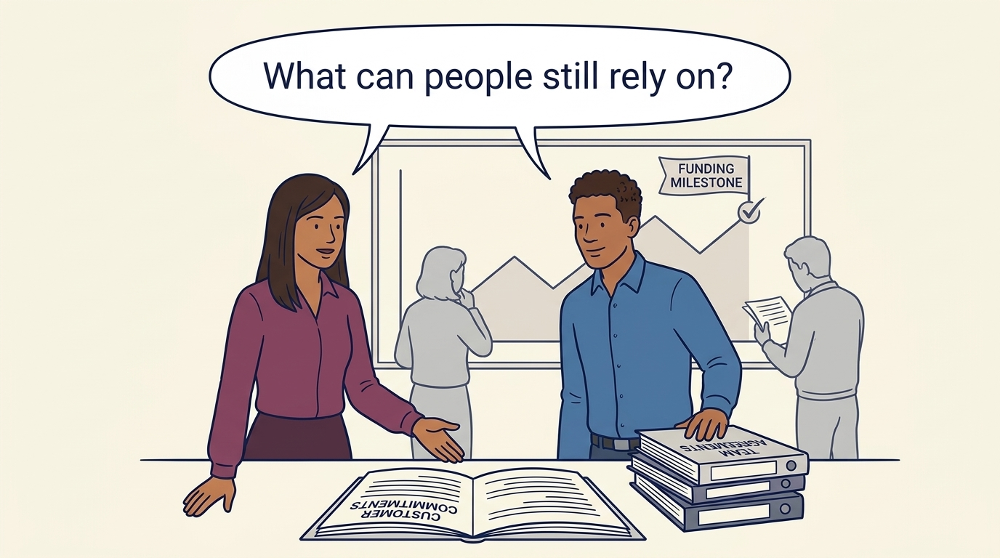
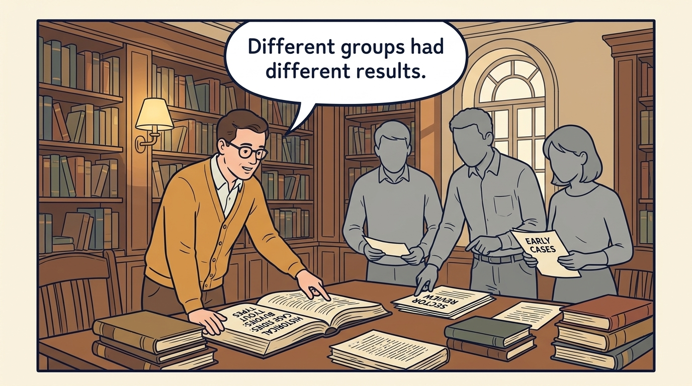
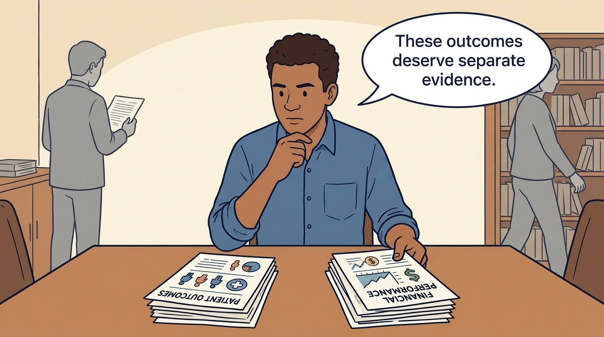
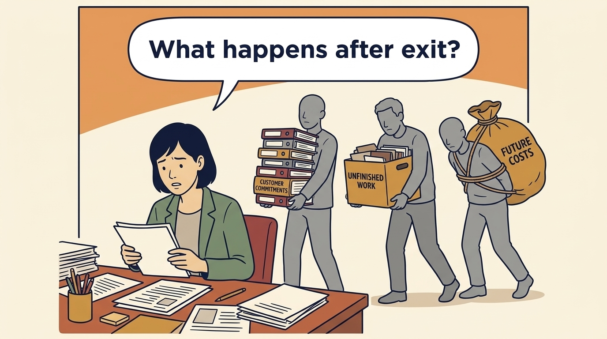
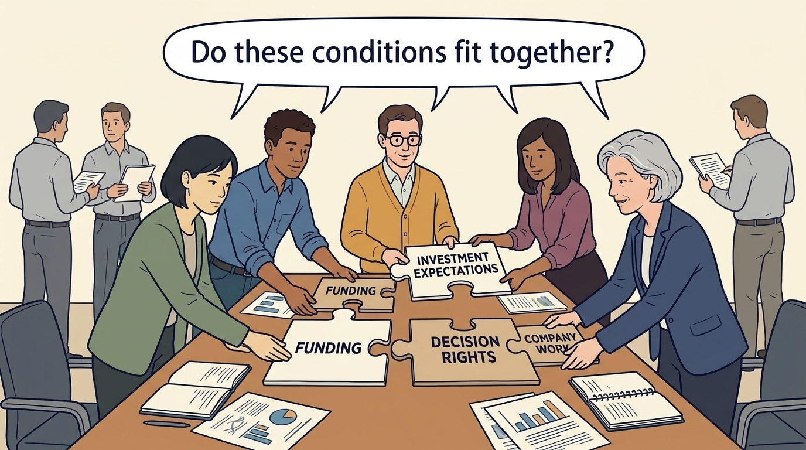
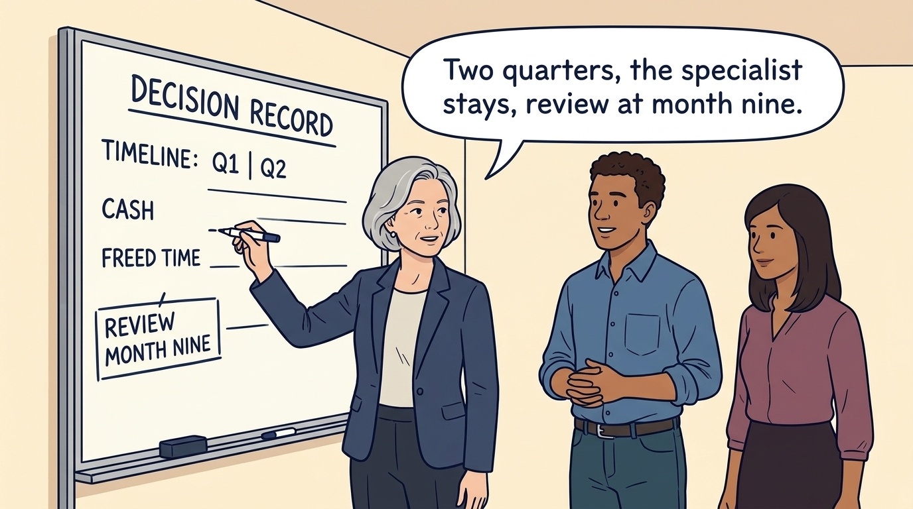

<!-- comic-style
{
  "cast": "MORGAN: a thoughtful investor technology adviser with short dark hair and a green jacket, used in the fund scenarios. ALEX: a practical CTO with curly hair and blue rolled-up sleeves. SAM: a CFO with round glasses and an amber cardigan. PRIYA: a product leader with straight dark hair and plum sleeves. INES: a CEO with short grey hair and a navy jacket. All are fictional; none represents a person in a real case.",
  "style": "Clean editorial explainer comic, dark ink outlines, restrained green, blue, and amber accents on warm white, generous space, readable short speech bubbles, expressive people and simple physical metaphors. No photorealism, logos, dense charts, or title text. Keep the same character appearances throughout the journal."
}
-->

**Comic.** An exit is a decisive reporting event for some investors, not the only horizon for judging the work: product and engineering leaders, customers, employees and suppliers live with the company through and after each funding or ownership event. The panels set the book’s proposed standard of durable success, a company that can keep serving customers, fund its obligations and explain what is unfinished, beside the investor’s result, then follow one fictional Larkspur decision about thirty customers on an old onboarding path: the option that breaks their contracts is refused, the feasible ones are compared, and the chosen transition is funded, dated and reviewed.

Morgan is an investor’s adviser in the fund scenarios; Alex leads technology, Priya leads product, Sam leads finance, and Ines is the CEO. All are fictional, and so are the Larkspur figures. Comparative scenarios use separate assumptions. Historical cases are discussed through documents; the scenes do not reenact real events.

<!-- comic-panel
{
  "id": "01-scene",
  "status": "generated",
  "asset": "assets/images/24-success-for-whom/comic-01-scene.jpeg",
  "aspect_ratio": "16:9",
  "prompt": "Panel 1 of an explainer comic. Priya and Alex stand beside customer and team commitments while a funding milestone is marked behind them. Use one speech bubble with the exact words: \"What can people still rely on?\" Convey: A funding round, sale or corporate milestone does not complete the company’s responsibility to customers, teams and suppliers. Judge what can keep working through change and continued ownership.",
  "alt": "Comic panel: Priya and Alex stand beside customer and team commitments while a funding milestone is marked behind them.",
  "caption": "A funding round, sale or corporate milestone does not complete the company’s responsibility to customers, teams and suppliers. Judge what can keep working through change and continued ownership.",
  "generation": {
    "model": "gemini-3-pro-image-preview",
    "reference_id": "owned-cast-20260913",
    "sha256": "a42b4cfb55953ac6a5b05c2d4fd1cb0b871442cadd0d49fff7ec63a880dabca1"
  }
}
-->

**Panel 1:** A funding round, sale or corporate milestone does not complete the company’s responsibility to customers, teams and suppliers. Judge what can keep working through change and continued ownership.

*Dialogue:* “What can people still rely on?”

<!-- comic-panel
{
  "id": "02-scene",
  "status": "generated",
  "asset": "assets/images/24-success-for-whom/comic-02-scene.jpeg",
  "aspect_ratio": "16:9",
  "prompt": "Panel 2 of an explainer comic. Sam compares different buyout types in historical research. Use one speech bubble with the exact words: \"Different groups had different results.\" Convey: Research results describe the groups and periods studied. Different types of buyout can have different outcomes; an average does not predict every company.",
  "alt": "Comic panel: Sam compares different buyout types in historical research.",
  "caption": "Research results describe the groups and periods studied. Different types of buyout can have different outcomes; an average does not predict every company.",
  "generation": {
    "model": "gemini-3-pro-image-preview",
    "reference_id": "owned-cast-20260913",
    "sha256": "395c4ed365b37e7e514d65d3df4b6dabc5671c08455a87cea499ea705d3ed793"
  }
}
-->

**Panel 2:** Research results describe the groups and periods studied. Different types of buyout can have different outcomes; an average does not predict every company.

*Dialogue:* “Different groups had different results.”

<!-- comic-panel
{
  "id": "03-scene",
  "status": "generated",
  "asset": "assets/images/24-success-for-whom/comic-03-scene.jpeg",
  "aspect_ratio": "16:9",
  "prompt": "Panel 3 of an explainer comic. Alex reads patient-outcome evidence beside financial performance. Use one speech bubble with the exact words: \"These outcomes deserve separate evidence.\" Convey: Stakeholders are people affected by a company. Research on patient outcomes shows why their welfare needs evidence separate from financial performance.",
  "alt": "Comic panel: Alex reads patient-outcome evidence beside financial performance.",
  "caption": "Stakeholders are people affected by a company. Research on patient outcomes shows why their welfare needs evidence separate from financial performance.",
  "generation": {
    "model": "gemini-3-pro-image-preview",
    "reference_id": "owned-cast-20260913",
    "sha256": "4e8bbc6ae6a66a507d6317bbdba34ee46dc5112942496efd76e7649e1c2e3187"
  }
}
-->

**Panel 3:** Stakeholders are people affected by a company. Research on patient outcomes shows why their welfare needs evidence separate from financial performance.

*Dialogue:* “These outcomes deserve separate evidence.”

<!-- comic-panel
{
  "id": "04-scene",
  "status": "generated",
  "asset": "assets/images/24-success-for-whom/comic-04-scene.jpeg",
  "aspect_ratio": "16:9",
  "prompt": "Panel 4 of an explainer comic. Morgan follows obligations beyond the ownership handoff. Use one speech bubble with the exact words: \"What happens after exit?\" Convey: A sale can leave the next owner with unfinished work, customer commitments and future costs. Hand over the obligations with the company, and follow those consequences too.",
  "alt": "Comic panel: Morgan follows obligations beyond the ownership handoff.",
  "caption": "A sale can leave the next owner with unfinished work, customer commitments and future costs. Hand over the obligations with the company, and follow those consequences too.",
  "generation": {
    "model": "gemini-3-pro-image-preview",
    "reference_id": "owned-cast-20260913",
    "sha256": "75c3748095d5a1febb80c6a8db97114de29ae0c12895a15acb28e1d3a7630b3d"
  }
}
-->

**Panel 4:** A sale can leave the next owner with unfinished work, customer commitments and future costs. Hand over the obligations with the company, and follow those consequences too.

*Dialogue:* “What happens after exit?”

<!-- comic-panel
{
  "id": "05-scene",
  "status": "generated",
  "needs_regeneration": true,
  "asset": "assets/images/24-success-for-whom/comic-05-scene.jpeg",
  "aspect_ratio": "16:9",
  "prompt": "Panel 5 of an explainer comic. At a boardroom table, Sam holds a calendar page marked with a 90-day cut-off while Priya holds a small stack of customer contracts whose end dates run past it; Morgan watches. Use one speech bubble, spoken by Priya, with the exact words: \"Not before their contracts allow.\" Convey: Sam proposes ending an old onboarding path for thirty customers in 90 days, saving about €220,000 a year. Several customer contracts run past that date, so the cut-off as written is a breach, not an option. The board refuses it and compares two feasible routes: a consent-based early migration and a two-quarter migration with the specialist kept on.",
  "alt": "Comic panel: Sam holds a calendar page marked with a 90-day cut-off while Priya holds customer contracts whose end dates run past it, and Morgan watches.",
  "caption": "Sam proposes ending an old onboarding path for thirty customers in 90 days, saving about €220,000 a year. Several customer contracts run past that date, so the cut-off as written is a breach, not an option. The board refuses it and compares two feasible routes: a consent-based early migration and a two-quarter migration with the specialist kept on.",
  "generation": {
    "model": "gemini-3-pro-image-preview",
    "reference_id": "owned-cast-20260913",
    "sha256": "ee4ab68d1d1c979809ac7324a75ae81265849d10f565cf8b79cba06e419479ad"
  }
}
-->

**Panel 5:** Sam proposes ending an old onboarding path for thirty customers in 90 days, saving about €220,000 a year. Several customer contracts run past that date, so the cut-off as written is a breach, not an option. The board refuses it and compares two feasible routes: a consent-based early migration and a two-quarter migration with the specialist kept on.

*Dialogue:* “Not before their contracts allow.”

<!-- comic-panel
{
  "id": "06-scene",
  "status": "generated",
  "needs_regeneration": true,
  "asset": "assets/images/24-success-for-whom/comic-06-scene.jpeg",
  "aspect_ratio": "16:9",
  "prompt": "Panel 6 of an explainer comic. Ines writes a short decision record on a board while Alex and Priya look on; the board shows a two-quarter timeline, a separate line for cash and a separate line for freed time, and a review marker at month nine. Use one speech bubble, spoken by Ines, with the exact words: \"Two quarters, the specialist stays, review at month nine.\" Convey: The board chooses the two-quarter migration after the data-quality step. It funds the specialist through the migration, then a half-time data service; it records €80,000 a year of payroll saved from year two as cash and €70,000 of support time as capacity, names who is accountable, keeps the disagreement on record and sets the evidence that reopens the decision.",
  "alt": "Comic panel: Ines writes a decision record on a board showing a two-quarter timeline, separate cash and freed-time lines and a month-nine review marker, while Alex and Priya look on.",
  "caption": "The board chooses the two-quarter migration after the data-quality step. It funds the specialist through the migration, then a half-time data service; it records €80,000 a year of payroll saved from year two as cash and €70,000 of support time as capacity, names who is accountable, keeps the disagreement on record and sets the evidence that reopens the decision.",
  "generation": {
    "model": "gemini-3-pro-image-preview",
    "reference_id": "owned-cast-20260913",
    "sha256": "328b8f8d0203836e45af923755c78cb4421daa64f2045121fa8600e21d447182"
  }
}
-->

**Panel 6:** The board chooses the two-quarter migration after the data-quality step. It funds the specialist through the migration, then a half-time data service; it records €80,000 a year of payroll saved from year two as cash and €70,000 of support time as capacity, names who is accountable, keeps the disagreement on record and sets the evidence that reopens the decision.

*Dialogue:* “Two quarters, the specialist stays, review at month nine.”
