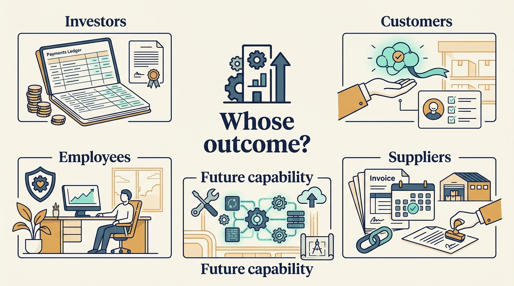

> **KEY POINTS:**
>
> * Durable value includes the **ability to keep creating useful outcomes**. Assess company economics, reinvestment, operating capability and stakeholder consequences alongside investor returns.
> * The evidence does not support one verdict on every buyout. Company **context, financing, ownership choices and research design** all affect what conclusions can be drawn.
> * Keep the central **thesis open to correction**. A credible plan explains who gains, who bears costs, what must remain true and which evidence would justify changing course.

 
Durable success means that a company can continue creating useful outcomes after the immediate intervention and, where relevant, after the owner exits. It includes economic viability, the ability to reinvest, operational capability, and the distribution of benefits and burdens.

This definition is the manuscript's proposed standard. It's deliberately broader than investor return, because investors measure success at the moment they realize value, while product and engineering leaders, customers and employees live with the company afterward. A plan can pass the first test and fail the second. The standard doesn't assume that every stakeholder benefits from every decision or that a difficult restructuring is always avoidable.

The four case-study chapters examined five companies. This final chapter puts them alongside **empirical research**, research based on observations and data, and asks who gained, who bore costs and what the company could sustain afterward. It first examines how to read the research, then uses it to build a broader assessment of success.

## What Wider Studies Can Tell Us

The studies below compare groups of businesses. A **comparison group**, sometimes called a control group, helps estimate what might have happened without the ownership change. In **observational research**, researchers study events that occurred rather than randomly assigning companies to owners. Statistical adjustments can improve the comparison, but they rely on assumptions and don't remove every difference.

Davis and colleagues' April 2024 revision studies US buyouts from 1980–2013 and finds substantial variation by transaction type and economic conditions. Its reported two-year employment effects are approximately −12% for **public-to-private buyouts**, purchases that take publicly traded businesses into private ownership, and +15% for **private-to-private buyouts**, purchases of already privately owned businesses, relative to their comparison groups. These are estimated average differences for studied groups, not predictions for an individual company. [S08: Davis et al., 2024 revision](https://www.nber.org/system/files/working_papers/w26371/w26371.pdf)

Their earlier research also distinguishes establishment-level job losses from firm-level creation, acquisition and divestiture. [S09: Davis et al., jobs study](https://www.nber.org/papers/w19458) A statement about “jobs after buyouts” changes meaning depending on which boundary is measured. That isn't a reason to ignore job losses. It's a reason to identify who loses work, who gains it and how the comparison is built.

Bernstein, Lerner, and Mezzanotti examine UK firms around the 2008 crisis and find greater investment and financing inflows among companies backed by private equity relative to comparison firms, particularly when sponsors had more resources. [S10: Bernstein et al., crisis study](https://www.nber.org/system/files/working_papers/w23626/w23626.pdf) This challenges the assumption that leverage and sponsor ownership necessarily prevent support during a downturn. It doesn't establish that support is universal or that all financing structures are resilient.

These comparisons need careful interpretation. Investors choose which companies to buy, and the studied businesses may differ from others in ways the analysis can't fully capture. **Generalizability** means how far a result can reasonably be applied beyond the group and period studied. Historical averages should inform questions and scenarios, not become forecasts for a present-day software portfolio.

## Some Harms Require Direct Attention

Healthcare evidence shows why company earnings and investor outcomes can't stand in for stakeholder welfare. Gupta and colleagues' August 2023 revision studies US nursing homes and reports an adverse mortality effect for a subset of patients using an **instrumental-variable** method, alongside evidence on staffing and care. The method uses a factor that changes the likelihood of the exposure being studied to separate its effect from other differences. Its validity depends on assumptions about that factor, and the interpretation depends on the patient group studied. It isn't an estimate for every care setting. [S11: Gupta et al., nursing homes](https://www.nber.org/system/files/working_papers/w28474/w28474.pdf)

Kannan, Bruch, and Song's 2023 hospital study compares 51 hospitals acquired by private equity owners with 259 controls. It reports an adjusted increase of 4.6 hospital-acquired conditions per 10,000 eligible hospitalizations, equivalent to 25.4% of the pre-acquisition rate at those acquired hospitals. The relative percentage is not a percentage-point increase in every patient's risk. [S12: Kannan et al., adverse events](https://jamanetwork.com/journals/jama/fullarticle/2813379)

An earlier study by Bruch, Gondi, and Song found increases in financial measures and improvements in some measured quality indicators, with differences between the hospital company HCA and other hospitals. [S39: Bruch et al., hospital measures](https://jamanetwork.com/journals/jamainternalmedicine/fullarticle/2769549) These findings don't cancel one another. They examine different outcomes and samples. Improvement in one quality measure can't establish the absence of harm in another.

The relevance to software is a question about mechanisms, not an analogy equating software inconvenience with clinical harm. Where customers can't readily observe quality or change providers, financial incentives may not protect them adequately. Product leaders should examine who bears the cost of reduced service and whether the people affected can meaningfully respond.

## Follow Outcomes Beyond the First Exit

Kannan and Song's 2025 research letter compares 18 hospitals sold to a second private equity owner with 18 sold to other for-profit owners. It finds lower operating margins after those sales to a second private equity owner, associated with higher expenses rather than simple cost cutting. The small sample and observational design limit generalization, and financial measures don't establish patient outcomes. [S42: Kannan and Song, after sale](https://jamanetwork.com/journals/jama-health-forum/fullarticle/2837043)

This is useful because it makes the next ownership period an object of study. It also warns against treating a lower margin as self-evident deterioration: additional spending could have different purposes and consequences, and those need investigation.

The Skype case makes a related temporal point. A valuable sale and later product retirement can both be true without one event providing a complete causal explanation of the other. The lesson is to **keep the observation window explicit**.

## Success for Whom?

A **stakeholder** is someone affected by the business, including people who didn't choose its owner. The table below keeps their outcomes separate. It also distinguishes investor cash already received, or **realized proceeds**, from an estimate of unsold holdings.

| Perspective | Evidence of progress | A question that can overturn the story |
| --- | --- | --- |
| Investors | Realized proceeds, net performance, understood risk | How much remains a valuation, and what capital was required? |
| Company | Sustainable cash and ability to reinvest | What expenditure or obligation was deferred? |
| Customers | Useful outcomes, reliability, fair transitions | Who lost value or became more dependent? |
| Employees | Viable work, capability, fair treatment | Who bore transition costs without sharing benefits? |
| Next owner | Inspectable capability and disclosed obligations | Which claims fail outside the sale presentation? |

These columns aren't an additive score. A gain for one group **does not mathematically offset harm** to another. Some decisions require choosing between conflicting interests. The people authorized to decide should explain whose interests take priority, why, and how the resulting harm will be addressed.

**Figure 1:** *An attractive investment result does not answer every question about who benefited or bore the cost.*

## What a Durable Plan Looks Like

A durable ownership plan begins with a credible customer and business thesis. It prices the investment the thesis needs and leaves room for plausible downside conditions. It assigns decisions clearly and lets inconvenient evidence change the plan.

It also preserves the people, systems and relationships required for continued service. Cost reductions are judged with their transition costs and delayed effects. Growth is examined for contribution and cash, not only reported revenue. Technology support strengthens company judgment rather than creating permanent dependence on an owner-appointed expert.

These are proposed conditions drawn from the mechanisms examined throughout the book, not a validated formula that guarantees success. A well-designed plan can still fail because of competition, market change or execution. A poorly designed plan can benefit from favorable timing.

**Figure 2:** *A durable plan explains how useful work can continue and what evidence would justify changing course.*

## Responsibility Continues After a Funding Milestone

A funding round that issues new shares supplies company resources under agreed terms. It doesn't prove that customers have a useful product or that the next round will happen. A sale realizes an ownership transaction; it doesn't prove that the new owner can sustain every service. A corporate integration milestone can be completed while customers still face migration or support problems.

For fictional Larkspur, Priya and Alex propose a review that follows customer outcomes and operating commitments through each event. Can customers complete the task they pay for? Can the team keep the service reliable? Which work remains unfunded? Which capability depends on a person or service that may leave? Which burdens have been moved to employees, customers or suppliers?

The measures should stay usable under continued ownership too. A company needn't be sold for its leaders to ask whether the plan is worthwhile. Treat the investor’s next milestone as one constraint and one result within **a longer operating responsibility**.

## What You Can Change as a Company Leader

As a product or technology leader, you can improve the investment’s assumptions by explaining what the company can deliver and what resources it needs. You can expose unfunded dependencies, propose feasible alternatives and keep a record of outcomes. Investor advisers and networks can help, but the company still needs accountable people making and carrying out its decisions.

You can't control the capital markets, remove every conflict or guarantee that everyone benefits. You can make the relevant evidence and consequences visible, develop the people who will sustain the work and bring decisions to those with the authority to resolve them.

The book began with how a company gets money. The fuller question is now: does its ownership arrangement help it serve customers, fund necessary work and meet its obligations over time? Answering requires evidence about investor returns, company cash and capabilities, and the people affected.

For your own company, begin with one decision. Explain the customer need, the work required, the funding and authority, and the evidence that would change the plan. Then review what happened and what remains to be done.

The main narrative ends here. The [[toolkit]] that follows provides records for that next step, and the [[glossary]] can help you revisit the terms.

## Questions to Consider

1. *For your company’s current plan, who gains, who bears costs, what must remain true and which evidence would justify changing course?*
2. *Which stakeholder outcomes does your reporting track beyond investor return: customers, employees, the next owner and the company’s ability to reinvest?*
3. *Where can your customers not readily observe quality or change providers? What protects them if financial incentives do not?*
4. *What observation window do you use to judge success, and would the verdict change if you extended it past the next exit?*
5. *Which research findings about buyouts have you been treating as forecasts for your company, and which conditions differ?*
6. *What one decision would you begin with tomorrow, and what would you record about it?*

## To Probe Further

- **[Private Equity at Work: When Wall Street Manages Main Street](https://www.russellsage.org/publications/book/private-equity-work)** — Eileen Appelbaum and Rosemary Batt, Russell Sage Foundation, 2014. *A book-length account by critics of the buyout model, read for the stakeholder side of the post's table and checked against the studies the post cites.*
- **[Evaluating trends in private equity ownership and impacts on health outcomes, costs, and quality: systematic review](https://pmc.ncbi.nlm.nih.gov/articles/PMC10354830/)** — Alexander Borsa, Geronimo Bejarano, Moriah Ellen and Joseph Dov Bruch, BMJ, 2023. *A systematic review of 55 studies that places the post's two hospital studies in the context of the whole literature on private equity in health care.*
- **[Sources of Value Creation in Private Equity Buyouts of Private Firms](https://academic.oup.com/rof/article-abstract/26/2/257/6516584)** — Jonathan B. Cohn, Edith S. Hotchkiss and Erin M. Towery, Review of Finance, 2022. *It examines the private-to-private buyouts behind the post's +15% employment figure and finds the gains come from relaxed financing constraints rather than financial engineering.*
- **[Mastering 'Metrics: The Path from Cause to Effect](https://press.princeton.edu/books/paperback/9780691152844/mastering-metrics)** — Joshua D. Angrist and Jörn-Steffen Pischke, Princeton University Press, 2015. *Read its chapters on instrumental variables and differences-in-differences before deciding how much weight the nursing-home and hospital findings can bear.*
- **[Grow the Pie: How Great Companies Deliver Both Purpose and Profit](https://www.cambridge.org/core/books/grow-the-pie/D4A79452BAD1B9058ED25E19D0183197)** — Alex Edmans, Cambridge University Press, 2020. *It offers a way to reason about the post's success-for-whom table without treating it as an additive score across customers, employees and investors.*
