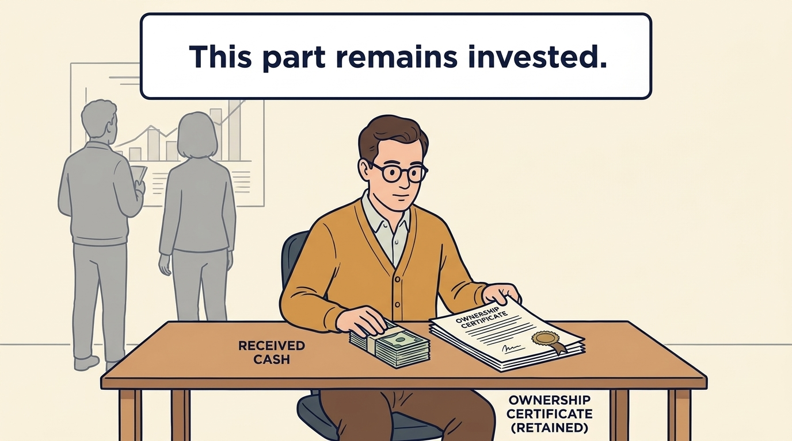
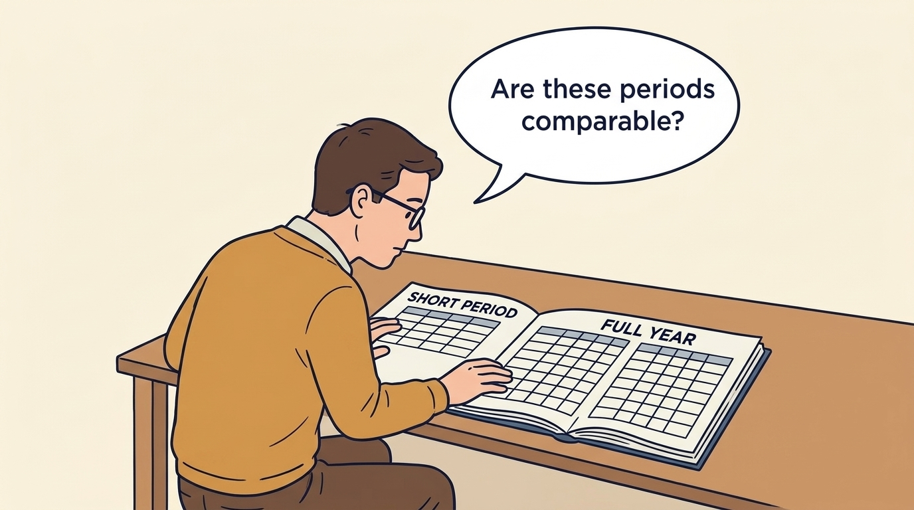
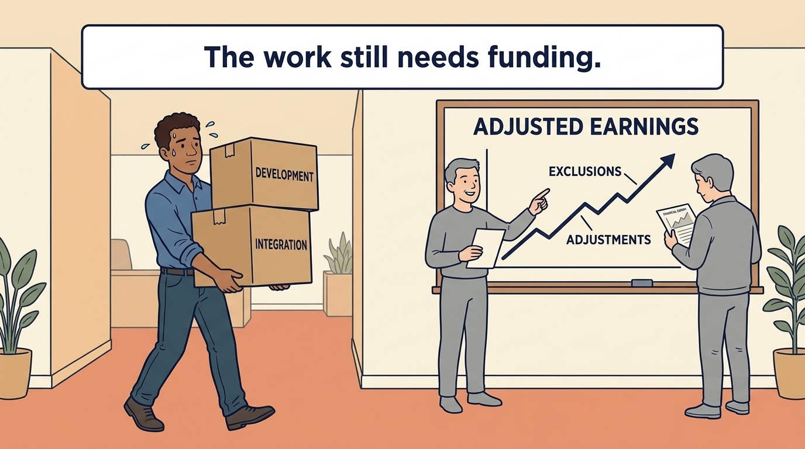
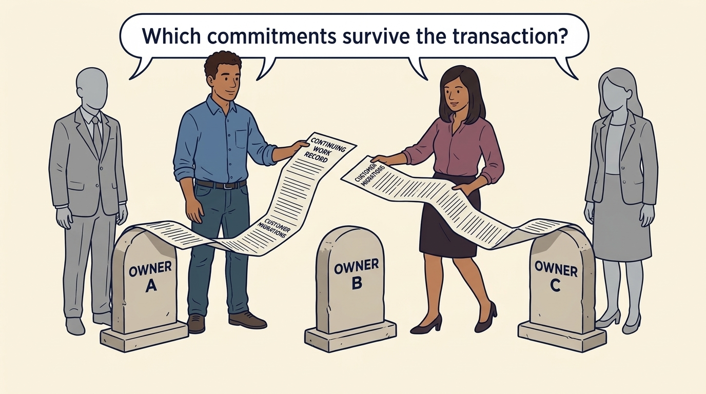

<!-- comic-style
{
  "cast": "MORGAN: a thoughtful investor technology adviser with short dark hair and a green jacket, used in the fund scenarios. ALEX: a practical CTO with curly hair and blue rolled-up sleeves. SAM: a CFO with round glasses and an amber cardigan. PRIYA: a product leader with straight dark hair and plum sleeves. INES: a CEO with short grey hair and a navy jacket. All are fictional; none represents a person in a real case.",
  "style": "Clean editorial explainer comic, dark ink outlines, restrained green, blue, and amber accents on warm white, generous space, readable short speech bubbles, expressive people and simple physical metaphors. No photorealism, logos, dense charts, or title text. Keep the same character appearances throughout the journal."
}
-->

**Comic.** A buy-and-build strategy is set by investors and financed largely with debt, while the integration and platform work it creates is inherited by the operating team across successive owners. The panels follow what that accumulates in TeamSystem’s reported results.

Morgan is an investor’s adviser in the fund scenarios; Alex leads technology, Priya leads product, and Sam leads finance. All are fictional. Comparative scenarios use separate assumptions. Historical cases are discussed through documents; the scenes do not reenact real events.

<!-- comic-panel
{
  "id": "01-scene",
  "status": "generated",
  "asset": "assets/images/25-teamsystem/comic-01-scene.jpeg",
  "aspect_ratio": "16:9",
  "prompt": "Panel 1 of an explainer comic. Morgan reads a historical TeamSystem file with successive ownership folders. Use one speech bubble with the exact words: \"Each owner starts somewhere different.\" Convey: TeamSystem is a business-software group. This case follows selected evidence from 2000 through 2017 across different ownership episodes.",
  "alt": "Comic panel: Morgan reads a historical TeamSystem file with successive ownership folders.",
  "caption": "TeamSystem is a business-software group. This case follows selected evidence from 2000 through 2017 across different ownership episodes.",
  "generation": {
    "model": "gemini-3-pro-image-preview",
    "reference_id": "owned-cast-20260913",
    "sha256": "da21b4569c4760c323498f43a0628506787a16f4a9a8c5b6b91e7c3b107fcf34"
  }
}
-->

**Panel 1:** TeamSystem is a business-software group. This case follows selected evidence from 2000 through 2017 across different ownership episodes.

*Dialogue:* “Each owner starts somewhere different.”

<!-- comic-panel
{
  "id": "02-scene",
  "status": "generated",
  "asset": "assets/images/25-teamsystem/comic-02-scene.jpeg",
  "aspect_ratio": "16:9",
  "prompt": "Panel 2 of an explainer comic. Alex follows product, pricing and collection notes toward different customer and business questions. Use one speech bubble with the exact words: \"Which intervention changed which outcome?\" Convey: Product changes, pricing, collection and acquisitions can affect different results. A reported project does not establish the amount it contributed.",
  "alt": "Comic panel: Alex follows product, pricing and collection notes toward different customer and business questions.",
  "caption": "Product changes, pricing, collection and acquisitions can affect different results. A reported project does not establish the amount it contributed.",
  "generation": {
    "model": "gemini-3-pro-image-preview",
    "reference_id": "owned-cast-20260913",
    "sha256": "88c9b5aa93098edb72775ff170232497815d865e9bffe8bf76b82e1fbc5fb649"
  }
}
-->

**Panel 2:** Product changes, pricing, collection and acquisitions can affect different results. A reported project does not establish the amount it contributed.

*Dialogue:* “Which intervention changed which outcome?”

<!-- comic-panel
{
  "id": "03-scene",
  "status": "generated",
  "asset": "assets/images/25-teamsystem/comic-03-scene.jpeg",
  "aspect_ratio": "16:9",
  "prompt": "Panel 3 of an explainer comic. Sam separates received cash from a retained ownership certificate. Use one speech bubble with the exact words: \"This part remains invested.\" Convey: A partial exit sells some of an investment while retaining an interest. Money received and estimated value still held remain separate.",
  "alt": "Comic panel: Sam separates received cash from a retained ownership certificate.",
  "caption": "A partial exit sells some of an investment while retaining an interest. Money received and estimated value still held remain separate.",
  "generation": {
    "model": "gemini-3-pro-image-preview",
    "reference_id": "owned-cast-20260913",
    "sha256": "aca17a6546b1f3a783339bce9e806a73cf9a0e30dd5202faa875c3ee6edbe852"
  }
}
-->

**Panel 3:** A partial exit sells some of an investment while retaining an interest. Money received and estimated value still held remain separate.

*Dialogue:* “This part remains invested.”

<!-- comic-panel
{
  "id": "04-scene",
  "status": "generated",
  "asset": "assets/images/25-teamsystem/comic-04-scene.jpeg",
  "aspect_ratio": "16:9",
  "prompt": "Panel 4 of an explainer comic. Sam aligns a short accounting calendar with a constructed full-year comparison. Use one speech bubble with the exact words: \"Are these periods comparable?\" Convey: Compare the same businesses over equivalent periods. Buying a company partway through a year can distort a simple growth calculation.",
  "alt": "Comic panel: Sam compares short-period and full-year calendar grids in a report.",
  "caption": "Compare the same businesses over equivalent periods. Buying a company partway through a year can distort a simple growth calculation.",
  "generation": {
    "model": "gemini-3-pro-image-preview",
    "reference_id": "owned-cast-20260913",
    "sha256": "84579980a3d633a5755640a5af5f090b34ba04749e6dc0fa928ad23a4f8a419c"
  }
}
-->

**Panel 4:** Compare the same businesses over equivalent periods. Buying a company partway through a year can distort a simple growth calculation.

*Dialogue:* “Are these periods comparable?”

<!-- comic-panel
{
  "id": "05-scene",
  "status": "generated",
  "asset": "assets/images/25-teamsystem/comic-05-scene.jpeg",
  "aspect_ratio": "16:9",
  "prompt": "Panel 5 of an explainer comic. Alex carries development and integration work past an adjusted earnings board. Use one speech bubble with the exact words: \"The work still needs funding.\" Convey: Development and integration still require money even when their costs are treated differently in an earnings measure.",
  "alt": "Comic panel: Alex carries development and integration work past an adjusted earnings board.",
  "caption": "Development and integration still require money even when their costs are treated differently in an earnings measure.",
  "generation": {
    "model": "gemini-3-pro-image-preview",
    "reference_id": "owned-cast-20260913",
    "sha256": "95c843dab83d8b304ae11f8ba0cdd6e899465de04468c0e6f0cdd529cc79c8fc"
  }
}
-->

**Panel 5:** Development and integration still require money even when their costs are treated differently in an earnings measure.

*Dialogue:* “The work still needs funding.”

<!-- comic-panel
{
  "id": "06-scene",
  "status": "generated",
  "asset": "assets/images/25-teamsystem/comic-06-scene.jpeg",
  "aspect_ratio": "16:9",
  "prompt": "Panel 6 of an explainer comic. Priya and Alex hand a continuing work record across several ownership markers. Use one speech bubble with the exact words: \"Which commitments survive the transaction?\" Convey: Customer migrations and integration obligations can span several owners. Carry their costs and evidence into the next plan instead of restarting the operating history.",
  "alt": "Comic panel: Priya and Alex hand a continuing work record across several ownership markers.",
  "caption": "Customer migrations and integration obligations can span several owners. Carry their costs and evidence into the next plan instead of restarting the operating history.",
  "generation": {
    "model": "gemini-3-pro-image-preview",
    "reference_id": "owned-cast-20260913",
    "sha256": "eb7841ec9556dc195a0e9a79998e591301c02663945965758c35001c6e87d177"
  }
}
-->

**Panel 6:** Customer migrations and integration obligations can span several owners. Carry their costs and evidence into the next plan instead of restarting the operating history.

*Dialogue:* “Which commitments survive the transaction?”
