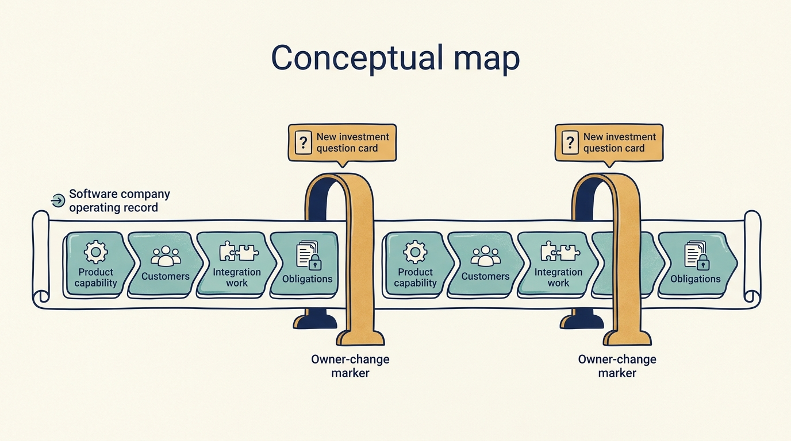

> **KEY POINTS:**
>
> * Successive owners face **different investment problems**. A company’s development continues, while entry prices, financing and the improvements already achieved change the next owner’s task.
> * Growth and earnings need **comparable definitions**. Acquisition timing, constructed full-year comparisons and expense adjustments can change the apparent result.
> * Examine **what the group is accumulating**. Products and useful capability can grow alongside integration demands and financial obligations; customer and employee outcomes require separate evidence.

 
TeamSystem provides business software, including products used by accountants and smaller companies. Its history raises a useful question: how can a software group grow, keep developing products, report positive adjusted earnings and still report a loss under the accounting rules it must follow? Answering it means asking what changed in the operating business, what was acquired, how the investment was financed, and which costs each measure includes.

TeamSystem makes those questions concrete, and it's the case that most directly tests [[acquisition-adds-work-first]]: successive purchases of software businesses across four major ownership episodes in the period examined. The chapter follows selected evidence from a regional Italian software company in 2000 through its 2017 reporting period. It examines successive ownership episodes, not one continuous investment by an interchangeable “private equity” owner, and it isn't an assessment of the company's current value.

A **buy-and-build** strategy expands a group through further acquisitions. **Statutory results** follow the applicable reporting rules; **adjusted results** modify a measure by specified additions or exclusions. Those distinctions stay visible as the chapter follows ownership, operating initiatives and the 2017 financial statements.

The sources have different strengths. Investor accounts explain their stated ambitions and reported realizations. Company financial statements expose operating measures, investment and financing. Neither supplies a controlled experiment identifying the effect of a particular architecture or management intervention.

For the company leader, the central question is what each acquisition adds to both capability and obligations. A buy-and-build strategy is set by investors and financed largely with debt, while the integration, product and platform work it creates is inherited by the operating team and carried across successive owners. That work can continue long after the investor who approved it has sold.

## From a Regional Company to a Different Ownership Problem

Palamon describes the business it backed in June 2000 as founder-led, with about 28,000 clients and 200 employees. Its account emphasizes national expansion, a new senior management team, and investment in research, development and information technology. It describes a December 2004 sale to Bain Capital, by which time revenue was €58 million and employment exceeded 450. These are retrospective sponsor claims. The webpage's summary field gives a conflicting exit year; its narrative and Bain's later account support 2004. [S45: Palamon TeamSystem case](https://www.palamon.com/teamsystem) [S47: TeamSystem sale announcement](https://www.hgcapitaltrust.com/news-insights/news/archive/12072015)

The early setting is useful for leaders in smaller software businesses. National expansion changes more than sales coverage. A founder may no longer be able to resolve every product exception, customer dispute, recruitment decision and investment priority personally. Developing management capacity can therefore be part of product value creation: it changes the organization's ability to make and carry out decisions.

That's an interpretation of the proposed mechanism, not proof that each recruitment caused the observed growth. Headcount growth also doesn't establish a better employee experience. More people can mean successful expansion, acquired businesses, duplicated work, or several effects together. The record would need employee and acquisition detail to tell them apart.

**Enterprise value** estimates the value of the operating business. **EBITDA** is earnings before interest, taxes, depreciation and amortization; it leaves out several costs and cash obligations. A **multiple** expresses one figure relative to another: 11.3× EBITDA means the price equals 11.3 times the stated annual earnings measure. It doesn't promise that investors receive that amount of cash each year.

By August 2010, the ownership proposition had changed. HgCapital announced an agreement to acquire a majority stake at an enterprise value of €565 million, described as 11.3 times fiscal 2010 EBITDA. The announcement emphasized business software used by accountants and smaller companies, recurring demand, and opportunities for organic growth and acquisitions. It anticipated completion in September; these were announced terms, not a closing statement. [S46: TeamSystem acquisition announcement](https://www.hgcapitaltrust.com/news-insights/news/archive/08032010)

The distinction matters here. Software supporting customers' recurring administrative work may offer attractive repeat demand. But the seller can already charge for that attraction in the entry price. A good company doesn't automatically become a good investment at every price. [[valuation-is-an-estimate]] develops the connection between valuation assumptions and the work a company must perform.

## What the Owners Say They Changed

HgCapital's March 2016 results presentation attributes several initiatives to its involvement: product strategy, pricing, financial reporting, cash collection and the acquisition process. It links a 2013 bond refinancing to financing flexibility and reports eleven acquisitions during the ownership period. This is the sponsor's account of its contribution. [S48: HgCapital Trust 2015 results, p. 14](https://www.hgcapitaltrust.com/~/media/Files/H/Hgcapital-Trust-V2/documents/investors/financial-calendar/hgcapitaltrust-dec-2015-general.pdf)

These interventions can work through different mechanisms. Better reporting can expose a problem without solving it. Faster collection can release cash without changing a product. Pricing can increase revenue while either improving or damaging the customer relationship. Acquisitions can add capability immediately while creating integration work that continues for years.

For company leaders and their advisers, the useful task is to reconstruct the chain between an intervention and its intended result:

| Proposed intervention | Possible business mechanism | Evidence that would test it |
| --- | --- | --- |
| Change the product portfolio | Concentrate investment on valuable customer work | Adoption, retention and contribution for affected customer groups; discontinued commitments |
| Change pricing or packaging | Charge for useful value or reduce costly exceptions | Customer response, support burden, cancellations and collection, as well as booked revenue |
| Improve billing and collection | Reduce disputed invoices and time until payment | Dispute causes and actual collection times, separated from one-off recovery of old balances |
| Acquire another software business | Add customers, domain knowledge or functionality | Acquisition-adjusted growth, integration costs and outcomes for existing and acquired customers |

The table is an assessment framework, not an assertion that TeamSystem measured these outcomes or that every initiative succeeded.

A repeated need such as acquisition assessment or billing diagnosis might justify a reusable support service. The existence of such projects doesn't establish that a centralized platform was necessary, that companies could freely decline help, or that the support was worth its full cost.

## A Partial Exit Has a Cash Part and a Valuation Part

In December 2015, HgCapital announced an agreement to sell TeamSystem to Hellman & Friedman while retaining a minority interest. The March 2016 presentation then described the transaction as completed and reported £39 million of cash proceeds to HgCapital Trust plus a retained stake valued at £6.1 million. It presented a 1.8× investment return. [S47: TeamSystem sale announcement](https://www.hgcapitaltrust.com/news-insights/news/archive/12072015) [S48: HgCapital Trust 2015 results, p. 14](https://www.hgcapitaltrust.com/~/media/Files/H/Hgcapital-Trust-V2/documents/investors/financial-calendar/hgcapitaltrust-dec-2015-general.pdf)

The £45.1 million combined figure therefore contains two different things: money received and an interest still exposed to future results. Calling all of it realized cash would remove the remaining risk from the story. Nor does the presentation reconstruct every fee, capital contribution and distribution needed to calculate a net return for an ultimate investor.

Palamon reports a 4.1× return for its earlier ownership episode. [S45: Palamon TeamSystem case](https://www.palamon.com/teamsystem) These reported multiples don't rank the two owners' operating skill. They concern different entry prices, dates, ownership positions and stages of development. A fair comparison would also need complete cash flows and a consistent treatment of retained value. A sequence of owners can each help a company develop while experiencing very different investment economics.

A **secondary buyout** transfers a business between private equity ownership arrangements. For management, it creates another distinction: the company continues, but the new shareholder's investment starts at a new price. Earlier operational progress is part of the asset the buyer purchases and can't simply be counted again as new value creation. The incoming thesis needs its own credible future improvements and investment capacity.

**Figure 1:** *Separate money already received from the estimated value of ownership that remains.*

## Profitable and Loss-Making in the Same Year

TeamSystem Holding's 2017 consolidated report provides a useful financial cross-section. The amounts below are millions of euros; “total revenue” includes other operating income. Adjusted EBITDA is the company's adjusted measure, while the loss is the consolidated statutory result. [S49: TeamSystem 2017 report, PDF pp. 11, 23 and 45](https://www.teamsystem.com/media/files/865_Consolidated%20Financial%20Statements%20as%20at%20and%20for%20the%20year%20ended%2031%20December%202017%20of%20TeamSystem%20Group.pdf)

| 2017 measure | € million | Question it helps answer |
| --- | ---: | --- |
| Total revenue | 315.977 | What activity was recognized in this consolidated reporting period? |
| Adjusted EBITDA | 113.010 | What earnings result from the company's specified exclusions? |
| Consolidated net loss | −56.788 | What result remains after the income statement's financing, tax and other charges? |

The gap is about €169.8 million: €113.010 million minus a loss of €56.788 million. To explain it, follow the report’s reconciliation and income statement through the excluded expenses, asset-accounting charges, financing and tax items. The gap isn't itself a cash payment to one recipient.

Adjusted EBITDA and the statutory loss count different things. The first excludes specified charges; the second includes the relevant financing, tax and other income-statement items. Their reconciliation is more useful than choosing the number that best supports a preferred story. A loss alone doesn't establish that customers received worse software. Adjusted EBITDA alone doesn't establish that the ownership structure leaves enough cash for reinvestment.

**Comparability adds another complication.** The 2016 statutory income statement included operations from the March acquisition date, not a full comparable calendar year. Management also supplied a pro forma comparison: a constructed full-year presentation with specified acquisition assumptions. Its 2016 total revenue was about €290 million, compared with about €229 million in the statutory presentation. Against the pro forma base, 2017 growth was 8.9%. [S49: TeamSystem 2017 report, PDF pp. 10–11 and 23](https://www.teamsystem.com/media/files/865_Consolidated%20Financial%20Statements%20as%20at%20and%20for%20the%20year%20ended%2031%20December%202017%20of%20TeamSystem%20Group.pdf)

Simply dividing the two statutory totals would give about 37.7% growth. The arithmetic is correct, but the comparison is unsuitable for describing a full year's operating improvement. Even the 8.9% comparison isn't an isolated measure of organic growth: changes in the businesses included still matter.

The practical lesson reaches directly into engineering reporting. If a new acquisition adds both revenue and engineers, revenue per engineer may move **without any change in delivery effectiveness**. If a product is consolidated partway through a year, annual support costs and annual revenue may cover different intervals. Finance and technology teams need a shared definition of the business and period being compared before discussing productivity.

## Investment Continues, but Its Classification Matters

The report records about €13.4 million of capitalized development in 2017 and a €1.9 million information-technology integration and transformation adjustment in its EBITDA reconciliation. It also describes an additional €80 million **secured-note issue**, borrowing through debt securities backed by specified security, part of whose proceeds repaid a €20 million parent loan. These are evidence of investment, integration expenditure and financing activity, not measurements of the resulting customer benefit. [S49: TeamSystem 2017 report, PDF pp. 9, 11 and 14–15](https://www.teamsystem.com/media/files/865_Consolidated%20Financial%20Statements%20as%20at%20and%20for%20the%20year%20ended%2031%20December%202017%20of%20TeamSystem%20Group.pdf)

Capitalizing qualifying development records it as an asset to be charged over time rather than expensing all of it immediately. The cash still has to be paid. The accounting distinction is explained in [[obligations-before-budget]]; the disclosed capitalized amount isn't a measure of all research and development effort.

Similarly, an integration cost can be excluded from an adjusted earnings presentation while remaining a real requirement of the acquisition strategy. Calling an expense exceptional at one subsidiary doesn't establish that similar expenses will disappear across a group that keeps buying companies.

This raises a demanding question for the investment thesis: what spending does the model itself require? If growth relies on acquisitions, the plan needs capacity to evaluate, integrate and support them. If customer retention relies on continuing development, the cash model needs that investment. A comparison that removes both burdens may describe a convenient earnings subtotal while overstating the cash the strategy can release.

That concern is a question to investigate, not a finding of improper accounting. Disclosed adjustments can help readers understand results, especially after an ownership change. Their usefulness depends on keeping the reconciliation visible and choosing the right measure for each decision. Visma supplies a complementary, precisely reconciled example in [[visma]].

## What Remains Unknown About Customers and Employees?

The consulted records support a history of expansion, ownership transactions, investment and financial change. They provide much less independent evidence about the people using and building the products.

A customer can renew because the software is valuable, because switching is difficult, or both. Revenue retention alone can't distinguish those situations. A fuller account would examine migration effort, reliability, support responsiveness, pricing changes and the availability of credible alternatives. The importance of the customer workflow makes these questions more consequential, not less.

For employees, aggregate growth doesn't reveal how responsibilities, workload, professional development or bargaining power changed. An acquisition program can create opportunities while also creating duplication and uncertainty. The case needs evidence from affected teams rather than an assumption that financial growth settles the question.

These limitations prevent a verdict that every ownership episode created durable mutual benefit. They also prevent the opposite shortcut: treating leverage or a statutory loss as proof that all operating development was illusory. The company, investors and individual stakeholders need separate assessments.

## Keep the Operating History When the Owner Changes

The periods examined here involve successive transactions and continuing acquisition work. For the leader inheriting that work, a new owner’s starting point in a financial model isn't the beginning of the product’s obligations. Customer migrations, development commitments and knowledge dependencies can span several ownership periods.

The proposed application is to carry a consistent record of commitments, costs and actual outcomes across the handover. Ask the next owner which assumptions in its plan depend on work already under way and whether it has funded the remaining burden. Don't restart the evidence just because the owner or reporting basis changes.

That method can also help through another funding round or entry into a corporate group. TeamSystem’s disclosed history doesn't establish results for those settings; it gives a concrete reason to ask **what operating work survives the transaction**.

**Figure 2:** *Each investor starts with a new investment question, while company responsibilities continue.*

## What Company Leaders Can Take From This Case

Use the history to challenge an acquisition-led software thesis before it becomes a list of projects. Ask the investment team which improvements the entry price already assumes. Ask the CFO which earnings definition matters to valuation, which cash flows fund the plan and which costs recur across acquisitions. As product and technology leaders, explain which customer capabilities the next acquisition adds and what existing work it displaces.

Then agree on a few observations that can change the plan: customer migration failures, acquired products that don't fit, savings that stay unreleased, or an integration team whose workload exceeds its capacity. A thesis that can't be revised in response to such evidence isn't being managed as a hypothesis.

Repeated acquisitions can add products, customers and knowledge while also adding integration work, continuing costs and borrowing. Track both with consistent definitions. A larger group and a higher earnings figure alone don't establish better outcomes for every acquired company or customer.

The final chapter brings the cases together with wider research. It asks what a lasting improvement would mean for each group affected: [[success-for-whom]].

## Questions to Consider

1. *Which improvements in your company does the current owner’s entry price already assume, and which new improvements does its plan require?*
2. *If your company has been through more than one ownership period, which operating commitments span them, and did each new owner fund the remaining burden?*
3. *What is your company’s statutory result, and how does it reconcile with the adjusted earnings measure investors discuss?*
4. *When you compare growth or productivity across periods, are the businesses and intervals consistent? What would acquisition timing do to the comparison?*
5. *Which costs of your growth model are classed as exceptional but recur every year: integration, migration or acquisition assessment?*
6. *What evidence do you have about customer and employee outcomes from your acquisitions, beyond aggregate revenue and headcount?*

## To Probe Further

- **[Inorganic growth strategies and the evolution of the private equity business model](https://ideas.repec.org/a/eee/corfin/v45y2017icp31-63.html)** — Benjamin Hammer, Alexander Knauer, Magnus Pflücke and Bernhard Schwetzler, Journal of Corporate Finance, 2017. *Peer-reviewed evidence from 9,548 buyouts that add-on acquisitions raise the chance of exit to another investor, which places TeamSystem's sequence of acquisitions and owners in a wider pattern.*
- **[On Secondary Buyouts](https://corpgov.law.harvard.edu/2015/11/10/on-secondary-buyouts/)** — François Degeorge, Jens Martin and Ludovic Phalippou, Harvard Law School Forum on Corporate Governance, 2015; the paper appeared in the Journal of Financial Economics, 2016. *The authors' summary of their finding that sales between investors do better when buyer and seller have different skills gives a way to ask what each new owner of TeamSystem brought.*
- **[Hg invests in TeamSystem](https://www.hgcapitaltrust.com/news-insights/news/2021/18-01-2021-131229553)** — HgCapital Trust plc, January 18, 2021. *The trust's own announcement of an ownership change inside the same two managers, which extends the chapter's point about owners changing while the company continues.*
- **[Silver Lake to Make €600M Strategic Investment in TeamSystem](https://www.silverlake.com/silver-lake-to-make-e600m-strategic-investment-in-teamsystem/)** — Silver Lake, May 19, 2023. *The buyer's interested announcement of a €600 million minority stake, documenting another owner buying into the company's accumulated progress after the period this chapter examines.*
- **[Sale of remaining investment in TeamSystem](https://www.hgcapitaltrust.com/news-insights/news/2024/08-07-2024)** — HgCapital Trust plc, July 8, 2024. *The seller's own announcement that the retained interest carried at £6.1 million in 2016 finally became a cash figure of about £24.3 million, closing the question this chapter raises.*
- **[Annual Reports](https://www.teamsystem.com/en/investors/annual-reports-eng/)** — TeamSystem investor relations, consolidated financial statements for 2015 to 2025. *The company's own consolidated statements let a reader repeat the chapter's 2017 exercise of reconciling adjusted EBITDA to the statutory result, after checking which entity each year covers.*
