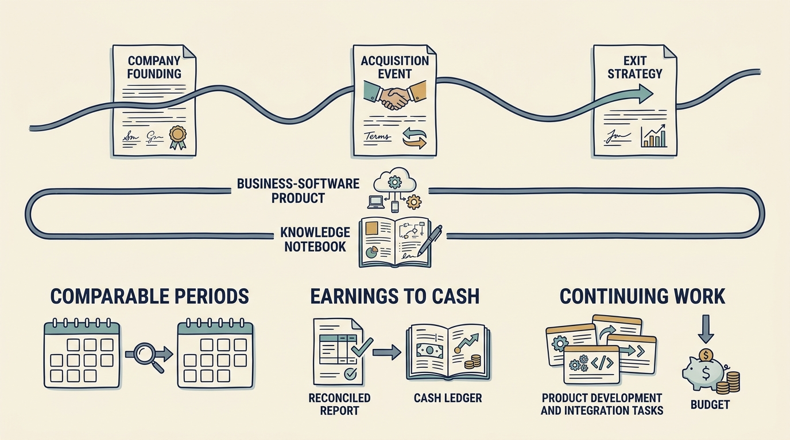

**TeamSystem**, a business-software group, shows how a company can expand, invest in products, report positive adjusted earnings and report a **statutory loss**, the loss reported under the applicable accounting rules, in the same year. Each ownership change creates a new financial starting point. Product work carries on across it: migrations, integrations and dependencies remain somebody's responsibility, and each new owner inherits both the progress made and the work still unfinished. The case examines selected evidence from 2000 through 2017, not later ownership periods.

**Figure 1:** *Carry product commitments and their costs across ownership and reporting boundaries.*

The documented episodes run from Palamon's 2000 investment in a founder-led regional business, through Bain Capital from 2004, HgCapital's 2010 majority purchase at an announced enterprise value of €565 million, and the 2015 agreed sale to Hellman & Friedman, described as completed in March 2016. These are distinct investment episodes at different prices, not one actor with a single plan.

The 2016 sale illustrates a partial exit: £39 million of cash proceeds to HgCapital Trust plus a retained stake valued at £6.1 million. [S48: HgCapital Trust 2015 results, p. 14](https://www.hgcapitaltrust.com/~/media/Files/H/Hgcapital-Trust-V2/documents/investors/financial-calendar/hgcapitaltrust-dec-2015-general.pdf) Money received and estimated value still held are different things. Later announcements, a 2021 reinvestment and a 2024 agreed sale valuing the trust's investment at £24.3 million subject to closing conditions, report agreed values for a holding that changed after 2016, not cash received for the 2016 stake.

**Financial comparisons need a consistent business and period.** The 2017 report compares a full year with a constructed full-year 2016 presentation because the statutory prior period began at the March 2016 acquisition date. Dividing the two statutory totals would show 37.7% revenue growth; against the pro forma base, growth was 8.9%, and even that includes newly consolidated businesses. [S49: TeamSystem 2017 consolidated report](https://www.teamsystem.com/media/files/865_Consolidated%20Financial%20Statements%20as%20at%20and%20for%20the%20year%20ended%2031%20December%202017%20of%20TeamSystem%20Group.pdf)

The same report reconciles adjusted EBITDA of €113.0 million to a consolidated loss of €56.8 million. The €169.8 million gap consists of €20.3 million of costs management classes as non-core, €11.1 million of bad-debt allowance, provisions and impairment, €72.5 million of depreciation and amortization, and €72.0 million of net finance cost, offset by a €6.1 million tax credit. Amortization is a charge for assets already paid for, largely intangibles recognized when the 2016 purchase price was allocated; finance cost is the cost of the debt that financed the group. Management names both as the main reasons for the loss.

Development recorded as an asset **still consumes cash**: about €13.4 million of development was capitalized in 2017. An integration expense excluded from an earnings measure is still work the operating team must do; [[visma]] examines whether such costs recur.

A new owner's financial starting point **does not erase earlier product obligations**. Carry the costs, commitments and observed results into the next ownership discussion, and identify who funds the remaining burden. This is a proposed leadership practice; the disclosed history does not establish its effectiveness across funding rounds or corporate ownership. What the group accumulates across its owners is the strongest lesson: useful products and knowledge, but also obligations, dependencies and continuing work.
