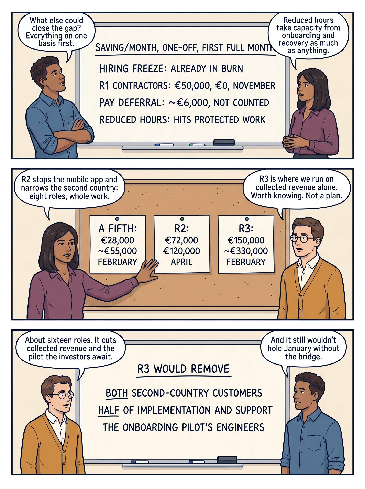

<!-- comic-style
{
  "cast": "MORGAN: a thoughtful investor technology adviser with short dark hair and a green jacket, used in the fund scenarios. ALEX: a practical CTO, a brown-skinned man with short, tight dark curls close to his head and blue rolled-up sleeves. SAM: a CFO, a man with short brown hair, round glasses and an amber cardigan. PRIYA: a product leader with straight dark hair and plum sleeves. INES: a CEO with short grey hair and a navy jacket. All are fictional; none represents a person in a real case.",
  "style": "Clean editorial explainer comic pages, each one image of three stacked full-width strips: navy ink outlines, restrained green, blue and amber accents on warm ivory, generous space, expressive people and simple physical props. Dialogue, short labels and the supplied amounts are lettered in the artwork, exactly as scripted. Money bags, coins and banknotes are plain and undecorated; the euro sign appears only inside supplied text, and arrows, documents and screens carry plain lines, never lettering. No photorealism, logos, titles or unsupplied text. Keep the same character appearances throughout the journal.",
  "reference": "_research/comic-cast-20260913.jpeg",
  "identity": {
    "Morgan": "MORGAN is a light-skinned WOMAN with a short, straight, JET-BLACK bob cut level with her jaw and a straight fringe across her forehead (never brown hair, never a side parting), and a bright green jacket over a white top, first person in the reference; her face must match the reference sheet exactly.",
    "Alex": "ALEX is a medium-brown-skinned MAN with a masculine face, broad shoulders and a straight masculine build, SHORT tight dark curls close to his head (not a large afro), a blue rolled-sleeve shirt and blue jeans, second person in the reference; fill his face, neck and hands with the same brown skin color in every strip.",
    "Sam": "SAM is a light-skinned MAN with a masculine face and SHORT brown hair cropped above his ears (never a bob, never chin-length hair, never a woman), round glasses and an amber cardigan over a white shirt, third person in the reference.",
    "Priya": "PRIYA is a brown-skinned WOMAN with straight shoulder-length dark hair and a plum blouse, fourth person in the reference.",
    "Ines": "INES is a light-skinned OLDER WOMAN with a short GREY bob (grey hair, never dark) and a navy jacket, fifth person in the reference."
  },
  "short": {
    "Morgan": "a light-skinned woman with a jet-black jaw-length bob and fringe, in a bright green jacket",
    "Alex": "a brown-skinned man with short tight dark curls, in a blue rolled-sleeve shirt",
    "Sam": "a light-skinned man with short brown hair and round glasses, in an amber cardigan over a collared white shirt",
    "Priya": "a brown-skinned woman with straight shoulder-length dark hair, in a plum blouse",
    "Ines": "an older light-skinned woman with a short grey bob, in a navy jacket"
  }
}
-->

**Comic.** Fictional Larkspur is waiting for a delayed **round**, €4 million of new investment not yet signed. Its existing investors will lend it a **bridge**, a €600,000 loan to carry it until the round arrives, but only if the board adopts a plan that keeps cash above the **reserve**, the €400,000 minimum balance the board has agreed to keep, until 30 June. Nine pages follow the company tracing the pressure to cut staff to its source, costing the alternatives on one basis, checking cash month by month, recording the decision, choosing roles by the work that stops, keeping a customer promise with a bounded fallback, and planning for the people who leave and the people who remain. Each page is three strips; the amounts and dates are drawn into the artwork, and a transcript follows every page.

Morgan is an adviser working for the investor; Alex leads technology, Priya leads product, Sam leads finance and Ines is the chief executive. All are fictional, and every figure in the scenario is invented. This scenario continues the delayed-financing chapter and is deliberately separate from the shared Larkspur examples in other chapters. R1 is the first reduction, already decided there: the contract engineers on internal tooling are not renewed after 31 October. R2 is the reduction this chapter decides; R3 is the deeper level at which the company would run on collected revenue alone. Historical cases are discussed through documents; the scenes do not reenact real events.

<!-- comic-page
{
  "id": "01-a-condition-with-a-date",
  "title": "A condition with a date",
  "asset": "assets/images/26-anatomy-of-a-layoff/comic-page-01-a-condition-with-a-date.jpeg",
  "aspect_ratio": "3:4",
  "cast": [
    "Sam",
    "Ines",
    "Alex",
    "Priya"
  ],
  "strips": [
    {
      "scene": "A whiteboard hung high on the wall, above everyone's heads, with 4 lines of large, neat handwriting, each line fully visible, the first line a heading. Sam stands at the left of the board and Ines at the right. Everyone stands to the side of the board, clear of it, hands at their sides; no head, hand, marker or speech bubble covers any of its lettering. The floor and the wall around the board are bare: no bags, coins, banknotes, papers, plants or furniture.",
      "labels": [
        "1 OCTOBER: BOARD REVIEW",
        "ROUND: €4M, EXPRESSION OF INTEREST",
        "BRIDGE: €600,000, SIGNED 20 SEPTEMBER",
        "RESERVE: €400,000"
      ],
      "label_notes": "The heading, then the three lines beneath it.",
      "bubbles": [
        {
          "who": "Sam",
          "text": "The investors signed the bridge three weeks late. And it comes with a condition."
        },
        {
          "who": "Ines",
          "text": "Money cuts both ways for a team. It arrives with obligations attached."
        }
      ]
    },
    {
      "scene": "Ines, at the left, holds a single sheet upright and facing the reader at chest height; it has one large heading and 3 plain lines beneath. Sam, at the right, reads it. A bare table stands between them.",
      "labels": [
        "BRIDGE CONDITION",
        "PLAN ADOPTED BY 31 OCTOBER",
        "ABOVE €400,000 UNTIL 30 JUNE",
        "COUNTING NOTHING FROM THE ROUND"
      ],
      "label_notes": "The first label is the heading on the sheet; the other three are its lines, top to bottom.",
      "bubbles": [
        {
          "who": "Ines",
          "text": "A condition attached to cash, with a date. Meet it, or do without."
        },
        {
          "who": "Sam",
          "text": "It says nothing about headcount. Any plan that holds the date satisfies it."
        }
      ]
    },
    {
      "scene": "A whiteboard hung high on the wall, above everyone's heads, with 5 lines of large, neat handwriting, each line fully visible, the first line a heading and the last line with a line drawn above it, as in a sum. Alex stands at the left of the board and Priya at the right. Everyone stands to the side of the board, clear of it, hands at their sides; no head, hand, marker or speech bubble covers any of its lettering. The floor and the wall around the board are bare: no bags, coins, banknotes, papers, plants or furniture.",
      "labels": [
        "THE BASELINE: 40 PEOPLE",
        "PAYROLL: €324,000",
        "CONTRACT ENGINEERS + OTHER: €126,000",
        "− COLLECTED REVENUE: €250,000",
        "= NET BURN: €200,000"
      ],
      "label_notes": "The heading, then three lines, then the sum line at the bottom.",
      "bubbles": [
        {
          "who": "Alex",
          "text": "Seventeen in engineering, five in product, eight implementation, six sales, four admin."
        },
        {
          "who": "Priya",
          "text": "A reduction can't be decided without this. The earlier decision never needed it."
        }
      ]
    }
  ],
  "alt": "Comic page in three strips: a board sets the scene on 1 October, the €4 million round, the €600,000 bridge signed on 20 September and the €400,000 reserve; Ines holds the bridge condition, a plan by 31 October holding cash above the reserve until 30 June with nothing from the round; a board sums the forty-person baseline to a €200,000 net burn.",
  "caption": "Every figure in this comic is invented. Fictional Larkspur sells scheduling software to businesses whose staff work in the field. It is 1 October, and the scheduled board review is about to begin. The round is the €4 million of new investment Larkspur has been negotiating since June; it is still an expression of interest, with nothing signed, and its closing keeps moving. The bridge is a €600,000 loan from the existing investors meant to carry the company until the round closes; they signed their commitment on 20 September, three weeks late, and it comes with a condition. The reserve is the €400,000 minimum cash the board has agreed never to fall below. The investors will pay the bridge only if, by 31 October, the board has adopted an operating plan that keeps cash above the reserve until at least 30 June, counting no money from the delayed round. That is a condition attached to cash, with a date; it says nothing about headcount, and a plan that met the date by other means would satisfy it just as well. What the earlier decision never stated is who works at Larkspur and what they cost: forty employees — seventeen in engineering, five in product and design, eight in implementation and support, six in sales and marketing, four in finance and administration — with a payroll of €324,000 a month, €126,000 of contract engineering and other costs, €250,000 of collected revenue and a net monthly burn of €200,000. A reduction cannot be decided without that baseline.",
  "status": "generated",
  "generation": {
    "sha256": "a97bae422e3553c0e317622f35dec376006e88e4e855cb4ada8ff39247f841ee"
  }
}
-->

**Page 1: A condition with a date.** Every figure in this comic is invented. Fictional Larkspur sells scheduling software to businesses whose staff work in the field. It is 1 October, and the scheduled board review is about to begin. The round is the €4 million of new investment Larkspur has been negotiating since June; it is still an expression of interest, with nothing signed, and its closing keeps moving. The bridge is a €600,000 loan from the existing investors meant to carry the company until the round closes; they signed their commitment on 20 September, three weeks late, and it comes with a condition. The reserve is the €400,000 minimum cash the board has agreed never to fall below. The investors will pay the bridge only if, by 31 October, the board has adopted an operating plan that keeps cash above the reserve until at least 30 June, counting no money from the delayed round. That is a condition attached to cash, with a date; it says nothing about headcount, and a plan that met the date by other means would satisfy it just as well. What the earlier decision never stated is who works at Larkspur and what they cost: forty employees — seventeen in engineering, five in product and design, eight in implementation and support, six in sales and marketing, four in finance and administration — with a payroll of €324,000 a month, €126,000 of contract engineering and other costs, €250,000 of collected revenue and a net monthly burn of €200,000. A reduction cannot be decided without that baseline.

- *Strip 1.* **Sam:** “The investors signed the bridge three weeks late. And it comes with a condition.” **Ines:** “Money cuts both ways for a team. It arrives with obligations attached.”
- *Strip 2.* **Ines:** “A condition attached to cash, with a date. Meet it, or do without.” **Sam:** “It says nothing about headcount. Any plan that holds the date satisfies it.”
- *Strip 3.* **Alex:** “Seventeen in engineering, five in product, eight implementation, six sales, four admin.” **Priya:** “A reduction can't be decided without this. The earlier decision never needed it.”

<!-- comic-page
{
  "id": "02-three-pressures-that-sound-alike",
  "title": "Three pressures that sound alike",
  "asset": "assets/images/26-anatomy-of-a-layoff/comic-page-02-three-pressures-that-sound-alike.jpeg",
  "aspect_ratio": "3:4",
  "cast": [
    "Sam",
    "Morgan",
    "Ines",
    "Alex"
  ],
  "strips": [
    {
      "scene": "A whiteboard hung high on the wall, above everyone's heads, with 4 lines of large, neat handwriting, each line fully visible, the first line a heading and the last line with a line drawn above it, as in a sum. Sam stands at the left of the board and Morgan at the right. Everyone stands to the side of the board, clear of it, hands at their sides; no head, hand, marker or speech bubble covers any of its lettering. The floor and the wall around the board are bare: no bags, coins, banknotes, papers, plants or furniture.",
      "labels": [
        "1 FUNDING CONDITION",
        "R1+BRIDGE: €1.1M, 31 DECEMBER",
        "BURN €150,000: RESERVE ~20 MAY",
        "= CUT €40,000/MONTH, FEB–JUNE"
      ],
      "label_notes": "The heading, then two lines, then the sum line at the bottom.",
      "bubbles": [
        {
          "who": "Sam",
          "text": "As a number: at least forty thousand a month, more if cutting costs first."
        },
        {
          "who": "Morgan",
          "text": "A condition with a date. The company meets it or does without the money."
        }
      ]
    },
    {
      "scene": "A pinboard hung high on the wall with exactly 2 large index cards pinned side by side in one row with clear gaps between them, every word fully visible. Ines stands at the left of the pinboard and Morgan at the right. Everyone stands to the side of the board, clear of it, hands at their sides; no head, hand, marker or speech bubble covers any of its lettering. The floor and the wall around the board are bare: no bags, coins, banknotes, papers, plants or furniture.",
      "labels": [
        "2 RESERVED MATTER: DIRECTOR CONSENTS",
        "3 INFLUENCE: OTHERS CUT FIFTH"
      ],
      "label_notes": "One label per card, left to right.",
      "bubbles": [
        {
          "who": "Ines",
          "text": "Changing the plan is a reserved matter: authority through a seat and a clause."
        },
        {
          "who": "Morgan",
          "text": "The fifth is what I've seen elsewhere. Information about other companies, not an instruction."
        }
      ]
    },
    {
      "scene": "A whiteboard hung high on the wall, above everyone's heads, with 3 lines of large, neat handwriting, each line fully visible. Alex stands at the left of the board and Sam at the right. Everyone stands to the side of the board, clear of it, hands at their sides; no head, hand, marker or speech bubble covers any of its lettering. The floor and the wall around the board are bare: no bags, coins, banknotes, papers, plants or furniture.",
      "labels": [
        "A FIFTH OF ENGINEERING: ~€28,000/MONTH",
        "NEEDED: AT LEAST €40,000/MONTH",
        "BY RATIO, NOT WORK STOPPED"
      ],
      "label_notes": "The three lines on the board, top to bottom.",
      "bubbles": [
        {
          "who": "Alex",
          "text": "A fifth wouldn't meet the condition, and it picks people by proportion."
        },
        {
          "who": "Sam",
          "text": "So it's costed as one option beside the others, not adopted."
        }
      ]
    }
  ],
  "alt": "Comic page in three strips: a board turns the funding condition into a number, at least €40,000 a month from February to June; two cards separate the investor director’s reserved-matter consent from the influence of a fifth cut elsewhere; a board shows a fifth of engineering saving €28,000 against €40,000 needed, chosen by ratio.",
  "caption": "“The investors want a reduction” describes three different things, and each needs a different response. The first is a funding condition: the bridge arrives only if the plan holds the reserve to 30 June. Sam translates it into a number. With R1 — the first reduction, already decided, which ends the contract engineers on 31 October — and the bridge, cash on 31 December is €1.1 million and the burn is €150,000, so the reserve is reached about 20 May; to hold it to 30 June, spending between February and June must fall by at least €40,000 a month, more if the reduction itself costs money first. The second is a formal approval right: Larkspur’s shareholders’ agreement makes changing the operating plan a reserved matter, so the board decides and the investor director’s consent is part of it. That is authority, exercised through a seat and a clause, and the response is to bring the board a decision it can take. The third is influence: the investor director says that in other companies the fund has backed, a delayed round has meant a cut of about a fifth of engineering, and Morgan has seen the same. A fifth of Larkspur’s engineering payroll is about €28,000 a month; it would not meet the condition, and it would select people by ratio rather than by the work the company is going to stop. A comparison with other companies is information about those companies, not an instruction, so Alex records it as one option to cost beside the others.",
  "status": "generated",
  "generation": {
    "sha256": "e322d537127b034d5c8522ff43571a79b07c363a46d7c935a462aa180e904af9"
  }
}
-->

**Page 2: Three pressures that sound alike.** “The investors want a reduction” describes three different things, and each needs a different response. The first is a funding condition: the bridge arrives only if the plan holds the reserve to 30 June. Sam translates it into a number. With R1 — the first reduction, already decided, which ends the contract engineers on 31 October — and the bridge, cash on 31 December is €1.1 million and the burn is €150,000, so the reserve is reached about 20 May; to hold it to 30 June, spending between February and June must fall by at least €40,000 a month, more if the reduction itself costs money first. The second is a formal approval right: Larkspur’s shareholders’ agreement makes changing the operating plan a reserved matter, so the board decides and the investor director’s consent is part of it. That is authority, exercised through a seat and a clause, and the response is to bring the board a decision it can take. The third is influence: the investor director says that in other companies the fund has backed, a delayed round has meant a cut of about a fifth of engineering, and Morgan has seen the same. A fifth of Larkspur’s engineering payroll is about €28,000 a month; it would not meet the condition, and it would select people by ratio rather than by the work the company is going to stop. A comparison with other companies is information about those companies, not an instruction, so Alex records it as one option to cost beside the others.

- *Strip 1.* **Sam:** “As a number: at least forty thousand a month, more if cutting costs first.” **Morgan:** “A condition with a date. The company meets it or does without the money.”
- *Strip 2.* **Ines:** “Changing the plan is a reserved matter: authority through a seat and a clause.” **Morgan:** “The fifth is what I've seen elsewhere. Information about other companies, not an instruction.”
- *Strip 3.* **Alex:** “A fifth wouldn't meet the condition, and it picks people by proportion.” **Sam:** “So it's costed as one option beside the others, not adopted.”

<!-- comic-page
{
  "id": "03-the-alternatives-on-one-basis",
  "title": "The alternatives, costed on the same basis",
  "asset": "assets/images/26-anatomy-of-a-layoff/comic-page-03-the-alternatives-on-one-basis.jpeg",
  "aspect_ratio": "3:4",
  "cast": [
    "Alex",
    "Priya",
    "Sam"
  ],
  "strips": [
    {
      "scene": "A whiteboard hung high on the wall, above everyone's heads, with 5 lines of large, neat handwriting, each line fully visible, the first line a heading. Alex stands at the left of the board and Priya at the right. Everyone stands to the side of the board, clear of it, hands at their sides; no head, hand, marker or speech bubble covers any of its lettering. The floor and the wall around the board are bare: no bags, coins, banknotes, papers, plants or furniture.",
      "labels": [
        "SAVING/MONTH, ONE-OFF, FIRST FULL MONTH",
        "HIRING FREEZE: ALREADY IN BURN",
        "R1 CONTRACTORS: €50,000, €0, NOVEMBER",
        "PAY DEFERRAL: ~€6,000, NOT COUNTED",
        "REDUCED HOURS: HITS PROTECTED WORK"
      ],
      "label_notes": "The heading, then the four lines beneath it.",
      "bubbles": [
        {
          "who": "Alex",
          "text": "What else could close the gap? Everything on one basis first."
        },
        {
          "who": "Priya",
          "text": "Reduced hours take capacity from onboarding and recovery as much as anything."
        }
      ]
    },
    {
      "scene": "A pinboard hung high on the wall with exactly 3 large index cards pinned side by side in one row with clear gaps between them, every word fully visible. Priya stands at the left of the pinboard and Sam at the right; Priya rests an open hand beside the middle card. Everyone stands to the side of the board, clear of it, hands at their sides; no head, hand, marker or speech bubble covers any of its lettering. The floor and the wall around the board are bare: no bags, coins, banknotes, papers, plants or furniture.",
      "labels": [
        "A FIFTH: €28,000, ~€55,000, FEBRUARY",
        "R2: €72,000, €120,000, APRIL",
        "R3: €150,000, ~€330,000, FEBRUARY"
      ],
      "label_notes": "One label per card, left to right.",
      "bubbles": [
        {
          "who": "Priya",
          "text": "R2 stops the mobile app and narrows the second country: eight roles, whole work."
        },
        {
          "who": "Sam",
          "text": "R3 is where we run on collected revenue alone. Worth knowing. Not a plan."
        }
      ]
    },
    {
      "scene": "A whiteboard hung high on the wall, above everyone's heads, with 4 lines of large, neat handwriting, each line fully visible, the first line a heading. Sam stands at the left of the board and Alex at the right. Everyone stands to the side of the board, clear of it, hands at their sides; no head, hand, marker or speech bubble covers any of its lettering. The floor and the wall around the board are bare: no bags, coins, banknotes, papers, plants or furniture.",
      "labels": [
        "R3 WOULD REMOVE",
        "BOTH SECOND-COUNTRY CUSTOMERS",
        "HALF OF IMPLEMENTATION AND SUPPORT",
        "THE ONBOARDING PILOT'S ENGINEERS"
      ],
      "label_notes": "The heading, then the three lines beneath it.",
      "bubbles": [
        {
          "who": "Sam",
          "text": "About sixteen roles. It cuts collected revenue and the pilot the investors await."
        },
        {
          "who": "Alex",
          "text": "And it still wouldn't hold January without the bridge."
        }
      ]
    }
  ],
  "alt": "Comic page in three strips: a board puts the hiring freeze, R1, the pay deferral and reduced hours on one basis; three cards compare a fifth cut, R2 and R3 by saving, one-off cost and first full month; a board lists what R3 would remove.",
  "caption": "Before a reduction, the board asks what else could close the gap, and the alternatives are put on one basis: the recurring monthly saving once it has fully arrived, the one-off cash it costs first, the first month in which the full saving appears, and what the company gives up. The hiring freeze in force since August saves nothing further; its saving is already in the burn. R1, the contract engineers not renewed, saves €50,000 from November at no cost. The executive pay deferral, 15% of four salaries paid later, is a loan from four people to the company, about €6,000 a month, and the plan does not count it. Reduced hours across engineering would take capacity from the protected onboarding and recovery work as much as from anything else. A fifth of engineering by ratio saves about €28,000 a month for about €55,000 of one-off cost, first full month February, and does not meet the condition. R2 — stop the mobile app, narrow the second country, eight roles in all — saves €72,000 a month for €120,000 of one-off cost, first full month April, and removes whole pieces of work rather than a slice of every team. R3 is the level at which Larkspur runs on collected revenue alone: €150,000 a month saved for about €330,000 up front, about sixteen roles, the second country entirely, half of implementation and support and the onboarding pilot’s engineers. It is worth knowing, and it is not a plan: it removes the revenue and the pilot the company exists to deliver, and it still would not hold January without the bridge.",
  "status": "generated",
  "generation": {
    "sha256": "aa70e10fbb543c4824a8a91fb72b12286c09832819907d854a458d5c89b4f5e0"
  }
}
-->

**Page 3: The alternatives, costed on the same basis.** Before a reduction, the board asks what else could close the gap, and the alternatives are put on one basis: the recurring monthly saving once it has fully arrived, the one-off cash it costs first, the first month in which the full saving appears, and what the company gives up. The hiring freeze in force since August saves nothing further; its saving is already in the burn. R1, the contract engineers not renewed, saves €50,000 from November at no cost. The executive pay deferral, 15% of four salaries paid later, is a loan from four people to the company, about €6,000 a month, and the plan does not count it. Reduced hours across engineering would take capacity from the protected onboarding and recovery work as much as from anything else. A fifth of engineering by ratio saves about €28,000 a month for about €55,000 of one-off cost, first full month February, and does not meet the condition. R2 — stop the mobile app, narrow the second country, eight roles in all — saves €72,000 a month for €120,000 of one-off cost, first full month April, and removes whole pieces of work rather than a slice of every team. R3 is the level at which Larkspur runs on collected revenue alone: €150,000 a month saved for about €330,000 up front, about sixteen roles, the second country entirely, half of implementation and support and the onboarding pilot’s engineers. It is worth knowing, and it is not a plan: it removes the revenue and the pilot the company exists to deliver, and it still would not hold January without the bridge.

- *Strip 1.* **Alex:** “What else could close the gap? Everything on one basis first.” **Priya:** “Reduced hours take capacity from onboarding and recovery as much as anything.”
- *Strip 2.* **Priya:** “R2 stops the mobile app and narrows the second country: eight roles, whole work.” **Sam:** “R3 is where we run on collected revenue alone. Worth knowing. Not a plan.”
- *Strip 3.* **Sam:** “About sixteen roles. It cuts collected revenue and the pilot the investors await.” **Alex:** “And it still wouldn't hold January without the bridge.”

<!-- comic-page
{
  "id": "04-cash-does-not-arrive-monthly",
  "title": "Reconcile the reduction by date",
  "asset": "assets/images/26-anatomy-of-a-layoff/comic-page-04-cash-does-not-arrive-monthly.jpeg",
  "aspect_ratio": "3:4",
  "cast": [
    "Sam",
    "Alex",
    "Priya"
  ],
  "strips": [
    {
      "scene": "A whiteboard hung high on the wall, above everyone's heads, with 4 lines of large, neat handwriting, each line fully visible, the first line a heading. Sam stands at the left of the board and Alex at the right. Everyone stands to the side of the board, clear of it, hands at their sides; no head, hand, marker or speech bubble covers any of its lettering. The floor and the wall around the board are bare: no bags, coins, banknotes, papers, plants or furniture.",
      "labels": [
        "LARKSPUR'S FICTIONAL TERMS",
        "NOTICE: 1–3 MONTHS, PAID",
        "SEVERANCE: 1 MONTH/2 YEARS",
        "ACCRUED LEAVE: PAID OUT"
      ],
      "label_notes": "The heading, then the three lines beneath it.",
      "bubbles": [
        {
          "who": "Sam",
          "text": "A reduction is presented as a monthly saving. Cash doesn't arrive that way."
        },
        {
          "who": "Alex",
          "text": "People who leave are paid through notice and receive severance before any saving appears."
        }
      ]
    },
    {
      "scene": "A whiteboard hung high on the wall, above everyone's heads, with 6 lines of large, neat handwriting, each line fully visible, the first line a heading. Alex stands at the left of the board and Priya at the right. Everyone stands to the side of the board, clear of it, hands at their sides; no head, hand, marker or speech bubble covers any of its lettering. The floor and the wall around the board are bare: no bags, coins, banknotes, papers, plants or furniture.",
      "labels": [
        "R2: 8 NOTICES, 31 OCTOBER",
        "3 LEAVE NOVEMBER, 3 DECEMBER",
        "1 LEAVES 31 JANUARY",
        "1 RETAINED: 31 MARCH, €8,500/MONTH",
        "SAVING: €20K, €45K, €63.5K, €63.5K",
        "FULL €72,000 FROM APRIL"
      ],
      "label_notes": "The heading, then the five lines beneath it.",
      "bubbles": [
        {
          "who": "Alex",
          "text": "Two app engineers, a designer, a product manager, two country engineers, sales, admin."
        },
        {
          "who": "Priya",
          "text": "The saving builds up gradually. Another €9,000 stops with the app's contracts in February."
        }
      ]
    },
    {
      "scene": "A whiteboard hung high on the wall, above everyone's heads, with 5 lines of large, neat handwriting, each line fully visible, the first line a heading and the last line with a line drawn above it, as in a sum. Sam stands at the left of the board and Priya at the right. Everyone stands to the side of the board, clear of it, hands at their sides; no head, hand, marker or speech bubble covers any of its lettering. The floor and the wall around the board are bare: no bags, coins, banknotes, papers, plants or furniture.",
      "labels": [
        "ONE-OFF COSTS COME FIRST",
        "SEVERANCE: ~€95,000",
        "JOB-SEARCH SUPPORT, LEGAL: €15,000",
        "ACCRUED LEAVE: ~€10,000",
        "= €120,000: €30K/€45K/€32K/€13K"
      ],
      "label_notes": "The heading, then three lines, then the sum line at the bottom.",
      "bubbles": [
        {
          "who": "Sam",
          "text": "Paid with the final salaries, months before the full saving lands."
        },
        {
          "who": "Priya",
          "text": "So the cash forecast has to show both, month by month."
        }
      ]
    }
  ],
  "alt": "Comic page in three strips: a board states the fictional notice, severance and leave terms; a board lays out R2, notice to eight on 31 October, the leaving dates, the retained specialist and the saving building from €20,000 in December to the full €72,000 in April; a board sums the €120,000 of one-off costs and when each is paid.",
  "caption": "A reduction is often presented as a monthly saving; cash does not arrive that way. Under Larkspur’s fictional employment terms, notice periods run from one to three months by length of service and are paid whether or not worked; severance, a payment made on leaving, is one month’s pay for every two full years of service with a minimum of one month; and accrued leave is paid out. R2 gives notice to eight people on 31 October: two engineers, a designer and a product manager from the mobile app, two of the three second-country engineers, one sales role and one administrative role, €63,000 a month of pay, employer charges and benefits together, with a further €9,000 a month of the app’s cloud, test devices and services stopping from February. Three leave on 30 November, three on 31 December, one on 31 January, and one of the two second-country engineers is retained on a fixed term to 31 March at about €8,500 a month. So the saving builds up: about €20,000 in December, €45,000 in January, €63,500 in February and March, and the full €72,000 from April. The one-off costs run the other way: about €95,000 of severance, €15,000 of job-search support and legal cost and about €10,000 of accrued leave, €120,000 in all, paid with the final salaries — €30,000 in November, €45,000 in December, €32,000 in January and €13,000 for the retained specialist in March.",
  "generation": {
    "model": "gemini-3-pro-image-preview",
    "reference": "_research/comic-cast-20260913.jpeg",
    "sha256": "96dd98adf8d1eeb20887a7bf5d52e15f7b926f69b6faee7977ace09da7fb3bfa"
  },
  "status": "generated"
}
-->

**Page 4: Reconcile the reduction by date.** A reduction is often presented as a monthly saving; cash does not arrive that way. Under Larkspur’s fictional employment terms, notice periods run from one to three months by length of service and are paid whether or not worked; severance, a payment made on leaving, is one month’s pay for every two full years of service with a minimum of one month; and accrued leave is paid out. R2 gives notice to eight people on 31 October: two engineers, a designer and a product manager from the mobile app, two of the three second-country engineers, one sales role and one administrative role, €63,000 a month of pay, employer charges and benefits together, with a further €9,000 a month of the app’s cloud, test devices and services stopping from February. Three leave on 30 November, three on 31 December, one on 31 January, and one of the two second-country engineers is retained on a fixed term to 31 March at about €8,500 a month. So the saving builds up: about €20,000 in December, €45,000 in January, €63,500 in February and March, and the full €72,000 from April. The one-off costs run the other way: about €95,000 of severance, €15,000 of job-search support and legal cost and about €10,000 of accrued leave, €120,000 in all, paid with the final salaries — €30,000 in November, €45,000 in December, €32,000 in January and €13,000 for the retained specialist in March.

- *Strip 1.* **Sam:** “A reduction is presented as a monthly saving. Cash doesn't arrive that way.” **Alex:** “People who leave are paid through notice and receive severance before any saving appears.”
- *Strip 2.* **Alex:** “Two app engineers, a designer, a product manager, two country engineers, sales, admin.” **Priya:** “The saving builds up gradually. Another €9,000 stops with the app's contracts in February.”
- *Strip 3.* **Sam:** “Paid with the final salaries, months before the full saving lands.” **Priya:** “So the cash forecast has to show both, month by month.”

<!-- comic-page
{
  "id": "05-cash-by-date-under-three-plans",
  "title": "Cash by date under three plans",
  "asset": "assets/images/26-anatomy-of-a-layoff/comic-page-05-cash-by-date-under-three-plans.jpeg",
  "aspect_ratio": "3:4",
  "cast": [
    "Sam",
    "Ines",
    "Morgan"
  ],
  "strips": [
    {
      "scene": "A wall chart hung high, above everyone's heads: one plain line rising then descending in steps from left to right across exactly five labelled points, each point carrying one short label, and a horizontal dashed line drawn below it with its own label at the right end. Sam stands at the left below it and Ines at the right. Nothing covers the lettering.",
      "labels": [
        "OCT: €800,000",
        "NOV, BRIDGE IN: €1,220,000",
        "DEC: €1,045,000",
        "MAR: €722,000",
        "JUN: €488,000",
        "RESERVE €400,000"
      ],
      "label_notes": "The first five labels are the five points on the line, left to right; RESERVE €400,000 sits at the right end of the dashed line.",
      "bubbles": [
        {
          "who": "Sam",
          "text": "Bridge drawn 15 November. Customers keep paying €250,000. Nothing counted from the round."
        },
        {
          "who": "Ines",
          "text": "June ends €88,000 above the reserve. Condition met, with about a month's margin."
        }
      ]
    },
    {
      "scene": "A whiteboard hung high on the wall, above everyone's heads, with 5 lines of large, neat handwriting, each line fully visible, the first line a heading. Sam stands at the left of the board and Morgan at the right. Everyone stands to the side of the board, clear of it, hands at their sides; no head, hand, marker or speech bubble covers any of its lettering. The floor and the wall around the board are bare: no bags, coins, banknotes, papers, plants or furniture.",
      "labels": [
        "30 JUNE CASH / RESERVE",
        "BRIDGE+R2: €488,000 / EARLY AUGUST",
        "BRIDGE ONLY: €200,000 / MAY",
        "R2 ONLY: BELOW / JANUARY",
        "NEITHER: BELOW / ~20 JANUARY"
      ],
      "label_notes": "The heading, then the four lines beneath it.",
      "bubbles": [
        {
          "who": "Sam",
          "text": "The last two rows are the comparison a board rarely asks for."
        },
        {
          "who": "Morgan",
          "text": "Without the bridge, R2 or not, you're below the reserve in January."
        }
      ]
    },
    {
      "scene": "A pinboard hung high on the wall with exactly 2 large index cards and one small card pinned alone beneath them pinned side by side in one row with clear gaps between them, every word fully visible. Ines stands at the left of the pinboard and Sam at the right. Everyone stands to the side of the board, clear of it, hands at their sides; no head, hand, marker or speech bubble covers any of its lettering. The floor and the wall around the board are bare: no bags, coins, banknotes, papers, plants or furniture.",
      "labels": [
        "R2 MAKES THE BRIDGE LAST",
        "R2 CANNOT REPLACE IT",
        "THESE FIGURES, NOT A RULE"
      ],
      "label_notes": "The first two labels are the cards in the row; the third is the small card beneath them.",
      "bubbles": [
        {
          "who": "Ines",
          "text": "Leaving costs come first; the first full month of saving is April."
        },
        {
          "who": "Sam",
          "text": "Shorter notice, lower severance or a later reserve date changes it. Compare by date."
        }
      ]
    }
  ],
  "alt": "Comic page in three strips: a chart traces month-end cash under the plan from €800,000 in October through the bridge’s arrival to €488,000 in June above the €400,000 reserve; a board compares the four plans by cash on 30 June and reserve date; three cards say R2 makes the bridge last longer, cannot stand in for it, and that this is a result of these figures, not a rule.",
  "caption": "Sam’s forecast rests on stated assumptions: cash on 1 October is €1.0 million; customers keep paying €250,000 a month with no new sales assumed; nothing is counted from the two second-country customers or from the round; the bridge’s €600,000 is drawn on 15 November as a convertible loan with no fee, its interest added to the amount owed and nothing payable in cash for twelve months. Month by month under the plan, cash is €800,000 at the end of October, €1,220,000 in November once the bridge arrives, €1,045,000 in December, €722,000 in March and €488,000 on 30 June — about €88,000 above the reserve, a little more than one month of the reduced burn — reaching the reserve in the first week of August. The same arithmetic run the other ways gives the comparison the board needs: bridge without R2, €200,000 on 30 June and the reserve breached about 20 May, so the condition is not met and in practice there is no bridge; R2 without the bridge, below the reserve about 10 January; neither, about 20 January. Without the bridge, R2 or no R2, Larkspur is below the reserve in January, because the one-off costs come first and the first full month of saving is April. At Larkspur’s notice periods, severance terms and dates, the reduction makes the bridge last longer and cannot stand in for it. That is a result of these figures, not a rule: shorter notice, lower severance, an earlier decision or a later reserve date would change the answer, which is why transition costs, savings and funding are compared by date rather than assumed either way.",
  "status": "generated",
  "generation": {
    "sha256": "66271c67a460d09ee90e0aedae32fc2e43933b3451f6f0c0721704fe4b9c6580"
  }
}
-->

**Page 5: Cash by date under three plans.** Sam’s forecast rests on stated assumptions: cash on 1 October is €1.0 million; customers keep paying €250,000 a month with no new sales assumed; nothing is counted from the two second-country customers or from the round; the bridge’s €600,000 is drawn on 15 November as a convertible loan with no fee, its interest added to the amount owed and nothing payable in cash for twelve months. Month by month under the plan, cash is €800,000 at the end of October, €1,220,000 in November once the bridge arrives, €1,045,000 in December, €722,000 in March and €488,000 on 30 June — about €88,000 above the reserve, a little more than one month of the reduced burn — reaching the reserve in the first week of August. The same arithmetic run the other ways gives the comparison the board needs: bridge without R2, €200,000 on 30 June and the reserve breached about 20 May, so the condition is not met and in practice there is no bridge; R2 without the bridge, below the reserve about 10 January; neither, about 20 January. Without the bridge, R2 or no R2, Larkspur is below the reserve in January, because the one-off costs come first and the first full month of saving is April. At Larkspur’s notice periods, severance terms and dates, the reduction makes the bridge last longer and cannot stand in for it. That is a result of these figures, not a rule: shorter notice, lower severance, an earlier decision or a later reserve date would change the answer, which is why transition costs, savings and funding are compared by date rather than assumed either way.

- *Strip 1.* **Sam:** “Bridge drawn 15 November. Customers keep paying €250,000. Nothing counted from the round.” **Ines:** “June ends €88,000 above the reserve. Condition met, with about a month's margin.”
- *Strip 2.* **Sam:** “The last two rows are the comparison a board rarely asks for.” **Morgan:** “Without the bridge, R2 or not, you're below the reserve in January.”
- *Strip 3.* **Ines:** “Leaving costs come first; the first full month of saving is April.” **Sam:** “Shorter notice, lower severance or a later reserve date changes it. Compare by date.”

<!-- comic-page
{
  "id": "06-the-decision-recorded",
  "title": "The decision, recorded",
  "asset": "assets/images/26-anatomy-of-a-layoff/comic-page-06-the-decision-recorded.jpeg",
  "aspect_ratio": "3:4",
  "cast": [
    "Ines",
    "Morgan",
    "Sam",
    "Priya"
  ],
  "strips": [
    {
      "scene": "A whiteboard hung high on the wall, above everyone's heads, with 5 lines of large, neat handwriting, each line fully visible, the first line a heading. Ines stands at the left of the board and Morgan at the right. Everyone stands to the side of the board, clear of it, hands at their sides; no head, hand, marker or speech bubble covers any of its lettering. The floor and the wall around the board are bare: no bags, coins, banknotes, papers, plants or furniture.",
      "labels": [
        "15 OCTOBER: THE BOARD DECIDES",
        "CHOSEN: R2, NOTICES 31 OCTOBER",
        "REJECTED: FIFTH, R3, HOURS, WAITING",
        "AUTHORIZED: BOARD + INVESTOR DIRECTOR",
        "ROLES BY WORK, NOT RANKING"
      ],
      "label_notes": "The heading, then the four lines beneath it.",
      "bubbles": [
        {
          "who": "Ines",
          "text": "We meet early: the condition's date is 31 October and notices must start then."
        },
        {
          "who": "Morgan",
          "text": "My consent under the reserved matter. Ines gives notices; Alex and Priya choose roles."
        }
      ]
    },
    {
      "scene": "A whiteboard hung high on the wall, above everyone's heads, with 4 lines of large, neat handwriting, each line fully visible, the first line a heading. Sam stands at the left of the board and Ines at the right. Everyone stands to the side of the board, clear of it, hands at their sides; no head, hand, marker or speech bubble covers any of its lettering. The floor and the wall around the board are bare: no bags, coins, banknotes, papers, plants or furniture.",
      "labels": [
        "FUNDING",
        "€120,000 ONE-OFF, FROM OPERATING CASH",
        "SPECIALIST TERM: €17,000, IN PLAN",
        "CONTINGENCY: €8,500, ONE MORE MONTH"
      ],
      "label_notes": "The heading, then the three lines beneath it.",
      "bubbles": [
        {
          "who": "Sam",
          "text": "May and June options, another €17,000, sit outside the plan and need the board."
        },
        {
          "who": "Ines",
          "text": "The bridge is drawn on 15 November, once the plan is adopted."
        }
      ]
    },
    {
      "scene": "A long horizontal timeline drawn high on the wall, above everyone's heads: one straight line carrying exactly 6 tick marks and nothing else, one tick directly under each of the 6 labels written above the line, and no tick anywhere without a label over it. Priya stands at the left below it and Sam at the right; Priya points up at the fourth tick.",
      "labels": [
        "1 DEC: NOTICES, BRIDGE, AMENDMENT",
        "1 FEB: DEPARTURES DONE",
        "1 MAR: FEBRUARY'S REAL SAVING",
        "15 MAR: TRANSFER TEST",
        "1 APR: CUSTOMER LIVE, ROUND",
        "1 MAY: APRIL VERIFIED"
      ],
      "label_notes": "One label per tick, in this left-to-right order.",
      "bubbles": [
        {
          "who": "Priya",
          "text": "Each review reads only evidence that exists by its date."
        },
        {
          "who": "Sam",
          "text": "And the 1 April review puts the question after July on the agenda."
        }
      ]
    }
  ],
  "alt": "Comic page in three strips: a board records the 15 October decision, R2 chosen, the alternatives rejected, authorized by the board with the investor director’s consent; a board lists the funding, €120,000 one-off, the €17,000 fixed term and the €8,500 contingency; a six-tick timeline runs from the 1 December review to 1 May.",
  "caption": "The board meets on 15 October rather than waiting for its November date, because the condition’s date is 31 October and the notice periods have to start then for the savings to land by February. Chosen: R2, notices on 31 October, one second-country specialist retained to 31 March under an agreement signed before any notice is served, the adopted plan meeting the bridge condition with €488,000 at 30 June. Rejected: a fifth of engineering by ratio, because it saves €28,000 against a need of at least €40,000 and chooses people by proportion; R3, because it removes the revenue and the pilot the company exists to deliver and still does not hold January without the bridge; reduced hours, because they take capacity from the protected work; and waiting for the round, because the round is an expression of interest and the condition’s date is 31 October. Funding: €120,000 of one-off cost from operating cash inside the plan; the specialist’s fixed term, €17,000, inside the plan; one contingency of €8,500 for a further month, spent only if the transfer test fails; the May and June options, €17,000, held outside the plan and usable only with the board’s approval; the bridge drawn on 15 November once the plan is adopted. Authorized by the Larkspur board with the investor director’s consent under the reserved matter; Ines gives the individual notices, and Alex and Priya select roles by the work that stops, not by a ranking of people. Reviews on 1 December, 1 February, 1 March, 15 March, 1 April and 1 May each read only evidence that exists by their date, and the 1 April review also puts on the agenda how Larkspur is financed after July.",
  "status": "generated",
  "generation": {
    "sha256": "7ea1f7d30b1fd2e3c2b2fd9bd8e75b4bd91ebac21b680a2aa76cd70e4b98542d"
  }
}
-->

**Page 6: The decision, recorded.** The board meets on 15 October rather than waiting for its November date, because the condition’s date is 31 October and the notice periods have to start then for the savings to land by February. Chosen: R2, notices on 31 October, one second-country specialist retained to 31 March under an agreement signed before any notice is served, the adopted plan meeting the bridge condition with €488,000 at 30 June. Rejected: a fifth of engineering by ratio, because it saves €28,000 against a need of at least €40,000 and chooses people by proportion; R3, because it removes the revenue and the pilot the company exists to deliver and still does not hold January without the bridge; reduced hours, because they take capacity from the protected work; and waiting for the round, because the round is an expression of interest and the condition’s date is 31 October. Funding: €120,000 of one-off cost from operating cash inside the plan; the specialist’s fixed term, €17,000, inside the plan; one contingency of €8,500 for a further month, spent only if the transfer test fails; the May and June options, €17,000, held outside the plan and usable only with the board’s approval; the bridge drawn on 15 November once the plan is adopted. Authorized by the Larkspur board with the investor director’s consent under the reserved matter; Ines gives the individual notices, and Alex and Priya select roles by the work that stops, not by a ranking of people. Reviews on 1 December, 1 February, 1 March, 15 March, 1 April and 1 May each read only evidence that exists by their date, and the 1 April review also puts on the agenda how Larkspur is financed after July.

- *Strip 1.* **Ines:** “We meet early: the condition's date is 31 October and notices must start then.” **Morgan:** “My consent under the reserved matter. Ines gives notices; Alex and Priya choose roles.”
- *Strip 2.* **Sam:** “May and June options, another €17,000, sit outside the plan and need the board.” **Ines:** “The bridge is drawn on 15 November, once the plan is adopted.”
- *Strip 3.* **Priya:** “Each review reads only evidence that exists by its date.” **Sam:** “And the 1 April review puts the question after July on the agenda.”

<!-- comic-page
{
  "id": "07-work-stopped-and-a-promise-kept",
  "title": "Work stopped, and a promise kept",
  "asset": "assets/images/26-anatomy-of-a-layoff/comic-page-07-work-stopped-and-a-promise-kept.jpeg",
  "aspect_ratio": "3:4",
  "cast": [
    "Priya",
    "Alex",
    "Sam"
  ],
  "strips": [
    {
      "scene": "A wall chart hung high, above everyone's heads, in two halves with a clear gap between them: the left half is a row of exactly five plain workbenches each with one label; the right half is a row of exactly three plain workbenches each with one label, the third bench covered by a plain sheet. Alex stands at the left below it and Priya at the right. Nothing covers the lettering.",
      "labels": [
        "1 OCT: 4+2+5+3+2",
        "1 APR: ONBOARDING 4",
        "CORE 8",
        "MOBILE: STOPPED"
      ],
      "label_notes": "The first label is a single heading across the left half's five benches, each bench under its own word and number; the other three labels are the three benches in the right half, left to right.",
      "bubbles": [
        {
          "who": "Alex",
          "text": "Twelve engineers from April: onboarding unchanged, a core of eight, the app stopped."
        },
        {
          "who": "Priya",
          "text": "The core absorbs the recovery pair in December and one second-country engineer."
        }
      ]
    },
    {
      "scene": "A pinboard hung high on the wall with exactly 3 large index cards pinned side by side in one row with clear gaps between them, every word fully visible. Priya stands at the left of the pinboard and Alex at the right. Everyone stands to the side of the board, clear of it, hands at their sides; no head, hand, marker or speech bubble covers any of its lettering. The floor and the wall around the board are bare: no bags, coins, banknotes, papers, plants or furniture.",
      "labels": [
        "APP STOPS 15 DECEMBER: ARCHIVED",
        "3 BETA CUSTOMERS: TOLD NOVEMBER",
        "NO COUNTRY BEYOND 2 CUSTOMERS"
      ],
      "label_notes": "One label per card, left to right.",
      "bubbles": [
        {
          "who": "Priya",
          "text": "The app's code is frozen with a written record. A restart starts from evidence."
        },
        {
          "who": "Alex",
          "text": "Sam removes expansion from every forecast until the round closes."
        }
      ]
    },
    {
      "scene": "A whiteboard hung high on the wall, above everyone's heads, with 5 lines of large, neat handwriting, each line fully visible, the first line a heading. Priya stands at the left of the board and Sam at the right. Everyone stands to the side of the board, clear of it, hands at their sides; no head, hand, marker or speech bubble covers any of its lettering. The floor and the wall around the board are bare: no bags, coins, banknotes, papers, plants or furniture.",
      "labels": [
        "2 CONTRACTS: GO-LIVE BY MARCH",
        "CUSTOMER 1: MOVED TO SEPTEMBER",
        "CUSTOMER 2: DECLINES; PROMISE KEPT",
        "SPECIALIST RETAINED TO 31 MARCH",
        "13 ENGINEER-MONTHS FOR 12"
      ],
      "label_notes": "The heading, then the four lines beneath it.",
      "bubbles": [
        {
          "who": "Priya",
          "text": "Settled with both customers before the notices. Nobody hears it from a departing engineer."
        },
        {
          "who": "Sam",
          "text": "One spare engineer-month. The 31 March date holds, with little room."
        }
      ]
    }
  ],
  "alt": "Comic page in three strips: a chart shows five engineering benches on 1 October and three on 1 April, onboarding unchanged, a core of eight and the mobile app covered; three cards record the app stopping on 15 December, the beta customers told and no further countries; a board records the two second-country contracts, the first moved to 30 September, the second’s promise kept with a retained specialist and thirteen engineer-months against twelve of work.",
  "caption": "The reduction is chosen by work, so the resulting team can be described by work. From 1 April in the base case Larkspur has twelve engineers besides Alex: four on the onboarding pilot, unchanged, and eight on a core team — the original five, the two engineers redeployed from the recovery work when it ends in December, and the one remaining second-country engineer. The mobile app stops on 15 December; its code is frozen and archived with a written record of what works, what does not and which defects are open, so a later restart starts from evidence rather than memory, and its three beta customers are told on 3 November and moved back to the web product. Further countries stop too. The two second-country contracts promise go-live by 31 March and give the customer a right to terminate if go-live slips past 30 June; a right to terminate after June is not an agreement to be delivered in June. With only one remaining engineer the promise could be kept for neither, so Priya settles it with both before the notices are served. The first customer, whose own rollout is not ready before autumn, signs an amendment moving go-live and its termination deadline to 30 September with three months’ fees waived. The second declines any change, and the plan keeps its original promise: one of the two second-country engineers is retained on a fixed term to 31 March. Alex’s estimate gives thirteen engineer-months from 1 November to 31 March against eleven of work plus one for writing down and reviewing the tax-rule mapping — one spare, about two weeks, which is why the second customer’s progress is read at the December and February reviews.",
  "status": "generated",
  "generation": {
    "model": "gemini-3-pro-image-preview",
    "reference": "_research/comic-cast-20260913.jpeg",
    "sha256": "7aaaed0790f1c2df688393f873b611f70c172a08880f97e0bac5902b36f6a11a"
  }
}
-->

**Page 7: Work stopped, and a promise kept.** The reduction is chosen by work, so the resulting team can be described by work. From 1 April in the base case Larkspur has twelve engineers besides Alex: four on the onboarding pilot, unchanged, and eight on a core team — the original five, the two engineers redeployed from the recovery work when it ends in December, and the one remaining second-country engineer. The mobile app stops on 15 December; its code is frozen and archived with a written record of what works, what does not and which defects are open, so a later restart starts from evidence rather than memory, and its three beta customers are told on 3 November and moved back to the web product. Further countries stop too. The two second-country contracts promise go-live by 31 March and give the customer a right to terminate if go-live slips past 30 June; a right to terminate after June is not an agreement to be delivered in June. With only one remaining engineer the promise could be kept for neither, so Priya settles it with both before the notices are served. The first customer, whose own rollout is not ready before autumn, signs an amendment moving go-live and its termination deadline to 30 September with three months’ fees waived. The second declines any change, and the plan keeps its original promise: one of the two second-country engineers is retained on a fixed term to 31 March. Alex’s estimate gives thirteen engineer-months from 1 November to 31 March against eleven of work plus one for writing down and reviewing the tax-rule mapping — one spare, about two weeks, which is why the second customer’s progress is read at the December and February reviews.

- *Strip 1.* **Alex:** “Twelve engineers from April: onboarding unchanged, a core of eight, the app stopped.” **Priya:** “The core absorbs the recovery pair in December and one second-country engineer.”
- *Strip 2.* **Priya:** “The app's code is frozen with a written record. A restart starts from evidence.” **Alex:** “Sam removes expansion from every forecast until the round closes.”
- *Strip 3.* **Priya:** “Settled with both customers before the notices. Nobody hears it from a departing engineer.” **Sam:** “One spare engineer-month. The 31 March date holds, with little room.”

<!-- comic-page
{
  "id": "08-transfer-test-with-a-bounded-fallback",
  "title": "Knowledge transferred, with a bounded fallback",
  "asset": "assets/images/26-anatomy-of-a-layoff/comic-page-08-transfer-test-with-a-bounded-fallback.jpeg",
  "aspect_ratio": "3:4",
  "cast": [
    "Alex",
    "Priya",
    "Sam",
    "Ines"
  ],
  "strips": [
    {
      "scene": "A pinboard hung high on the wall with exactly 2 large index cards and one small card pinned alone beneath them pinned side by side in one row with clear gaps between them, every word fully visible. Alex stands at the left of the pinboard and Priya at the right. Everyone stands to the side of the board, clear of it, hands at their sides; no head, hand, marker or speech bubble covers any of its lettering. The floor and the wall around the board are bare: no bags, coins, banknotes, papers, plants or furniture.",
      "labels": [
        "ROUTINE SUPPORT: MISTAKE IS INCONVENIENCE",
        "TAX-RULE CHANGE: MISTAKE IS UNLAWFUL",
        "READ SEPARATELY, ON REAL RELEASES"
      ],
      "label_notes": "The first two labels are the cards in the row; the third is the small card beneath them.",
      "bubbles": [
        {
          "who": "Alex",
          "text": "First week of March, the remaining engineer releases real changes alone. Two parts."
        },
        {
          "who": "Priya",
          "text": "Passing only routine support isn't enough. Nobody else has shown they can change rules."
        }
      ]
    },
    {
      "scene": "A long horizontal timeline drawn high on the wall, above everyone's heads: one straight line carrying exactly 5 tick marks and nothing else, one tick directly under each of the 5 labels written above the line, and no tick anywhere without a label over it. Priya stands at the left below it and Sam at the right; Sam points up at the third tick.",
      "labels": [
        "15 MAR: PASS, LEAVES MARCH",
        "FAIL → +1 MONTH, €8,500",
        "15 APR: RETEST READ",
        "22 APR: BOARD ON MAY–JUNE",
        "22 JUN: END, OR UNRESOLVED"
      ],
      "label_notes": "One label per tick, in this left-to-right order.",
      "bubbles": [
        {
          "who": "Priya",
          "text": "Fixed dates, agreed with the specialist before any notice was served."
        },
        {
          "who": "Sam",
          "text": "Signing that agreement was a precondition of the reduction. No contractor holds the mapping."
        }
      ]
    },
    {
      "scene": "A whiteboard hung high on the wall, above everyone's heads, with 5 lines of large, neat handwriting, each line fully visible, the first line a heading. Sam stands at the left of the board and Ines at the right. Everyone stands to the side of the board, clear of it, hands at their sides; no head, hand, marker or speech bubble covers any of its lettering. The floor and the wall around the board are bare: no bags, coins, banknotes, papers, plants or furniture.",
      "labels": [
        "IF THE FINAL TEST FAILS",
        "MAY+JUNE: €462,500, RESERVE ~25 JULY",
        "AGREED EARLY ENDS, BOTH CUSTOMERS",
        "SETTLEMENTS: FROM THE €62,500 HEADROOM",
        "CUSTOMER REFUSES: NO ANSWER, RECORDED"
      ],
      "label_notes": "The heading, then the four lines beneath it.",
      "bubbles": [
        {
          "who": "Sam",
          "text": "Each €10,000 of settlement brings the reserve date forward about four days."
        },
        {
          "who": "Ines",
          "text": "If either customer refuses, the specialist's departure isn't part of an approved plan."
        }
      ]
    }
  ],
  "alt": "Comic page in three strips: two cards separate routine support from a legally required tax-rule change as the two parts of the transfer test; a five-tick timeline gives the fixed fallback dates from 15 March to 22 June; a board records what happens if the final test fails, the May and June options, agreed early ends, settlements from the €62,500 headroom, and the unresolved branch the record admits.",
  "caption": "The two second-country engineers hold the mapping between the country’s tax rules and Larkspur’s configuration. One leaves on 31 January having written it down and reviewed it with the remaining engineer; the other, by an agreement recorded before the notices are served, works a fixed term from 1 February to 31 March at about €8,500 a month, with options to stay month by month to 30 June at most. Signing that agreement is a precondition of serving the notices. The transfer test runs on the actual work: in the first week of March the remaining engineer releases real changes alone, in two parts read separately — routine support, where a mistake is an inconvenience the customer reports, and one legally required tax-rule change, where a mistake means prices or tax calculated wrongly under the law. Passing only routine support shows that part is safe, but the specialist cannot leave. The fallback runs on fixed dates: on 15 March, pass both and the specialist leaves on 31 March, fail either and the plan’s one contingency month to 30 April starts; a retest in the first week of April is read on 15 April; if it fails, the board decides by 22 April whether to use the May and June options, and Priya opens talks with both customers on an agreed early end. May and June together leave €462,500 on 30 June, still above the reserve, and bring the reserve date forward to about 25 July. If the final test fails, agreed early ends are signed with both customers, any settlements coming out of the €62,500 by which June cash exceeds the reserve — each €10,000 brings the reserve date forward by about four days. If either customer refuses, the plan has no answer for that customer, and the record says so: until the board resolves it, the specialist’s departure is not part of an approved plan. No contractor is assumed, because no contractor holds the mapping.",
  "status": "generated",
  "generation": {
    "sha256": "3916c5407704e7b90258bc146b433d0e17b468556e9b3b5cc1674fdfa95da721"
  }
}
-->

**Page 8: Knowledge transferred, with a bounded fallback.** The two second-country engineers hold the mapping between the country’s tax rules and Larkspur’s configuration. One leaves on 31 January having written it down and reviewed it with the remaining engineer; the other, by an agreement recorded before the notices are served, works a fixed term from 1 February to 31 March at about €8,500 a month, with options to stay month by month to 30 June at most. Signing that agreement is a precondition of serving the notices. The transfer test runs on the actual work: in the first week of March the remaining engineer releases real changes alone, in two parts read separately — routine support, where a mistake is an inconvenience the customer reports, and one legally required tax-rule change, where a mistake means prices or tax calculated wrongly under the law. Passing only routine support shows that part is safe, but the specialist cannot leave. The fallback runs on fixed dates: on 15 March, pass both and the specialist leaves on 31 March, fail either and the plan’s one contingency month to 30 April starts; a retest in the first week of April is read on 15 April; if it fails, the board decides by 22 April whether to use the May and June options, and Priya opens talks with both customers on an agreed early end. May and June together leave €462,500 on 30 June, still above the reserve, and bring the reserve date forward to about 25 July. If the final test fails, agreed early ends are signed with both customers, any settlements coming out of the €62,500 by which June cash exceeds the reserve — each €10,000 brings the reserve date forward by about four days. If either customer refuses, the plan has no answer for that customer, and the record says so: until the board resolves it, the specialist’s departure is not part of an approved plan. No contractor is assumed, because no contractor holds the mapping.

- *Strip 1.* **Alex:** “First week of March, the remaining engineer releases real changes alone. Two parts.” **Priya:** “Passing only routine support isn't enough. Nobody else has shown they can change rules.”
- *Strip 2.* **Priya:** “Fixed dates, agreed with the specialist before any notice was served.” **Sam:** “Signing that agreement was a precondition of the reduction. No contractor holds the mapping.”
- *Strip 3.* **Sam:** “Each €10,000 of settlement brings the reserve date forward about four days.” **Ines:** “If either customer refuses, the specialist's departure isn't part of an approved plan.”

<!-- comic-page
{
  "id": "09-both-sides-of-the-door",
  "title": "The people who leave, and the people who remain",
  "asset": "assets/images/26-anatomy-of-a-layoff/comic-page-09-both-sides-of-the-door.jpeg",
  "aspect_ratio": "3:4",
  "cast": [
    "Ines",
    "Alex",
    "Priya",
    "Sam"
  ],
  "strips": [
    {
      "scene": "A whiteboard hung high on the wall, above everyone's heads, with 5 lines of large, neat handwriting, each line fully visible, the first line a heading. Ines stands at the left of the board and Alex at the right. Everyone stands to the side of the board, clear of it, hands at their sides; no head, hand, marker or speech bubble covers any of its lettering. The floor and the wall around the board are bare: no bags, coins, banknotes, papers, plants or furniture.",
      "labels": [
        "THE SAME FOR ALL EIGHT",
        "NOTICE, SEVERANCE, LEAVE: PAID",
        "REFERENCE, JOB-SEARCH SUPPORT",
        "GOOD LEAVERS: OPTIONS, 12 MONTHS",
        "TOLD INDIVIDUALLY, 31 OCTOBER, MORNING"
      ],
      "label_notes": "The heading, then the four lines beneath it.",
      "bubbles": [
        {
          "who": "Ines",
          "text": "Written down, the same for all eight. It doesn't make up for the loss."
        },
        {
          "who": "Alex",
          "text": "Nobody learns their fate from a calendar invitation or a changed access badge."
        }
      ]
    },
    {
      "scene": "A pinboard hung high on the wall with exactly 2 large index cards and one small card pinned alone beneath them pinned side by side in one row with clear gaps between them, every word fully visible. Alex stands at the left of the pinboard and Sam at the right. Everyone stands to the side of the board, clear of it, hands at their sides; no head, hand, marker or speech bubble covers any of its lettering. The floor and the wall around the board are bare: no bags, coins, banknotes, papers, plants or furniture.",
      "labels": [
        "EU: CONSULT, NOTIFY, 30 DAYS",
        "US WARN: 100+, 60 DAYS",
        "8 OF 40: BELOW BOTH"
      ],
      "label_notes": "The first two labels are the cards in the row; the third is the small card beneath them.",
      "bubbles": [
        {
          "who": "Alex",
          "text": "A reference, not advice. The book doesn't say which law governs Larkspur."
        },
        {
          "who": "Sam",
          "text": "Our calendar assumes individual notice. Legal advisers confirm that before the date is fixed."
        }
      ]
    },
    {
      "scene": "A whiteboard hung high on the wall, above everyone's heads, with 5 lines of large, neat handwriting, each line fully visible, the first line a heading. Priya stands at the left of the board and Ines at the right. Everyone stands to the side of the board, clear of it, hands at their sides; no head, hand, marker or speech bubble covers any of its lettering. The floor and the wall around the board are bare: no bags, coins, banknotes, papers, plants or furniture.",
      "labels": [
        "THE 32 WHO REMAIN",
        "STOPPED LIST PUBLISHED, NOT IMPLIED",
        "ON-CALL: 1 IN 8",
        "INCIDENT COUNT: READ FIRST",
        "WHAT RESTORES THE PLAN: STATED"
      ],
      "label_notes": "The heading, then the four lines beneath it.",
      "bubbles": [
        {
          "who": "Priya",
          "text": "The failure to avoid is eight people's work spread over the rest by omission."
        },
        {
          "who": "Ines",
          "text": "We can't promise stability we don't have. We can say which plan runs, why."
        }
      ]
    }
  ],
  "alt": "Comic page in three strips: a board lists what the eight who leave receive, the same for all, told individually on 31 October; two cards summarise the EU directive and US WARN thresholds with a small card saying eight of forty sits below both but national law may differ; a board lists what the thirty-two who remain are told, the stopped list, the on-call rota, the incident count and what would restore the plan.",
  "caption": "A reduction chosen by work still ends in eight individual conversations, and what the company owes each person is part of the plan. At Larkspur’s fictional terms: notice paid in full whether worked or not, severance on the stated formula, accrued leave paid out, a written reference and job-search support at the company’s cost. Each person holds share options, and the board treats the eight as good leavers, so vested options can be exercised for twelve months after leaving rather than lapsing after ninety days. None of this compensates for a job lost in the middle of a winter; it is what the company can do, it is written down, and it is the same for all eight. On 31 October each is told individually in the morning, by the leader they work for, before anyone else hears. The employment process belongs to a jurisdiction: the EU directive on collective redundancies requires consultation and notification with a thirty-day wait above its thresholds, and the US WARN Act sixty days’ notice from employers of 100 or more; eight dismissals in an establishment of forty sit below both, but national law may set lower thresholds, works-council rules may apply, and the book does not say which law governs Larkspur. The cash table’s calendar assumes individual notice with no collective procedure, and legal advisers confirm that before the date is fixed. Thirty-two people remain, and the failure to avoid is the silent one: the work of eight distributed over the rest by omission. So the stopped list is published, not implied; the on-call rota now draws on eight engineers instead of ten, one week in eight, and every review reads the incident count first; the pay deferral is announced as a deferral; and the team is told what would restore the plan. A company cannot promise stability it does not have, but it can say which plan is running, why, and what the next review will decide — from the same dated cash table that sits behind the board paper and the investor update. R2 buys time; it does not end the problem, and the board must decide how Larkspur is financed after July, well before August.",
  "status": "generated",
  "generation": {
    "sha256": "32d31cf1178bd77b096918bba5b5086afb77d6ce9892c4bd4929fbcf28e25bd4"
  }
}
-->

**Page 9: The people who leave, and the people who remain.** A reduction chosen by work still ends in eight individual conversations, and what the company owes each person is part of the plan. At Larkspur’s fictional terms: notice paid in full whether worked or not, severance on the stated formula, accrued leave paid out, a written reference and job-search support at the company’s cost. Each person holds share options, and the board treats the eight as good leavers, so vested options can be exercised for twelve months after leaving rather than lapsing after ninety days. None of this compensates for a job lost in the middle of a winter; it is what the company can do, it is written down, and it is the same for all eight. On 31 October each is told individually in the morning, by the leader they work for, before anyone else hears. The employment process belongs to a jurisdiction: the EU directive on collective redundancies requires consultation and notification with a thirty-day wait above its thresholds, and the US WARN Act sixty days’ notice from employers of 100 or more; eight dismissals in an establishment of forty sit below both, but national law may set lower thresholds, works-council rules may apply, and the book does not say which law governs Larkspur. The cash table’s calendar assumes individual notice with no collective procedure, and legal advisers confirm that before the date is fixed. Thirty-two people remain, and the failure to avoid is the silent one: the work of eight distributed over the rest by omission. So the stopped list is published, not implied; the on-call rota now draws on eight engineers instead of ten, one week in eight, and every review reads the incident count first; the pay deferral is announced as a deferral; and the team is told what would restore the plan. A company cannot promise stability it does not have, but it can say which plan is running, why, and what the next review will decide — from the same dated cash table that sits behind the board paper and the investor update. R2 buys time; it does not end the problem, and the board must decide how Larkspur is financed after July, well before August.

- *Strip 1.* **Ines:** “Written down, the same for all eight. It doesn't make up for the loss.” **Alex:** “Nobody learns their fate from a calendar invitation or a changed access badge.”
- *Strip 2.* **Alex:** “A reference, not advice. The book doesn't say which law governs Larkspur.” **Sam:** “Our calendar assumes individual notice. Legal advisers confirm that before the date is fixed.”
- *Strip 3.* **Priya:** “The failure to avoid is eight people's work spread over the rest by omission.” **Ines:** “We can't promise stability we don't have. We can say which plan runs, why.”
