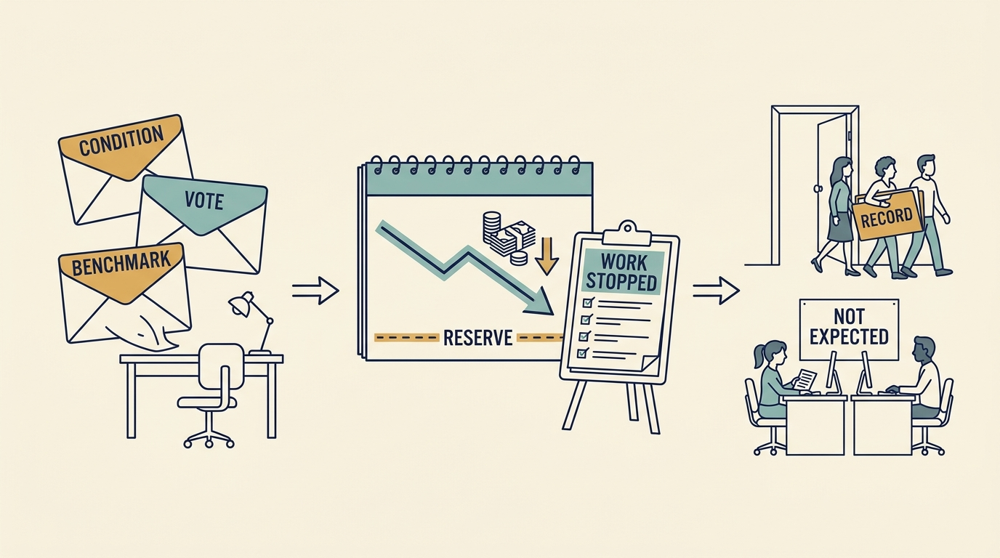

Outside investment grows a team quickly; its obligations can force cuts just as quickly, and a bad layoff removes the capacity the money was meant to build. On 1 October the fictional Larkspur board meets the decision [[the-financing-slipped]] left open. The €600,000 bridge commitment has arrived with a condition: the existing investors fund it only if, by 31 October, the board adopts a plan that holds the €400,000 reserve until 30 June without the delayed round. **A reduction request has to be traced to its source before it is answered.** The scenario is separate from the shared Larkspur ledger; all figures are fictional.

**Figure 1:** *Trace the request to its source, reconcile the reduction by date, and plan for both sides of the door.*

The baseline comes first: forty employees, €324,000 of monthly payroll, €50,000 of contractors ending with R1, €76,000 of other costs, €250,000 of collected revenue, a €200,000 burn. The pressure is then separated. The bridge’s condition is a **funding condition**: cash to a date, which Sam translates into a saving of at least €40,000 a month from February. The investor director’s vote under the reserved matter is a **formal approval right**, answered with a decision the board can take. The remark that other companies cut a fifth of engineering is **influence**: about €28,000 a month by ratio, short of the condition.

**R2** stops the field-worker mobile app and narrows the second country to its two signed customers: eight roles, €72,000 a month recurring, €120,000 of one-off cost. **R3**, running on collected revenue alone, would remove about sixteen further roles and the revenue base; costed as the floor, not chosen.

Reconciled by date, R2’s savings ramp from €20,000 in December to €72,000 in April, one specialist being retained to 31 March, while severance and accrued leave are paid first. With the bridge drawn on 15 November, cash is €488,000 on 30 June and the reserve is reached in August; the condition is met. Without R2 it is €200,000. Without the bridge the reserve is breached in January whatever R2 does. **At these terms and dates the reduction extends the bridge but cannot stand in for it**; compare costs, savings and funding by date.

The board adopts R2 on 15 October with the investor director’s consent; Ines gives the notices on 31 October within plan and law; roles follow the work that stops. Afterwards Larkspur has twelve engineers on two teams, the app archived with a state-of-work record, one second-country customer moved to September by signed amendment, the other’s first-quarter promise kept by retaining one specialist to 31 March (€17,000), and a March transfer test on that real work with one funded further month as fallback. The eight receive paid notice, severance on a stated formula, good-leaver option terms and outplacement, and hear it first. The thirty-two who remain get a published stopped list, a rota of eight instead of ten, and what would restore the plan. EU and US thresholds decide whether a collective procedure (consultation, separate notification of an authority, sixty days’ notice) applies, so the calendar; national and state rules can add more; Larkspur checks its own. [S77: Council Directive 98/59/EC](https://www.legislation.gov.uk/eudr/1998/59) [S78: US WARN Act](https://www.law.cornell.edu/uscode/text/29/2101)
