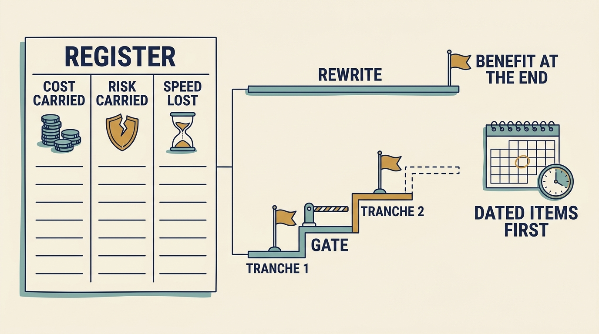

**Technical debt** is the cost a company carries because its software was built, or has aged, so that it is slower, riskier or dearer to change than it needs to be. In the fictional Larkspur scenario, the investor’s technology adviser asks how much technical debt the scheduling-software company has and whether to rewrite the old parts. Issue counts and percentages answer neither. The answer is a **carrying cost** — what each item costs per month — in three columns the board already reads.

**Figure 1:** *Put each item on three monthly columns, then fund the fix in tranches released by measured gates.*

**Cost carried** counts workaround hours and the old component’s licences and hosting. **Risk carried** counts incidents, unsupported components, failed restores and a vendor’s dated retirement. **Speed lost** counts lead time on the changes customers pay for and deals the product cannot take, stated as revenue not won. Larkspur’s five register items (invoicing tangles, an unsupported reporting stack, a single-server scheduling engine capped at about 400 technicians, prompt logic in code, a vendor model retiring 31 March 2028) cost about €8,500 a month, two incidents a quarter, a 45-minute failover and €12,000 a month not won.

Each item’s **origin** decides its owner and remedy: a dated shortcut with an owner is not a failure, an undated one is; growth that outran a design is fixed in stages; an ageing platform or retiring vendor is sequenced by its date.

A fix is presented by what it buys: revenue protected or enabled, cost or risk removed and, only where a real dated decision is kept open, the decision preserved. None can be priced exactly, so the work is judged on the columns it moves. Boards under-fund it because a prevented failure is invisible while its cost sits on this quarter’s budget; the register’s before-and-after figures make “nothing happened” measurable.

For the scheduling engine, a **rewrite** (replacing the system with a new one) means nine frozen months, one switch-over carrying every risk, and about €340,000 that stops counting only when all of it is spent. A **tranche** plan — funding a **refactor** (reworking software without changing what it does) in stages, each released by a measured gate — puts failover and rightsizing in hand at month three for about €58,000, serves the largest customers from month seven, and keeps the core replacement as an open decision. Living with it costs the same every month.

**The decision.** The reporting stack’s **migration** (moving software to a supported platform) goes first, in November and December 2027: a hard date outranks a large number. Ines, the chief executive, authorizes it within her delegation. Engine tranche 1 follows from January 2028 in the board-approved plan; tranche 2 is requested only with tranche 1’s measured result. The gate, by 31 March 2028: failover rehearsed in under five minutes, hosting down at least €1,500 a month, no incident from the split, lead time no worse. The invoicing tangles are carried deliberately, at about €3,000 a month, with a written reason and a review date; the register is reviewed quarterly with the cloud bill.
