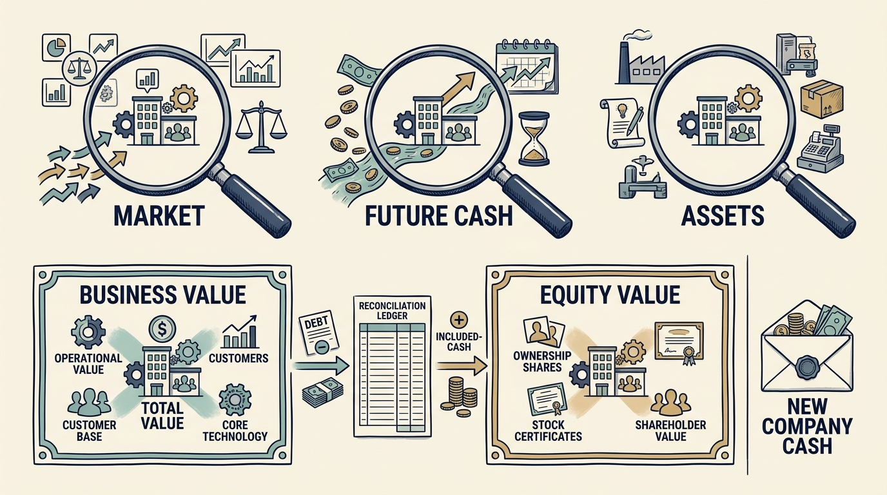

**Valuation estimates what a business or ownership interest is worth at a date and for a purpose.** Different assumptions can produce different answers; each answer still needs supporting evidence. Product and engineering leaders rarely need to value a company, but under investors the estimate becomes the target: its assumptions decide which growth, margin and cost results the company must deliver, and hence which technology work is funded.

**Figure 1:** *Separate the valuation method, ownership value and cash the company receives.*

Begin with three financial ideas. **Revenue** records sales during a period. **Earnings**, or profit, deduct the costs included in a specified measure. **Cash flow** follows actual money received and paid. A customer can pay before or after revenue is recorded, so sales and profit are not the same as cash available today.

**EBITDA** means earnings before interest, taxes, depreciation and amortization. Interest is a borrowing cost. The taxes excluded here are income taxes. **Depreciation** spreads the cost of assets such as equipment over time; **amortization** does the same for certain intangible assets, such as qualifying software development. Leaving out these charges can help compare operating earnings across differently financed businesses, but the excluded costs still matter.

The fictional company records €20 million of revenue and €16 million of operating expenses excluding depreciation and amortization. EBITDA is therefore €4 million. Deduct €1 million of asset-accounting charges to reach €3 million of operating profit, then €1 million of interest and €0.5 million of tax to reach €1.5 million of net profit. None of these calculations alone establishes available cash.

**Enterprise value** estimates the operating business’s value. **Equity value** is the value attributable to its shares after relevant adjustments. In the simplified example, equity value equals enterprise value less **net debt**, borrowings minus included cash. A €60 million business with €20 million of net debt has €40 million of equity value before other adjustments.

Three common valuation approaches **organize the evidence differently**. **Market comparisons** use values of sufficiently similar businesses. A **multiple** expresses value relative to a measure: €60 million is 3× this company’s revenue or 15× its EBITDA. Using an assumed multiple to estimate value requires checking the comparison and assumptions.

**Discounted cash flow** translates expected future cash into today’s value using a rate reflecting time and risk. **Asset-based valuation** examines assets and relevant obligations. Neither future forecasts nor historical development spending establishes value without judgment. Growth can influence any approach; it is not a separate method.

In a separate fictional funding round, an €8m equity valuation before new money plus €2m of new cash gives a €10m post-money valuation, assuming **identical rights and no other adjustments**. The new investor holds 20%; the company receives €2m, not €10m. A purchase of existing shares instead pays the seller. Corporate buyers may expect benefits in their own businesses; those expectations still require evidence and a separately funded operating plan.

These definitions let us follow a purchase through to an investor’s eventual proceeds. The next chapter works through that calculation in [[return-mechanics]].
