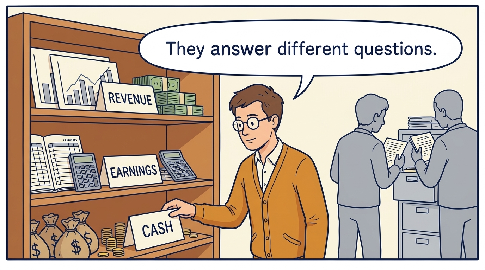
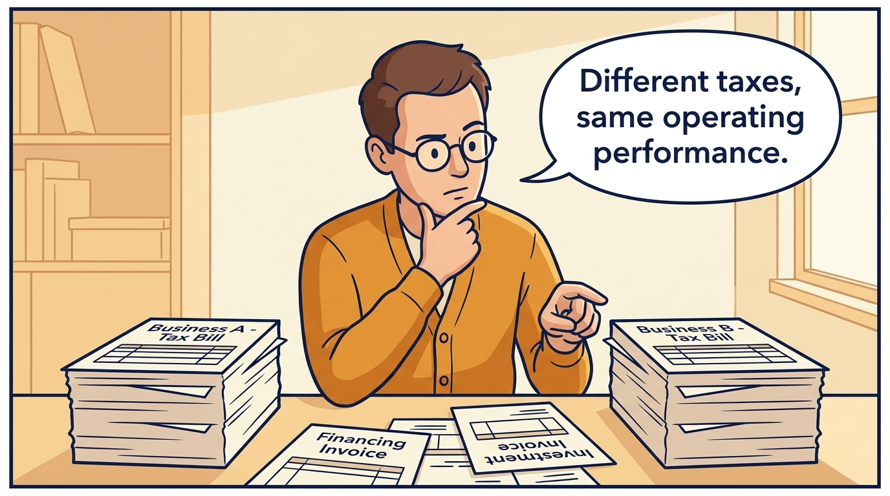
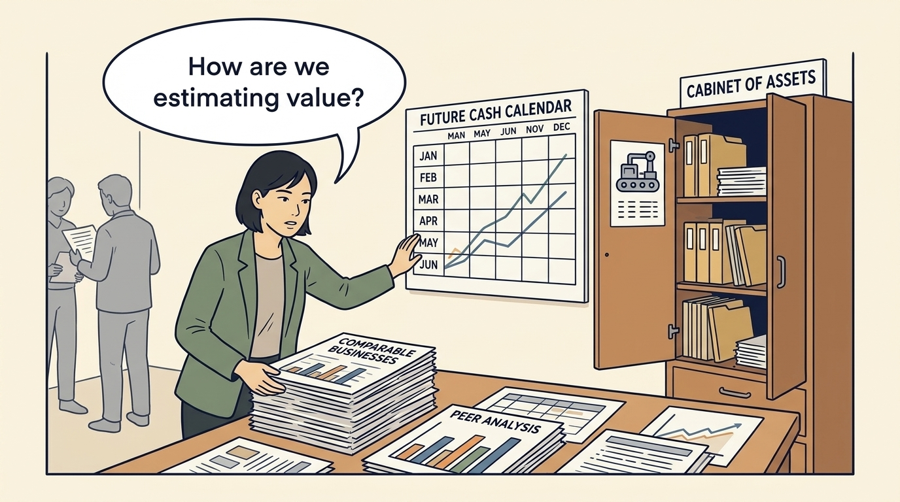
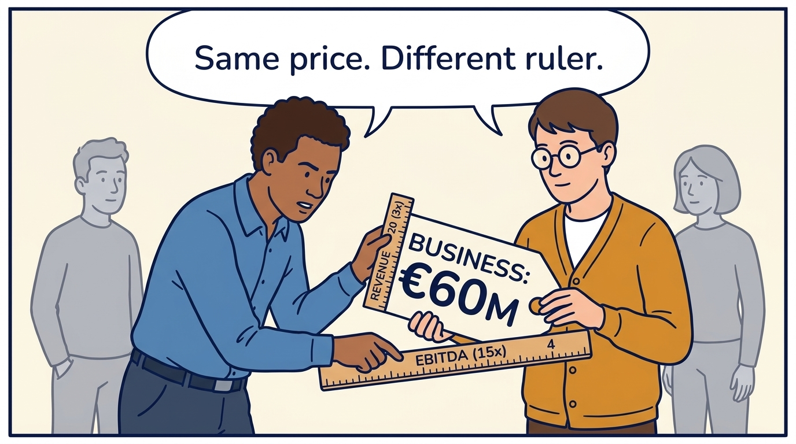
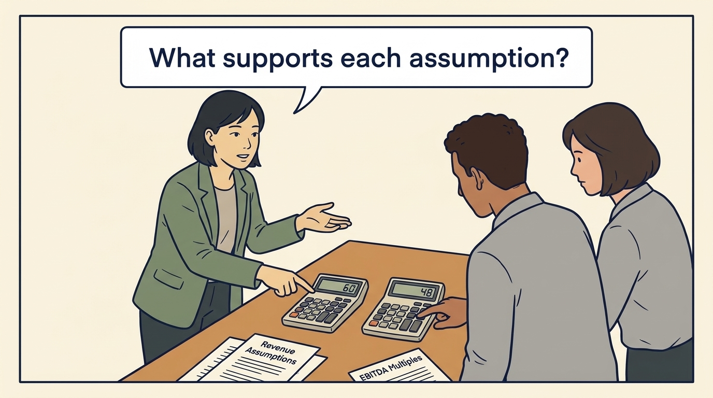
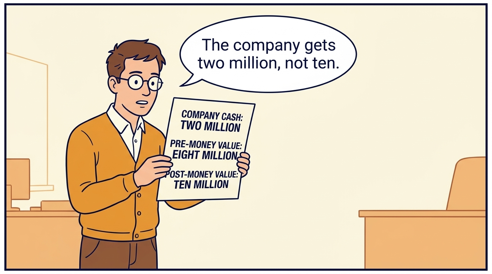

<!-- comic-style
{
  "cast": "MORGAN: a thoughtful investor technology adviser with short dark hair and a green jacket, used in the fund scenarios. ALEX: a practical CTO with curly hair and blue rolled-up sleeves. SAM: a CFO with round glasses and an amber cardigan. PRIYA: a product leader with straight dark hair and plum sleeves. INES: a CEO with short grey hair and a navy jacket. All are fictional; none represents a person in a real case.",
  "style": "Clean editorial explainer comic, dark ink outlines, restrained green, blue, and amber accents on warm white, generous space, readable short speech bubbles, expressive people and simple physical metaphors. No photorealism, logos, dense charts, or title text. Keep the same character appearances throughout the journal."
}
-->

**Comic.** Product and engineering leaders rarely need to value a company. The panels show why, under investors, the estimate becomes the target: its assumptions decide which growth, margin and cost results the company must deliver, and hence which technology work is funded.

Morgan is an investor’s adviser in the fund scenarios; Alex leads technology, Priya leads product, and Sam leads finance. All are fictional. Comparative scenarios use separate assumptions. Historical cases are discussed through documents; the scenes do not reenact real events.

<!-- comic-panel
{
  "id": "01-scene",
  "status": "generated",
  "asset": "assets/images/26-valuation-is-an-estimate/comic-01-scene.jpeg",
  "aspect_ratio": "16:9",
  "prompt": "Panel 1 of an explainer comic. Sam places revenue, earnings and cash cards on separate shelves. Use one speech bubble with the exact words: \"They answer different questions.\" Convey: Revenue records sales. Earnings deduct specified costs. Cash flow follows actual money received and paid. These answer different questions.",
  "alt": "Comic panel: Sam places revenue, earnings and cash cards on separate shelves.",
  "caption": "Revenue records sales. Earnings deduct specified costs. Cash flow follows actual money received and paid. These answer different questions.",
  "generation": {
    "model": "gemini-3-pro-image-preview",
    "reference_id": "owned-cast-20260913",
    "sha256": "fa05365eaaa2d157c412a7203f9d037b7ce98e9d52c3bb56e228aa41461b8019"
  }
}
-->

**Panel 1:** Revenue records sales. Earnings deduct specified costs. Cash flow follows actual money received and paid. These answer different questions.

*Dialogue:* “They answer different questions.”

<!-- comic-panel
{
  "id": "02-scene",
  "status": "generated",
  "asset": "assets/images/26-valuation-is-an-estimate/comic-02-scene.jpeg",
  "aspect_ratio": "16:9",
  "prompt": "Panel 2 of an explainer comic. Sam compares two identical operating businesses with different tax bills, while invoices for financing and investment remain on the desk. Use one speech bubble with the exact words: \"Different taxes, same operating performance.\" Convey: EBITDA leaves out interest, income taxes, depreciation and amortization. The last two spread asset costs over time. The excluded costs still matter.",
  "alt": "Comic panel: Sam compares two identical operating businesses with different tax bills, while invoices for financing and investment remain on the desk.",
  "caption": "EBITDA leaves out interest, income taxes, depreciation and amortization. The last two spread asset costs over time. The excluded costs still matter.",
  "generation": {
    "model": "gemini-3-pro-image-preview",
    "reference_id": "owned-cast-20260913",
    "sha256": "b246f83254330e331ba97f8012f91139d79eabcf1fb5b200a8aa308edd3ee3f4"
  }
}
-->

**Panel 2:** EBITDA leaves out interest, income taxes, depreciation and amortization. The last two spread asset costs over time. The excluded costs still matter.

*Dialogue:* “Different taxes, same operating performance.”

<!-- comic-panel
{
  "id": "03-scene",
  "status": "generated",
  "asset": "assets/images/26-valuation-is-an-estimate/comic-03-scene.jpeg",
  "aspect_ratio": "16:9",
  "prompt": "Panel 3 of an explainer comic. Morgan examines comparable businesses, a future cash calendar and a cabinet of assets. Use one speech bubble with the exact words: \"How are we estimating value?\" Convey: Valuation estimates what something is worth. Compare similar businesses, estimate what future cash is worth today, or examine assets and relevant obligations.",
  "alt": "Comic panel: Morgan examines comparable businesses, a future cash calendar and a cabinet of assets.",
  "caption": "Valuation estimates what something is worth. Compare similar businesses, estimate what future cash is worth today, or examine assets and relevant obligations.",
  "generation": {
    "model": "gemini-3-pro-image-preview",
    "reference_id": "owned-cast-20260913",
    "sha256": "03295f46bcd81bc11c44fec45ba73f401823fdb7582d931e3c1614bd58a6e479"
  }
}
-->

**Panel 3:** Valuation estimates what something is worth. Compare similar businesses, estimate what future cash is worth today, or examine assets and relevant obligations.

*Dialogue:* “How are we estimating value?”

<!-- comic-panel
{
  "id": "04-scene",
  "status": "generated",
  "asset": "assets/images/26-valuation-is-an-estimate/comic-04-scene.jpeg",
  "aspect_ratio": "16:9",
  "prompt": "Panel 4 of an explainer comic. Sam holds one price tag while Alex measures it with two different rulers. Use one speech bubble with the exact words: \"Same price. Different ruler.\" Convey: A multiple compares value with a financial measure. A €60 million business with €20 million of revenue and €4 million of EBITDA is 3× revenue or 15× EBITDA.",
  "alt": "Comic panel: Sam holds one price tag while Alex measures it with two different rulers.",
  "caption": "A multiple compares value with a financial measure. A €60 million business with €20 million of revenue and €4 million of EBITDA is 3× revenue or 15× EBITDA.",
  "generation": {
    "model": "gemini-3-pro-image-preview",
    "reference_id": "owned-cast-20260913",
    "sha256": "262fc585b56c9947debfcac95397c2391a70469f708913cc13f53a73831db8ed"
  }
}
-->

**Panel 4:** A multiple compares value with a financial measure. A €60 million business with €20 million of revenue and €4 million of EBITDA is 3× revenue or 15× EBITDA.

*Dialogue:* “Same price. Different ruler.”

<!-- comic-panel
{
  "id": "05-scene",
  "status": "generated",
  "asset": "assets/images/26-valuation-is-an-estimate/comic-05-scene.jpeg",
  "aspect_ratio": "16:9",
  "prompt": "Panel 5 of an explainer comic. Two calculators on a table show 60 and 48 for the same business. Use one speech bubble with the exact words: \"What supports each assumption?\" Convey: Using an assumed 3× revenue gives €60 million; using 12× EBITDA gives €48 million. Examine the assumptions and evidence behind each estimate.",
  "alt": "Comic panel: Two calculators on a table show 60 and 48 for the same business.",
  "caption": "Using an assumed 3× revenue gives €60 million; using 12× EBITDA gives €48 million. Examine the assumptions and evidence behind each estimate.",
  "generation": {
    "model": "gemini-3-pro-image-preview",
    "reference_id": "owned-cast-20260913",
    "sha256": "6f8fe884a3bcc8a89de5ee0e46399e83ebd65eb6bc619ec01e157783648381a9"
  }
}
-->

**Panel 5:** Using an assumed 3× revenue gives €60 million; using 12× EBITDA gives €48 million. Examine the assumptions and evidence behind each estimate.

*Dialogue:* “What supports each assumption?”

<!-- comic-panel
{
  "id": "06-scene",
  "status": "generated",
  "asset": "assets/images/26-valuation-is-an-estimate/comic-06-scene.jpeg",
  "aspect_ratio": "16:9",
  "prompt": "Panel 6 of an explainer comic. Sam opens a fresh funding-round worksheet, keeping its values separate from the earlier business-valuation example. Use one speech bubble with the exact words: \"The company gets two million, not ten.\" Convey: Separate fictional round: €8m pre-money equity value plus €2m of new cash gives €10m post-money and 20% for the new investor, assuming equal rights and no other adjustments. Company cash increases by €2m.",
  "alt": "Comic panel: Sam holds a worksheet distinguishing two million in company cash, eight million pre-money value and ten million post-money value.",
  "caption": "Separate fictional round: €8m pre-money equity value plus €2m of new cash gives €10m post-money and 20% for the new investor, assuming equal rights and no other adjustments. Company cash increases by €2m.",
  "generation": {
    "model": "gemini-3-pro-image-preview",
    "reference_id": "owned-cast-20260913",
    "sha256": "9c5c967a336c95defb4e5e7f5ccc2f22fba5a1c825a277158afdfde2e09553d3"
  }
}
-->

**Panel 6:** Separate fictional round: €8m pre-money equity value plus €2m of new cash gives €10m post-money and 20% for the new investor, assuming equal rights and no other adjustments. Company cash increases by €2m.

*Dialogue:* “The company gets two million, not ten.”
