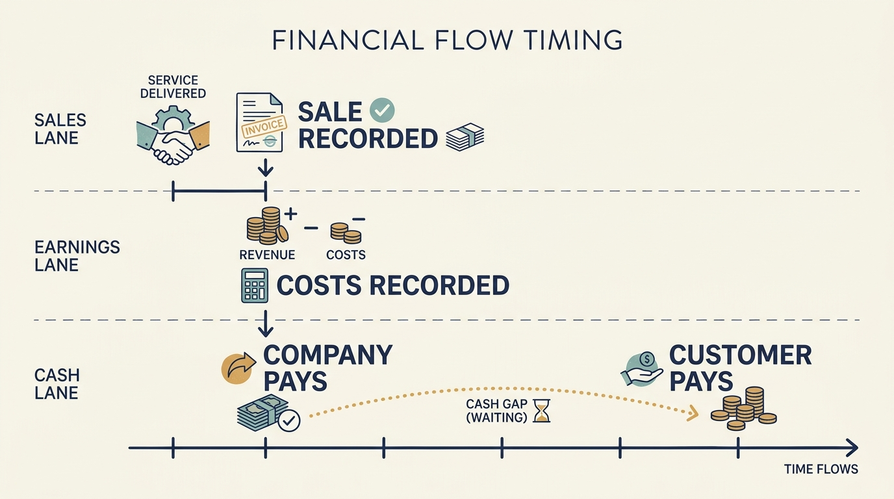
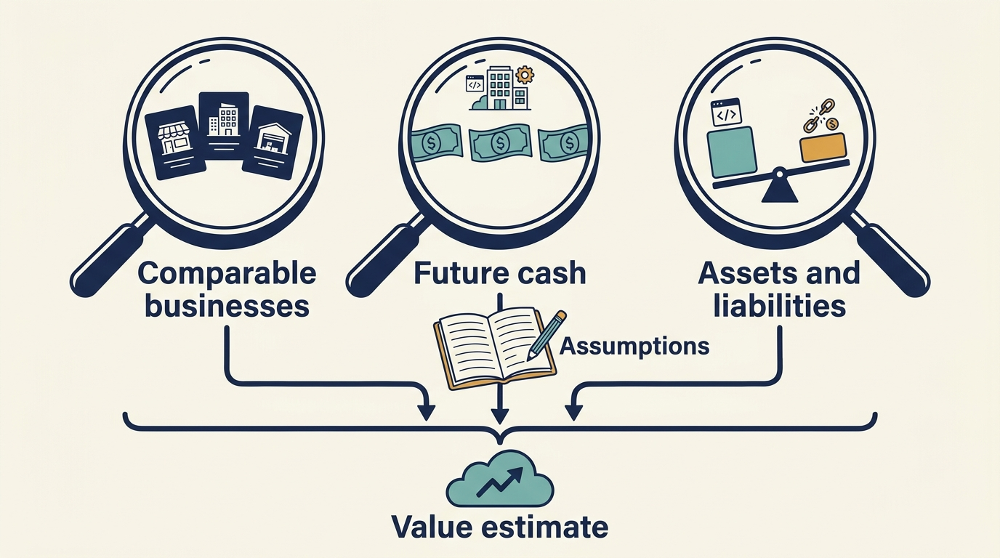

> **IN THIS SECTION, YOU WILL:** Learn to read a business’s sales, profit and cash, then interpret a valuation: what is being valued, how the estimate was built and which of its assumptions your plan is being asked to support.

> **WHY YOU SHOULD CARE:** A valuation’s assumptions quietly become your growth, margin and cost targets; unless you can read how the estimate was built, you cannot tell which targets are credible.

> **WHY INVESTORS CARE:** The valuation is the investor’s own forecast turned into a price; the assumptions inside it are the results the investor is now counting on, and it will test whether management understands them.

> **KEY POINTS:**
>
> * **Sales, profit and cash** answer different questions. A business can record a sale or a profit before receiving the customer’s money.
> * A valuation is an **estimate for a date and a purpose**. Its assumptions can become growth, margin and cost targets that leaders must examine.
> * The **business’s value and the shareholders’ share of it** differ. Borrowing and other claims explain the difference.

 
Suppose someone says a company is worth €60 million. Before interpreting that number, ask what is being valued: the operating business, or the shares its owners hold? Then ask how the estimate was made. This chapter answers both questions in two stages, using that €60 million as the thread.

Product and engineering leaders rarely need to produce a valuation. They do need to read one. An investor’s valuation assumptions can become growth, margin and cost targets, and those targets shape which technology work is funded and which is questioned. Understanding how the number was built shows which assumptions your operating plan is being asked to support, and lets you test whether it can.

**Stage 1, Read the business’s numbers,** introduces revenue, profit and cash flow and ends with a short checkpoint. **Stage 2, Interpret a valuation,** separates business value from shareholder value, works through three common ways of estimating value, and ends with one operating assumption a leader can challenge. Read the calculations one step at a time. They are there to make the assumptions understandable; no spreadsheet or accounting background is needed.

## Stage 1: Read the Business’s Numbers

### Revenue, Earnings and Cash Are Three Different Things

**Revenue** is the income a business recognizes from selling its products or services during a period. It isn’t necessarily cash received in that period: a customer might pay later, or pay in advance for a service delivered over time.

**Profit**, also called earnings, is what remains after the costs included in a particular profit measure. There are several measures because readers want to answer different questions: one may focus on selling and delivering the product, while another also deducts interest on borrowing and income tax. A company’s **income statement** records revenue and expenses over a period; **net profit** is the final result after all its income and charges.

### Why People Use EBITDA to Compare Operating Earnings

Revenue shows the scale of sales but leaves out their cost: two companies with identical revenue can have very different operating economics. Net profit includes those costs but also reflects borrowing, income taxes and asset-accounting charges. Income-tax rates differ between countries, so higher net profit needn’t mean that a company serves customers more efficiently.

Consider two fictional companies with identical operations and €2 million of profit before tax. At assumed effective income-tax rates of 20% and 30%, their net profits are €1.6 million and €1.4 million. The difference comes entirely from tax. These are illustrative rates, not rates for particular countries.

**EBITDA** stands for **earnings before interest, taxes, depreciation and amortization**. Interest is a financing cost. Here, taxes means income taxes, rather than every tax a business pays. An **asset** is a resource expected to provide future benefit. **Depreciation** and **amortization** are accounting charges that spread the cost of certain assets over time: depreciation commonly concerns **tangible assets**, physical items such as equipment; amortization concerns **intangible assets**, nonphysical resources such as qualifying software development or acquired customer relationships.

EBITDA leaves those items out to help compare operating earnings across businesses with different financing, tax circumstances and asset histories. A more heavily borrowed company can pay more interest without operating less efficiently; an acquisition can introduce amortization charges without worsening the acquired product. Removing these effects helps examine the operating business before deciding how to finance or own it. Comparisons still need consistent accounting policies and context. [S52: IPEV valuation guidelines, section 3.4](https://www.privateequityvaluation.com/Portals/0/Documents/Guidelines/2025%20IPEV%20Valuation%20Guidelines.pdf)

**EBITDA supplements net profit and cash flow.** The excluded costs still affect value: lower taxes can benefit shareholders, interest must be paid, and assets may need replacing. EBITDA can’t establish how much cash the business can spend. The SEC distinguishes EBITDA from measures making additional adjustments, which need a different label and a calculation explaining the adjustments in its disclosure context. [S06: SEC non-GAAP guidance](https://www.sec.gov/rules-regulations/staff-guidance/corporation-finance-interpretations/non-gaap-financial-measures)

### Putting the Measures Together

Consider this deliberately simplified, fictional annual income statement. All figures are millions of euros. Operating expenses include salaries, hosting, selling costs and development expensed in the year; assume no other income or charges.

| Step | Calculation | Result |
| --- | --- | ---: |
| Revenue | Sales recognized during the year | 20.0 |
| EBITDA | Revenue 20.0 − operating expenses excluding depreciation and amortization 16.0 | 4.0 |
| Operating profit, or EBIT (earnings before interest and taxes) | EBITDA 4.0 − depreciation and amortization 1.0 | 3.0 |
| Profit before tax | Operating profit 3.0 − interest 1.0 | 2.0 |
| Net profit | Profit before tax 2.0 − tax expense 0.5 | 1.5 |

The **EBITDA margin** is EBITDA divided by revenue: €4 million / €20 million = 20%. It describes an earnings relationship, not a bank balance.

**Cash flow** is money moving into or out of the business during a period. To understand it, look at when customers and suppliers are paid, spending recorded as assets, debt repayments and other actual receipts and payments. Spending €1 million on equipment consumes cash even if only part becomes a depreciation expense this year. Recording qualifying development as an asset can change the timing of earnings charges while leaving the cash payment in place. [[obligations-before-budget]] develops that distinction.

An **adjusted EBITDA** measure adds further specified exclusions to an earnings calculation. Some may improve comparability; others may remove costs the business will keep incurring. Ask for a **reconciliation**: a line-by-line calculation showing how one reported number becomes another. Ask what each excluded cost is and whether the business will incur it again. The Visma and TeamSystem cases show why the adjective “adjusted” matters.

**Figure 1:** *Revenue, earnings and cash describe different events; timing connects them.*

### Checkpoint: What Can You Now Ask About the €60 Million?

Return to the opening number with the fictional income statement in hand. The table gives three results for the same year: €20 million of revenue, €4 million of EBITDA and €1.5 million of net profit. A valuation of €60 million is a price, and a price is only informative once you know what it is being compared with. Before moving on, you should be able to ask three questions:

- Which measure is the €60 million being compared with, and for which period: last year’s result, this year’s forecast or an adjusted figure?
- If the measure is adjusted, what has been excluded, and will the business keep incurring it?
- How did the business’s cash differ from that earnings measure over the year, and why?

If any of these is unclear, the number isn’t yet usable. If all three are clear, Stage 2 explains how the €60 million was built and what it does and doesn’t tell you.

## Stage 2: Interpret a Valuation

### A Valuation Is an Estimate, Not a Number You Look Up

**Valuation** estimates what a business or an ownership interest is worth at a particular date, for a particular purpose. A negotiated acquisition price, an investor’s estimate for reporting and a buyer’s maximum affordable price answer related but different questions. A technology budget shouldn’t treat them as interchangeable facts.

**Enterprise value**, often abbreviated EV, is what the operating business is worth, before asking who has a claim on it. **Equity value** is the value attributable to the shares after allowing for debt, cash and other relevant claims. It’s an estimate of share value, not necessarily cash already paid to shareholders. In the book’s simplified bridge:

**Equity value = enterprise value − net debt.**

**Net debt** is borrowings minus the cash included in the valuation bridge. If €25 million of borrowing and €5 million of cash are included, net debt is €20 million. The debt may remain in place, be repaid or be refinanced at a sale; its treatment must be reflected in the calculation. Cash needed to run the business or restricted from use may be treated differently from surplus cash.

So the opening €60 million can be either figure. If it is enterprise value and net debt is €20 million, equity value is €40 million, before other claims and transaction adjustments. If it is equity value, the operating business is worth more than €60 million once the borrowing is added back. Neither figure is money the company has received; [[announcement-is-not-a-budget]] follows where the cash in a transaction actually goes.

Valuation methods organize evidence and assumptions; they don’t eliminate judgment. The December 2025 **International Private Equity and Venture Capital Valuation (IPEV) guidelines** distinguish the purpose of the valuation, the method used and inputs such as EBITDA. They guide the reporting of estimated values for private investments; they don’t prescribe a company’s strategy or determine its negotiated sale price. [S52: IPEV valuation guidelines, introduction and section 3](https://www.privateequityvaluation.com/Portals/0/Documents/Guidelines/2025%20IPEV%20Valuation%20Guidelines.pdf)

### Three Ways to Estimate Value

With business value and share value separated, the next question is how the business value itself is estimated. The methods below offer a practical orientation, not equal mastery of each: multiples get the fullest treatment because they are what leaders most often hear quoted; discounted cash flow gets a single-payment illustration rather than a working model. The methods can be used together, and their usefulness depends on the company and the available evidence. IPEV discusses earnings and revenue multiples, discounted cash flows and net assets, emphasizing appropriate inputs and comparability. [S52: IPEV valuation guidelines, sections 3.2–3.9](https://www.privateequityvaluation.com/Portals/0/Documents/Guidelines/2025%20IPEV%20Valuation%20Guidelines.pdf)

| Approach | Plain-language question | Main limitation |
| --- | --- | --- |
| Market comparisons | What values do comparable businesses or transactions imply for this company? | The companies, dates, accounting and prospects may not be sufficiently comparable. |
| Discounted cash flow: translate expected future cash into today’s value | What is the business’s expected future cash generation worth today? | The answer depends on uncertain forecasts, risk assumptions and value beyond the forecast period. |
| Asset-based valuation | What are the underlying assets worth, after accounting for relevant obligations? | Assets considered separately can miss the value of a functioning organization and its customer relationships. |

One check applies whichever method is used. Each method can start from a different claim: a multiple of EBITDA or a cash-flow model of the operating business gives an enterprise value, while an asset-based calculation that already deducts debts gives something closer to an equity value. Be clear which liabilities a method has already included before applying the net-debt bridge, so that borrowing isn’t deducted twice on the way to equity value.

#### Market Comparisons: Revenue and Earnings Multiples

A **valuation multiple** is a ratio between a value and a financial measure. If an operating business is valued at €60 million and annual revenue is €20 million, EV / revenue is 3×. If annual EBITDA is €4 million, the same €60 million value corresponds to 15× EBITDA.

Those two multiples describe the same fictional company and valuation, not two incompatible kinds of company. They are different ways of expressing the price.

To use a multiple for valuation, the analyst reverses the calculation. Applying an assumed 3× revenue multiple to €20 million of revenue gives €60 million of enterprise value. Applying an assumed 12× EBITDA multiple to €4 million gives €48 million. These are illustrative assumptions, not current market benchmarks. The disagreement calls for examining the comparisons and expectations behind the assumptions, not picking the larger answer.

A revenue multiple can be useful when current earnings are low or negative and investors are assessing what a growing business could become. But revenue doesn’t reveal the cost of delivering it. Two businesses with equal revenue can need very different staffing, infrastructure, selling effort and ongoing investment.

An EBITDA multiple makes an earnings base explicit. It still leaves questions about how sustainable those earnings are and what cash is needed to maintain them. Comparing one company’s forecast adjusted EBITDA with another’s historical unadjusted result can produce an apparently precise but unsuitable valuation. IPEV specifically addresses consistency of the period and accounting basis, including development-cost differences. [S52: IPEV valuation guidelines, section 3.4](https://www.privateequityvaluation.com/Portals/0/Documents/Guidelines/2025%20IPEV%20Valuation%20Guidelines.pdf)

**Growth is a business characteristic, not a separate valuation method.** Growth expectations can influence a revenue multiple, an EBITDA multiple or a cash-flow forecast. A mature business can also have valuable growth opportunities. A rapidly growing business still needs a credible relationship between future revenue, costs and investment.

#### Discounted Cash Flow: Make Time and Investment Explicit

Discounted cash flow, or **DCF**, estimates future cash flows and translates them into present value. The **discount rate** reflects the required compensation for time and risk under the chosen model. Cash flow and discount rate must refer to the same claims: a model valuing the operating business differs from one valuing cash available only to equity holders.

A small fictional example explains discounting. At an assumed 10% annual discount rate, €1.1 million received in one year has a present value of €1 million: 1.1 / 1.10. This is arithmetic, not a recommended rate. An uncertain three-year transformation needs a fuller forecast than that single payment.

For a company valuation, the model also needs the cash flows across the forecast period and a **terminal value** for what comes afterward. That final estimate can materially affect the result. A spreadsheet that stops at five years doesn’t mean the company stops needing development or maintenance in year six.

For a technology proposal, this approach makes the sequence visible: spend on a migration now, run two platforms during the transition, realize savings later, and keep paying to maintain the result. Its weakness is that plausible-looking assumptions can hide an unachievable plan. The architecture and operating teams must help test what the forecast requires.

Growth also needs resources. Damodaran’s teaching on growth-company valuation connects revenue growth, sustainable margins and reinvestment; a larger business may need more capital before it produces more cash. [S53: Growth companies—value drivers](https://pages.stern.nyu.edu/~adamodar/New_Home_Page/littlebook/growthvaluedrivers.htm) The practical implication is to ask how much product, engineering, selling and implementation effort each growth assumption requires, and when the benefit can arrive.

#### Asset-Based Valuation: Understand What Can Be Separated

An asset-based approach examines the value of assets and relevant **liabilities**, financial obligations such as debts and unpaid bills. It can be particularly informative when identifiable assets drive value or when continuing the business in its present form is doubtful.

For a software company, adding up historical development expenditure isn’t a sufficient valuation. Code written at great cost may have little use; a relatively inexpensive product may support valuable customer relationships. The cost of building an asset and what someone would pay for it answer different questions.

The technology implications concern separability and continuity. Who controls the product rights? Can the service operate without its current parent? Which shared systems, people and contracts would need replacing? These questions become especially concrete in a carve-out, where a business is separated from a larger organization. [[acquisition-adds-work-first]] examines that work.

**Figure 2:** *A valuation depends on its purpose and assumptions; no single lens supplies an automatic price.*

### A Funding-Round Valuation Answers a Different Question

In a separate fictional example, Larkspur agrees an **equity valuation before new funding**, or **pre-money valuation**, of €8m. An investor subscribes €2m for new shares. Ignoring fees, other securities and different share rights, the **post-money valuation**, the equity value immediately after that funding, is €10m. The new investor owns €2m / €10m = 20%.

The company receives €2m, not the €10m headline valuation. If the same investor instead pays a founder €2m for existing shares, the company receives no new money at all. Nor should this equity valuation be compared directly with an enterprise value that treats borrowing differently.

A financing round sets a negotiated price for particular shares under particular terms. It doesn’t establish what every shareholder could receive in a sale, especially when payment rights differ. The product leader’s useful question is which assumptions about customer demand, growth and future funding justify the price, and which of them the team can test.

An early business with losses can’t sensibly use a positive EBITDA multiple as though current earnings established its value. A forecast or comparison still needs **assumptions about future sales, costs, reinvestment and uncertainty**. A corporate buyer may also expect benefits in its own operations. Those expected benefits belong in a separate explanation of what must change, who pays and how success would be observed.

### One Assumption to Challenge: Cost to Serve Falls as Sales Grow

Take the €60 million one last time, now as a model rather than a headline. Suppose, in a separate fictional assumption, the buyer’s model reaches that figure by expecting revenue to double over four years while onboarding cost per customer falls by a third, on the reasoning that implementation effort will spread across more customers. That is an operating assumption, and it lands on product and engineering. In the Larkspur onboarding example that [[roadmap-to-revenue]] costs out, each implementation takes about 80 hours, much of it one specialist’s manual configuration. Nothing in “more sales” makes those hours fall. Only a specific change does.

Three questions turn the assumption into something testable:

- **Which change produces the reduction?** A reusable setup step, a self-service data import, or a narrower first-year target of customers whose data is already standard. Name it.
- **When does it become usable?** If the setup step needs two quarters to build and a cohort to prove it, the cost reduction can’t start in year one, and the model’s year-one margin is wrong.
- **Who funds the transition?** Building the change consumes cash and engineer-weeks before it saves a single hour. That spending has to sit in an approved plan, not be assumed by the valuation.

If the answers are “nothing specific,” “not yet” and “nobody,” the assumption is a hope, and the target derived from it needs revising before the plan does. [[growth-into-design]] works through choosing the system change that makes such an assumption true, and [[roadmap-to-revenue]] shows how to measure whether it did.

## What to Carry Forward

Stage 1 gave you three measures that describe different events: revenue records sales, profit deducts a specified set of costs, and cash flow follows actual payments. Stage 2 gave you the bridge from business value to share value, three ways the business value can be estimated, and the habit of reading a valuation as a bundle of assumptions to be tested rather than a fact to be met.

You can now read a valuation. The next question is what the investor expects to get back from it, and why two investors holding the same company through the same performance can report very different results: [[three-different-returns]].

## Questions to Consider

1. *The last time you heard a valuation for your company, was it enterprise value or equity value, at what date and for what purpose?*
2. *Which valuation assumptions is your technology plan being asked to support: growth in which customers, margins at what cost to serve, earnings sustained by what investment? Which change would make each one true, and is it funded?*
3. *Which adjusted measures does your company report, and do you know what each excluded cost is and whether it recurs?*
4. *After the last funding round, how much money actually reached the company compared with the headline valuation?*

## To Probe Further

- **[Beginners’ Guide to Financial Statements](https://www.sec.gov/about/reports-publications/beginners-guide-financial-statements)** — U.S. Securities and Exchange Commission, 2014, updated 2017. *Start here if Stage 1 was new to you: a plain-language walk through the balance sheet, income statement and cash flow statement behind this chapter’s revenue, earnings and cash section.*
- **[IFRS 13 Fair Value Measurement](https://www.ifrs.org/issued-standards/list-of-standards/ifrs-13-fair-value-measurement/)** — International Accounting Standards Board, issued 2011. *The formal version of “a valuation is for a date and a purpose,” and the fair value definition your investor’s audited accounts are likely to use.*
- **[Valuation Approaches and Metrics: A Survey of the Theory and Evidence](https://pages.stern.nyu.edu/~adamodar/pdfiles/papers/valuesurvey.pdf)** — Aswath Damodaran, Stern School of Business, 2006 (published in Foundations and Trends in Finance, 2007). *Optional depth: a free survey of cash-flow models, multiples and asset-based valuation, the three lenses this chapter only introduces.*
- **[Valuation: Measuring and Managing the Value of Companies](https://www.wiley.com/en-us/Valuation:+Measuring+and+Managing+the+Value+of+Companies,+8th+Edition-p-9781394279418)** — Tim Koller, Marc Goedhart and David Wessels, McKinsey & Company, Wiley, 8th edition, 2025. *Optional depth: the practitioner reference behind many investor models, showing how a cash-flow forecast becomes an enterprise value and then an equity value.*
- **[Squaring Venture Capital Valuations with Reality](https://www.nber.org/papers/w23895)** — Will Gornall and Ilya Strebulaev, National Bureau of Economic Research working paper, 2017 (Journal of Financial Economics, 2020). *A study of 135 US unicorns whose modeled fair values, derived from each share class’s contractual terms, average about 50% below the reported post-money valuations; it shows how valuing every share at the latest preferred-share price can overstate the estimated value of the whole company, which is why this chapter treats a round valuation as answering a different question.*
