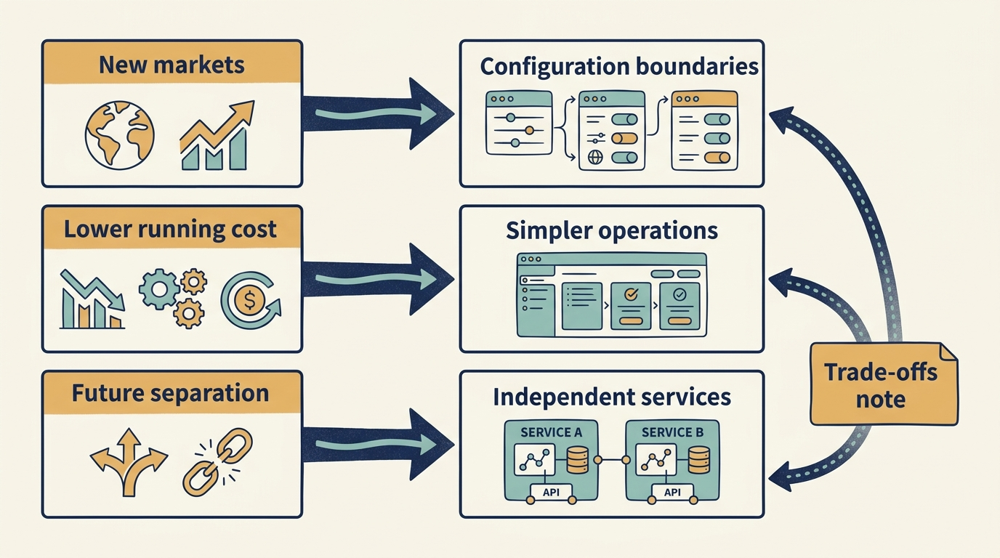
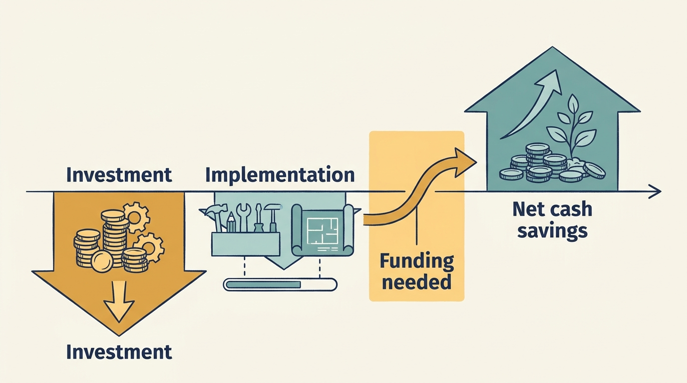

> **IN THIS SECTION, YOU WILL:** Learn to recover the business requirement behind a request for flexibility, compare implementation options against it and choose one with its funded transition.

> **WHY YOU SHOULD CARE:** “Make it more flexible” funds nothing on its own; a design chosen without the recovered business requirement is either over-built or wrong, and both cost cash before benefits arrive.

> **WHY INVESTORS CARE:** Growth is the assumption the valuation rests on; investors need the design choice that makes it possible to be funded, dated and reversible, not a request for flexibility with no cost attached.

> **KEY POINTS:**
>
> * An investor’s growth assumption reaches the team as a request for flexibility. **Recover the business requirement** before comparing designs: which changes must become easier, for which customers, by when.
> * Compare **options against that requirement**, not against each other’s fashion: the same customer need, delivery date, ongoing responsibility and cash limit. Choose one under stated assumptions and name the evidence that would reverse it.
> * Follow **spending and benefits through time**. An attractive future saving still needs funding before it arrives, and a design that adds operating responsibility adds a cost line the next review will question.

 
Suppose an investor expects Larkspur to grow quickly, and the technology team is asked to make the software “more flexible.” An investor’s growth assumption has reached the team as a request for flexibility. Recover the business requirement before comparing designs: which changes must become easier for the growth to happen?

The request leaves out its reasoning, and that is the condition this chapter starts from. Any company translates financial expectations into technical work. What is particular here is that the assumption arrived as a demand, with the customers, dates and constraints behind it left with the investor. The leader’s task is to recover that reasoning and turn it into an implementation choice the company can fund.

A **valuation assumption** is a belief used when estimating what a business is worth, such as an expectation of future sales or profit. An **operating requirement** states what the company must do to make that belief plausible. An **implementation choice** is how the company meets that requirement in its technology: how the systems are structured, what is built, what is bought, and how the parts fit together. That structure exists inside a system the team builds and across the landscape of systems, suppliers and integrations the company runs. The examples below come mostly from software a company builds; the same reasoning applies when the choice is which supplier system to adopt or how deeply to integrate it.

The boundary with the two preceding chapters is deliberate. [[can-the-team-deliver]] produced the assessment this chapter uses. Its finding for fictional Larkspur’s second country was: *market entry depends on coordinated changes to billing, legal work, support and product configuration, because the country rules are coupled into the invoicing module that all four read; every engineering change to those rules passes through the same two specialists and takes about three weeks end to end.* [[fix-decisions-before-hiring]] dealt with the organizational half: delegation removed the decision waits, and one billing engineer is being brought into the module. This chapter takes the system half and chooses. It does not repeat the assessment.

## Recover the Requirement

“We are valued on growth” is incomplete. Growth in which customers, products or markets? How many will stay, what will it cost to serve them, and what further investment is required? “We are valued on **EBITDA**”, earnings before interest, taxes, depreciation and amortization, is also incomplete. Which year’s earnings, under which adjustments, and how will the company sustain them? [[valuation-is-an-estimate]] introduces the terms.

If much of the valuation depends on expansion, management may weight learning quickly, entering markets, onboarding customers and changing the offering, and may accept lower current earnings to build those capabilities, provided the cost, funding and evidence justify it. If much of it depends on repeatable earnings, management may weight cost to serve, reliable operations and predictable investment. Neither priority removes the other: a growth plan with worsening cost per customer may need cost work urgently, and an earnings-focused company whose product is becoming obsolete may need experimentation urgently. The useful distinction is which business uncertainty or constraint matters most right now.

For Larkspur, recovered from the investor’s reasoning, the requirement is: invoice, contract with, support and onboard customers in a second country under that country’s tax and pricing rules, with first paying customers within twelve months; and, because the thesis assumes a third country within two years, adding a country must become cheaper each time. That is what “more flexible” meant.

## What Each Priority Asks of the Design

A valuation method doesn’t dictate an implementation. The overview below names, for each business priority, the trade-off the design has to face. Two shorter tables then separate the questions for a system the company builds from those for one it buys, because the same priority leads to different questions. A common arrangement is a bought core with built extensions around it, so many readers will need both.

| Business priority implied by the thesis | Trade-off to evaluate |
| --- | --- |
| Learn which products or markets can grow | Flexibility costs effort; elaborate infrastructure can slow the learning it was meant to enable. |
| Serve more customers without proportional cost growth | Sharing resources may lower unit cost while increasing coordination or failure exposure. |
| Improve sustainable earnings and cash generation | Savings depend on a completed transition; cutting resilience or development can damage future earnings. |
| Combine acquisitions or prepare a separation | Integration can improve the customer offer but reduce local flexibility and complicate a later separation. |
| Reduce dependence on a single supplier or person | Compare the dependency’s possible impact and likelihood with the cost and effectiveness of the alternatives; include consequences the company cannot accept. [[prove-you-can-restore]] shows why a rare failure can still dominate a decision. |

**If the company builds the system.** A few terms first. **Modularity** means dividing software into parts with clear responsibilities and connections. **Feature flags** let a team enable or disable selected behavior without releasing a new version each time. **Tenant isolation** keeps different customers’ data or workloads appropriately separated in a shared service. **Interfaces** are the agreed ways software parts exchange information.

| Business priority | What to examine in a built system |
| --- | --- |
| Learn what can grow | Isolated changes, configurable workflows, feature flags, reliable deployment and experiment measurement |
| Serve more customers | Automated onboarding, capacity management, appropriate tenant isolation and cost visibility |
| Improve earnings and cash | Remove duplicate systems, simplify operations, automate repetitive work, retire unused infrastructure |
| Combine or separate | Clear product boundaries, reliable interfaces, portable data and explicit shared-service dependencies |
| Reduce a dependency | Spread knowledge beyond the one or two people who hold it |

**If the company buys the system.** **Configuration** changes behavior through settings rather than by changing the software itself. **Customization** means altering a supplier’s product beyond its intended settings, which often makes later upgrades harder. **Exit cost** is what the company would spend to move to another supplier, including moving its data and retraining its staff.

| Business priority | What to examine in a bought system |
| --- | --- |
| Learn what can grow | Configuration depth without custom code, a sandbox to test in, and how quickly the supplier delivers a needed change; customizing to gain flexibility can remove it at the next upgrade |
| Serve more customers | How licence and consumption charges scale with customers; a price per user or per transaction can erode the margin the growth plan assumes |
| Improve earnings and cash | Consolidate overlapping products, renegotiate at renewal, retire licences still being paid for; a negotiated discount can be reversed at the next renewal |
| Combine or separate | Whether licences transfer on a sale, whether data can be exported in usable form, and which contracts bind the whole group |
| Reduce a dependency | Know the exit cost, the notice period, and whether an equivalent supplier exists |

A growth-oriented company might need modular boundaries because teams must change a few parts of the product independently. **Microservices** are smaller services that can be deployed and operated separately. Modular boundaries don’t automatically require them. A modular application with one deployment can be cheaper and easier for its team to operate; separately deployed services become an option when their specific independence is worth the extra operating work.

A company that buys most of its systems faces the same question in a different form. Flexibility there comes from staying close to the supplier’s intended use, so upgrades stay routine, and from keeping its own distinctive work in parts it controls. Heavy customization of a bought product is one common way companies lose both: the system no longer upgrades cleanly, and the knowledge of why it was changed leaves with the people who changed it. Equally, a blanket preference for the lowest immediate cost is not an earnings strategy. A reliable **managed service**, operated by a supplier on the company’s behalf, can cost more on an invoice while reducing the total work of operating the product; a commitment that lowers this year’s hosting price may limit the ability to shrink or change later.

**Figure 1:** *Implementation choices need a specific business priority and an explicit account of their trade-offs.*

## Three Options for One Requirement

Alex and Priya compare three ways to meet Larkspur’s second-country requirement. Every figure is fictional. The cash limit comes from the plan Sam has confirmed: up to €300,000 of additional cash this year for the expansion’s technical work, on top of the billing engineer already funded. The scarce capacity is the two invoicing specialists, whose protected time now exists because the previous chapter removed the decision waits from their queue.

| | A. Configure a supplier | B. Own the boundary | C. Replace the core |
| --- | --- | --- | --- |
| What it is | Adopt a bought tax-and-billing service for the second country, configured for its rules and integrated with the existing invoicing module through its export | Extract the country rules from the invoicing module behind an interface Larkspur owns; migrate the first country onto it, then add the second as configuration | Replace the billing and configuration core so that all country rules become configuration, as costed in the assessment |
| First second-country invoice | Month 4–5 | Month 8 | About month 12 |
| Additional cash | €60,000 setup; €40,000 a year subscription, rising per invoice | €140,000: a contractor covering the specialists’ product work during the extraction, plus test tooling | €1.3m over eighteen months |
| Engineer-weeks and scarce capacity | 8; two specialist-weeks | 16, including six weeks of the two specialists and the new billing engineer | 4 people × 18 months; the specialists throughout |
| Ongoing responsibility | The supplier maintains tax rules; Larkspur maintains the integration and finance reconciles two billing paths | Larkspur maintains the country-rules component; each further country is configuration | Larkspur maintains a new core; the old one must be retired |
| What it preserves or sacrifices | Fastest and cheapest now; leaves the coupling in place and adds a second billing path per country | Touches the fragile module, so existing invoices carry regression risk; removes the coupling for every later country | Broadest capability; far exceeds the cash limit, leaves no margin against the twelve-month date, and the retirement condition is unresolved |

They choose **B**, under three explicit assumptions. First, the thesis’s third country is real: with a third country, A’s per-country subscription and second billing path compound, while B makes each further country a configuration change. Second, the six specialist-weeks are available, which is true only because the delegation changes in the previous chapter hold. Third, last year’s invoices can be replayed through the extracted rules to detect regressions before any customer sees them.

Rejected: A, because it meets the date but leaves the constraint that made expansion hard in the first place and adds a reconciliation burden the growth plan would multiply; it is held as the fallback. C, because it far exceeds the cash limit, leaves no margin against the twelve-month date, and its retirement condition is unknown; it would be reconsidered only if a third country and larger customers made the whole core the constraint rather than the country rules.

Funding: €140,000 of the €300,000, leaving room for the fallback. Scarce capacity: six weeks of the two specialists, protected in the plan. Authority: the Larkspur board approved the envelope; Ines authorizes the choice on Alex and Priya’s recommendation; Alex is accountable for delivery and Priya for the country requirement being met, including the legal and support work engineering cannot do. Evidence that would reverse the decision: if by month four the replayed invoices show differences the specialists cannot explain within two weeks, or incidents consume the protected time, Larkspur switches to A for the second country and leaves B at a safe intermediate state with the first country’s rules extracted; if fewer than five signed customer commitments exist in the second country by month six, the go-live is deferred and the boundary work continues for the first country only; if the third-country assumption disappears from the thesis, A becomes the better answer and B stops.

## A Bounded Illustration: Paying for a Saving

The choice above buys capability, not a cash saving. A **separate payback example** shows how a saving is financed, and it should not be added to the decision above. Assume one proposed change at Larkspur costs €200,000 in cash now and is expected to avoid €100,000 of annual external setup costs after a one-year implementation. Assume those supplier payments really can be avoided and the €100,000 is the annual cash saving after any added operating and maintenance costs. The €180,000 pilot in [[roadmap-to-revenue]] illustrated staff capacity; this example illustrates cash savings. The two shouldn’t be added together either.

An earnings discussion examines the recurring cost reduction and its effect on the relevant earnings measure. A cash discussion must include the initial payment, the year’s wait and the timing of savings. A growth discussion asks whether easier onboarding also removes a constraint on selling and serving more customers. An implementation discussion asks which configuration or integration boundary would deliver the improvement without a much larger rewrite. These are complementary views of one proposal. The first €100,000 saving arrives during the second year, not immediately after approval; cumulative undiscounted savings recover the €200,000 after two full years of savings, about three years after the initial investment. That is a **simple payback** calculation; it ignores tax, discounting, timing within each year and uncertainty.

A **valuation multiple** expresses business value relative to a financial measure, such as annual EBITDA. At an unchanged 10× EBITDA multiple, €100,000 of additional annual EBITDA corresponds to €1 million of enterprise value. That is a sensitivity calculation, not an independently established project value: it assumes the saving is sustainable, the relevant EBITDA definition reflects it, the multiple stays unchanged and other effects don’t offset it. The initial investment also affects cash and potentially net debt. Adding both that €1 million and the present value of the same future savings would double-count the benefit.

If Larkspur can’t fund the first year, the project may be **economically attractive and currently infeasible**. It could phase the work, seek funding or choose another intervention. Valuation doesn’t remove the financing constraint.

**Figure 2:** *A promising future saving still needs an affordable route through the implementation period.*

## Other Owners, Other Hypotheses

The same discipline applies when the expectation comes from a different owner. A corporate parent may value using Larkspur across its own customer base; the implementation question becomes which interfaces and operating responsibilities enable that use, with a named company sponsor and budget. A buyout plan may emphasize cash generation; the case then needs the transition costs and the time before any saving reaches cash. A new funding round may require evidence of an option worth developing further, without funding the full option today. These are alternative hypotheses; none assigns a guaranteed valuation premium to a technical feature. **Show the technical evidence separately from the financial inference**, and say which funding or commercial commitment must arrive before the next design stage is justified.

## The Decision Record

The CEO, CFO, product leader and CTO record five answers together, drawing on the investor’s adviser where useful. For Larkspur’s second country they read:

1. **The value assumption:** the growth thesis assumes a second country within twelve months and a third within two years; each country’s signed customers and revenue are the assumption’s test.
2. **The operating requirement:** invoice, contract with, support and onboard customers under the second country’s tax and pricing rules by month twelve, with each further country cheaper to add than the last.
3. **The technical options:** configure a supplier (fast, keeps the coupling, adds a billing path per country); own the boundary (month eight, removes the coupling, regression risk on existing invoices); replace the core (broadest, €1.3m, far beyond the cash limit and with no margin against the date).
4. **The funded transition:** option B, €140,000 of the €300,000 envelope, sixteen engineer-weeks including six protected specialist-weeks, first second-country invoice in month eight; option A held as the €60,000 fallback.
5. **The review evidence:** the month-four replay of last year’s invoices; five signed customer commitments by month six; the month-eight go-live; and the three reversal triggers above.

Then test the record against slower growth, a lower sale valuation and a longer ownership period. Under slower growth with no third country, A would have been enough, and the board should know that B’s extra €80,000 is the price of the thesis being right; the boundary still shortens every later rule change, so the money is not wasted, but it was spent on an assumption. Under a lower sale valuation, nothing in the design changes, because the choice was made against a customer requirement rather than a multiple. Under a longer ownership period, C moves closer, because the retirement of the old core becomes affordable inside the holding period.

Option B leaves Larkspur operating the country rules itself. The billing engineer, the protected specialist time and the test tooling are now lines in the operating cost, and the next visible line an investor will question is the hosting bill, because it is large, adjustable and improves the earnings measure directly. [[cheaper-cloud-bill]] shows how to tell whether a lower bill reflects a real improvement or a worse unit of service.

## Questions to Consider

1. *What does “more flexible” or “lower cost to serve” mean in your company’s case: which changes must become easier, for which customers, by when, for the valuation assumption to hold?*
2. *For your most significant proposal, have you compared at least two designs against the same need, date, ongoing responsibility and cash limit, and written down what would reverse the choice?*
3. *Are the systems your company buys being customized in ways that trade upgrade flexibility for short-term convenience?*
4. *Would your chosen design still be right under slower growth, a lower sale valuation and a longer ownership period, and which of those changes the answer?*

## To Probe Further

- **[Architecture: Selling Options](https://architectelevator.com/architecture/architecture-options/)** — Gregor Hohpe, The Architect Elevator, 2016. *Treats flexibility as a financial option bought at a price now, which gives you the language to explain to a board why modularity costs money.*
- **[The Promise and Peril of Real Options](https://pages.stern.nyu.edu/~adamodar/pdfiles/papers/realopt.pdf)** — Aswath Damodaran, NYU Stern, working paper. *The finance-side check on the options metaphor, worth reading before you present flexibility as a valuation benefit to an investor who knows the discounted-cash-flow view.*
- **[Design Rules, Volume 1: The Power of Modularity](https://mitpress.mit.edu/9780262291859/design-rules-volume-1/)** — Carliss Baldwin and Kim Clark, MIT Press, 2000. *The dense but original source behind this chapter's claim that a module that can change independently is an option the company holds, so modularity is an economic choice.*
- **[Monolith First](https://martinfowler.com/bliki/MonolithFirst.html)** — Martin Fowler, 2015. *Supports this chapter's point that modular boundaries do not require separately deployed services, since the successful microservice systems Fowler saw started as monoliths.*
- **[Building Evolutionary Architectures](https://evolutionaryarchitecture.com/)** — Neal Ford, Rebecca Parsons and Patrick Kua, O'Reilly, 2017. *Introduces fitness functions, a way to state which changes must become easier so the operating requirement in this chapter's five-point decision can be tested rather than asserted.*
