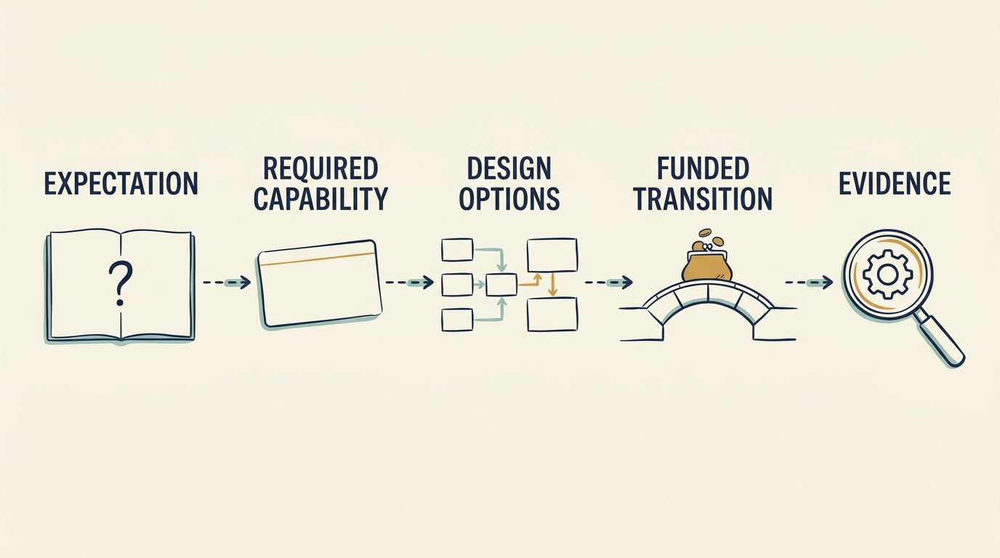

**A valuation assumption is a belief used when estimating company value**, such as expected sales growth. An investor’s growth assumption has reached fictional Larkspur’s team as a request for flexibility, with the reasoning left behind. Recover the business requirement before comparing designs.

**Figure 1:** *Translate financial expectations into testable work before choosing a design.*

“Valued on growth” is incomplete until it says which customers, what they need and **what it will cost to serve them**. For Larkspur the recovered requirement is: invoice, contract with, support and onboard customers in a second country under its tax and pricing rules within twelve months, and make each further country cheaper to add, because the thesis assumes a third.

The previous two chapters established the constraint, country rules coupled into the invoicing module changed only through two specialists, and relieved the queue around them; this chapter chooses the system change.

An **implementation choice** is how the company meets a requirement in its technology. **Modularity** divides software into parts with clear responsibilities; it can make selected changes easier without requiring **microservices**, smaller services deployed and operated separately. Judge a supplier or single-person dependency by impact and likelihood against the cost of alternatives, not by rarity alone.

Three fictional options are compared against the same requirement, date and a €300,000 cash limit (a scenario separate from the hundred-day plan) on one basis, first-year cash then recurring cost; two fit the limit. **A, configure a supplier**: a bought tax-and-billing service, €60,000 setup plus €40,000 a year per country, first invoice in month four, but the coupling stays and each country adds a billing path. **B, own the boundary**: extract the country rules behind an interface Larkspur owns, €140,000 once with no supplier fee, maintained by the funded billing engineer, six protected specialist-weeks, first invoice in month eight, regression risk on existing invoices. **C, replace the core**, €1.3m over eighteen months, exceeds both the cash limit and the date; it is the comparison.

Larkspur chooses **B**: €80,000 more upfront, cheaper than A only beyond the second year or once a third country arrives; it assumes the third country is real, the specialist time holds and last year’s invoices can be replayed to catch regressions. A is the fallback, priced with its subscription and fundable from the unspent envelope; until the replay passes, the existing module stays authoritative. C waits until the whole core is the constraint. Alex is accountable for delivery, Priya for the requirement; Ines authorizes within the board’s envelope. The decision reverses if the month-four replay shows unexplained differences, fewer than five customers have signed by month six, or the third country leaves the thesis.

A **separate payback illustration**: €200,000 now, €100,000 a year after a one-year implementation, simple payback about three years after investment. At an unchanged 10× multiple, €100,000 of EBITDA corresponds to €1 million of enterprise value, a sensitivity, not a project value; adding it to the same savings counts them twice.

B leaves Larkspur operating the country rules; the next cost line an investor will question is the hosting bill: [[cheaper-cloud-bill]].
