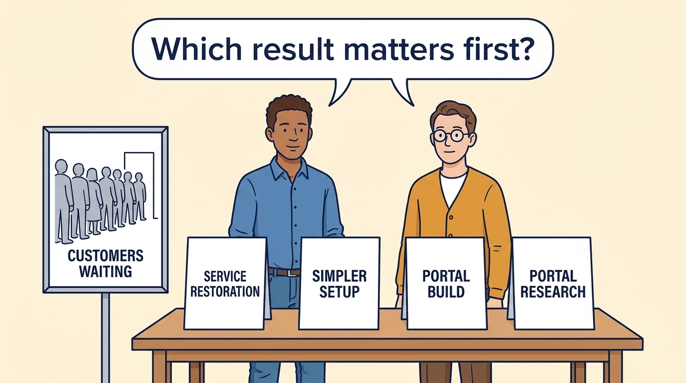
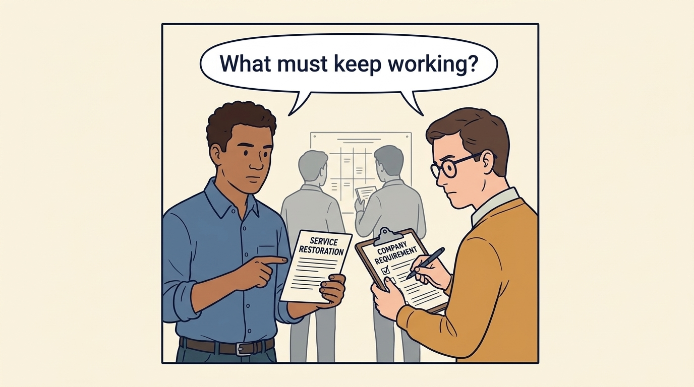
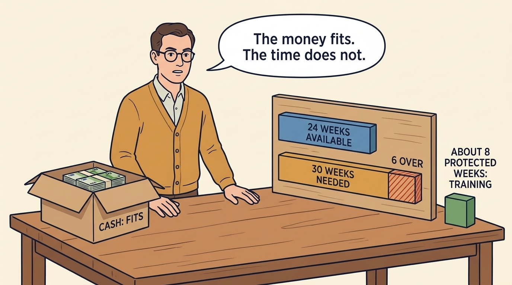
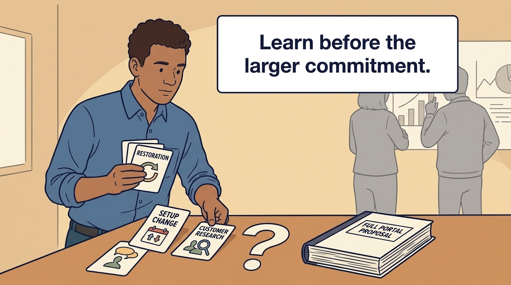
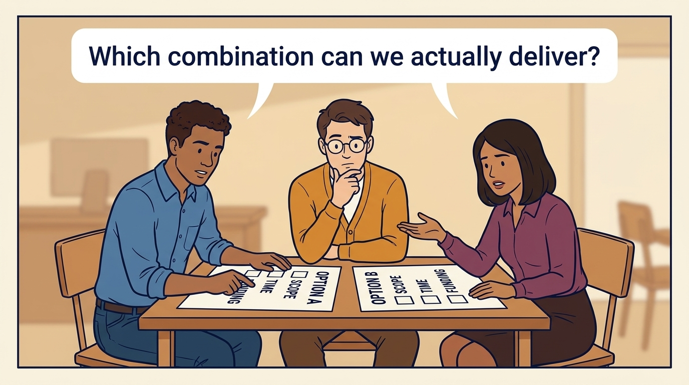

<!-- comic-style
{
  "cast": "MORGAN: a thoughtful investor technology adviser with short dark hair and a green jacket, used in the fund scenarios. ALEX: a practical CTO with curly hair and blue rolled-up sleeves. SAM: a CFO with round glasses and an amber cardigan. PRIYA: a product leader with straight dark hair and plum sleeves. INES: a CEO with short grey hair and a navy jacket. All are fictional; none represents a person in a real case.",
  "style": "Clean editorial explainer comic, dark ink outlines, restrained green, blue, and amber accents on warm white, generous space, readable short speech bubbles, expressive people and simple physical metaphors. No photorealism, logos, dense charts, or title text. Keep the same character appearances throughout the journal."
}
-->

**Comic.** Investor ownership changes the conditions of the choice of what to fund: establish the actual money, team time and authority before committing, and name the result the funding was agreed on. The panels follow a fictional Larkspur exercise, the same first-hundred-days plan the board approves at closing, from four requests to a feasible combination, and then to the review that revised it.

Morgan is an investor’s adviser in the fund scenarios; Alex leads technology, Priya leads product, and Sam leads finance. All are fictional. Comparative scenarios use separate assumptions. Historical cases are discussed through documents; the scenes do not reenact real events.

<!-- comic-panel
{
  "id": "01-scene",
  "status": "generated",
  "asset": "assets/images/28-cannot-fund-everything/comic-01-scene.jpeg",
  "aspect_ratio": "16:9",
  "caption": "A company investment commits resources for a future benefit. Begin with the customer or business result the work should change.",
  "alt": "Comic panel: Alex and Sam arrange four proposal cards beside a drawing of customers waiting to use the product.",
  "prompt": "Panel 1 of an explainer comic. Alex and Sam arrange four proposal cards beside a drawing of customers waiting to use the product. Use one speech bubble with the exact words: \"Which result matters first?\" Convey: A company investment commits resources for a future benefit. Begin with the customer or business result the work should change.",
  "generation": {
    "model": "gemini-3-pro-image-preview",
    "reference_id": "owned-cast-20260913",
    "sha256": "8fb8eebcf97968082f8eae0b0afd757e7f4f2672585275ad2c04fd54da3c4055"
  }
}
-->

**Panel 1:** A company investment commits resources for a future benefit. Begin with the customer or business result the work should change.

*Dialogue:* “Which result matters first?”

<!-- comic-panel
{
  "id": "02-scene",
  "status": "generated",
  "asset": "assets/images/28-cannot-fund-everything/comic-02-scene.jpeg",
  "aspect_ratio": "16:9",
  "caption": "Routine operating work is already budgeted. The change budget must still fund the improvement needed to meet the agreed recovery requirement, and the company still chooses how to meet it.",
  "alt": "Comic panel: Alex points to a service-restoration card while Sam checks a clearly marked company requirement.",
  "prompt": "Panel 2 of an explainer comic. Alex points to a service-restoration card while Sam checks a clearly marked company requirement. Use one speech bubble with the exact words: \"What must keep working?\" Convey: Routine operating work is already budgeted. The change budget must still fund the improvement needed to meet the agreed recovery requirement, and the company still chooses how to meet it.",
  "generation": {
    "model": "gemini-3-pro-image-preview",
    "reference_id": "owned-cast-20260913",
    "sha256": "bcf3a078ef789b20b2dedf905555a3f471a2796ad108ae72ff35e3d4b1662002"
  }
}
-->

**Panel 2:** Routine operating work is already budgeted. The change budget must still fund the improvement needed to meet the agreed recovery requirement, and the company still chooses how to meet it.

*Dialogue:* “What must keep working?”

<!-- comic-panel
{
  "id": "03-scene",
  "status": "generated",
  "asset": "assets/images/28-cannot-fund-everything/comic-03-scene.jpeg",
  "aspect_ratio": "16:9",
  "caption": "Cash and team time are separate limits. In this fictional exercise, the requests fit €500,000 but need 30 engineer-weeks against 24 available; a fifth item, KNW-1, uses four protected specialist-weeks outside the 24 and no cash.",
  "alt": "Comic panel: Sam compares a cash counter with a row of 24 available time blocks; six additional blocks sit outside the row.",
  "prompt": "Panel 3 of an explainer comic. Sam compares a cash counter with a row of 24 available time blocks; six additional blocks sit outside the row. Use one speech bubble with the exact words: \"The money fits. The time does not.\" Convey: Cash and team time are separate limits. In this fictional exercise, the requests fit €500,000 but need 30 engineer-weeks against 24 available; a fifth item, KNW-1, uses four protected specialist-weeks outside the 24 and no cash.",
  "generation": {
    "model": "gemini-3-pro-image-preview",
    "reference_id": "owned-cast-20260913",
    "sha256": "e455897d3caf24ff3e9871e4131abaa74769781d2b84d1dcd5191262a9e4a5d7"
  }
}
-->

**Panel 3:** Cash and team time are separate limits. In this fictional exercise, the requests fit €500,000 but need 30 engineer-weeks against 24 available; a fifth item, KNW-1, uses four protected specialist-weeks outside the 24 and no cash.

*Dialogue:* “The money fits. The time does not.”

<!-- comic-panel
{
  "id": "04-scene",
  "status": "generated",
  "asset": "assets/images/28-cannot-fund-everything/comic-04-scene.jpeg",
  "aspect_ratio": "16:9",
  "caption": "Ines proposes and the board approves €280,000 and 18 engineer-weeks for restoration, the smaller setup change and customer research, with KNW-1 alongside. It leaves €220,000 and six weeks in reserve, which only the board may draw, and defers the full portal, whose twelve weeks still do not fit.",
  "alt": "Comic panel: Alex selects three cards and leaves the full portal proposal beside a question mark.",
  "prompt": "Panel 4 of an explainer comic. Alex selects three cards and leaves the full portal proposal beside a question mark. Use one speech bubble with the exact words: \"Learn before the larger commitment.\" Convey: Ines proposes and the board approves €280,000 and 18 engineer-weeks for restoration, the smaller setup change and customer research, with KNW-1 alongside. It leaves €220,000 and six weeks in reserve, which only the board may draw, and defers the full portal, whose twelve weeks still do not fit.",
  "generation": {
    "model": "gemini-3-pro-image-preview",
    "reference_id": "owned-cast-20260913",
    "sha256": "7d409beaa90e3233ffa476f8e46e7cf041f58e277b9745e3e7e4e3d40395263e"
  }
}
-->

**Panel 4:** Ines proposes and the board approves €280,000 and 18 engineer-weeks for restoration, the smaller setup change and customer research, with KNW-1 alongside. It leaves €220,000 and six weeks in reserve, which only the board may draw, and defers the full portal, whose twelve weeks still do not fit.

*Dialogue:* “Learn before the larger commitment.”

<!-- comic-panel
{
  "id": "05-scene",
  "status": "generated",
  "asset": "assets/images/28-cannot-fund-everything/comic-05-scene.jpeg",
  "aspect_ratio": "16:9",
  "caption": "A funding stage commits resources to a defined result or learning step. Agree what evidence would justify continuing, changing or stopping.",
  "alt": "Comic panel: Morgan and Alex place a review card between a small first step and a larger possible project.",
  "prompt": "Panel 5 of an explainer comic. Morgan and Alex place a review card between a small first step and a larger possible project. Use one speech bubble with the exact words: \"What would change our next decision?\" Convey: A funding stage commits resources to a defined result or learning step. Agree what evidence would justify continuing, changing or stopping.",
  "generation": {
    "model": "gemini-3-pro-image-preview",
    "reference_id": "owned-cast-20260913",
    "sha256": "79b7ee1e425751a1e158a3743a2b8413d1e9ad2db0d3745497f4a4770422e465"
  }
}
-->

**Panel 5:** A funding stage commits resources to a defined result or learning step. Agree what evidence would justify continuing, changing or stopping.

*Dialogue:* “What would change our next decision?”

<!-- comic-panel
{
  "id": "06-scene",
  "status": "generated",
  "asset": "assets/images/28-cannot-fund-everything/comic-06-scene.jpeg",
  "aspect_ratio": "16:9",
  "caption": "The day-45 restoration test fails after its €80,000 and four weeks are spent. On Ines’s request the board approves €20,000 and two weeks from the reserve for the correction and a retest by day 85: €300,000 and 20 engineer-weeks committed, €200,000 and four weeks left, the portal still deferred.",
  "alt": "Comic panel: Alex, Sam and Priya compare the original combination sheet with the revised one after the failed restoration test.",
  "prompt": "Panel 6 of an explainer comic. Alex, Sam and Priya compare two option sheets, the original combination and the revised one after a failed restoration test, with scope, time and funding checklists. Use one speech bubble with the exact words: \"Which combination can we actually deliver?\" Convey: The day-45 restoration test fails after its €80,000 and four weeks are spent. On Ines’s request the board approves €20,000 and two weeks from the reserve for the correction and a retest by day 85: €300,000 and 20 engineer-weeks committed, €200,000 and four weeks left, the portal still deferred.",
  "generation": {
    "model": "gemini-3-pro-image-preview",
    "reference_id": "owned-cast-20260913",
    "sha256": "452008751ab6addde64e17ac992949cdbb7fa381f527c3c4fd7da45ad4d1c08e"
  }
}
-->

**Panel 6:** The day-45 restoration test fails after its €80,000 and four weeks are spent. On Ines’s request the board approves €20,000 and two weeks from the reserve for the correction and a retest by day 85: €300,000 and 20 engineer-weeks committed, €200,000 and four weeks left, the portal still deferred.

*Dialogue:* “Which combination can we actually deliver?”
