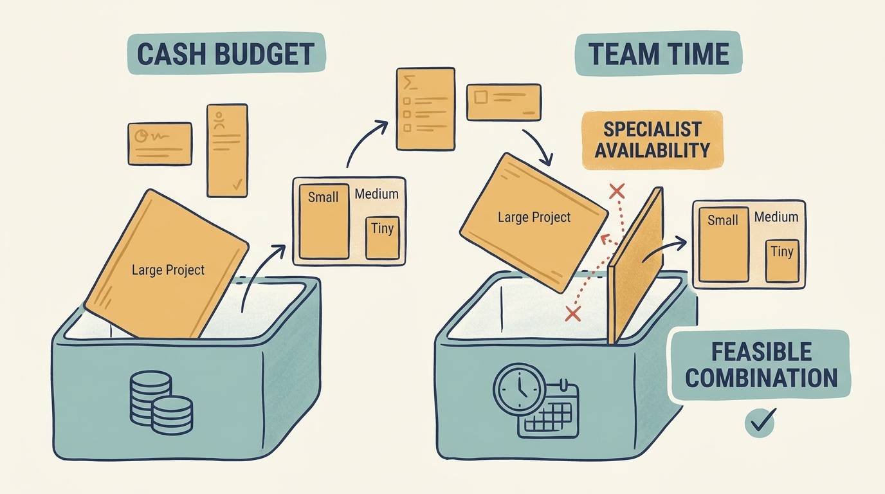
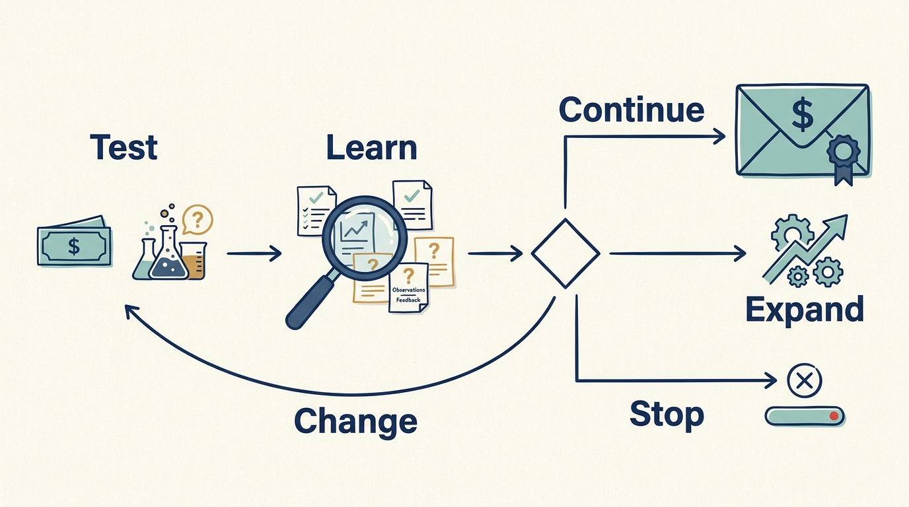

> **IN THIS SECTION, YOU WILL:** Learn to choose a combination of work that fits both the cash and the team time available, and revise the whole combination when a test fails.

> **WHY IS THIS IMPORTANT FOR YOU:** A plan that fits the cash but not the team time, or ignores an agreed obligation, gets overrun by the constraint nobody counted; choosing the feasible combination is what makes commitments deliverable.

> **WHY INVESTORS CARE ABOUT THIS:** An investor’s growth expectation only becomes value if the company chooses the work that can actually be delivered; a plan that overcommits the team produces slippage the investor discovers at the next review.

> **KEY POINTS:**
>
> * Choose a **combination of work the company can actually deliver**. Several attractive projects can fit the cash limit and still exceed the team time available.
> * Sort the requests by **what they rest on**: an agreed obligation, tested customer evidence or an assumption. A growth target starts the discussion; it does not choose the project.
> * Make the **next review part of the decision**, and revise the whole combination, not just one project, when a test fails or new evidence arrives.

 
Larkspur’s investor wants faster growth. Priya, the product leader, has requests for a new customer portal. Alex, the technology leader, wants to improve recovery from system failures. The customer team wants simpler setup for new accounts. Each request has a plausible benefit. They can’t all use the same people at the same time.

A **company investment** commits resources now in the expectation of a future benefit. **Team capacity** is the time and capability people have available to do the work. Choosing investments needs both a cash plan and a capacity plan. This chapter shows one way to make the choice, as a proposed working method illustrated with fictional figures.

## Three Requests, Two Limits

In this **fictional planning exercise**, the Larkspur board has authorized up to €500,000 of additional cash and 24 engineer-weeks for a set of improvements over the next two quarters, and Ines, the CEO, decides how that envelope is used. Routine operating work is already budgeted. The following change budget must also fund the improvement needed to meet the agreed recovery requirement. One **engineer-week** means one person’s working time for one week; it’s a planning estimate, not a guarantee that people are interchangeable.

The cash estimates concern additional spending, such as specialist help and new services. Existing employees’ pay is already in the ordinary operating budget; their available time is shown separately. These figures aren’t additions to the programs in other chapters.

| Proposed work | Additional cash | Engineer-weeks | Intended result |
| --- | ---: | ---: | --- |
| Improve and test service restoration | €80,000 | 4 | Meet the company’s agreed recovery requirement |
| Simplify one customer-setup step | €180,000 | 12 | Test whether customers can start using the product with less help |
| Build the full proposed customer portal | €220,000 | 12 | Offer a broader way for customers to manage their work |
| Test the portal need with customer research | €20,000 | 2 | Learn which problems would justify a larger product commitment |
| **All proposed work** | **€500,000** | **30** | **Fits the cash limit but exceeds available engineering time** |

The money fits. The time does not. The portal research comes before a full build; the table shows what funding both stages would require, and the company still has to decide whether the research justifies that later commitment.

The totals are only a first check. Confirm that the required specialists are available in the weeks each project needs them. Twenty-four engineer-weeks spread across several teams or months may not support a plan that needs the same specialist for twelve consecutive weeks.

## Sort the Rows by What They Rest On

Before choosing among the rows, establish what each one depends on. The table gives every row the same shape; the rows are not the same kind of choice.

**An agreed obligation.** Some work protects an existing commitment: continuing a contracted service, meeting an applicable requirement or resolving a risk the company has decided it can’t accept. At Larkspur the board has agreed a recovery requirement, and the restoration row is what meeting it costs. That doesn’t make every proposed security or maintenance project mandatory. Establish the specific obligation or failure scenario, the minimum acceptable result and the feasible alternatives, with specialist interpretation where necessary. The company still chooses how to meet the need.

**An expected result.** An **investment thesis** is the investor’s explanation of why the investment should succeed; it is a revisable prediction, not an instruction. Larkspur’s says the company can grow faster. “Grow faster” could mean winning more customers, activating customers already waiting or helping existing customers buy additional services. Those are different problems, and more marketing won’t fix a setup process that can’t handle the customers already sold. For each row, ask what evidence supports the intended result: a customer request, a tested constraint and a guess deserve different confidence.

**Dependencies and displaced work.** The **opportunity cost** of a choice is the benefit of the best alternative you give up. If two rows need the same specialist, approving one delays the other even when both have funding. Include preparation, transition, continuing operation and the work each row pushes aside.

**What a smaller step could teach.** An **experiment** is a limited test designed to learn whether an assumption holds. Its immediate result may be a better decision rather than revenue. The portal research row is one; it exists because the portal’s benefit is the least supported claim on the table.

## The Condition That Applies Here

This arrangement changes the conditions of the decision. Establish the actual funding, authority and deadline before committing. In this exercise the condition is specific: Larkspur’s growth funding was agreed on a plan that assumes onboarding volume can rise substantially without proportional growth in the implementation team. That gives the setup row a priority the company’s own view might not, and it makes the pilot’s evidence a condition of the next expansion step. Other funding arrangements set other conditions; [[raise-what-you-need]] compares them, and the [[reading-guide]] explains how the book’s alternative scenarios relate to each other.

A board that wants the expansion date without funding the necessary capacity has an unresolved choice. **Present the feasible combinations.** Don’t turn the gap into an unrecorded demand for the team to work harder. A plan chosen by team preference or the loudest request has a specific weakness: it leaves out the constraint that will actually bind, the money and capacity available and the result the funding was agreed on, so it can’t say what it displaces or what evidence would change it.

## Select the Combination

Suppose the recovery requirement is agreed, the setup constraint is supported by customer evidence and the portal’s benefit remains uncertain. Ines’s choice is restoration, the smaller setup change and customer research. That uses €280,000 and 18 engineer-weeks, leaving €220,000 and six engineer-weeks uncommitted.

Record the decision in full:

- **Chosen:** restoration (€80,000, four weeks), the setup change (€180,000, twelve weeks) and the portal research (€20,000, two weeks).
- **Rejected for now:** the full portal build. The unused money doesn’t make it feasible: its twelve engineer-weeks still exceed the remaining six, and its benefit still needs investigation.
- **Funding and scarce capacity:** €280,000 of the €500,000 envelope; 18 of 24 engineer-weeks, with the implementation specialist needed by the setup change for twelve consecutive weeks.
- **Authority:** the board authorized the envelope; Ines decides the combination within it and reports the choice to the board. Alex is accountable for restoration, Priya for the setup change and the research.
- **Evidence that would change it:** research showing the portal is essential to retain a major customer, or a first setup cohort showing no reduction in effort.

The remaining €220,000 and six weeks provide room for uncertainty and for a later decision. They aren’t automatically savings or permission to start another project. The review below shows what part of them was for.

An estimated score can help organize this conversation. It shouldn’t hide that an agreed obligation, a speculative product opportunity and a learning step answer different questions. **Explain the trade-off in words** as well as numbers.

**Figure 1:** *A project can be affordable and still be impossible to schedule.*

## Make the Commitment in Stages Where That Helps

A **funding stage** commits resources for a defined piece of work before deciding whether to commit more. The stage needs a useful outcome or a decision it can inform. Dividing a project into calendar phases doesn’t by itself reduce risk.

For the portal, the research is the first stage; the next decision might be to build a narrow function, investigate another need or stop. For restoration, the stage is the test itself: can the service recover within the agreed conditions?

Check the connections between stages. Can the company operate safely if it stops after the first? **Who maintains anything already delivered?** What spending is unavoidable once the first commitment is made? Some transitions require a larger coordinated commitment, which should be visible from the start.

**Figure 2:** *Commit enough to answer the next decision, then use the evidence before committing more.*

## Review the Combination, Not Just Each Project

New evidence can change the whole plan, and in this exercise it did. At the day-45 restoration test the service came back after eleven hours against the agreed four, because a credential was missing and the database version the backup needed was no longer available ([[prove-you-can-restore]] walks through this kind of failure). The €80,000 and four engineer-weeks had been spent. That is **sunk cost**: resources already spent that can’t be recovered. It belongs in the record, but the next commitment depends on remaining costs and expected benefits, and the obligation has not gone away.

Correcting the two faults and re-running the test needs about €20,000 and two engineer-weeks, which come from the uncommitted reserve. The revised commitment:

- **Chosen:** the retest by day 85 is added; the setup change and the portal research continue unchanged. Total committed: €300,000 and 20 engineer-weeks; €200,000 and four engineer-weeks remain.
- **Rejected:** pausing the setup change to free its specialist for recovery work, because its cohort evidence is the condition on the expansion decision; and starting the portal build with the remaining money, which is still infeasible in capacity and still unsupported by evidence.
- **Funding and scarce capacity:** two of the six spare engineer-weeks, in the weeks the operations lead is available for the retest.
- **Authority:** Ines takes the revision to the board because it changes what the envelope funds; [[decide-who-decides]] describes that path.
- **Evidence that would change it:** a second failed test, which would send the remaining reserve to recovery before anything else and delay the setup change’s second cohort.

Review the starting assumptions, actual spending, team burden and observed outcomes together, not project by project. A supplier failure may use the spare capacity. Customer research may invalidate an expected benefit. One completed improvement may remove the need for another. Decide which work continues, which changes and which stops.

## Keep the Record

The [[toolkit]]’s record for comparing investment choices and capacity (Tool 12) holds exactly the fields used above: the required commitments, the money and team time available, the options, the combination proposed, the first stages and the review decision. Fill it in before the board conversation, and update it after the review rather than starting a new one.

The setup change was chosen on customer evidence. Whether its benefit is real is a separate question, and the next chapter follows that one change from the work proposed to the measured customer and business result: [[roadmap-to-revenue]].

## Questions to Consider

1. *For your current plan, what are the cash limit and the capacity limit, which one binds first, and does the plan say what is already budgeted and what it must still fund?*
2. *Which of your commitments rest on an agreed obligation, which on tested evidence and which on an assumption? Are they being compared as if they were the same kind of choice?*
3. *When the last plan was reviewed, was the whole combination reconsidered or only each project’s progress, and did the reserve go where the evidence pointed?*

## To Probe Further

- **[2015 Letter to Shareholders](https://www.sec.gov/Archives/edgar/data/0001018724/000119312516530910/d168744dex991.htm)** — Jeff Bezos, Amazon.com, filed with the SEC in April 2016. *The short passage on Type 1 and Type 2 decisions, a compact way to ask whether a proposed commitment can be staged or must be made all at once.*
- **[Delusions of Success: How Optimism Undermines Executives' Decisions](https://hbr.org/2003/07/delusions-of-success-how-optimism-undermines-executives-decisions)** — Dan Lovallo and Daniel Kahneman, Harvard Business Review, July 2003. *Explains why project forecasts are systematically optimistic and proposes checking a plan against comparable past projects, the evidence question in this chapter's sorting of the rows.*
- **[Investment Opportunities as Real Options: Getting Started on the Numbers](https://hbr.org/1998/07/investment-opportunities-as-real-options-getting-started-on-the-numbers)** — Timothy Luehrman, Harvard Business Review, July–August 1998. *A manager's introduction to treating a staged investment as an option to continue, expand or stop. The option is only worth what it costs to exercise, which is why this chapter asks whether a stage can stand alone.*
- **[The Principles of Product Development Flow: Second Generation Lean Product Development](https://archive.org/details/principlesofprod0000rein)** — Donald Reinertsen, Celeritas Publishing, 2009. *Explains, through queues and the cost of delay, why 24 engineer-weeks spread across teams is not the same as one specialist available for twelve consecutive weeks.*
- **[The psychology of sunk cost](https://doi.org/10.1016/0749-5978%2885%2990049-4)** — Hal Arkes and Catherine Blumer, Organizational Behavior and Human Decision Processes, 1985. *The experiments behind this chapter's rule that a review should weigh remaining costs and benefits, not what has already been spent.*
