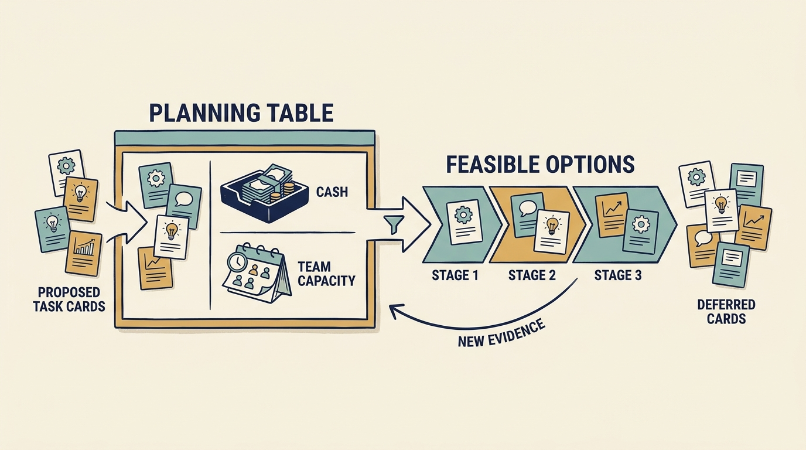

A **company investment** commits resources now for an expected future benefit. Choosing investments requires a view of both cash and **team capacity**, the time and capability available to do the work. Several attractive projects can exceed either limit when considered together. Investor ownership changes the decision in two ways: the financing limits the cash and capacity available, and the investor's expected result gives some options a priority the company's own view might not.

**Figure 1:** *Choose a feasible combination and preserve room to learn.*

Begin with the company result, rather than the proposed solution. An **investment thesis** explains why the owner expects its investment to succeed. Company leaders should test its assumptions against customer needs and operating evidence. Faster growth might require more demand, faster customer setup or a different product; those possibilities call for different work.

Establish existing obligations and minimum acceptable service before comparing discretionary improvements. This does not make every maintenance proposal automatically mandatory. Identify the actual commitment or failure scenario, feasible alternatives and the resources required to meet it.

**Compare complete options**: useful result, supporting evidence, money, team time, dependencies, continuing costs and the consequences of delay or failure. **Opportunity cost** is the benefit of the best alternative a choice gives up. A shared specialist can make that trade-off binding even when both projects have funding.

In a separate fictional Larkspur exercise, management has €500,000 of additional cash and 24 engineer-weeks available after existing commitments. One engineer-week represents one person’s working time for a week. The four proposed pieces of work total €500,000 and 30 engineer-weeks. The cash fits; the engineering time does not.

One possible choice funds tested service restoration, a smaller customer-setup improvement and research into the proposed portal. It uses €280,000 and 18 engineer-weeks. The unused €220,000 and six weeks leave room for uncertainty and later decisions. They are neither automatically savings nor a reason to approve another project. Different evidence could justify a different selection.

Use funding stages when an early result can inform a later commitment. State whether the company can operate safely if it stops between stages and who maintains anything already delivered. Some transitions require a larger coordinated investment.

**Review the combination** as conditions change. **Sunk costs** are resources already spent that cannot be recovered. Keep them in the record, but judge the next commitment by its remaining costs and expected benefits. Explain what should continue, expand, change or stop through the agreed decision process.

The owner’s expected outcome changes the immediate question. In alternative Larkspur scenarios, the same onboarding proposal could test demand before another round, support a funded expansion, fit cash left after debt payments or enable a corporate channel. State which conditions apply and what evidence supports them. Present feasible combinations of scope, timing and funding when expectations exceed capacity. Unresolved disagreement should not become an implicit promise that the team can do everything.

This is a proposed working method, **not a formula for the correct budget**. Its purpose is to make a feasible choice and its assumptions understandable before the company promises delivery.
