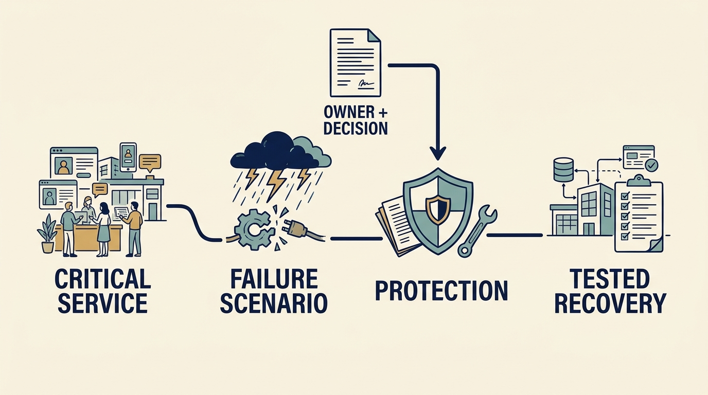

At six in the morning a dispatcher at a Larkspur customer opens the scheduling service, and it doesn’t load. **Recovery** — restoring service after a failure — is what a company needs evidence of beforehand. The scenario is fictional.

**Figure 1:** *Fund and test recovery against the services the company must sustain.*

Start with the **business function that must keep working** and write its recovery objective plainly. Larkspur’s: dispatch must resume within four hours, losing no more than fifteen minutes of schedule updates, if it loses its own systems inside a working area of its computing supplier. The customer contract promises that scope, so a test against the objective is evidence about the whole promise — but the promise is continuing, and no test discharges it. The objective's questions come from the US National Institute of Standards and Technology (NIST) Cybersecurity Framework (CSF). [S17: NIST CSF 2.0](https://nvlpubs.nist.gov/nistpubs/CSWP/NIST.CSWP.29.pdf)

**A saved copy of the data is not evidence the service can be rebuilt from it.** The investor's pre-investment checks found three years of error-free backups and no restore attempt. The day-45 test took eleven hours: the account that could read the copies belonged to a departed engineer, and Larkspur’s copies loaded only into the release of data-storage software that wrote them, found on a retired machine and installed by hand. The data came back a night old: a failure on both counts, neither fix repeatable.

The hundred-day limit set by the **board**, the company's directors, was €500,000 and 24 **engineer-weeks** — one person's work for one week each. It carried this item at **€80,000 and four of them**, gone by day 45.

The correction buys a repeatable version of each fix: separate test systems on the live service's software release, emergency access details in one controlled store two named people can use, and a written rehearsal. It costs **€20,000 and two engineer-weeks** from money the board held back — a draw only the board approves, which it did, setting a day-85 retest. Total: €100,000, six engineer-weeks.

**Risk arithmetic supports the decision but is not the reason for it.** A 5% annual chance of a €4 million outage implies €200,000 of loss averaged over a year — an average, not a yearly bill; an assumed 2% leaves €80,000, a €120,000 difference against that €100,000 cost. Both probabilities are illustrative, and the €120,000 never appears in the accounts as profit.

The day-85 retest met the objective; the improvement task closed at the day-100 review. What the evidence did not cover is the **residual risk**, the harm still possible once safeguards exist: failure of the supplier's whole area, a rehearsal outside the busy dispatch period, only two people able to run the emergency access procedure. The chief executive accepts that on the board's behalf with a quarterly retest. Upkeep is ongoing work, so it belongs to the running-cost budget, not the hundred-day limit, whose 24 engineer-weeks are by then all allocated; it fits existing allowances and adds no recurring spending. Documented acceptance records a decision; it cannot discharge an obligation.
