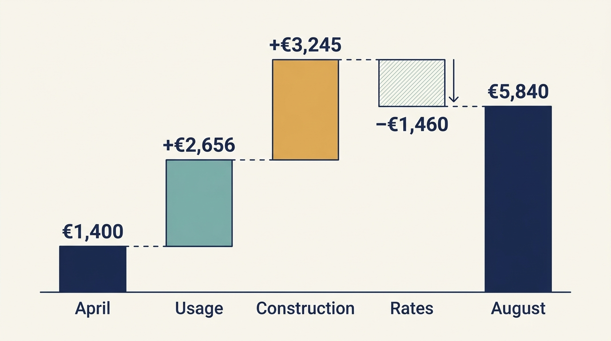
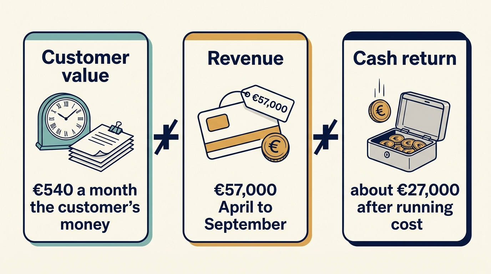

> **IN THIS SECTION, YOU WILL:** Learn to compute the return on an AI feature or tool for a stated period from figures you actually have, to explain why an AI bill grows faster than revenue, and to decide how much to commit to a vendor under a stated demand range, so that “what is our AI ROI” gets an answer with a unit, a period and a condition attached.

> **WHY INVESTORS CARE:** AI features are sold on a subscription and paid for by usage. An investor sees the subscription revenue in the plan and the usage bill in the accounts, and wants to know whether the gap between them is a margin, a trend or a promise.

> **WHY YOU SHOULD CARE:** A licence is a cost you set once. A token bill is a cost your customers, your engineers and your vendor all move without asking you, and it can turn a profitable feature into a loss-making one while the dashboard still shows growth.

> **KEY POINTS:**
>
> * **Measure per useful customer task, on one basis.** Cost per token or per model call is the vendor’s unit. Cost per document sorted and accepted, per ticket resolved, per change completed is the company’s, and only that unit can be set against a price.
> * **Separate why the bill changed.** Usage (more customers, more documents), rates (the vendor’s price per token) and construction (longer prompts, more context, retries, larger models) move the bill for different reasons, have different owners and take different remedies. A price cut can hide a construction cost that doubled.
> * **Return has a period and a condition, and a commitment has a floor.** State the return for a dated period under the quality and review conditions that make it true, set the stop and reprice rules before the review, and size any committed spend at the low end of a demand range the company can pay for.

 
The chapter [[cheaper-cloud-bill]] showed why a cloud bill has to be read through useful service, a comparable basis and the reasons costs change before anyone calls it an improvement. AI spending is a cloud bill with two additional habits. It is metered in **tokens**, the units in which AI services count the text a model reads and writes, so the cost of the same feature moves with how the feature is built as well as with how much it is used. And it is sold to the investor as a return: an **AI feature** with a monthly price, an **AI tool** that saves staff time. Both claims are checked here on money, the way [[scale-the-team-with-ai]] checks them on capacity.

Larkspur is the fictional scheduling-software company this book follows. Alex leads technology as chief technology officer (CTO), Priya leads product, Ines is the chief executive who leads the company, Sam leads finance, and Morgan is the technology adviser to Larkspur’s investor. The chapter [[ai-strategy-three-questions]] left two AI investments with dated gates. The document-sorting feature, which sorts a customer’s incoming inspection documents into categories before maintenance is scheduled, passed its release gate on 11 December 2026: at least 95% of ordinary documents sorted correctly, no safety-relevant document missed, review effort below 1.5 hours a week, two of three trial customers willing to keep paying €300 a month. The board funded general release in the 2027 operating plan, and the feature went on sale to all customers on 1 April 2027. The support assistant that drafts responses for Larkspur’s six support agents passed its own check and runs at about €8,000 a year. Those results are taken as given here; this chapter is about what happens next. Every figure is fictional, and the shared Larkspur ledger that runs through the chapters [[first-hundred-days]] and [[handover-of-obligations]] is not touched.

It is September 2027. Forty customers pay for the sorting feature. Sam has noticed that the vendor’s bill has grown faster than the feature’s revenue for four months running, and Morgan has asked, ahead of the next board meeting, for “the AI ROI”. Both want a number. The chapter gives them one, with the unit, the period and the condition that make it true.

## Choose a Unit That Explains the Business

The vendor bills per million tokens, and Larkspur’s engineers can tell you the tokens per **model call**, one request sent to the model and its answer. Neither is the company’s unit. Larkspur charges a customer €300 a month for documents sorted so that a planner can schedule without reading them, and the useful unit is therefore **a document sorted and accepted**: classified by the feature and not corrected by the customer afterwards. Rejected classifications cost tokens and earn nothing.

The same choice applies to the internal tools. The support assistant’s unit is a ticket resolved without being reopened, inherited from the pilot in [[ai-strategy-three-questions]]; the coding tool’s unit, from [[scale-the-team-with-ai]], is a change completed with the old quality checks. A cost per token can fall while the cost per useful unit rises, because the number of tokens the feature spends to produce one accepted result is not fixed. That is the first fact about AI spending and the one a licence never had: **the construction of the feature is a cost driver**, and construction is decided by the company’s own engineers.

Three things move the tokens spent per document, and Larkspur’s feature has moved all three since the trial. The **prompt**, the instructions and examples sent to the model with each document, grew when Priya added rules learned from the trial. The **context**, the extra material the feature retrieves and sends along, grew when Alex added similar past documents from the same customer to hold accuracy on unusual formats. And **retries**, repeat calls when the first answer fails a check, grew when the safety check was made stricter, because a document that fails the check is sent again with a larger model. Each of these was a reasonable product decision. Together they raised the tokens per document by about 80% between April and August, and nobody had set that figure against the price.

## Put Every Figure on the Same Basis

Sam’s observation that the bill grows faster than revenue is true and, on its own, uninformative. The table puts two months on one basis, cost assigned to the period as the cloud chapter defines it, and separates money that leaves the company from employees’ time that is already paid for.

| Feature, monthly | April 2027 | August 2027 |
| --- | ---: | ---: |
| Paying customers | 20 | 40 |
| Revenue at €300 | €6,000 | €12,000 |
| Documents processed | 9,000 | 26,000 |
| Documents accepted (96%) | 8,640 | 24,960 |
| Model and hosting charges (cash) | €1,400 | €5,840 |
| Evaluation and monitoring upkeep: sampled review, test set runs (cash) | €1,200 | €1,600 |
| **Running cost, cash** | **€2,600** | **€7,440** |
| Engineering time keeping the feature working (time, cost-based estimate) | €2,250 (a quarter of one engineer) | €4,500 (half of one engineer) |
| Support load from the feature (time, cost-based estimate) | €400 | €1,200 |
| **Margin after cash running cost** | **€3,400** | **€4,560** |
| **Margin after cash and time** | **€750** | **−€1,140** |
| Running cash cost per customer | €130 | €186 |
| Cash cost per accepted document | €0.30 | €0.30 |

Read across and the picture is more precise than “growing faster than revenue”. Cash cost per accepted document is flat, because the fixed upkeep is spread over more documents even as the model charges per document rose. Cash cost per customer rose from €130 to €186 against a €300 price, because customers send more documents than the trial customers did and each document costs more tokens. And after the engineers’ time, the feature loses money in August, which nobody had seen because engineering time is not on the vendor’s invoice.

The figures labelled cost-based estimates are not cash; they are the price of the work the engineers would otherwise do, and that work has to be named. Half an engineer on a feature that earns €12,000 a month is half an engineer not on the second country’s rules. Whether Larkspur counts that time against the feature depends on the question being asked: a cash forecast uses the cash lines; a decision about whether to keep the feature uses both.

## Separate Usage, Rates and Construction

The model charges rose from €1,400 to €5,840. Three causes, in the order Larkspur applies them, and the order matters because the effects multiply:

| Cause | What changed | Effect on the August bill | Who owns it | Remedy |
| --- | --- | ---: | --- | --- |
| **Usage** | 9,000 documents became 26,000: twice the customers, and 650 documents a month each instead of 450 | +€2,656 at April’s cost per document | Sales and customers; the growth the plan wanted | None needed if the price covers it; a per-document allowance in the price if it does not |
| **Construction** | Tokens per document up about 80%: longer prompt, retrieved context, retries to a larger model | +€3,245 | Product and engineering | Trim the prompt, cap the context, route easy documents to a smaller model, cache repeated context; each a measured engineering change |
| **Rates** | The vendor cut its list price per token by 20% in June | −€1,460 | The vendor | None available; note that the cut hid most of the construction increase |
| **Total** | | **€5,840** | | |

The cloud chapter separated usage, rates and architecture for the same reason: each has a different owner and a different remedy, and a bill that reports only the total lets the wrong person be blamed. Here the finding is uncomfortable for the product side. The June price cut was reported to the board as good news; without it the bill would have been over €7,000, and the reason is a set of product decisions, each defensible, whose cost per document nobody tracked.

**Figure 1:** *The August bill in its three parts. Usage added €2,656, construction added €3,245, and the vendor's June price cut took €1,460 off, which is why the reported total hid most of the construction increase. Each part has a different owner and a different remedy.*

**Do not count the same saving twice.** Alex proposes construction work: a shorter prompt, a cap on retrieved context, a smaller model for documents the checks pass easily, and caching of the context that repeats within a customer. He estimates it cuts tokens per document by about 35% at unchanged quality, two engineer-weeks of work, tested on the same 200-document samples the release gate used. If that work is done, the volume eligible for any vendor discount falls with it. The commitment decision below is therefore made after the construction change, not before, so that Larkspur does not commit to paying for tokens it is about to stop using.

## Return With a Unit, a Period and a Condition

**Return on investment (ROI)** is the benefit of an investment net of its cost, divided by the cost, for a stated period. Every word in that sentence does work, and the one most often dropped is the period. An AI feature does not have an ROI; it has an ROI for April to September 2027 under the conditions that held then.

Three different numbers answer “what is the sorting feature worth”, and they should never be added.

- **Customer value.** At the trial’s measured review effort, a customer saves about 10.8 hours of a planner’s time a month, worth roughly €540 at a loaded hourly cost of €50. That is why the customer buys. It is not Larkspur’s money.
- **Revenue.** €300 a month per customer: 190 customer-months from April to September, €57,000. It is Larkspur’s money before costs.
- **Cash return.** Revenue less the cash running cost, which grew from €2,600 to about €7,600 a month over the period: roughly €30,000 of running cost, leaving about €27,000 of cash over six months.

**Figure 2:** *Three answers to what the sorting feature is worth, and none of them adds to the others. Customer value is the planner time a customer saves and is the customer's money; revenue is Larkspur's money before costs; cash return is what remains after the cash running cost for the stated period.*

On that basis the feature’s **running return** for April to September 2027 is about €27,000 on €30,000 of running cost, roughly 90%, on the condition that quality stayed above the release threshold and review effort below 1.5 hours a week, which the monthly samples show it did. That is the honest answer to Morgan’s question about the feature as it runs. It is not the answer to whether the feature has paid for itself: the trial cost €45,000 of cash and six engineer-weeks, and general release cost a further ten engineer-weeks, about €22,000 as a cost-based estimate. Against those one-off costs the feature is still about €18,000 of cash short after six months, and about €40,000 short if the engineers’ time is charged. At the August margin it recovers the cash in another three to four months and the time never, unless the construction work lands. Both statements are true, for different questions, and the board should hear both.

The internal tool shows why the period matters even more. The support assistant’s 2027 benefit was a hire deferred: about €32,000 of employment cost avoided, less €8,000 of licences and upkeep, about €24,000 of cash, on the condition that quality held and ticket volume stayed under 1,400 a month. That is a 2027 return of about 300% on the tool’s running cost. It is a **benefit of that period**. In 2028 the same tool costs the same €8,000 and defers nothing by itself; a further return requires a further operating change, another hire not made or capacity used for work that earns. A tool whose return was a one-off deferral, reported as if it recurred, is how an internal AI programme ends up with a large cumulative ROI and no cash to show for it.

## A Commitment Changes Future Spending

In September the vendor offers Larkspur a **committed-spend agreement** for 2028: promise a fixed monthly amount for twelve months and pay 25% less per token on everything, with usage above the commitment billed at list price. The offer is worth considering, and it is a floor under next year’s cost whatever next year brings. The 25% and the amounts are assumptions for this example, not a vendor’s published terms.

Larkspur follows the cloud chapter’s method. Demand is measured as what the feature’s usage would cost at flexible list prices, after the construction work, so every option is compared against one yardstick.

**Demand range.** With the 35% construction saving applied, the August bill would have been about €3,800 of model charges. The board’s 2028 forecast, approved in the autumn planning round, puts the feature between 35 customers, if renewals disappoint, and 80, if the second country signs, at 650 documents a month each: model charges between about €5,000 and €14,000 a month at flexible prices, with €10,000 the expected case. A **stress case** of €3,000, the largest customers leaving or a substitute product arriving as the chapter [[ai-strategy-three-questions]] described, is kept to test the decision, not as a forecast.

**Funding condition.** The board has approved a 2028 cash provision for supplier payments covering the forecast range, and Ines has standing permission to sign contracts of a year or less. No plan and no cash exist beyond 31 December 2028, so a longer commitment is not on the table, as in the cloud chapter.

| Option, monthly | Cost at €5,000 demand | Cost at €10,000 demand | Cost at €14,000 demand | Cost at €3,000 stress case |
| --- | ---: | ---: | ---: | ---: |
| A. Stay flexible at list price | €5,000 | €10,000 | €14,000 | €3,000 |
| B. Commit €6,000 fixed, covering €8,000 of flexible usage; usage above that at list | €6,000 | €8,000 | €12,000 | €6,000 |
| C. Commit €3,750 fixed, covering €5,000 of flexible usage; usage above that at list | €3,750 | €8,750 | €12,750 | €3,750 |

Option B saves €2,000 a month at expected and high demand, costs €1,000 more at the low end and €3,000 more in the stress case. Option C saves €1,250 a month at every point in the stated range and costs €750 more in the stress case. **Larkspur chooses Option C**, sized at the low end of the range, after the construction work has been measured on the same samples, so the commitment covers tokens the feature will actually use.

**Figure 3:** *A commitment is a floor under next year's cost. Option C's €3,750 floor sits below the low end of the range the board approved, so it saves €1,250 a month at every point in the range and costs €750 more only in the stress case. Option B's €6,000 floor sits inside the range, saving more at expected demand but costing more exactly when the feature is losing customers.*

**What the contract says**, and what Sam checks before Ines signs, differs from the cloud contract in three clauses that AI vendors add. The **model retirement** clause: the vendor may retire the model version the feature is built on with six months’ notice, and committed spend transfers to the successor model at that model’s price, so a commitment can be honoured on a model the company has not tested; Larkspur asks for, and gets, the right to run its release-gate samples on the successor before the switch and to end the commitment if the samples fail. The **price change** clause: list prices may change with thirty days’ notice, and the 25% applies to the list price on the day, so a price rise raises the committed spend’s buying power but not its cost, while a price cut reduces what the same money buys in discount terms; the fixed €3,750 is owed either way. The **data** clause: the terms on retention and training use of customer documents, reviewed against the questions the NIST profile poses, unchanged from the trial and confirmed in writing. [S18: NIST generative AI profile](https://nvlpubs.nist.gov/nistpubs/ai/NIST.AI.600-1.pdf) As with the cloud commitment, the agreement cannot be cancelled early, cannot be transferred without the vendor’s consent, and expires on 31 December 2028 with no automatic renewal; December’s overage is billed in January and paid in February 2029, which Sam reserves inside the 2028 provision.

**Why the others are rejected.** Option B’s extra €750 of saving exists only at expected demand and above, and is bought with a floor €2,250 higher in the case where the feature is losing customers, which is exactly the case in which Larkspur would want to spend less. Option A is rejected because €1,250 a month with no downside inside the range is real money. A three-year offer, at a larger discount, is not compared, because no plan exists for the years it would bind.

Recorded, the decision reads:

| Element | What was decided |
| --- | --- |
| Chosen | Construction work first (two engineer-weeks, measured on the release-gate samples), then Option C: €3,750 a month committed for 2028, usage above it at list price |
| Rejected | Option B, for its floor in the low case; Option A, for leaving a range-wide saving; any multi-year term, for binding years nobody has funded |
| Funding | €45,000 over 2028 from the approved cash provision, paid monthly in advance; overage settled in arrears from the same provision, with the February 2029 tail reserved |
| Authority | Ines, under her standing permission for contracts of a year or less; Sam confirms the cash and the three AI clauses; Alex is accountable for the construction work and the successor-model test; Priya for the price and renewal rules below |
| Review | Monthly against the unit figures in the table above; the contract reopened by any of the events below |
| Evidence that would reopen the decision | Flexible-price usage below €5,000 for two consecutive months; a construction change that cuts usage below the committed level; a model-retirement notice; a proposal to sell the company or separate part of it, since the obligation travels with the operating company that signed it |

## Set the Stop and Reprice Rules Before the Review

A feature that was worth its cost in April can stop being worth it in October for four different reasons, and the response to each is decided now, so that the October meeting applies a rule rather than invents one. The customer promise from the trial still holds and still bounds the rules: a customer keeps the feature for as long as quality holds and Ines renews the approval; nothing here promises more than that.

- **Running cost per customer above €150, half the price, for two consecutive months.** Priya first checks construction, because that is the cause Larkspur controls; if construction is already at the measured minimum, the price is changed, either a per-document allowance above which documents are charged, or a higher tier for heavy users. No customer is moved to a new price without the notice the contract gives.
- **Ordinary-sample accuracy below 95% or any safety-relevant document missed in a monthly sample.** The feature falls back to the review-aid mode the trial defined, in which a person confirms every classification, for all customers, that day; it returns to automated sorting only when a fresh sample passes. Throughput and cost do not enter this rule at any value.
- **A vendor list-price rise of 30% or more, or a retirement notice whose successor fails the samples.** A decision within sixty days between the successor, another vendor’s model tested on the same samples, and the review-aid mode; the committed spend continues to be owed during the sixty days, which is why the notice period was negotiated.
- **Fewer than 80% of customers renewing the feature at €300 at their annual renewal.** A reprice test with the next twenty renewals, run the way the trial tested willingness to pay, before the price is changed for everyone.

The counterargument deserves its own rule. A feature can be worth keeping at a loss for a period if it wins renewals of the main product: a customer who leaves takes €2,400 a month of scheduling revenue with them, and the sorting feature may be what keeps them. Larkspur allows exactly that, with a limit: a loaded loss of up to €1,000 a month on the feature is accepted until 31 March 2028 if customers with the feature renew the main product at a rate at least ten points above customers without it, measured on the renewals that fall in the period. The loss is stated in the monthly report as a loss, not netted into “platform value”, and on 31 March the rule expires and the feature has to stand on its own figures or be repriced. The evidence that would change the judgment is the renewal comparison itself: if the gap is smaller than ten points, the retention argument was a story, and the feature is judged on its cash.

## What to Say When the Investor Asks

Morgan’s three questions, and the answers that point at the method rather than at a single number:

**“What is our AI ROI?”** For the sorting feature, a running return of about 90% on cash running cost for April to September 2027, quality and review conditions holding, with the one-off trial and release costs not yet recovered in cash by about €18,000; for the support assistant, about 300% for 2027 on a hire deferred, a benefit of that year that does not recur by itself. Two figures, each with a period and a condition, and neither one a property of “our AI”.

**“Why is the AI bill growing faster than revenue?”** Usage doubled with the customers the plan wanted; construction raised tokens per document by 80% through product decisions that held quality; a 20% vendor price cut hid most of that. The construction share is Larkspur’s to fix, and the fix is measured before the vendor commitment is sized.

**“Should we commit to a bigger contract?”** A one-year commitment sized at the low end of the approved demand range, after the construction work, saves €1,250 a month across the range and costs €750 a month in the stress case; a larger one buys €750 more in the good case with a floor €2,250 higher in the bad one; nothing longer than the year the board has funded. The obligation travels with the company, which matters if ownership changes.

Those answers are longer than a number. They are also what an investor who has read [[cheaper-cloud-bill]] will recognize as the same discipline applied to a newer bill, and the adviser who wanted a benchmark will find that the unit figures are what a benchmark would need to be made of.

Larkspur’s AI is now worth its cost on stated terms, for a stated period, with rules for the day it stops being so. The chapter [[prove-you-can-restore]] set the same shape for resilience, a saving counts only after the quality it depends on has been tested, and the chapter [[cheaper-cloud-bill]] supplied the method. Part VII follows the company through funding and ownership changes, where a committed contract like this one is among the obligations the chapter [[handover-of-obligations]] carries to the next decision-maker.

## Questions to Consider

1. *For each AI feature or tool you run, what is the useful unit, and can you state its cash cost per unit for last month on the same basis as the month before?*
2. *Of last quarter’s change in your AI bill, how much was usage, how much rates and how much construction, and who owns each part?*
3. *For the return figure you last reported, what period and what quality condition does it belong to, and did it include a one-off benefit that will not recur?*
4. *If a vendor offered you a committed-spend discount today, what demand range and what funded period would you size it against, and what do the retirement, price-change and data clauses say?*

## To Probe Further

- **[FinOps for AI Overview](https://www.finops.org/wg/finops-for-ai-overview/)** — FinOps Foundation, 2026. *The practice body's own account of why token-based billing needs a cost per inference and a demand forecast before any commitment, the step this chapter takes with Larkspur's sorting feature.*
- **[Tokenomics: Managing AI Value in SaaS Model Token Costs](https://www.finops.org/wg/token-economics-saas/)** — FinOps Foundation, 2026. *Works through the gap this chapter opens between a subscription sold per seat and a bill paid per token, and moves from token counts to cost per successful outcome.*
- **[Emerging Patterns in Building GenAI Products](https://martinfowler.com/articles/gen-ai-patterns/)** — Bharani Subramaniam and Martin Fowler, martinfowler.com, 2025. *Describes the construction choices, from retrieval to guardrails, whose extra model calls make up the construction share of the bill this chapter separates from usage and rates.*
- **[A Survey on Efficient Inference for Large Language Models](https://arxiv.org/abs/2404.14294)** — Zixuan Zhou and colleagues, arXiv, 2024. *A technical map of where the cost of answering one request comes from, for a reader who wants to know what an engineer can change and what only the vendor can.*
- **[Welcome to LLMflation – LLM inference cost is going down fast](https://a16z.com/llmflation-llm-inference-cost/)** — Guido Appenzeller, Andreessen Horowitz, 2024. *An investor's estimate of how fast the price per token falls and why, which is the case for the price-change and model-retirement clauses this chapter asks Sam to check.*
- **[The New Business of AI (and How It's Different From Traditional Software)](https://a16z.com/the-new-business-of-ai-and-how-its-different-from-traditional-software/)** — Martin Casado and Matt Bornstein, Andreessen Horowitz, 2020. *The investor's argument that AI products carry lower gross margins than licensed software, which is the expectation behind Morgan's question about the gap between subscription revenue and the usage bill.*
