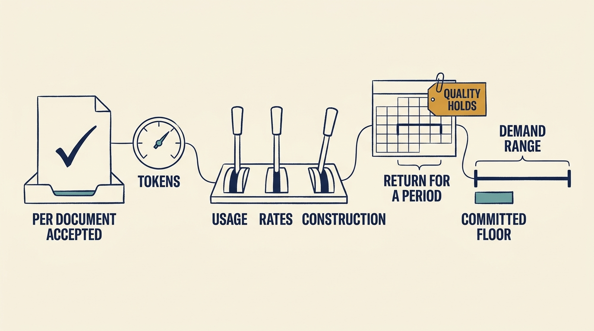

**Artificial intelligence (AI)** software uses a trained model to do a task. Larkspur’s fictional feature sorts customers’ inspection documents for €300 a month but pays its vendor per **token**, the pieces of text the model reads and writes, so the bill moves while the price stays fixed. The bill has outgrown revenue (customer fees), and Morgan, the investor’s adviser, asks for “the AI ROI”: **return on investment**, the money left after costs, divided by those costs, for a stated period.

**Figure 1:** *Per useful task, by cause, committed at the low end.*

**Choose the company’s unit.** Larkspur’s is **a document sorted and accepted** without correction. Its model cost per document rose about 80% from April to August at unchanged vendor prices.

**Put two months on one basis.** Staff time is salary the **payroll** pays anyway. August 2027: 40 customers, €12,000 revenue, €7,424 to suppliers, **a €1,124 loss** after staff time. Supplier cost per customer rose from €130 to about €186 against a €300 price.

**Separate why the bill changed.** Model charges rose from €1,400 to €5,824: **usage** added €2,644, **construction** (how the feature is built) €3,236, and a 20% price cut removed €1,456. Proposed construction work would cut model charges 35%, turning August’s loss into a projected €914 monthly surplus.

**Return has a period and a condition.** April to September 2027: €57,000 revenue less about €30,100 of supplier cost leaves about €26,900, roughly 90% **before staff costs**, projected, if the trial’s accuracy and review conditions held. After €27,700 of allocated staff time the period is about €800 short, before one-off costs. The support assistant drafts support agents’ replies, so a seventh agent’s start moved from April to October, avoiding €32,000 of 2027 employment cost. Less €8,000 of licences and upkeep, €24,000 remains: a projected 300% for 2027 (220% counting €2,000 of rollout time), a one-year benefit if deferral and quality hold.

**Commit low, after the construction work.** The vendor offers **committed spend** for 2028: a fixed monthly payment owed even if usage falls short, 25% off the usage it covers, the rest at the standard **list price**. Committing €2,400 to cover €3,200 saves €800 a month across the forecast range (€3,300 to €7,600) and costs €400 more in a harsh €2,000 **stress case**. Ines, the chief executive, signs in November, once October’s bill and quality samples show the 35% saving. The €28,800 stays owed even if the feature is withdrawn.

**Set the stop rules first.** Supplier cost per customer above €150 for two months: fix construction, then reprice. Accuracy below 95% or a missed safety document: planners confirm each result where they have time; otherwise sorting stops. A 30% price rise: decide within sixty days of the notice. Model retirement: give notice within sixty days of testing access if the replacement fails, or sixty days before retirement if access has not come. A capped loss is tolerated until 31 March 2028 while early renewal rates favour the feature, though that does not prove it causes renewals. See the article.
