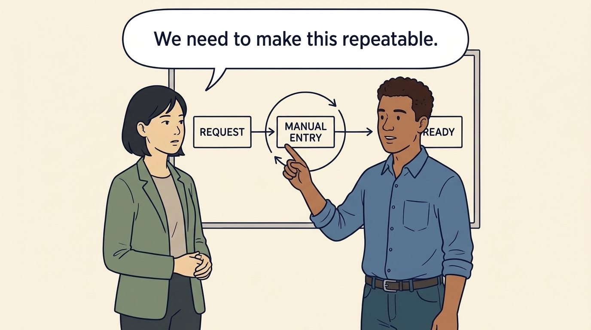
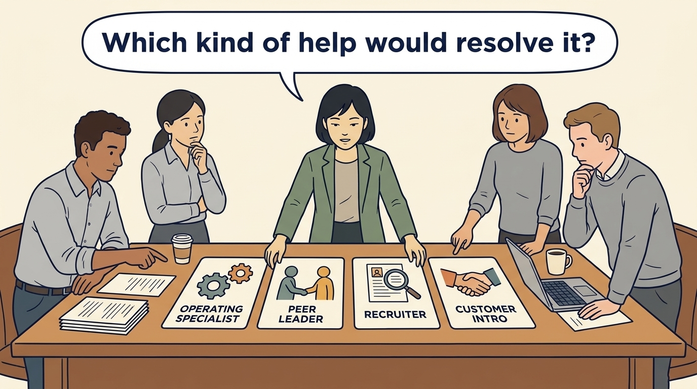
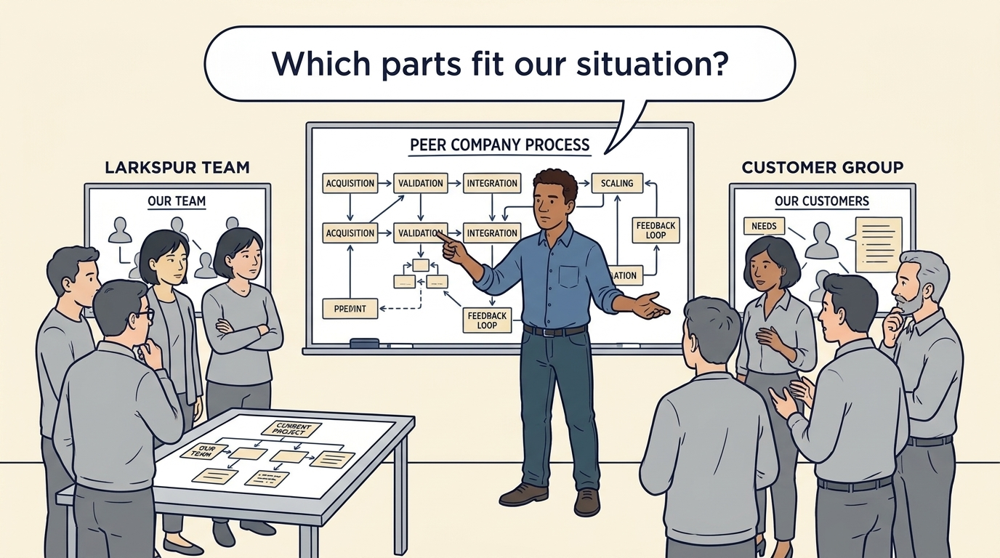
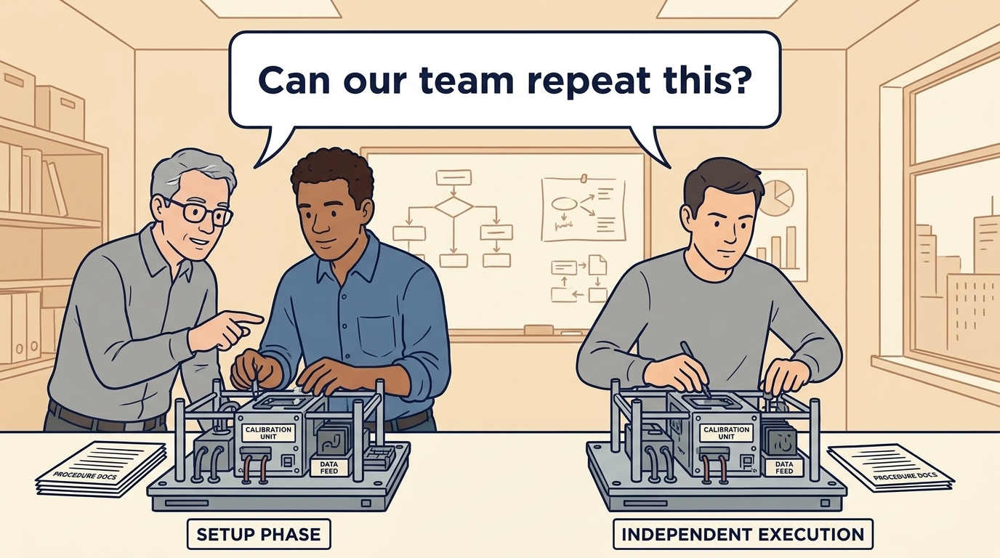
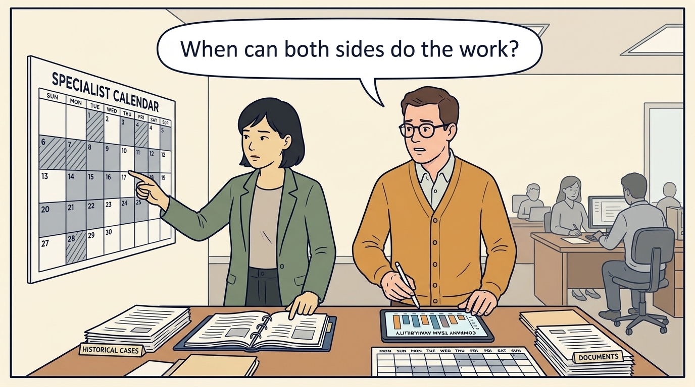
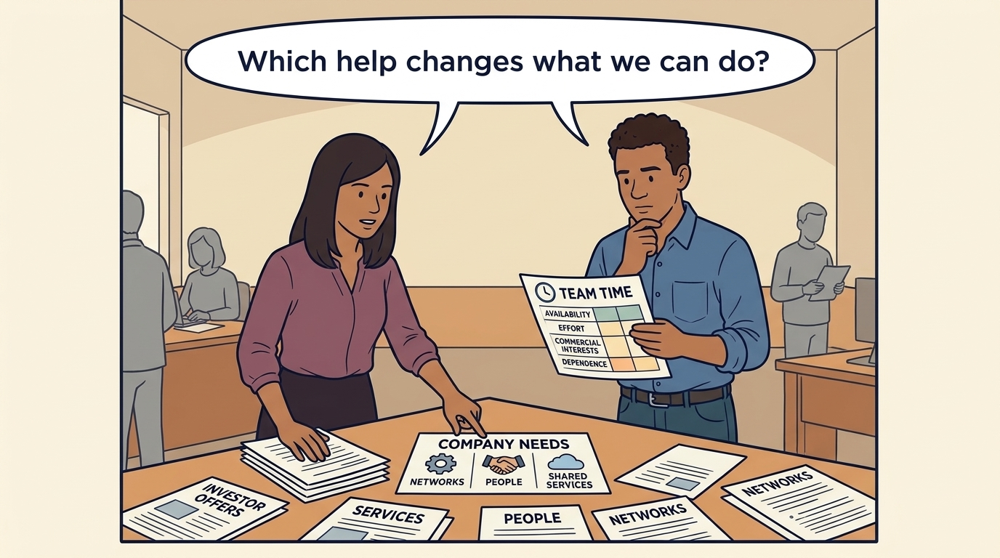

<!-- comic-style
{
  "cast": "MORGAN: a thoughtful investor technology adviser with short dark hair and a green jacket, used in the fund scenarios. ALEX: a practical CTO with curly hair and blue rolled-up sleeves. SAM: a CFO with round glasses and an amber cardigan. PRIYA: a product leader with straight dark hair and plum sleeves. INES: a CEO with short grey hair and a navy jacket. All are fictional; none represents a person in a real case.",
  "style": "Clean editorial explainer comic, dark ink outlines, restrained green, blue, and amber accents on warm white, generous space, readable short speech bubbles, expressive people and simple physical metaphors. No photorealism, logos, dense charts, or title text. Keep the same character appearances throughout the journal."
}
-->

**Comic.** An investor may give Larkspur faster access to relevant people and experience. The panels compare that access with the help the company could obtain elsewhere, starting from the company’s need, and end with the written request that the next chapter turns into a charter.

Morgan is an investor’s adviser in the fund scenarios; Alex leads technology, Priya leads product, and Sam leads finance. All are fictional. Comparative scenarios use separate assumptions. Historical cases are discussed through documents; the scenes do not reenact real events.

<!-- comic-panel
{
  "id": "01-scene",
  "status": "generated",
  "asset": "assets/images/29-help-that-changes-capability/comic-01-scene.jpeg",
  "aspect_ratio": "16:9",
  "caption": "A capability is something the company can reliably do. Begin the search for help with the work the team cannot yet perform well.",
  "alt": "Comic panel: Alex and Morgan examine a request-to-ready workflow with a loop around manual entry.",
  "prompt": "Panel 1 of an explainer comic. Alex shows Morgan a customer-setup process with one repeated manual step circled. Use one speech bubble with the exact words: \"We need to make this repeatable.\" Convey: A capability is something the company can reliably do. Begin the search for help with the work the team cannot yet perform well.",
  "generation": {
    "model": "gemini-3-pro-image-preview",
    "reference_id": "owned-cast-20260913",
    "sha256": "089848a48bfc3082f603de9850fb6534b245723f15e358ea381468876334f5b7"
  }
}
-->

**Panel 1:** A capability is something the company can reliably do. Begin the search for help with the work the team cannot yet perform well.

*Dialogue:* “We need to make this repeatable.”

<!-- comic-panel
{
  "id": "02-scene",
  "status": "generated",
  "asset": "assets/images/29-help-that-changes-capability/comic-02-scene.jpeg",
  "aspect_ratio": "16:9",
  "caption": "Lay out the credible sources for the same need, including those outside the investor’s network, and compare them on availability, company effort, cost and relevant experience.",
  "alt": "Comic panel: Morgan lays out cards representing a specialist, a peer leader, a recruiter and a customer introduction.",
  "prompt": "Panel 2 of an explainer comic. Morgan lays out cards representing a specialist, a peer leader, a recruiter and a customer introduction. Use one speech bubble with the exact words: \"Which kind of help would resolve it?\" Convey: Lay out the credible sources for the same need, including those outside the investor’s network, and compare them on availability, company effort, cost and relevant experience.",
  "generation": {
    "model": "gemini-3-pro-image-preview",
    "reference_id": "owned-cast-20260913",
    "sha256": "29f8c541118624547dd49e291e6b82820cb32315348565b6e9df7f1e7185e079"
  }
}
-->

**Panel 2:** Lay out the credible sources for the same need, including those outside the investor’s network, and compare them on availability, company effort, cost and relevant experience.

*Dialogue:* “Which kind of help would resolve it?”

<!-- comic-panel
{
  "id": "03-scene",
  "status": "generated",
  "asset": "assets/images/29-help-that-changes-capability/comic-03-scene.jpeg",
  "aspect_ratio": "16:9",
  "caption": "A connection is a chance to learn, not proof of fit. Check whether an introduced customer, candidate or reused practice suits the company’s situation.",
  "alt": "Comic panel: Alex compares a peer company’s large process diagram with the smaller team and customer group at Larkspur.",
  "prompt": "Panel 3 of an explainer comic. Alex compares a peer company’s large process diagram with the smaller team and customer group at Larkspur. Use one speech bubble with the exact words: \"Which parts fit our situation?\" Convey: A connection is a chance to learn, not proof of fit. Check whether an introduced customer, candidate or reused practice suits the company’s situation.",
  "generation": {
    "model": "gemini-3-pro-image-preview",
    "reference_id": "owned-cast-20260913",
    "sha256": "0ab302b275b010b775899b2300c4266d44f07e82e38d82083eea7611d0f53148"
  }
}
-->

**Panel 3:** A connection is a chance to learn, not proof of fit. Check whether an introduced customer, candidate or reused practice suits the company’s situation.

*Dialogue:* “Which parts fit our situation?”

<!-- comic-panel
{
  "id": "04-scene",
  "status": "generated",
  "asset": "assets/images/29-help-that-changes-capability/comic-04-scene.jpeg",
  "aspect_ratio": "16:9",
  "caption": "Temporary expertise can help start a capability while company people learn to sustain it. Test the result through actual work.",
  "alt": "Comic panel: A specialist and Alex demonstrate a setup step while a company colleague performs it independently.",
  "prompt": "Panel 4 of an explainer comic. A specialist and Alex demonstrate a setup step while a company colleague performs it independently. Use one speech bubble with the exact words: \"Can our team repeat this?\" Convey: Temporary expertise can help start a capability while company people learn to sustain it. Test the result through actual work.",
  "generation": {
    "model": "gemini-3-pro-image-preview",
    "reference_id": "owned-cast-20260913",
    "sha256": "47d303675fdb322b3b6d7358eb5de8e3f662e39edb00a08d2381ddfe2b2d009c"
  }
}
-->

**Panel 4:** Temporary expertise can help start a capability while company people learn to sustain it. Test the result through actual work.

*Dialogue:* “Can our team repeat this?”

<!-- comic-panel
{
  "id": "05-scene",
  "status": "generated",
  "asset": "assets/images/29-help-that-changes-capability/comic-05-scene.jpeg",
  "aspect_ratio": "16:9",
  "caption": "Establish availability, company effort and cost before depending on an offer. The investor’s specialist can start on day 21 after closing, ten days capped at €15,000 from the ONB-1 budget; an independent specialist would start five to seven weeks later and is the fallback; hiring stays deferred.",
  "alt": "Comic panel: Sam and Morgan compare the specialist calendar with the company team’s available time.",
  "prompt": "Panel 5 of an explainer comic. Sam and Morgan compare the specialist calendar with the company team’s available time. Use one speech bubble with the exact words: \"When can both sides do the work?\" Convey: Establish availability, company effort and cost before depending on an offer. The investor’s specialist can start on day 21 after closing, ten days capped at €15,000 from the ONB-1 budget; an independent specialist would start five to seven weeks later and is the fallback; hiring stays deferred.",
  "generation": {
    "model": "gemini-3-pro-image-preview",
    "reference_id": "owned-cast-20260913",
    "sha256": "d51df5e14f107f04bb204086ecdbfbb4f5b0f5c9d979a3abbd2e36236a0ffd0b"
  }
}
-->

**Panel 5:** Establish availability, company effort and cost before depending on an offer. The investor’s specialist can start on day 21 after closing, ten days capped at €15,000 from the ONB-1 budget; an independent specialist would start five to seven weeks later and is the fallback; hiring stays deferred.

*Dialogue:* “When can both sides do the work?”

<!-- comic-panel
{
  "id": "06-scene",
  "status": "generated",
  "asset": "assets/images/29-help-that-changes-capability/comic-06-scene.jpeg",
  "aspect_ratio": "16:9",
  "caption": "Priya chooses the first step for one need and writes the request: make one setup path repeatable, with a specialist alongside our engineer for six weeks; Priya assesses customer outcomes.",
  "alt": "Comic panel: Priya selects one company need from a table of possible offers while Alex checks availability, effort, commercial interests and dependence.",
  "prompt": "Panel 6 of an explainer comic. Priya selects one company need from a table of possible offers while Alex checks availability, effort, commercial interests and dependence. Use one speech bubble with the exact words: \"Which help changes what we can do?\" Convey: Priya chooses the first step for one need and writes the request: make one setup path repeatable, with a specialist alongside our engineer for six weeks; Priya assesses customer outcomes.",
  "generation": {
    "model": "gemini-3-pro-image-preview",
    "reference_id": "owned-cast-20260913",
    "sha256": "2f97c3ed339bd095c8588e5451cfecfc103acb0871f43cf1c63870dc51a0a697"
  }
}
-->

**Panel 6:** Priya chooses the first step for one need and writes the request: make one setup path repeatable, with a specialist alongside our engineer for six weeks; Priya assesses customer outcomes.

*Dialogue:* “Which help changes what we can do?”
