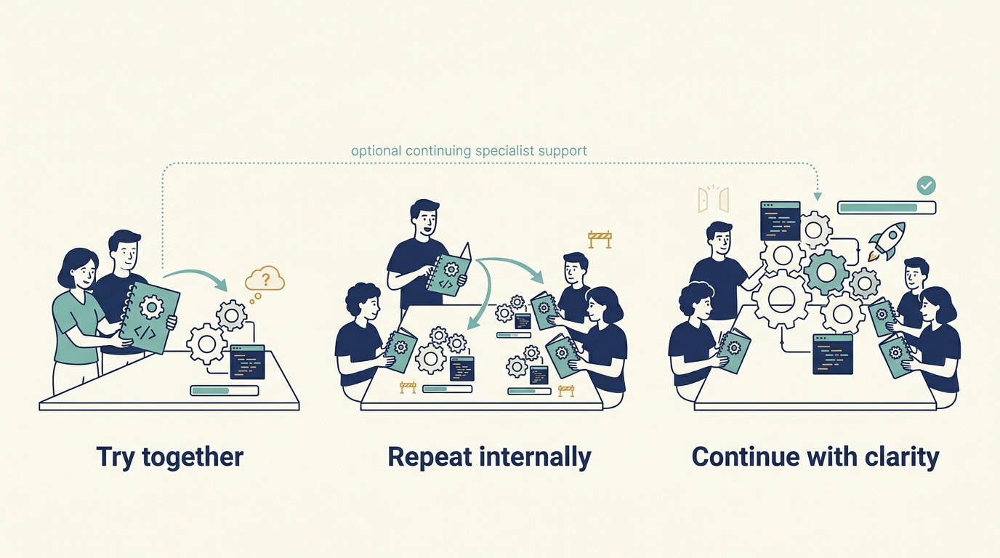

> **KEY POINTS:**
>
> * Ask for the help a **specific company problem** requires. Expertise, introductions and shared experience are useful when they change a decision or capability.
> * Find out what is **actually available**. An investor’s network or service description does not establish the people, time or funding your company will receive.
> * Build the **company’s ability to carry on**. Use external help to strengthen the team, and make any continuing dependence explicit.

 
Larkspur has money to improve customer onboarding, the setup required before a new customer can use its software. It lacks experience designing a repeatable process. Hiring a permanent leader would take time, while asking the same engineers to invent the process alongside their existing work could delay it further.

The investor may know a suitable specialist, a leader at another company who has solved a similar problem or someone who can help define the permanent role. Those are different forms of support. Which one would make the next decision easier?

This kind of help exists only because of the investor. A firm with several portfolio companies accumulates people, suppliers and experience a single company could not reach on its own, and it offers them because a stronger company raises the value of its holding. The offer is real but not free of interest. Using it well requires knowing what the company needs before accepting what is offered.

The previous chapter explained the investment firm’s technology adviser. This chapter widens the view to the people and connections around that adviser. We start with the company’s need, examine possible help and then consider how to judge its availability and fit.

## Name the Capability You Need

A **capability** is something the company can reliably do, such as understanding a customer need, releasing software safely or hiring for a specialist role. Describe the gap through the work that currently fails or takes too long.

“We need help with engineering” is difficult to act on. “Changes wait three weeks because only two people can review the billing code” identifies a constraint. The useful help might involve teaching more reviewers, changing the software boundary or changing the approval process. An introduction to a large outsourcing provider may not address any of those needs.

Distinguish four possible requests: help to understand the problem, help to make a decision, people to carry out work and help developing the company’s own skills. One engagement can involve several, but agreeing which are needed prevents advice from being mistaken for delivery capacity.

## Map the Possible Sources of Help

An investment firm’s **operating team**, where it has one, helps companies improve how they work. Its **portfolio companies** are businesses in which its funds invest. A **peer network** connects leaders who can exchange relevant experience. Support may also come from outside specialists, suppliers or people introduced through the firm’s relationships.

KKR’s description of Capstone provides one public example: it describes collaboration with company management, operating specialists, external partners and services spanning technology, growth and people. This establishes what that firm says it offers, rather than proving effectiveness or availability to any particular company. [S22: KKR Capstone description](https://www.kkr.com/approach/capstone)

Use the following map as a set of possibilities to investigate, not a promised service catalogue:

| Company need | Help to explore | What to establish first |
| --- | --- | --- |
| Understand a new customer problem | Introductions to potential customers, experienced product leaders or research specialists | Are these people relevant to the market you intend to serve? |
| Start a capability the company lacks | A temporary specialist, a peer example and practical training | Who in the company will learn the work and own it afterward? |
| Improve engineering delivery | Experienced engineering leaders, focused assessments or reusable tools | Which constraint should change, and what company effort is needed? |
| Hire for a critical role | Recruiting support, candidate introductions and help defining the job | Who selects the candidate, pays the costs and manages the person? |
| Develop leaders and teams | Coaching, training, mentoring and peer learning | Which capability should improve, and how is confidential feedback handled? |
| Make a supplier or expansion decision | Procurement expertise, commercial introductions or experience in another market | Are the terms and experience relevant to this company’s actual needs? |
| Combine or separate businesses | People with experience of the particular transition | Can they help the company operate through the change, within agreed responsibilities? |

The best route may be outside the investor’s network. Assess the support against the same company need regardless of who introduced it.

**Figure 1:** *Start with the capability the company needs, then compare credible sources of help.*

## Compare the Offer With the Investor’s Actual Position

The questions below are a proposed way to assess help; the categories are not promises of what an investor provides.

| Possible source | A useful request to test | What the company must clarify |
| --- | --- | --- |
| Venture investor’s network | Introductions to people who can test an unmet customer need or a leadership role | Whether they represent the target market and whether anyone is available to do the work |
| Growth investor’s specialists | Help repeating onboarding, commercial delivery or management practices at greater scale | Whether the experience fits this company and what local capacity adoption requires |
| Buyout firm’s operating team | A bounded assignment on costs, security, acquisitions or organizational capability | Who pays, which company leader owns the result and how competing assignments affect availability |
| Corporate investor or parent | Access to a channel, specialist capability or shared service | Commercial interests, information boundaries, local authority and the cost of continuing dependence |

Suppose a corporate investor can introduce Larkspur to a large customer group. Priya should agree the learning goal and the commercial owner of any subsequent offer. Suppose a fund can lend an integration specialist. Alex should agree the knowledge transfer and the work the team must stop to participate. In both cases, the request concerns a company capability and an actual recipient, not a general desire to use the investor’s network.

## Use Connections to Learn About Customers

An introduction can give a product team access it would otherwise struggle to obtain. It can help test a problem, understand a buying process or find a partner. It does not establish demand for the product.

Investors may introduce people from companies they already know. Those people may differ from the customers the product intends to serve. Ask what you can learn from the conversation and which other perspectives are still missing.

For Larkspur, interviews with larger portfolio companies might reveal useful scheduling needs, but those needs may not match its smaller maintenance-business customers. Priya should compare the insights with evidence from the intended market before changing the roadmap.

A commercial introduction also needs follow-through. Agree who owns the relationship, what the company is ready to offer and what additional delivery work a successful sale would create. More opportunities can worsen an existing onboarding constraint.

## Start Small and Transfer the Work

Starting a new capability can combine temporary expertise with internal ownership. A specialist can help a company produce its first useful result while a company employee learns how to maintain it.

In a fictional example, Larkspur uses a short specialist assignment to document one setup path, remove one repeated manual step and teach the customer team how to review the result. Alex protects time for an engineer to participate; Priya owns the customer outcome. The investor helps identify the specialist and resolve the agreed access to support.

The result should be judged through actual customer setups and **the team’s ability to repeat the work**. A presentation explaining what an improved process could look like is a different deliverable.

Temporary help does not always need to end in complete independence. A company may sensibly continue buying a scarce specialist service. It should understand the continuing cost, availability and responsibilities, rather than discover the dependence when the first assignment finishes.

**Figure 2:** *Useful support leaves a capability the company can use or a continuing service it understands.*

## Support Hiring and Development Together

An investor’s network may help identify candidates or people who can assess a role. Begin with the work the company needs: the decisions, skills, relationships and conditions in which the person must succeed. A prestigious introduction is not evidence that the candidate fits that job.

Hiring is also only one way to develop capability. Coaching an existing leader, mentoring a new manager or helping several teams practice a skill can be more appropriate than adding a senior role. Compare the transition effort and the company’s capacity to use the help.

Agree how development conversations relate to formal performance assessment. A leader should understand whether a discussion is confidential coaching, advice that will be shared with the board or part of an evaluation. The decision boundaries from Part II still apply.

## Check Availability Before Depending on It

Ask who will do the work, when they can begin, how much time they can give and which costs the company will bear. A firm may have relevant expertise that is committed elsewhere. A peer may be willing to discuss an approach but unable to provide delivery help.

Also ask what assumptions travel with a reused practice. A tool developed for a much larger business may require administration your team cannot support. Shared purchasing terms may be attractive while the cost of changing suppliers outweighs the benefit. **Borrow experience with its context attached**.

If the proposed help is unavailable, identify **an alternative provider or change the plan** before the team depends on it. A useful introduction and a commitment to deliver work belong in different parts of that plan.

Finish the search with a concrete request: the problem, the useful result, the proposed source of help and the company person who will own it. The next chapter turns that request into an agreed way of working: [[making-support-work]].

## Questions to Consider

1. What capability does your company lack, described through the work that fails or takes too long rather than through a category of help?
2. Which of the four requests are you making: help understanding the problem, help making a decision, people to carry out work or help developing your own skills?
3. Which contacts introduced by your investor represent your intended customers, and which represent a different market?
4. For each support offer, who will do the work, when, for how long, at what cost to the company, and who inside the company will own the result afterwards?
5. Which practices borrowed from another portfolio company arrived with their context attached, and which did not?
6. Where is your company already dependent on a specialist service that no one planned to keep funding?
