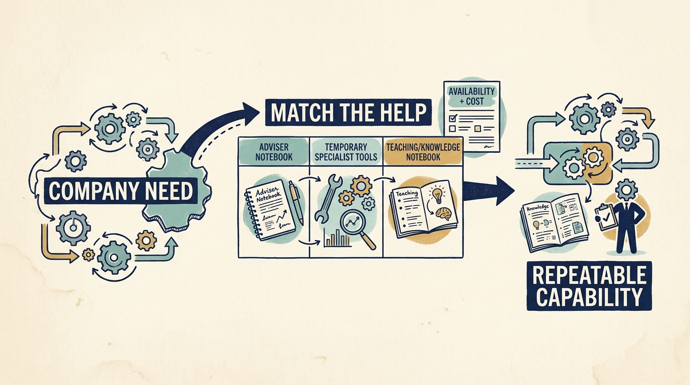

A **capability** is something the company can reliably do. Investor support is useful when it helps develop a missing capability, resolve a constraint or improve a decision. Begin with that company need before asking for an expert, a tool or a network introduction.

**Figure 1:** *Request the help that closes a specific gap in company work.*

Distinguish help understanding the problem, making a decision, carrying out work and developing the company’s own skills. Advice about engineering delivery is not the same as additional delivery capacity. A useful request explains which contribution is needed and who in the company will own the result.

An investor’s **operating team** helps companies improve their work. Its **portfolio companies** are businesses in which its funds invest. **Peer networks** connect leaders who can exchange experience. External specialists, recruiting support, suppliers and commercial introductions may provide other routes to help.

KKR’s own Capstone description illustrates a firm advertising operating specialists, partnerships with management and support across technology, growth and people. It does not prove availability or effectiveness for an individual company. [S22: KKR Capstone description](https://www.kkr.com/approach/capstone)

**Match the resource to the gap**. Customer introductions can help test a product need, while peer experience can reveal the conditions behind an earlier implementation. Recruiting support can help find candidates, while coaching or training may develop skills in the existing team. Starting a capability can combine a temporary specialist with a company employee who learns to sustain the work.

In a fictional Larkspur example, a specialist helps document one customer-setup path, remove a repeated manual step and teach the team to review the result. Company leaders provide engineering time and own the customer outcome. Test whether the new process works through actual customer setups and whether the team can repeat it.

**Connections still need evaluation**. Introduced customers may differ from the intended market. A known candidate may not fit the job. A reused tool may require more administration than the team can support. The best source of help may be outside the investor’s network.

Establish the people, availability, costs, company effort and information boundaries **before depending on the offer**. Continuing specialist support can be reasonable when its purpose, cost and responsibility are explicit.

The investor’s position changes the offer you should test. A venture network might help assess demand or recruit; a growth specialist might help repeat a working process; a buyout operating team might undertake a bounded assignment. A corporate channel or shared service can also create commercial dependence. These are possible sources, not guaranteed entitlements. Match each to a named company need and verify availability, authority, cost and the company effort needed to use it.

The transferable skill is matching a concrete need to a suitable source of help. Finish with a specific request and an accountable company leader; the engagement then needs an agreed result, resources, review and handover.
