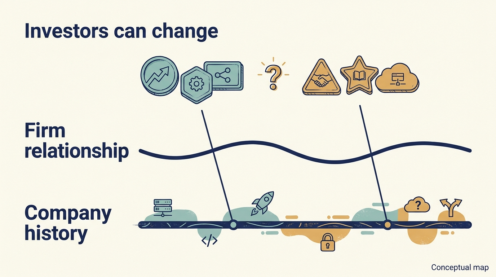

> **IN THIS SECTION, YOU WILL:** Learn to follow the funds and shareholders behind a familiar investment manager, and check that a year’s earnings are still the same measure before budgeting for acquisitions and shared support.

> **WHY INVESTORS CARE:** The funds and shareholders behind a holding change while the manager stays; each new investor buys at a new price on a stated earnings measure, and needs its definition, and its reconciliation to the measure management budgets on, to be explicit.

> **WHY YOU SHOULD CARE:** A familiar manager and a familiar earnings label can both mask a change: different funds behind the same name, and a different measure for the same year; both affect what the company can budget.

> **KEY POINTS:**
>
> * The same investment firm can remain involved while **the funds and investors behind it change**. Hg’s own announcements name two different funds and one investor’s announced complete exit; a long relationship is not one unchanged investment.
> * Check **how financial figures are calculated**. The same year, 2024, appears as €893m EBITDA and €904m adjusted EBITDA because the later measure adds back acquisition costs. The adjustment explains the gap and creates no cash.
> * Shared support and local decisions need a **clear division of responsibility**. The case raises that question without proving the model; budget the recurring cost of an acquisition program and name who is authorized to decide.

 
Visma is a group of business-software companies. Its public accounts describe product development, acquisitions and shared support alongside changes in its investors. The case shows a different pattern from the previous chapter, where each company was sold outright: Visma shows a continuing company-and-manager relationship through repeated investor entries and exits. Individual shareholders and funds have left; the manager has not, and the money behind the familiar name has changed with each transaction.

It matters for product and engineering leaders because a change of fund, even under the same manager, can change the money and the timeline behind long-running product and platform work. It is also a reminder that the earnings measures reported to shareholders can differ from the figures used inside the company.

The historical window runs principally through 2024, including a December 2023 ownership transaction. **Hg** is the investment manager associated with the long relationship discussed in the sources. A manager is the organization overseeing investments; the funds and investors behind it can change. Recall **EBITDA**, earnings before interest, taxes, depreciation and amortization. **Adjusted EBITDA** excludes additional specified items. A **reconciliation** shows the calculation from one figure to another. Neither earnings measure is the cash remaining after every company obligation.

We follow three questions in order: who continued to own an interest, how the group described its operations, and why two sources report different earnings for 2024. The last is a practical exercise in reading financial definitions, and it is where this chapter’s durable lesson lives.

## A Long Manager Relationship With Changing Investors

A **secondary sale** transfers an existing ownership interest from one investor to another. Visma’s December 2023 announcement describes such a sale valuing the company at €19 billion. It says around 20 new investors, including Altaroc, Jane Street, NPS and NYC Retirement System, would join the shareholder register with over €1 billion of equity investment, and that existing shareholders, including Hg, ICG, TPG and Visma management, would make around €3 billion of new investment, with Hg continuing what the announcement calls a 17-year investment with a majority stake. The announcement also describes a focus on standardized **software as a service (SaaS)** products, accessed as an ongoing service rather than supplied only as a one-time software purchase, after selling activities outside its chosen focus. [S30: Visma 2023 transaction](https://www.visma.com/newsroom/visma-attracts-new-investors-for-further-international-expansion-in-a-transaction-valuing-the-company-at-eur-19-billion-59703d9f)

The distinction between a secondary sale and new company funding is essential. Money used to buy an existing shareholder's stake doesn’t automatically fund product development. Continued involvement by a manager doesn’t necessarily mean the same fund has held the same exposure unchanged for the whole period. The title’s claim can be checked against the documents already cited. The table below uses only Visma’s 2023 announcement and Hg’s June 2017 buyout announcement; every cell those two documents do not fill is marked as such, and nothing is inferred from the length of the relationship.

| Event | Manager | Investing vehicle | Shareholders entering or increasing | Shareholders leaving or reducing | Money reaching the operating business |
| --- | --- | --- | --- | --- | --- |
| 2006 investment | Hg | Hg5 fund, £101 million (per Hg’s 2017 announcement) | Hg | Not stated in the consulted sources | Not stated |
| 2014 reinvestment | Hg | Hg7 fund (per Hg’s 2017 announcement) | Hg, described as reinvesting alongside KKR and Cinven; the entry dates of KKR and Cinven are not stated beyond KKR’s stake being described in 2017 as held for seven years | Not stated, including whether Hg5 sold | Not stated |
| June 2017 buyout, announced June 26, 2017 with completion stated as subject to regulatory approval; enterprise value stated as NOK 45 billion (about $5.3 billion) | Hg, leading the buying group | Hg fund not named; Hg to invest a further £238 million; buying group about £1.4 billion of equity | GIC, Montagu and ICG, described as committing direct capital; Hg to represent 41% of the equity; management retaining 7%; Cinven retaining about 17% | KKR, described as realizing its entire stake on completion | Not stated: the announcement describes equity invested as part of the transaction, not how much, if any, went to the company rather than to selling shareholders |
| December 2023 secondary sale, valuation €19 billion | Hg, with a majority stake | Hg fund(s) not named | About 20 new investors with over €1 billion; about €3 billion of new investment from existing shareholders including Hg, ICG, TPG and management. TPG’s entry date is not stated in the consulted sources | Sellers not named; the announcement calls the transaction a secondary sale | Not stated: the announcement links the transaction to supporting growth but does not state any primary proceeds to the company |

Sources: [S30: Visma 2023 transaction](https://www.visma.com/newsroom/visma-attracts-new-investors-for-further-international-expansion-in-a-transaction-valuing-the-company-at-eur-19-billion-59703d9f) and [S62: Hg 2017 Visma announcement](https://hgcapital.com/insights/hg-leads-usd5-3bn-buyout-of-visma), the manager’s own announcement of June 26, 2017. Both are interested accounts of announced terms, not audited records or verified closing events; the map records what was announced, not what was later confirmed to have completed.

Even this partial map shows the title’s point. The manager’s name is constant from 2006 to 2023. Behind it, Hg names two different funds for its 2006 and 2014 investments, one investor’s complete exit is announced in 2017, others enter in 2017 and 2023, and Hg’s own share moves from a stated 41% in 2017 to an unstated majority in 2023 by a route the consulted sources do not describe. Nothing in either document says that the majority sits in a single fund: a manager’s aggregate stake can be held through several vehicles, each with its own investors, rights and horizon. What the map cannot show is equally important: the fund-by-fund cash flows, the realized net return of any fund, the conflicts examined in each transaction, and how much of any round reached the company as new funding rather than paying departing shareholders. The €19 billion valuation is not cash distributed to investors, and it is not cash for the company.

**Figure 1:** *Continuity of familiar people does not establish that the investment and decision rights are unchanged.*

## Thirty-Three Acquisitions in a Single Year

In its March 2025 account of 2024, Visma describes substantial local autonomy supported by shared infrastructure and knowledge. It reports 33 acquisitions during 2024 — nearly three a month — and says it spends close to 20% of revenue on product development, while also acquiring other businesses. Those are company-reported descriptions and measures, not independently verified proof of the model's effectiveness. [S32: Visma annual-report announcement](https://www.visma.com/newsroom/visma-releases-annual-and-sustainability-reports-for-2024-7f5c9f37)

The described mechanism, keeping local product and market knowledge while sharing capabilities that would be expensive to assemble separately, resembles the boundaries examined in the chapter [[acquisition-adds-work-first]]. The consulted sources contain no documented intervention, with a local decision, a support action, its cost and an observed customer outcome, so this chapter treats the operating model as **a question the case raises**, not as a demonstrated success mechanism. Two cautions apply to anyone transferring it. Visma is a group that owns its operating businesses; an investment manager offering shared support across separate portfolio companies has different authority and economics. And “autonomy” can describe useful accountability or insufficient integration, while “shared capability” can describe valuable expertise or an expensive central service. The label alone can’t decide.

What the acquisition count does establish is a reason to read the earnings definitions closely. A group that buys businesses nearly every month incurs acquisition costs nearly every month.

## Two Sources, Two Numbers, One Year

Continuity needs checking in the numbers as well as the ownership. The same year now appears under a different earnings definition.

The report for the fourth quarter (**Q4**) of 2024 gives full-year revenue of €2,804 million and EBITDA of €893 million. For Q4 it reports 13.6% revenue growth and 10.0% organic growth. It reports **net debt / EBITDA of 2.5×**, comparing debt after included cash with the report’s defined annual earnings measure, and describes borrowing arrangements due to mature in 2028. The ratio depends on those definitions; it shouldn’t be treated as directly comparable with a ratio using gross debt, another EBITDA basis or a different business. These are figures and definitions at that reporting point, not current financing terms. [S31: Visma Q4 2024 report](https://cdn.prod.website-files.com/69787181d8720ea08c1f22fe/69787181d8720ea08c1f4589_Visma%202024%20Q4.pdf)

The report defines **organic growth**, growth adjusted for specified changes in the businesses being compared, using **constant currency**, which removes the effect of exchange-rate movements, and includes acquired companies in both the reporting and comparison periods. It defines its **free cash flow**, a measure of cash after specified spending, before tax and after specified development and asset investment. Its **ARR** means **annualized repeatable revenue**, an estimate expressed at a yearly rate, including both contractual recurrence and certain repeatable transaction revenue. [S31: Visma Q4 2024 report](https://cdn.prod.website-files.com/69787181d8720ea08c1f22fe/69787181d8720ea08c1f4589_Visma%202024%20Q4.pdf) Those definitions are consequential. “Organic” doesn’t mean simply subtracting the revenue acquired during the year. A before-tax free-cash-flow measure isn’t cash available after every obligation. Repeatable transaction revenue isn’t identical to contracted subscription revenue.

The investor webpage, inspected in September 2026, presents a 2024 figure of €904 million under a heading referring to adjusted EBITDA. [S33: Visma financials page](https://www.visma.com/investors/financials) The annual reports explain the difference. The 2024 report's EBITDA is €892.646 million. The 2025 report's reconciliation adds €11.665 million of acquisition-related expenses to that prior-year figure, producing €904.311 million of adjusted EBITDA. Rounded to whole millions, these are the €893 million and €904 million presentations. [S43: Visma 2024 annual report, pp. 50 and 52](https://cdn.prod.website-files.com/69787181d8720ea08c1f22fe/69787181d8720ea08c1f460b_Visma-Annual-Report-2024.pdf) [S44: Visma 2025 annual report, p. 96](https://cdn.prod.website-files.com/69787181d8720ea08c1f22fe/69bb9fc407e856cb8d6f7726_Visma%20Annual%20Report%202025.pdf)

| Bridge for the same 2024 period | € million |
| --- | ---: |
| EBITDA in the 2024 annual report | 892.646 |
| Add acquisition-related expenses in the later reconciliation | 11.665 |
| Adjusted EBITDA for 2024 in the 2025 annual report | 904.311 |

This resolves the numerical gap. The later number is a differently defined earnings measure for the same year, not evidence that an additional €11.665 million of business improvement subsequently occurred in 2024. **Nor does the adjustment itself create cash.**

## If You Buy Companies Every Year, Is Buying Them Exceptional?

The reconciliation raises a better question than whether one headline is right and the other wrong: which measure helps answer the decision at hand? An adjusted measure can help examine earnings before the expense of particular transactions, which is useful when comparing the operating businesses. A cash plan for a group that intends to keep acquiring companies must also account for the money and people needed to execute that strategy. **Costs can be exceptional for one transaction while recurring across a continuing program.** This is an analytical distinction, not a finding that the reported adjustment is inappropriate; the expense’s relevance depends on the question.

Here is the budget decision the adjustment cannot resolve. Suppose the leaders of a group like this one are setting next year’s plan and intend to keep acquiring at a similar rate. The adjusted measure tells them what the businesses earned before deal costs, one basis for comparing operating performance, alongside the full cost of the strategy; an acquisition-heavy product line can also need recurring integration resources that the adjusted figure leaves out. It does not tell them whether the year’s €11.665 million of acquisition costs will recur, whether integration work for last year’s purchases is funded, or which measure the lenders apply when they test net debt against earnings. That decision needs a cash plan: the expected number of transactions, the cost of each, the integration capacity in engineer-weeks, the interest and repayment obligations from the chapter [[obligations-before-budget]], and the defined earnings measure in the loan agreement. It also needs a named accountable leader for the integration budget and a stated authority for approving the next acquisition. None of this is an assertion about Visma’s internal planning; it is the decision any reader of the two numbers still has to make.

Technology creates a similar measurement problem. An integration team can be charged to a central acquisition program while local product margins exclude its cost. That may help local accountability, but a decision to expand the program still needs the total cost. Conversely, assigning all central costs to a newly acquired product immediately can make a useful transition look unviable before its benefits arrive. These are possible reporting designs, not assertions about Visma's internal allocations. The company’s product and technology leaders should agree with the CFO on a short description attached to each important measure: the **business included**, the **period** and whether comparative acquisitions are treated consistently, the **calculation** with its inclusions and exclusions, the **decision** the measure supports and the obligations it leaves outside, and the **evidence** needed to reproduce it.

The chapter [[teamsystem]] adds a different angle on the same measurement problem: a later owner inheriting accumulated acquisition work and a partial reporting period.

**Figure 2:** *When acquisitions recur, their support and integration demands belong in the operating model and its cash plan.*

## What the Documents Cannot Establish

The disclosed combination of software investment, recurring or repeatable revenue and acquisition activity is consistent with a business building and buying software capability over time. It challenges the simplistic claim that PE ownership necessarily eliminates product investment. It doesn’t show how much of growth came from better products rather than acquisitions, pricing, market demand or customer mix; an organic-growth measure doesn’t isolate the effect of engineering, and spending on development doesn’t establish that the spending was effective.

The same limit applies to people. Local autonomy may preserve founder knowledge; shared capabilities may help employees develop and give customers stronger services. Acquisition and product transition can also create losses: duplicated work, changed responsibilities, pricing changes or the retirement of a product customers depend on. The consulted material provides no consistent independent series of employee outcomes, customer migration costs or the experiences of acquired companies that fit the model poorly, and **a successful aggregate can conceal unsuccessful components**. A stronger assessment would connect individual product changes to adoption, retention and contribution economics, examine discontinued products and migration costs, and compare shared support with plausible alternatives. This draft does not elevate launch announcements or management descriptions of customer time savings into verified outcomes.

## One Authority-and-Budget Check

For a product leader, continuity of the investment manager is useful relationship information. It doesn’t remove the need to understand a new transaction’s funding, participants and expectations. After a transaction like the ones in the map, recheck three specific things: which vehicles now hold the interests, how their rights are exercised, and which of their horizons affect long-running platform work, without assuming that one fund holds the majority (the map leaves Hg’s 2023 vehicles unnamed); whether the shared-service budget and the integration capacity are still funded, and by whom; and which earnings definition the board, the lenders and the operating plan each use for the same year. The comparable check in a minority funding round is whether a familiar lead investor now works alongside different shareholders and rights; in a corporate group, whether the same local executives operate under a changed mandate. These are applications of the ownership-map method, not findings established by Visma’s history about those other arrangements.

Visma supports a narrower, more defensible conclusion than “private equity makes software companies better.” It shows a publicly described model combining sustained software investment, acquisition, shared support, local discretion and repeated investor transactions, and it shows exactly how a year’s earnings can be restated under a different definition. Its transferable lesson is to inspect the **level at which reuse creates value** and to keep every measure’s definition beside the number. Shared security expertise might travel well across products; a single customer workflow might not. Common financial definitions might help comparison; a uniform engineering ratio might obscure it.

Visma’s documents show a group that kept buying while investors entered and left behind a continuing manager, with positive reported earnings under either definition. The next case asks the harder question the adjusted number cannot answer: what happens when a company reports positive operating earnings but the cash left after interest and capital spending is too small to fund the technology plan: [[toys-r-us]].

## Questions to Consider

1. *If your investment manager stays but the fund or investors behind it change, what have you rechecked: funding, decision rights, expectations and shared services?*
2. *Which two figures for the same period in your company’s reporting differ, and can you reconcile them line by line?*
3. *Are acquisition, integration or transformation costs excluded from an adjusted measure your company reports? Do they recur, and who funds them in the cash plan?*
4. *At which level does shared capability create value in your group, whose costs are charged to a central program while local margins exclude them, and does anyone see the total?*

## To Probe Further

- **[ESMA Guidelines on Alternative Performance Measures](https://www.esma.europa.eu/document/esma-guidelines-alternative-performance-measures)** — European Securities and Markets Authority, 2015; applying from July 2016. *These guidelines provide a useful model for explaining alternative measures, the discipline behind this chapter's €893 million to €904 million bridge. Their formal scope depends on the issuer, securities and disclosure; private share ownership alone does not establish an exemption.*
- **[HgCapital and the Visma Transaction (A)](https://store.hbr.org/product/hgcapital-and-the-visma-transaction-a/214018)** — Paul A. Gompers, Karol Misztal and Joris Van Gool, Harvard Business School case 214-018, 2013. *A paid teaching case on the 2006 delisting that began the manager relationship discussed here, covering whether to bid against a strategic buyer and how to finance the purchase.*
- **[Visma](https://hgcapital.com/portfolio/case-studies/visma)** — Hg, undated portfolio case study. *The manager's own account of the relationship since 2006, useful for what Hg says it did with software as a service and acquisitions, not as independent evidence of results.*
- **[Hg leads $5.3bn buyout of Visma](https://hgcapital.com/insights/hg-leads-usd5-3bn-buyout-of-visma)** — Hg, June 26, 2017. *The manager's own announcement of the 2017 round, and the source of the fund names, stakes and KKR exit in this chapter's transaction map; it is an interested account of stated terms, not an audited record.*
- **[Continuation Funds: Considerations for Limited Partners and General Partners](https://ilpa.org/industry-guidance/principles-best-practices/continuation-funds/)** — Institutional Limited Partners Association, May 2023, with an updated draft issued for comment in 2026. *The fund investors' body sets out what they negotiate when a manager sells to a vehicle it also manages, which the chapter treats as a reason to recheck authority and funding.*
