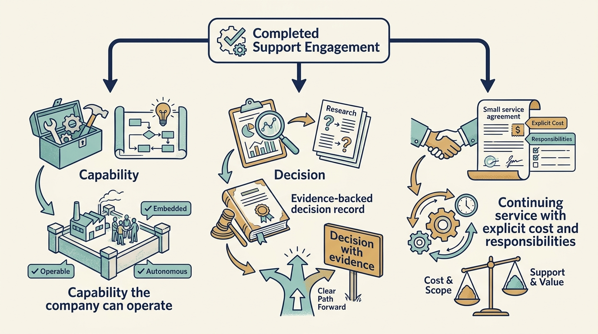

> **KEY POINTS:**
>
> * Agree **what the help should change**. Name the company result before booking meetings, assessments or specialist time.
> * Make **resources and responsibilities concrete**. The work needs company capacity as well as external expertise, with clear decisions about cost and information sharing.
> * Review the **result and the handover**. Continuing the engagement should depend on the useful work still needed, including any support the company expects to keep buying.

 
An investor offers Larkspur a specialist to improve customer setup. Everyone welcomes the idea. Two weeks later the specialist has interviewed the same engineers three times, while the customer team still does not know what will change or who is paying for implementation.

The offer named a person but left the work undefined. An **engagement** is an agreed piece of support with a purpose, participants and boundaries. An **engagement charter** is a short record of that agreement.

[[investor-support]] identified possible sources of help. This chapter explains how a company leader can use that help without creating a second, unclear route for assigning work. The approach is a proposed working method, illustrated through fictional situations.

## Turn the Request into a Decision or Result

Begin with one sentence about what the company needs to do differently. For Larkspur, the aim might be to reduce repeated manual setup while preserving the customer’s ability to start using the product successfully.

State whether the assignment should diagnose the problem, recommend options, implement a change or teach the company to do the work. A diagnostic review may end with a decision; an implementation assignment needs resources to deliver and test the change. Confusing the two leaves a list of recommendations without a funded owner.

Agree what is outside the assignment. Helping one setup process does not automatically authorize a company-wide reorganization or a wider assessment of individual performance. If the useful scope changes, discuss the new purpose and resources explicitly.

## Write the Smallest Useful Agreement

The charter should be short enough for the people doing the work to use. The following fields are a starting point:

| Field | What to agree |
| --- | --- |
| Company need | The problem, affected customers or teams and consequence of delay |
| Useful result | The decision or capability the engagement should improve |
| Accountable company leader | The person responsible for the operating result and decisions |
| Support and resources | Named people, time, costs and the company work displaced |
| Authority | Who recommends, approves, implements and resolves disagreement |
| Information | What is needed, who may receive it and how feedback will be used |
| Review | The evidence and date for continuing, changing, expanding or stopping |
| Handover | Who operates the result, what they need to learn and any continuing support |

The **engagement sponsor** is the person backing this assignment within the investment firm. The engagement sponsor can secure agreed support or resolve a resource issue. The accountable company leader remains responsible for the operating result unless a different formal assignment has been established.

The [[toolkit]] provides a reusable charter. Its value comes from resolving these questions, rather than completing every field for its own sake.

**Figure 1:** *Make the practical conditions of the help concrete before the engagement consumes time.*

## Give the Company Time to Use the Help

**External expertise consumes internal time**. People need to explain the situation, provide evidence, review options and take responsibility for what changes. The company may need to delay other work to make that possible.

In a separate fictional engagement, a specialist offers ten working days over six weeks. The plan also needs one company engineer for a day each week, two sessions with the customer team and review time from Priya, the product leader. If those commitments cannot be met, the apparent availability of the specialist does not make the engagement feasible.

Agree specialist fees and implementation funding separately where they are different. “The adviser is included” does not establish who pays for a supplier, new software or the company’s additional work. Compare the complete cost with using another provider or solving the problem internally.

A smaller assignment can be sensible if it produces a usable result. Simply reducing the time without changing the promised outcome can make the agreement less credible.

## Keep Investor Support Within One Company Plan

In a fictional Larkspur minority round, two investors each offer an adviser. One proposes rapid feature launches; the other proposes a platform overhaul. Priya and Alex should define the company’s question once, name the accountable executive and agree which work each adviser is asked to do. Two helpful relationships should not create two operating backlogs.

If the provider is a corporate investor, distinguish the support assignment from a commercial request that primarily benefits its own group. Specify who can use the resulting analysis, whether other companies can access information and what happens to the service after an ownership change. If the same person both assesses performance and coaches a leader, make that combination clear before confidential conversations begin.

Use an ordinary engagement review to decide whether to extend, change or end the assignment. Investor status should not make ineffective help impossible to stop. Where the company cannot end a required group service, record the authority and use the agreed route to resolve performance, cost or access problems.

## Agree How Information Will Be Used

The specialist may need documents, system observations or conversations with employees. State the purpose, the required access and the permitted recipients. The investment relationship alone does not settle every information-sharing question.

Distinguish coaching, operational support and formal oversight. A leader should understand when a discussion feeds a board assessment and when a specialist is helping the team improve its own process. Material concerns still need an agreed route to the people responsible for them.

Peer learning needs the same care. Other portfolio companies can learn from a simplified account of a problem without receiving customer records or confidential personnel information. Share the context necessary to understand the lesson within the permissions established for the engagement.

These boundaries support useful candor. People can explain weaknesses more clearly when they understand the purpose and consequences of the conversation.

## Begin with Evidence You Can Compare Later

A **baseline** records the starting situation using a clear definition and time period. For customer setup, it might include engineering hours, elapsed customer waiting time, errors and support requests. The measure should describe the work the engagement intends to change.

Agree what would count as improvement and what might reveal harm. Lower engineering effort would be incomplete if more customers abandon setup. A shorter delivery time would be incomplete if failures become harder to recover from.

Also record other changes that could explain the outcome. A new customer group, simpler contracts or changes in the sales process may affect setup time. An observed improvement does not automatically isolate the specialist’s contribution.

The value-measurement approach from [[product-value]] applies here too. Hours freed can create capacity without reducing payroll, and a useful capability can matter before it produces an observable financial gain.

## Change or End Help That Does Not Fit

At the agreed review, examine what was learned, what changed and what work remains. The right outcome may be to continue, change the scope, bring in a different specialist or stop.

For example, the engagement may reveal that setup delays primarily come from customer data quality rather than the software step originally selected. Continuing to automate that step would preserve the assignment while missing the problem. A revised decision could be the useful result of the first stage.

If participants disagree, use the authority and escalation route agreed at the start. **Escalation** means taking a decision to someone with the authority or resources to resolve it. Explain the options and consequences, rather than treating an objection to a specific engagement as opposition to the investor’s whole contribution.

Company leaders also need to identify **good help they cannot currently absorb**. Deferring an engagement until the team can participate may be a better use of the relationship than accepting an assignment that will stall.

## Leave a Capability, a Decision or an Understood Service

A **handover** transfers the knowledge and responsibilities needed to continue the work. It should include the remaining tasks, operating costs, evidence gathered and conditions that need future review.

For Larkspur, the handover might mean that the customer team can run the new setup process, engineers can maintain the reusable settings and Priya can review whether customers benefit. Test that understanding through an actual use of the process.

Where continued specialist help is appropriate, agree the service and its cost. The aim is a company that understands how its capability is sustained. A completed engagement should not leave a critical dependency that no one planned to fund.

Part IV has shown how to understand the adviser, find the help you need and agree a useful engagement. Part V applies those choices to funding rounds, changes of ownership and the operating plans that follow: [[part-5]] and [[diligence-and-thesis]].

**Figure 2:** *Agree what remains useful after the initial assignment and who will sustain it.*
