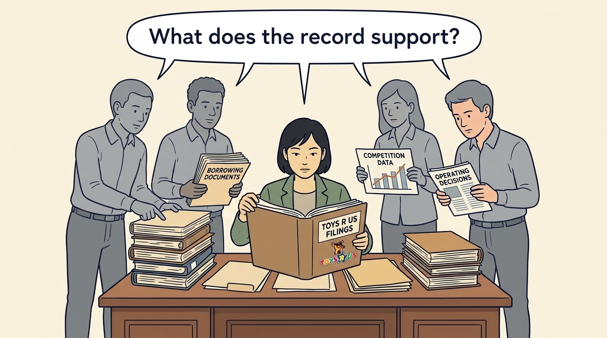
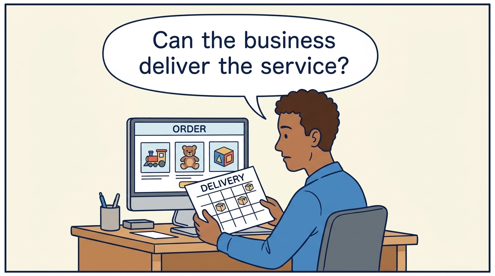
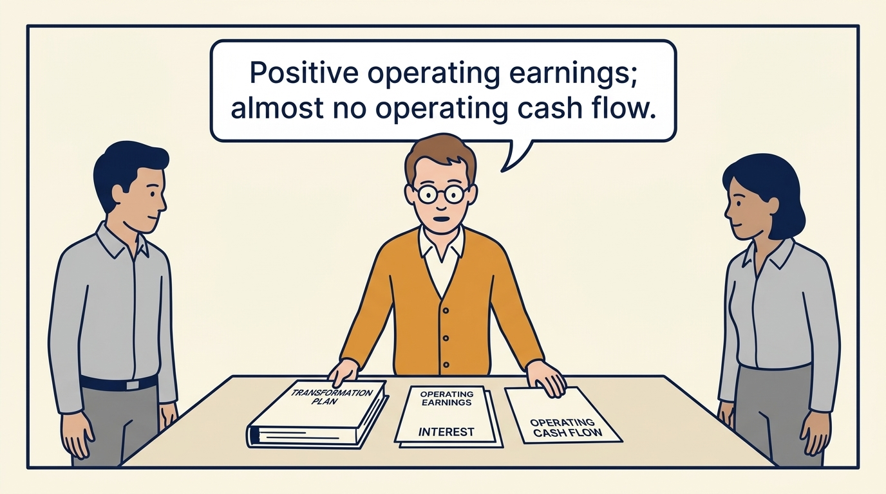
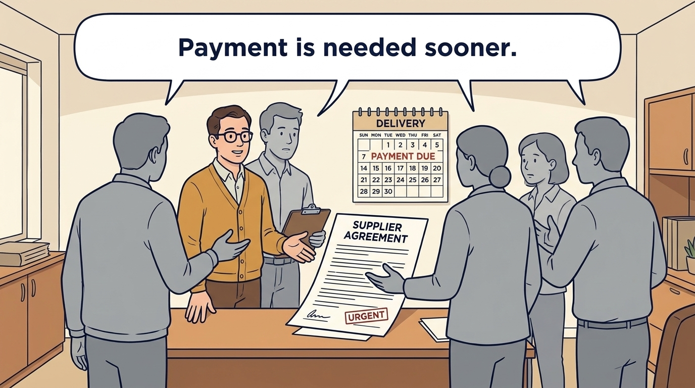
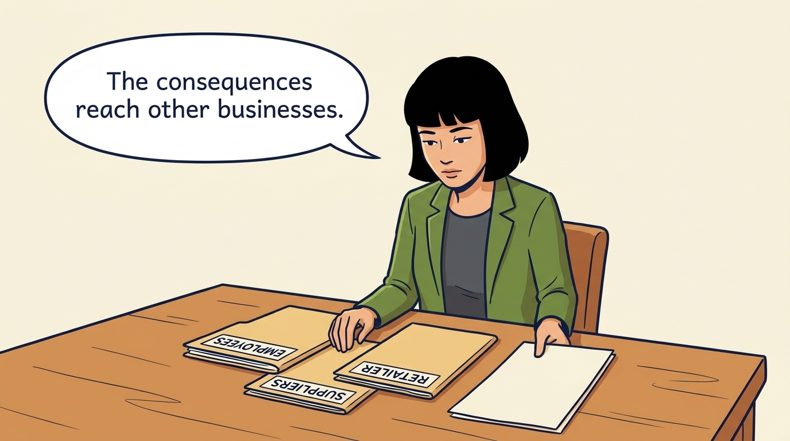
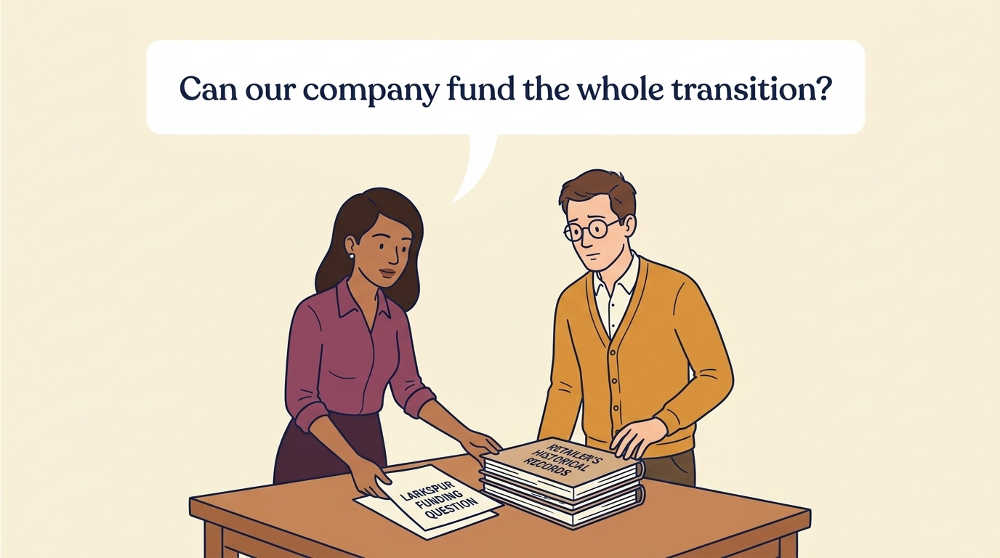

<!-- comic-style
{
  "cast": "MORGAN: a thoughtful investor technology adviser with short dark hair and a green jacket, used in the fund scenarios. ALEX: a practical CTO with curly hair and blue rolled-up sleeves. SAM: a CFO with round glasses and an amber cardigan. PRIYA: a product leader with straight dark hair and plum sleeves. INES: a CEO with short grey hair and a navy jacket. All are fictional; none represents a person in a real case.",
  "style": "Clean editorial explainer comic, dark ink outlines, restrained green, blue, and amber accents on warm white, generous space, readable short speech bubbles, expressive people and simple physical metaphors. No photorealism, logos, dense charts, or title text. Keep the same character appearances throughout the journal."
}
-->

**Comic.** The retailer reported positive operating earnings, a net loss and almost no operating cash flow in the same year, then a supplier cash shock. The panels follow what the documents show: why a technology transition needed funding, and how earlier supplier payments left less room to fund it. They do not show that the proposed work would have restored competitiveness.

Morgan is an investor’s adviser in the fund scenarios; Alex leads technology, Priya leads product, and Sam leads finance. All are fictional. Comparative scenarios use separate assumptions. Historical cases are discussed through documents; the scenes do not reenact real events.

<!-- comic-panel
{
  "id": "01-scene",
  "status": "generated",
  "asset": "assets/images/28-toys-r-us/comic-01-scene.jpeg",
  "aspect_ratio": "16:9",
  "prompt": "Panel 1 of an explainer comic. Morgan opens historical Toys R Us filings with several possible explanations. Use one speech bubble with the exact words: \"What does the record support?\" Convey: Toys R Us was a toy and baby-products retailer. Borrowing, competition and operating decisions can interact; the documents do not establish a single cause of failure or show that its technology plans were sufficient.",
  "alt": "Comic panel: Morgan opens historical Toys R Us filings with several possible explanations.",
  "caption": "Toys R Us was a toy and baby-products retailer. Borrowing, competition and operating decisions can interact; the documents do not establish a single cause of failure or show that its technology plans were sufficient.",
  "generation": {
    "model": "gemini-3-pro-image-preview",
    "reference_id": "owned-cast-20260913",
    "sha256": "1587538d0a0ce23d982d7134370e723cda200e1bdbbc2937ad2cf0792f654546"
  }
}
-->

**Panel 1:** Toys R Us was a toy and baby-products retailer. Borrowing, competition and operating decisions can interact; the documents do not establish a single cause of failure or show that its technology plans were sufficient.

*Dialogue:* “What does the record support?”

<!-- comic-panel
{
  "id": "02-scene",
  "status": "generated",
  "asset": "assets/images/28-toys-r-us/comic-02-scene.jpeg",
  "aspect_ratio": "16:9",
  "prompt": "Panel 2 of an explainer comic. Alex studies an online shopping screen and a recurring delivery calendar. Use one speech bubble with the exact words: \"Can the business deliver the service?\" Convey: The documents describe online work and plans for recurring deliveries. A proposed technology investment still needs funding and execution before it helps customers.",
  "alt": "Comic panel: Alex compares a toy-order screen with a delivery calendar marked with parcels.",
  "caption": "The documents describe online work and plans for recurring deliveries. A proposed technology investment still needs funding and execution before it helps customers.",
  "generation": {
    "model": "gemini-3-pro-image-preview",
    "reference_id": "owned-cast-20260913",
    "sha256": "ca904b0fb918fe069a20d0ec14e87859c1693bedb5287123e0d20f0d60d30b8e"
  }
}
-->

**Panel 2:** The documents describe online work and plans for recurring deliveries. A proposed technology investment still needs funding and execution before it helps customers.

*Dialogue:* “Can the business deliver the service?”

<!-- comic-panel
{
  "id": "03-scene",
  "status": "generated",
  "asset": "assets/images/28-toys-r-us/comic-03-scene.jpeg",
  "aspect_ratio": "16:9",
  "prompt": "Panel 3 of an explainer comic. Sam places three documents beside a transformation plan; their headings read, verbatim and printed normally left to right (never mirrored or reversed), OPERATING EARNINGS, INTEREST and OPERATING CASH FLOW, with a fourth sheet headed TRANSFORMATION PLAN. Two unnamed colleagues in grey look on. Use one speech bubble with the exact words: \"Positive operating earnings; almost no operating cash flow.\" Convey: In fiscal 2016 the company reported positive operating earnings, a net loss attributable to Toys R Us, Inc. and almost no operating cash flow. Name the measure and its period, and check which expenses are already included so that none is subtracted twice.",
  "alt": "Comic panel: Sam places earnings, interest and cash-flow statements beside a transformation plan.",
  "caption": "In fiscal 2016 the company reported positive operating earnings, a net loss attributable to Toys R Us, Inc. and almost no operating cash flow. Name the measure and its period, and check which expenses are already included so that none is subtracted twice.",
  "generation": {
    "model": "gemini-3-pro-image-preview",
    "reference_id": "owned-cast-20260913",
    "sha256": "3921d626190ea0b7267d47795e4c8f6c35ffecfe10bf8a86606b8331c404668e"
  }
}
-->

**Panel 3:** In fiscal 2016 the company reported positive operating earnings, a net loss attributable to Toys R Us, Inc. and almost no operating cash flow. Name the measure and its period, and check which expenses are already included so that none is subtracted twice.

*Dialogue:* “Positive operating earnings; almost no operating cash flow.”

<!-- comic-panel
{
  "id": "04-scene",
  "status": "generated",
  "asset": "assets/images/28-toys-r-us/comic-04-scene.jpeg",
  "aspect_ratio": "16:9",
  "prompt": "Panel 4 of an explainer comic. A fictional vendor shortens the time between inventory delivery and payment. Use one speech bubble with the exact words: \"Payment is needed sooner.\" Convey: Management’s court declaration reports a chain: concern about survival led suppliers to require earlier payment, the same inventory then needed cash sooner, and less room remained to fund the transition.",
  "alt": "Comic panel: A fictional vendor shortens the time between inventory delivery and payment.",
  "caption": "Management’s court declaration reports a chain: concern about survival led suppliers to require earlier payment, the same inventory then needed cash sooner, and less room remained to fund the transition.",
  "generation": {
    "model": "gemini-3-pro-image-preview",
    "reference_id": "owned-cast-20260913",
    "sha256": "dc3cacd29e48f8fecedc19e0661793606f388c4eb73538b6caa5b7b649c84e06"
  }
}
-->

**Panel 4:** Management’s court declaration reports a chain: concern about survival led suppliers to require earlier payment, the same inventory then needed cash sooner, and less room remained to fund the transition.

*Dialogue:* “Payment is needed sooner.”

<!-- comic-panel
{
  "id": "05-scene",
  "status": "generated",
  "asset": "assets/images/28-toys-r-us/comic-05-scene.jpeg",
  "aspect_ratio": "16:9",
  "prompt": "Panel 5 of an explainer comic. Morgan places employee and supplier records beside the retailer file. Use one speech bubble with the exact words: \"The consequences reach other businesses.\" Convey: The US shutdown affected employees and suppliers. Supplier Hasbro’s report records related costs, but neither account measures every consequence.",
  "alt": "Comic panel: Morgan reviews a report beside separate folders for employees, suppliers and the retailer.",
  "caption": "The US shutdown affected employees and suppliers. Supplier Hasbro’s report records related costs, but neither account measures every consequence.",
  "generation": {
    "model": "gemini-3-pro-image-preview",
    "reference_id": "owned-cast-20260913",
    "sha256": "828979664ceac96e6baef093185c9a045c20e1b2750d69aa7fa802c562ed18b0"
  }
}
-->

**Panel 5:** The US shutdown affected employees and suppliers. Supplier Hasbro’s report records related costs, but neither account measures every consequence.

*Dialogue:* “The consequences reach other businesses.”

<!-- comic-panel
{
  "id": "06-scene",
  "status": "generated",
  "asset": "assets/images/28-toys-r-us/comic-06-scene.jpeg",
  "aspect_ratio": "16:9",
  "prompt": "Panel 6 of an explainer comic. Priya and Sam place a separate Larkspur funding question beside the retailer’s historical records. Use one speech bubble with the exact words: \"Can our company fund the whole transition?\" Convey: The case raises a funding-dependency question, not a causal finding about every investor. Test your own operating cash flow, capital expenditure and payment terms before assuming a product improvement can sustain the transition.",
  "alt": "Comic panel: Priya and Sam place a separate Larkspur funding question beside the retailer’s historical records.",
  "caption": "The case raises a funding-dependency question, not a causal finding about every investor. Test your own operating cash flow, capital expenditure and payment terms before assuming a product improvement can sustain the transition.",
  "generation": {
    "model": "gemini-3-pro-image-preview",
    "reference_id": "owned-cast-20260913",
    "sha256": "acd73fddd8b7bee3352e2e2e77bc05bacbf8c1eeda3686d506c4dcfdf3bd520a"
  }
}
-->

**Panel 6:** The case raises a funding-dependency question, not a causal finding about every investor. Test your own operating cash flow, capital expenditure and payment terms before assuming a product improvement can sustain the transition.

*Dialogue:* “Can our company fund the whole transition?”
