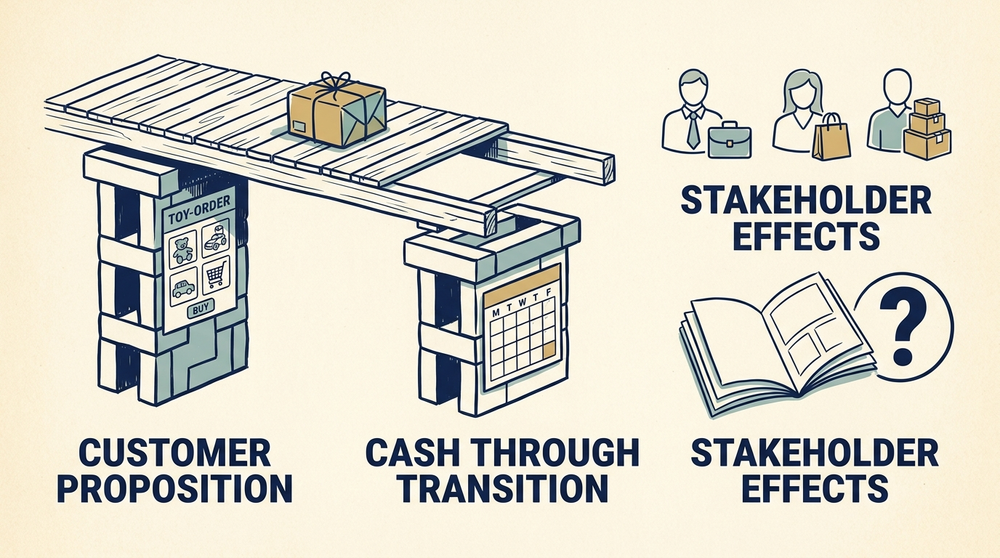

**Toys R Us**, the toy and baby-products retailer, illustrates the interaction of financing, competition, operating execution and the time needed for reinvention. The documents consulted describe technology gaps and proposed investment alongside severe financing and liquidity pressures. They show why a transition needed funding; they do not establish that the proposed work was sufficient to restore competitiveness, and the case does not establish a single cause of failure.

**Figure 1:** *A necessary product improvement still needs funding until its benefits arrive.*

The 2005 acquisition transferred ownership to the buyer group. The reviewed sources establish the agreement and completion, but they do not reconstruct every refinancing, distribution and fee across the ownership period. The financial evidence below comes from the last two years of that period.

The fiscal 2016 release, for the year ended January 28, 2017, shows why an unqualified word such as “profitable” misleads. Consolidated operating earnings were $460 million and adjusted EBITDA $792 million, but interest expense was $457 million, the consolidated net loss was $29 million, the net loss attributable to Toys “R” Us, Inc. was $36 million, and net cash used in operating activities was $1 million, before $252 million of **capital expenditure**, spending on assets. [S35: Toys R Us fiscal 2016 results](https://www.sec.gov/Archives/edgar/data/1005414/000100541417000010/truq4-16earningsreleaseexh.htm) Interest already reflected in operating cash flow must not be subtracted again. Positive operating earnings did not mean cash available for reinvention.

Technology work was underway. E-commerce sales grew 11% while total sales declined 2.2%. The chief executive's September 2017 court declaration describes a missing subscription-delivery capability and a proposed $90.4 million technology program for 2018–2021, beside roughly $400 million of annual cash debt service. These are management's explanations supporting the bankruptcy application, not court findings proving a complete causal account. [S50: Brandon declaration](https://profhayesuwla.com/wp-content/uploads/2017/09/toys-r-us-first-day-dec-chairman.pdf)

**Liquidity is the ability to meet payments when they fall due.** The declaration reports a chain: concern about survival led nearly 40% of suppliers to demand earlier payment; the same inventory then needed cash before it was sold; the immediate cash need rose, by management's estimate potentially by more than $1 billion; and less room remained to fund the transition. A product improvement expected to pay off over several years cannot meet an immediate inventory-funding need.

Reuters reported plans for US store **liquidation**, selling assets and winding down those operations, in March 2018, with roughly 33,000 jobs exposed. [S37: Reuters US liquidation report](https://www.business-standard.com/article/reuters/toys-r-us-to-close-doors-leaving-void-for-toy-lovers-118031500236_1.html) The case does not equate this with the disappearance of every international operation or later use of the brand. Hasbro's 2018 report separately records $60.4 million of costs associated with the bankruptcy, broadening the evidence beyond the retailer's account. [S51: Hasbro 2018 annual report](https://www.annualreports.com/HostedData/AnnualReportArchive/h/NYSE_HAS_2018.pdf)

**Transfer the funding question carefully.** A venture company awaiting another round or a product relying on a corporate allocation has different facts. Each leader still needs to establish whether existing obligations and the transition can be funded until benefits arrive: operating cash flow, its treatment of interest and working capital, then capital expenditure and payment dates, tested against a change in supplier terms. Distinguish a necessary product improvement from a sufficient rescue, and keep the consequences for employees and suppliers visible in the decision record.
