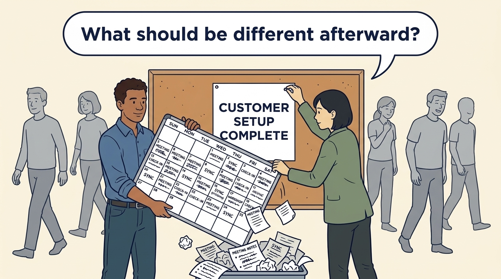
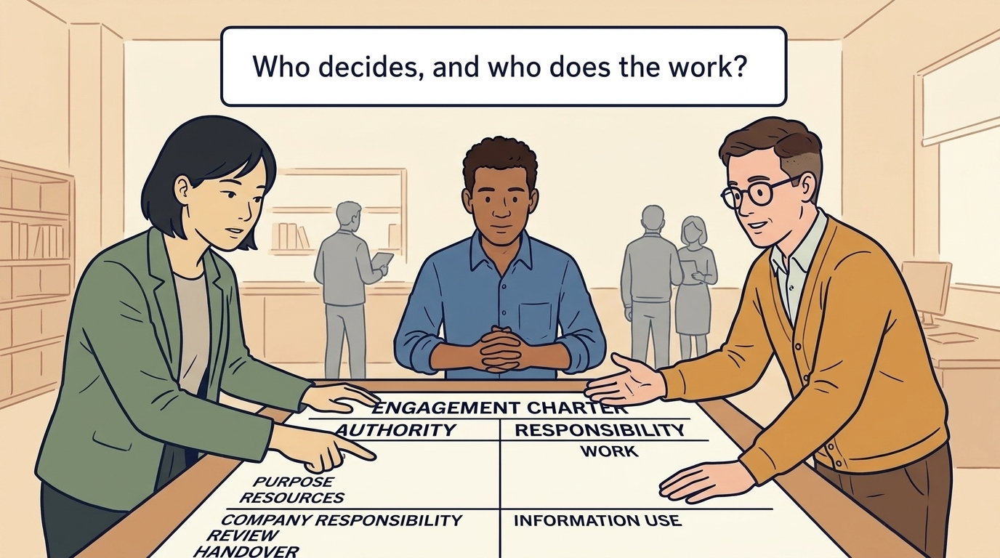
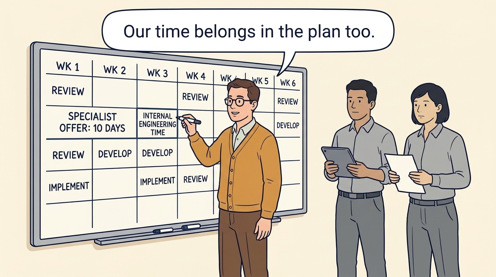
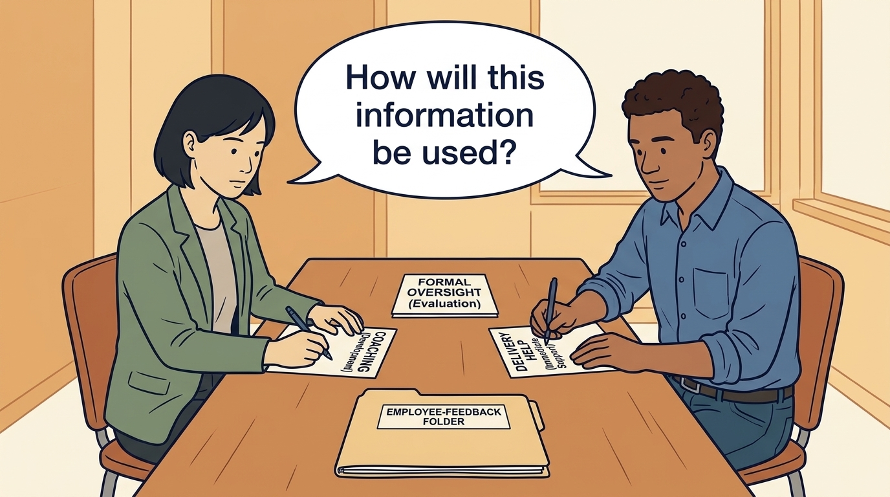
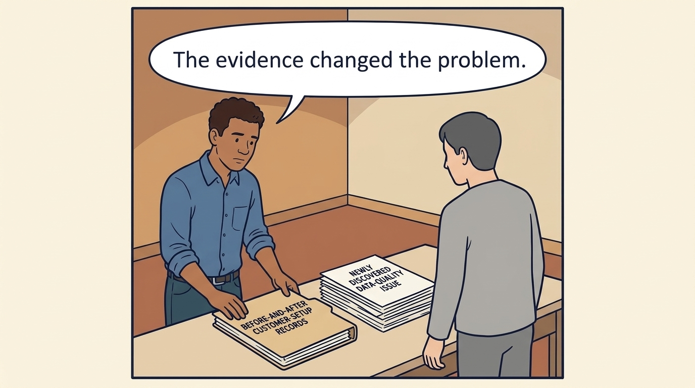
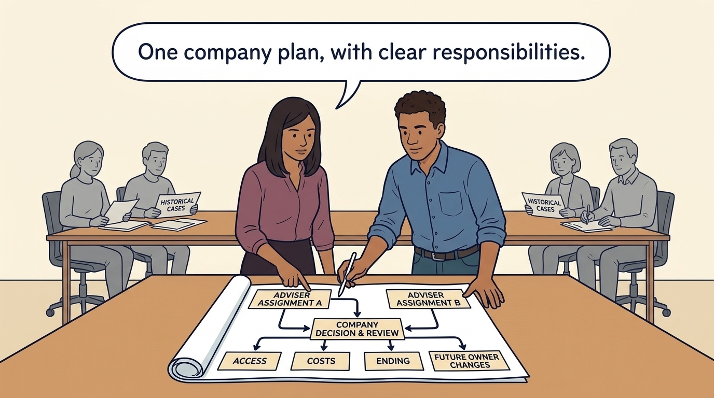

<!-- comic-style
{
  "cast": "MORGAN: a thoughtful investor technology adviser with short dark hair and a green jacket, used in the fund scenarios. ALEX: a practical CTO with curly hair and blue rolled-up sleeves. SAM: a CFO with round glasses and an amber cardigan. PRIYA: a product leader with straight dark hair and plum sleeves. INES: a CEO with short grey hair and a navy jacket. All are fictional; none represents a person in a real case.",
  "style": "Clean editorial explainer comic, dark ink outlines, restrained green, blue, and amber accents on warm white, generous space, readable short speech bubbles, expressive people and simple physical metaphors. No photorealism, logos, dense charts, or title text. Keep the same character appearances throughout the journal."
}
-->

**Comic.** A consultant the company hires answers to the company. A specialist sent by the investor answers partly to the owner, and engineers may not know whose instructions they are following. The panels show how an engagement charter keeps the help while keeping the decisions.

Morgan is an investor’s adviser in the fund scenarios; Alex leads technology, Priya leads product, and Sam leads finance. All are fictional. Comparative scenarios use separate assumptions. Historical cases are discussed through documents; the scenes do not reenact real events.

<!-- comic-panel
{
  "id": "01-scene",
  "status": "generated",
  "asset": "assets/images/30-useful-engagement/comic-01-scene.jpeg",
  "aspect_ratio": "16:9",
  "caption": "An engagement is an agreed piece of support. Name the decision or result it should improve before arranging the activity.",
  "alt": "Comic panel: Alex and Morgan replace a crowded meeting calendar with one card describing the customer-setup result.",
  "prompt": "Panel 1 of an explainer comic. Alex and Morgan replace a crowded meeting calendar with one card describing the customer-setup result. Use one speech bubble with the exact words: \"What should be different afterward?\" Convey: An engagement is an agreed piece of support. Name the decision or result it should improve before arranging the activity.",
  "generation": {
    "model": "gemini-3-pro-image-preview",
    "reference_id": "owned-cast-20260913",
    "sha256": "fd09aa6bdf887e13d72352e48cef0e6866b9fe86880f31327eb601ecb55ad454"
  }
}
-->

**Panel 1:** An engagement is an agreed piece of support. Name the decision or result it should improve before arranging the activity.

*Dialogue:* “What should be different afterward?”

<!-- comic-panel
{
  "id": "02-scene",
  "status": "generated",
  "asset": "assets/images/30-useful-engagement/comic-02-scene.jpeg",
  "aspect_ratio": "16:9",
  "caption": "A short engagement charter records purpose, resources, company responsibility, authority, information use, review and handover.",
  "alt": "Comic panel: Alex, Sam and Morgan examine one shared agreement with clearly separated responsibility fields.",
  "prompt": "Panel 2 of an explainer comic. Alex, Sam and Morgan examine one shared agreement with clearly separated responsibility fields. Use one speech bubble with the exact words: \"Who decides, and who does the work?\" Convey: A short engagement charter records purpose, resources, company responsibility, authority, information use, review and handover.",
  "generation": {
    "model": "gemini-3-pro-image-preview",
    "reference_id": "owned-cast-20260913",
    "sha256": "86894a0fabf55f6a420dda9ec45fcc2dc177c424f7a226597f609948faf2d0b1"
  }
}
-->

**Panel 2:** A short engagement charter records purpose, resources, company responsibility, authority, information use, review and handover.

*Dialogue:* “Who decides, and who does the work?”

<!-- comic-panel
{
  "id": "03-scene",
  "status": "generated",
  "asset": "assets/images/30-useful-engagement/comic-03-scene.jpeg",
  "aspect_ratio": "16:9",
  "caption": "External expertise still needs company capacity. The engagement must account for internal participation and implementation costs.",
  "alt": "Comic panel: Sam adds company engineer time beside the specialist’s ten-day offer on a six-week calendar.",
  "prompt": "Panel 3 of an explainer comic. Sam adds company engineer time beside the specialist’s ten-day offer on a six-week calendar. Use one speech bubble with the exact words: \"Our time belongs in the plan too.\" Convey: External expertise still needs company capacity. The engagement must account for internal participation and implementation costs.",
  "generation": {
    "model": "gemini-3-pro-image-preview",
    "reference_id": "owned-cast-20260913",
    "sha256": "e5000ec7aca74628fa556dfc585b45d481489a3e5520d6dd2be3ce05694a209d"
  }
}
-->

**Panel 3:** External expertise still needs company capacity. The engagement must account for internal participation and implementation costs.

*Dialogue:* “Our time belongs in the plan too.”

<!-- comic-panel
{
  "id": "04-scene",
  "status": "generated",
  "asset": "assets/images/30-useful-engagement/comic-04-scene.jpeg",
  "aspect_ratio": "16:9",
  "caption": "Coaching, delivery help and formal oversight use information for different purposes. Make those purposes and sharing boundaries understandable.",
  "alt": "Comic panel: Morgan and Alex label three distinct conversation cards before opening an employee-feedback folder.",
  "prompt": "Panel 4 of an explainer comic. Morgan and Alex label three distinct conversation cards before opening an employee-feedback folder. Use one speech bubble with the exact words: \"How will this information be used?\" Convey: Coaching, delivery help and formal oversight use information for different purposes. Make those purposes and sharing boundaries understandable.",
  "generation": {
    "model": "gemini-3-pro-image-preview",
    "reference_id": "owned-cast-20260913",
    "sha256": "3c34fa33abb4beb0a06df283778350f360c29b0050da03e5fa7e08407815d4a2"
  }
}
-->

**Panel 4:** Coaching, delivery help and formal oversight use information for different purposes. Make those purposes and sharing boundaries understandable.

*Dialogue:* “How will this information be used?”

<!-- comic-panel
{
  "id": "05-scene",
  "status": "generated",
  "asset": "assets/images/30-useful-engagement/comic-05-scene.jpeg",
  "aspect_ratio": "16:9",
  "caption": "A baseline records the starting situation. Compare outcomes and costs, and revise the engagement if the evidence points to a different problem.",
  "alt": "Comic panel: Alex places before-and-after customer-setup records beside a newly discovered data-quality issue.",
  "prompt": "Panel 5 of an explainer comic. Alex places before-and-after customer-setup records beside a newly discovered data-quality issue. Use one speech bubble with the exact words: \"The evidence changed the problem.\" Convey: A baseline records the starting situation. Compare outcomes and costs, and revise the engagement if the evidence points to a different problem.",
  "generation": {
    "model": "gemini-3-pro-image-preview",
    "reference_id": "owned-cast-20260913",
    "sha256": "1022aa47feca81a90d4968bd846990e4b78063bfb675fd2bc6f155dd81f544a6"
  }
}
-->

**Panel 5:** A baseline records the starting situation. Compare outcomes and costs, and revise the engagement if the evidence points to a different problem.

*Dialogue:* “The evidence changed the problem.”

<!-- comic-panel
{
  "id": "06-scene",
  "status": "generated",
  "asset": "assets/images/30-useful-engagement/comic-06-scene.jpeg",
  "aspect_ratio": "16:9",
  "caption": "Two investor advisers should work against one company question and accountable plan. Agree access, costs and an ending, including what changes under a future owner.",
  "alt": "Comic panel: Priya and Alex align two adviser assignments to one company decision and review date.",
  "prompt": "Panel 6 of an explainer comic. Priya and Alex align two adviser assignments to one company decision and review date. Use one speech bubble with the exact words: \"One company plan, with clear responsibilities.\" Convey: Two investor advisers should work against one company question and accountable plan. Agree access, costs and an ending, including what changes under a future owner.",
  "generation": {
    "model": "gemini-3-pro-image-preview",
    "reference_id": "owned-cast-20260913",
    "sha256": "d2132f3402f4bfeb62a449923319e1ebbacc5062df4752b80c862eb3b0b287e5"
  }
}
-->

**Panel 6:** Two investor advisers should work against one company question and accountable plan. Agree access, costs and an ending, including what changes under a future owner.

*Dialogue:* “One company plan, with clear responsibilities.”
