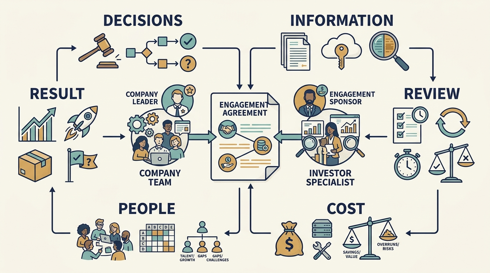

> **IN THIS SECTION, YOU WILL:** Learn to turn a request for help into a charter with resources, authority, evidence and a review date, then carry it through a scope change to a tested handover.

> **WHY INVESTORS CARE:** Investor specialists are scarce and shared across a portfolio; an engagement with a filled charter uses their days on the constraint that matters and leaves evidence the investor can act on.

> **WHY YOU SHOULD CARE:** Vague help produces repeated interviews, competing advice and no result; a filled charter is what lets the engagement change the work when the evidence changes.

> **KEY POINTS:**
>
> * Agree **what the help should change** and write it down: the result, the accountable company leader, the investor-side sponsor, resources on both sides, who directs the work, what information is for, the review date and the handover test.
> * **External help consumes internal time.** Ten specialist days, capped at €15,000, need six engineering days, two customer-team sessions and the product leader’s review; without those, the specialist’s availability doesn’t make the engagement feasible.
> * **Let the review change the work.** When evidence shows a different constraint, the charter says who may redirect the remaining days, which work stops and whether the budget still fits. The engagement ends with a capability, a decision or an understood continuing service.

 
An investor offers Larkspur a specialist to improve customer setup. Everyone welcomes the idea. Two weeks later the specialist has interviewed the same engineers three times, while the customer team still doesn’t know what will change or who is paying for implementation.

The offer named a person but left the work undefined. An **engagement** is an agreed piece of support with a purpose, participants and boundaries. An **engagement charter** is a short record of that agreement.

The specialist also reports to the investor. Before work starts, agree how that responsibility relates to the company’s priorities and who can direct the assignment. Company-sponsored work can suffer from conflicting executive sponsors and unclear authority too; the investor relationship adds a particular reporting line and the weight its suggestions carry. That is why the charter names who directs the work and what the specialist’s findings are for.

The input is the written request from [[help-that-changes-capability]]: “Help our customer team make one setup path repeatable, using a specialist who can work alongside our engineer for six weeks; Priya will assess customer outcomes.” This chapter completes the charter for that engagement, carries it through a scope change in engagement week three and ends at the week-six review. Two clocks run through it. Days count from closing, the board meeting that adopted the plan and committed €180,000 and 12 engineer-weeks to the onboarding pilot ONB-1; engagement weeks count from day 21, when the specialist starts. Each date below is given on both. The example is fictional and uses the figures from the shared Larkspur chain; the method is a proposal.

## Start From the Request

The request already says what the company needs to do differently: run one setup path without the implementation specialist. State whether the assignment should diagnose the problem, recommend options, implement a change or teach the company to do the work. This one implements and teaches: a diagnostic review would end with a decision, while an implementation needs resources to deliver and test the change.

Agree what is outside the assignment. Making one setup path repeatable doesn’t authorize a company-wide process redesign or an assessment of individual performance. If the useful scope changes, the charter says who agrees the new purpose and resources; it does not leave that to whoever is in the room.

## The Charter for the Onboarding Pilot Support

The fields are the same for any engagement; the entries are Larkspur’s.

| Field | Agreed for the ONB-1 pilot support |
| --- | --- |
| Company need | Onboarding depends on one specialist’s manual configuration (diligence finding D-3): about 80 hours per implementation in the sampled cases. The operating plan assumes 1.5× onboarding volume with the same implementation team. |
| Useful result | One standard setup path that a Larkspur engineer and the customer team can run without the implementation specialist, tested on new customers in the pilot cohort. |
| Accountable company leader | Priya, product leader. She directs the specialist’s day-to-day work and assesses customer outcomes. |
| Investor-side sponsor | The investment firm’s partner responsible for the Larkspur holding, who secures the specialist’s days and resolves availability problems. Morgan, the firm’s technology adviser, introduced the specialist and is not the sponsor. |
| Support and resources | Ten specialist days over six weeks, from day 21 to about day 63 after closing. Six days of one Larkspur engineer, one a week, released from portal research. Two customer-team sessions. Two hours a week of Priya’s time. |
| Funding | Specialist days charged to Larkspur at a capped €1,500 a day: ten days, €15,000 at most, paid from the ONB-1 budget (€180,000 committed) and counted inside the pilot’s spending, not added to it. Sam confirms the fit and that no reserve is touched. No implementation spending beyond the engineer’s time is assumed. |
| Authority | The specialist recommends. Priya decides what the path includes. Alex approves changes to product code. A change of scope needs Priya and the investor-side sponsor; a change of budget goes to the board; disagreement goes to Ines. |
| Information | Access to the pilot cohort’s customer records under Larkspur’s data obligations. Interviews are scheduled once, with the engineer present, and their purpose is stated. Findings go to Priya, Alex and the sponsor as pilot evidence, not as assessments of individuals. |
| Initial evidence | Baseline from actual customer records by day 20, the day before the specialist starts: hours per setup, customer waiting time, errors and support requests, reconstructed from the twelve implementations of the previous two quarters. |
| Scope boundary | One setup path, one country, the pilot cohort of new customers. No company-wide process redesign, no second path variant, no assessment of individual performance. |
| Review | Engagement week six, about day 63 after closing. Priya, Alex and the sponsor decide to end, extend or change the engagement on early cohort effort, customer waiting time and the handover test. The full cohort of eight is measured at day 90 and read at the day-100 board review. |
| Handover test | The Larkspur engineer and one customer-team member complete a new customer’s setup on the path with the specialist observing only. |

The **investor-side sponsor** is the person in the investment firm backing the engagement, who can secure the agreed support or resolve a resource problem. The **accountable company leader** stays responsible for the operating result unless the company makes a different formal assignment. Keeping the two labels apart lets a reader adapt the charter to a company sponsor or a corporate parent without guessing which is meant.

This is the agreement that would have prevented the repeated interviews. The specialist’s access is listed, the interviews have a stated purpose and an engineer in the room, and the customer team knows on day one what will change and who is paying. The [[toolkit]] provides a reusable version; its value comes from resolving these questions, not from completing every field.

**Figure 1:** *Make the practical conditions of the help concrete before the engagement consumes time.*

## Give the Company Time to Use the Help

**External expertise consumes internal time.** People need to explain the situation, provide evidence, review options and take responsibility for what changes. The six engineer-days in the charter come from somewhere: Alex takes them from the customer-portal research, which the first-hundred-days plan had already limited to research. If those days can’t be found, the specialist’s availability doesn’t make the engagement feasible.

Agree specialist fees and implementation funding separately where they differ. “The specialist is included” doesn’t establish who pays for a supplier, new software or the company’s additional work. Larkspur’s charter charges the days to the company so that the cost is visible against the pilot budget and comparable with the independent-specialist fallback. The costs are the fictional caps from the sourcing comparison in [[help-that-changes-capability]], repeated here so the charter can be checked against the choice:

| Route | Fictional cost | Charged to | Company effort |
| --- | --- | --- | --- |
| Peer conversation | None beyond time | — | Half a day of preparation |
| Investor’s specialist | Capped at €1,500 a day; ten days = €15,000 at most | ONB-1 (€180,000 committed); sits inside the roughly €90,000 the pilot incurs by day 100 | Six engineer-days (about €3,600 of existing payroll at €75 an hour: capacity, not cash) and two customer-team sessions |
| Independent specialist | Day rate unverified until references are checked; compared at the same cap, €15,000 for ten days, plus selection time | ONB-1 | The same, plus selection |
| Permanent implementation specialist | About €150,000 a year recurring per specialist, on the cost basis in [[roadmap-to-revenue]]; the diligence response costed two such hires at €300,000 a year | The operating budget, not ONB-1 | Onboarding and management |

The fee is the smaller number. Six engineer-days and two customer sessions are the part the company can fail to provide, and the €180,000 pilot they sit inside is what the fee must not quietly grow.

A smaller assignment can be sensible if it produces a usable result. Cutting the days without changing the promised outcome makes the agreement less credible, not cheaper.

## Week Three: the Evidence Changes the Problem

The baseline arrives at day 20 as agreed, the day before the specialist starts. Reconstructed from the specialist’s time records for the twelve implementations of the previous two quarters, it already shows the configuration step at under half of the 80 hours, with data cleaning the largest remaining share. The charter keeps the setup step as its target because that split is a reconstruction, not an observation. By engagement week three, about day 40 after closing, the engineer’s log of the first cohort setups on the new path confirms it in live work: configuration takes less than half the hours, and a large share of the rest is spent before it, cleaning and reconciling the customer’s records so that configuration can start. For customers with imperfect data, data quality, not the setup step, decides when a setup completes. Alex’s explanation in the diligence disagreement is gaining support; the pilot cohort was chosen to test it.

Continuing to template the setup step would preserve the assignment while missing the constraint on customer waiting time. The charter says who may change that.

**Who changes the scope.** Priya proposes the change, the investor-side sponsor agrees it, and Alex confirms the engineering effort. The board isn’t involved because the budget doesn’t move.

**Which work stops.** The specialist’s remaining five days were planned for templating the less common customer types in the cohort and a second session coaching the team on template use. Both stop. The days go to defining a data-intake check the customer team runs before setup begins, and the engineer’s remaining days go to a validation for the three most common data defects. The second customer-team session now covers the intake check.

**Whether the budget still fits.** Ten specialist days and six engineer-days, unchanged; the €15,000 cap and the €180,000 ONB-1 commitment unchanged; no additional cash; the week-six review, about day 63, stands.

**Alternatives rejected.** Continuing as chartered, because it would leave waiting time unchanged. Extending by four weeks and eight specialist days to build a full data-quality step, because there is no evidence yet that the intake check works and the extension would need the board’s reserve. Stopping and hiring, because the board deferred hiring until the pilot reports.

**Evidence that would change it.** If the intake check shows that data defects are concentrated in a few customers rather than spread across the cohort, the remaining days go back to the setup templates. A funded data-quality step is a board decision for the day-100 review, taken on the effort split Priya measures across the full cohort at day 90 ([[first-hundred-days]]).

## Keep the Assignment Inside the Company’s Plan

Three boundaries from earlier chapters apply to this charter: who directs the work, what the specialist’s information is for, and what the measurements can show.

**Governance.** Direct access to engineers helps during diligence or a scoped assignment. It becomes destructive when engineers receive competing priorities from the specialist, the CTO and the investment team, because a parallel reporting line then exists without a mandate. The charter’s governance purpose is to name the accountable company leader, the specialist’s role and the decision boundaries, and to say who revisits them if the role changes. Two helpful relationships, such as advisers from two investors, shouldn’t create two operating backlogs; define the company’s question once. Where the company can’t end a required group service, record the authority and use the agreed route for performance, cost or access problems. The decision map is in [[decide-who-decides]].

**Role and information use.** The specialist interviews engineers and sees customer records. The charter says those conversations are pilot evidence, not assessments of anyone. At Larkspur, the charter records that any view of the engineering team the investment firm wants is a separate request, announced by the company; that is the agreed local arrangement, not a rule every investor is bound by, and the firm’s existing reporting and information rights under the investment agreement still apply. [[investors-adviser]] sets out how to read those rights. People explain weaknesses more clearly when they know what the conversation is for.

**Measurement.** Fewer hours per setup is effort released, not cash saved; the implementation specialist’s payroll doesn’t change. The pilot cohort is eight customers in one country, so its result doesn’t establish the effect across all customer types, and an observed improvement doesn’t isolate the specialist’s contribution from the engineer’s work or from simpler contracts in the cohort. The charter therefore records waiting time and errors alongside hours, and the day-100 board review reads the day-90 cohort against the baseline rather than against the plan’s assumption. The reasoning is in [[roadmap-to-revenue]].

## Week Six: Review, Then Leave a Capability, a Decision or an Understood Service

At the review, in engagement week six and about day 63 after closing, Priya, Alex and the sponsor look at three things. The handover test: the Larkspur engineer and a customer-team member complete two new customers’ setups on the path with the specialist observing only. Two setups show that this path can be handed over; they say nothing about the less common customer types or about queue time. The intake check: the customer team is running it on new contracts, and the validation catches the three targeted defects. The measures: hours per setup on the first cohort customers are falling, and customer waiting time hasn’t yet moved; the full cohort of eight is measured at day 90 and read at the day-100 board review.

The decision: the engagement ends on schedule. No continuing specialist service is needed for the setup path, because the company can now run it. The data-quality finding goes to the day-100 board review as evidence for a funded data-quality step, with hiring still deferred. All ten specialist days are used and invoiced at €15,000, within the agreed cap; the €180,000 ONB-1 commitment is unchanged, and the fee sits inside the roughly €90,000 the pilot incurs by day 100. The budget is intact in that sense, and the board has a better decision to make than the one the plan assumed.

The calendar the two chapters share, with days counted from closing:

| Day | Event |
| --- | --- |
| 0 | Board adopts the plan; ONB-1 committed: €180,000 and 12 engineer-weeks |
| About 7 | Priya and Alex compare the four routes; Priya writes the request ([[help-that-changes-capability]]) |
| By 14 | Peer conversation |
| 20 | Baseline measured from actual records: the twelve implementations of the previous two quarters, about 80 hours each |
| 21 | Specialist starts; engagement week one |
| About 40 | Engagement week three: scope change, no cash change |
| About 63 | Engagement week six: review, handover test, engagement ends |
| 90 | Priya measures the cohort of eight |
| 100 | Board review reads the cohort; about €90,000 of ONB-1’s €180,000 incurred, the €15,000 among it |

A **handover** transfers the knowledge and responsibilities needed to continue the work: remaining tasks, operating costs, evidence gathered and conditions that need future review. Test it through an actual use of the result, as the charter did, rather than through a presentation.

Not every engagement ends this way, and it doesn’t need to. Three outcomes are legitimate. A **capability** the company can now run itself. A **decision** the company can now make better, which may be that the original assignment was aimed at the wrong constraint. Or an **understood continuing service**, where scarce specialist help is kept on purpose, with its cost, availability and responsibilities agreed. What no engagement should leave is a critical dependency that nobody planned to fund.

**Figure 2:** *Agree what remains useful after the initial assignment and who will sustain it.*

Part IV has shown how to understand the adviser, find the help you need and agree a useful engagement. The finding this engagement worked on came from investor diligence before the deal closed. Part V starts there: how a diligence finding becomes a company decision, how it is funded in the first hundred days and what happens when the financing or the owner changes: [[part-5]] and [[diligence-corrects-the-plan]].

## Questions to Consider

1. *For the support engagement closest to you, can you fill in the charter’s twelve fields, including the investor-side sponsor and the accountable company leader, without guessing?*
2. *Where do the internal days come from, and what work has been stopped to release them?*
3. *If the first evidence showed a different constraint, who could redirect the remaining days, and would the budget still fit?*
4. *At the last review you held, did the engagement end with a demonstrated capability, a changed decision or a continuing service someone agreed to fund?*

## To Probe Further

- **[Consulting Is More Than Giving Advice](https://hbr.org/1982/09/consulting-is-more-than-giving-advice)** — Arthur N. Turner, Harvard Business Review, 1982. *Its eight purposes of a consulting assignment are the shortest way to sharpen the post's choice between diagnosing, recommending, implementing and teaching.*
- **[Flawless Consulting: A Guide to Getting Your Expertise Used](https://www.wiley.com/en-us/Flawless+Consulting:+A+Guide+to+Getting+Your+Expertise+Used,+4th+Edition-p-9781394177301)** — Peter Block, Wiley, 4th edition, 2023. *Its contracting chapters show what a competent adviser expects to agree before starting, which is the post's engagement charter of wants, roles, deliverables and success criteria seen from the specialist's side.*
- **[Helping: How to Offer, Give, and Receive Help](https://books.google.com/books/about/Helping.html?id=uqin8fGXfJIC)** — Edgar H. Schein, Berrett-Koehler, 2009. *It explains why offered help fails when nobody has said what kind of help is wanted, the gap the post's engagement charter is meant to close.*
- **[The Secrets of Consulting: A Guide to Giving and Getting Advice Successfully](https://www.dorsethouse.com/books/soc.html)** — Gerald M. Weinberg, Dorset House, 1985. *Its rules on why advice is resisted and when to stop bear directly on the post's review step and on changing or ending help that does not fit.*
