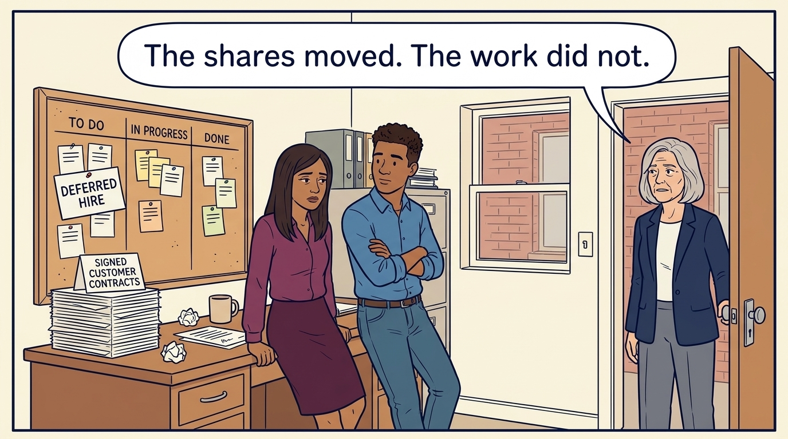
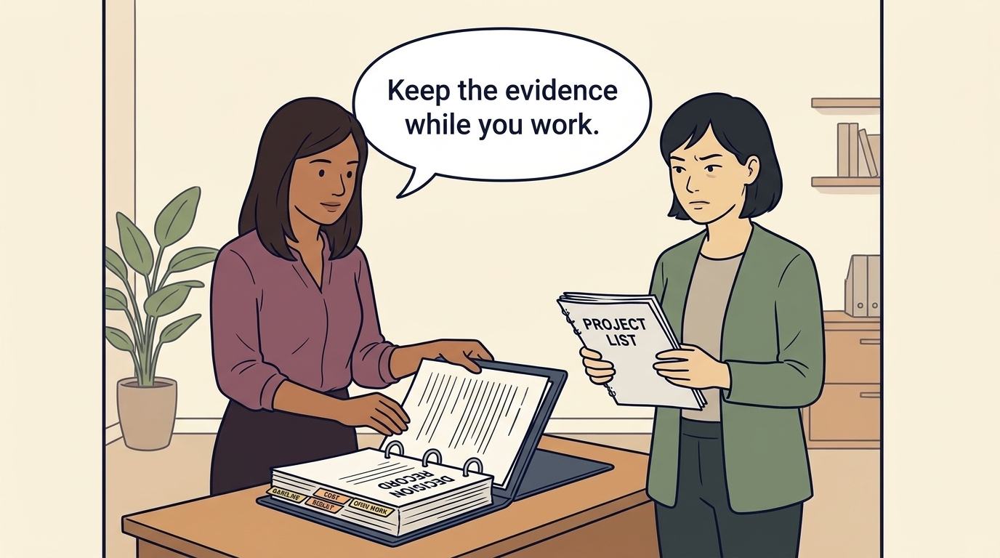
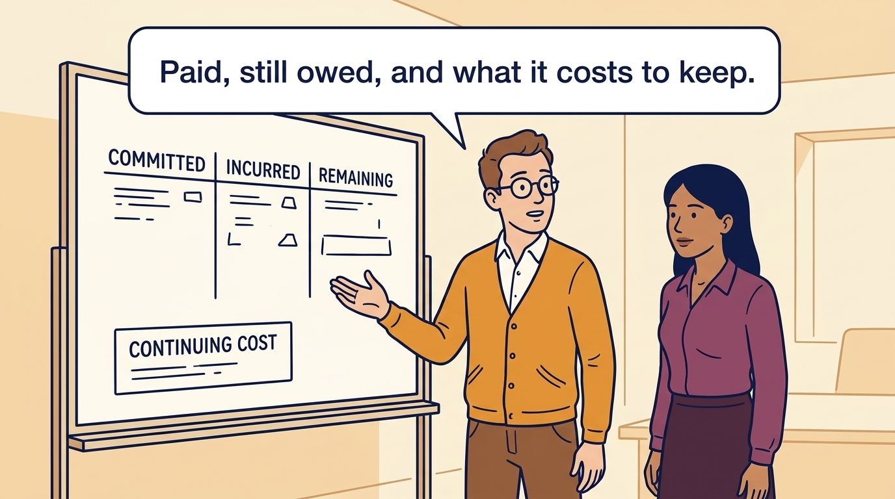
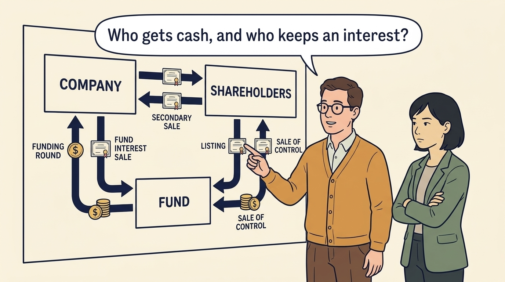
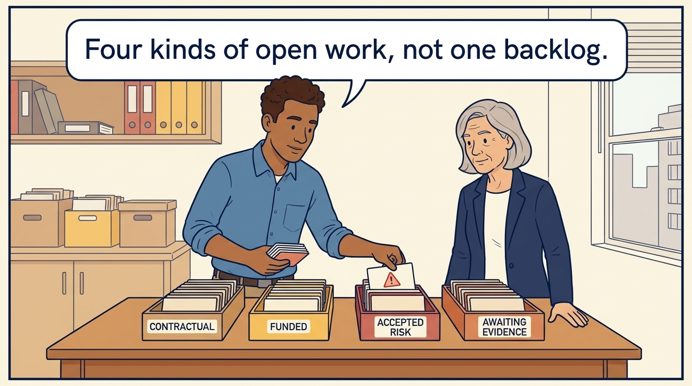
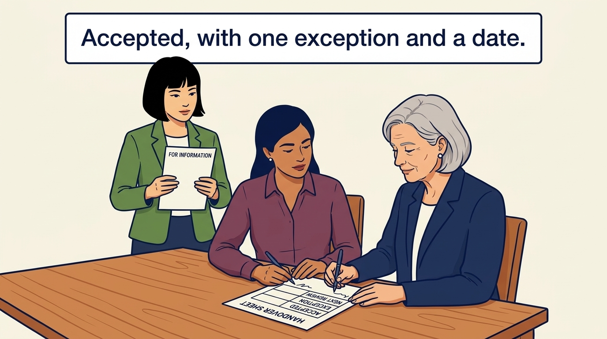

<!-- comic-style
{
  "cast": "MORGAN: a thoughtful investor technology adviser with short dark hair and a green jacket, used in the fund scenarios. ALEX: a practical CTO with curly hair and blue rolled-up sleeves. SAM: a CFO with round glasses and an amber cardigan. PRIYA: a product leader with straight dark hair and plum sleeves. INES: a CEO with short grey hair and a navy jacket. All are fictional; none represents a person in a real case.",
  "style": "Clean editorial explainer comic, dark ink outlines, restrained green, blue, and amber accents on warm white, generous space, readable short speech bubbles, expressive people and simple physical metaphors. No photorealism, logos, dense charts, or title text. Keep the same character appearances throughout the journal."
}
-->

**Comic.** The morning after an ownership event, the customer contracts, the half-finished migration and the deferred hire are still there. The panels follow the fictional Larkspur record from the day-100 review into a handover: keep the evidence during the work, separate what has been paid from what is still owed, follow who receives cash and who keeps an interest, sort the open obligations by kind, and get the handover accepted by a named receiver.

Morgan is an investor’s adviser in the fund scenarios; Alex leads technology, Priya leads product, Sam leads finance and Ines is the CEO. All are fictional, and every figure belongs to the shared Larkspur chain that runs from diligence through the first hundred days to this handover. Historical cases are discussed through documents; the scenes do not reenact real events.

<!-- comic-panel
{
  "id": "01-scene",
  "status": "generated",
  "asset": "assets/images/31-handover-of-obligations/comic-01-scene.jpeg",
  "aspect_ratio": "16:9",
  "prompt": "Panel 1 of an explainer comic. Priya and Alex stand in an office the morning after a transaction; on the desk lie a stack of signed customer contracts, a half-assembled migration board with some cards moved and some not, and a pinned card marked DEFERRED HIRE; Ines looks in from the doorway. Use one speech bubble with the exact words: \"The shares moved. The work did not.\" Convey: A round adds an investor, a secondary sale gives one shareholder liquidity, a continuation transaction moves the holding to a new vehicle, a sale of control changes who holds authority over the plan. None of these events changes the work. The customer contracts, the recovery requirement, the half-finished migration and the deferred hire are still there.",
  "alt": "Comic panel: Priya and Alex look at customer contracts, a half-finished migration board and a deferred-hire card the morning after a transaction, while Ines watches from the doorway.",
  "caption": "A round adds an investor, a secondary sale gives one shareholder liquidity, a continuation transaction moves the holding to a new vehicle, a sale of control changes who holds authority over the plan. None of these events changes the work. The customer contracts, the recovery requirement, the half-finished migration and the deferred hire are still there.",
  "generation": {
    "model": "gemini-3-pro-image-preview",
    "reference_id": "owned-cast-20260913",
    "sha256": "c3ce3406e0e04d48e6cd1afacf993fb2d5403d887b95f1e11a949fee67566083"
  }
}
-->

**Panel 1:** A round adds an investor, a secondary sale gives one shareholder liquidity, a continuation transaction moves the holding to a new vehicle, a sale of control changes who holds authority over the plan. None of these events changes the work. The customer contracts, the recovery requirement, the half-finished migration and the deferred hire are still there.

*Dialogue:* “The shares moved. The work did not.”

<!-- comic-panel
{
  "id": "02-scene",
  "status": "generated",
  "asset": "assets/images/31-handover-of-obligations/comic-02-scene.jpeg",
  "aspect_ratio": "16:9",
  "prompt": "Panel 2 of an explainer comic. Priya adds a page to a thick, well-kept binder labeled DECISION RECORD whose tabs read BASELINE, COST, RESULT and OPEN WORK, while Morgan holds a thin, hastily stapled booklet labeled PROJECT LIST and looks unconvinced. Use one speech bubble with the exact words: \"Keep the evidence while you work.\" Convey: If the decision and outcome record has been kept throughout ownership, a buyer, a new investor or a continuing board can examine what was believed, what changed, what was invested and what remains. A retrospective story assembled under time pressure is exactly what a careful counterparty discounts.",
  "alt": "Comic panel: Priya files a page in a thick decision-record binder with baseline, cost, result and open-work tabs while Morgan holds a thin project list.",
  "caption": "If the decision and outcome record has been kept throughout ownership, a buyer, a new investor or a continuing board can examine what was believed, what changed, what was invested and what remains. A retrospective story assembled under time pressure is exactly what a careful counterparty discounts.",
  "generation": {
    "model": "gemini-3-pro-image-preview",
    "reference_id": "owned-cast-20260913",
    "sha256": "48a49210c249d2fe20f7b5d923faacaaccbb30f962fa87eb8b1eac6a552a1794"
  }
}
-->

**Panel 2:** If the decision and outcome record has been kept throughout ownership, a buyer, a new investor or a continuing board can examine what was believed, what changed, what was invested and what remains. A retrospective story assembled under time pressure is exactly what a careful counterparty discounts.

*Dialogue:* “Keep the evidence while you work.”

<!-- comic-panel
{
  "id": "03-scene",
  "status": "generated",
  "asset": "assets/images/31-handover-of-obligations/comic-03-scene.jpeg",
  "aspect_ratio": "16:9",
  "prompt": "Panel 3 of an explainer comic. Sam and Priya stand at a whiteboard showing one initiative as three separate labeled columns, COMMITTED, INCURRED and REMAINING, with a smaller box below labeled CONTINUING COST; no numbers appear on the board. Use one speech bubble with the exact words: \"Paid, still owed, and what it costs to keep.\" Convey: The onboarding pilot's entry separates the committed cash, the cost incurred by day 100, the remaining commitment payable over the next two quarters and the continuing maintenance cost, next to the observed result and the funded open work. The receiving side can see that the pilot worked partly, why, what has been paid, what is still owed and what was deferred rather than solved.",
  "alt": "Comic panel: Sam and Priya at a whiteboard that splits one initiative into committed, incurred and remaining columns with a continuing-cost box.",
  "caption": "The onboarding pilot's entry separates the committed cash, the cost incurred by day 100, the remaining commitment payable over the next two quarters and the continuing maintenance cost, next to the observed result and the funded open work. The receiving side can see that the pilot worked partly, why, what has been paid, what is still owed and what was deferred rather than solved.",
  "generation": {
    "model": "gemini-3-pro-image-preview",
    "reference_id": "owned-cast-20260913",
    "sha256": "023ee4543a4a8a78feccdcd24de810954877f14e826f75e3bba237896f2031f8"
  }
}
-->

**Panel 3:** The onboarding pilot's entry separates the committed cash, the cost incurred by day 100, the remaining commitment payable over the next two quarters and the continuing maintenance cost, next to the observed result and the funded open work. The receiving side can see that the pilot worked partly, why, what has been paid, what is still owed and what was deferred rather than solved.

*Dialogue:* “Paid, still owed, and what it costs to keep.”

<!-- comic-panel
{
  "id": "04-scene",
  "status": "generated",
  "asset": "assets/images/31-handover-of-obligations/comic-04-scene.jpeg",
  "aspect_ratio": "16:9",
  "prompt": "Panel 4 of an explainer comic. Morgan and Sam study a large diagram of arrows between three plain boxes labeled COMPANY, SHAREHOLDERS and FUND, with coin symbols flowing along some arrows and a small share certificate icon staying in place on others. Use one speech bubble with the exact words: \"Who gets cash, and who keeps an interest?\" Convey: A funding round, a secondary sale of company shares, a sale of a fund interest, a continuation transaction, a listing and a sale of control move money and authority differently. For each form, establish who receives cash, who keeps an interest and what the company itself receives, and do not read a fund's realized result off a transaction announcement.",
  "alt": "Comic panel: Morgan and Sam trace arrows of cash and retained interests between boxes labeled company, shareholders and fund.",
  "caption": "A funding round, a secondary sale of company shares, a sale of a fund interest, a continuation transaction, a listing and a sale of control move money and authority differently. For each form, establish who receives cash, who keeps an interest and what the company itself receives, and do not read a fund's realized result off a transaction announcement.",
  "generation": {
    "model": "gemini-3-pro-image-preview",
    "reference_id": "owned-cast-20260913",
    "sha256": "5bd212f70243755832217a1758a1c56fc5e18fa9b11e4e4584e3bf4d49d333dc"
  }
}
-->

**Panel 4:** A funding round, a secondary sale of company shares, a sale of a fund interest, a continuation transaction, a listing and a sale of control move money and authority differently. For each form, establish who receives cash, who keeps an interest and what the company itself receives, and do not read a fund's realized result off a transaction announcement.

*Dialogue:* “Who gets cash, and who keeps an interest?”

<!-- comic-panel
{
  "id": "05-scene",
  "status": "generated",
  "asset": "assets/images/31-handover-of-obligations/comic-05-scene.jpeg",
  "aspect_ratio": "16:9",
  "prompt": "Panel 5 of an explainer comic. Alex sorts cards into four labeled trays on a table, CONTRACTUAL, FUNDED, ACCEPTED RISK and AWAITING EVIDENCE, while Ines watches; one card marked with a small warning triangle goes into the accepted-risk tray. Use one speech bubble with the exact words: \"Four kinds of open work, not one backlog.\" Convey: Obligations do not close at the transaction, but they are not all of one kind. Contractual obligations are owed whoever owns the company; funded work is authorized but not built; accepted risks are known exposures someone authorized decided to carry; options awaiting evidence carry only a decision date. Only the first kind is a debt; the others travel as decisions with reasons.",
  "alt": "Comic panel: Alex sorts cards into four trays labeled contractual, funded, accepted risk and awaiting evidence while Ines watches.",
  "caption": "Obligations do not close at the transaction, but they are not all of one kind. Contractual obligations are owed whoever owns the company; funded work is authorized but not built; accepted risks are known exposures someone authorized decided to carry; options awaiting evidence carry only a decision date. Only the first kind is a debt; the others travel as decisions with reasons.",
  "generation": {
    "model": "gemini-3-pro-image-preview",
    "reference_id": "owned-cast-20260913",
    "sha256": "14d235965a017c8b89ec398f84c7f1d3e893c93a5dec0550a6a7aefa412ebb1a"
  }
}
-->

**Panel 5:** Obligations do not close at the transaction, but they are not all of one kind. Contractual obligations are owed whoever owns the company; funded work is authorized but not built; accepted risks are known exposures someone authorized decided to carry; options awaiting evidence carry only a decision date. Only the first kind is a debt; the others travel as decisions with reasons.

*Dialogue:* “Four kinds of open work, not one backlog.”

<!-- comic-panel
{
  "id": "06-scene",
  "status": "generated",
  "asset": "assets/images/31-handover-of-obligations/comic-06-scene.jpeg",
  "aspect_ratio": "16:9",
  "prompt": "Panel 6 of an explainer comic. Ines and Priya sign a single handover sheet at a table, the sheet showing three plain rows labeled ACCEPTED, EXCEPTION and NEXT REVIEW, while Morgan, standing behind as the new board member, holds a copy marked FOR INFORMATION. Use one speech bubble with the exact words: \"Accepted, with one exception and a date.\" Convey: A handover is accepted, not merely sent. A named receiver with authority signs for each obligation, the accountable leader on the receiving side is recorded, one exception, the maintenance cost against a budget the new board has not yet adopted, stays open, and the next review date is fixed. Without the exception and the date it would be a receipt for a document; with them it is a decision about who owes what, and when it is looked at again.",
  "alt": "Comic panel: Ines and Priya sign a handover sheet with accepted, exception and next-review rows while Morgan holds a copy marked for information.",
  "caption": "A handover is accepted, not merely sent. A named receiver with authority signs for each obligation, the accountable leader on the receiving side is recorded, one exception, the maintenance cost against a budget the new board has not yet adopted, stays open, and the next review date is fixed. Without the exception and the date it would be a receipt for a document; with them it is a decision about who owes what, and when it is looked at again.",
  "generation": {
    "model": "gemini-3-pro-image-preview",
    "reference_id": "owned-cast-20260913",
    "sha256": "99bf3004743aa7d13eaaa64bb0836bd8c3633631136b157608bac49411ac90da"
  }
}
-->

**Panel 6:** A handover is accepted, not merely sent. A named receiver with authority signs for each obligation, the accountable leader on the receiving side is recorded, one exception, the maintenance cost against a budget the new board has not yet adopted, stays open, and the next review date is fixed. Without the exception and the date it would be a receipt for a document; with them it is a decision about who owes what, and when it is looked at again.

*Dialogue:* “Accepted, with one exception and a date.”
