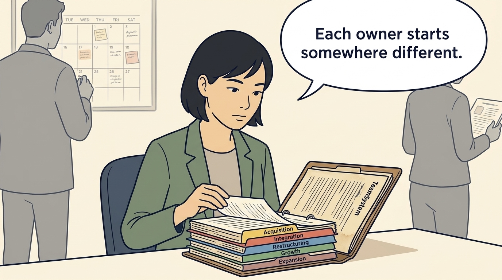
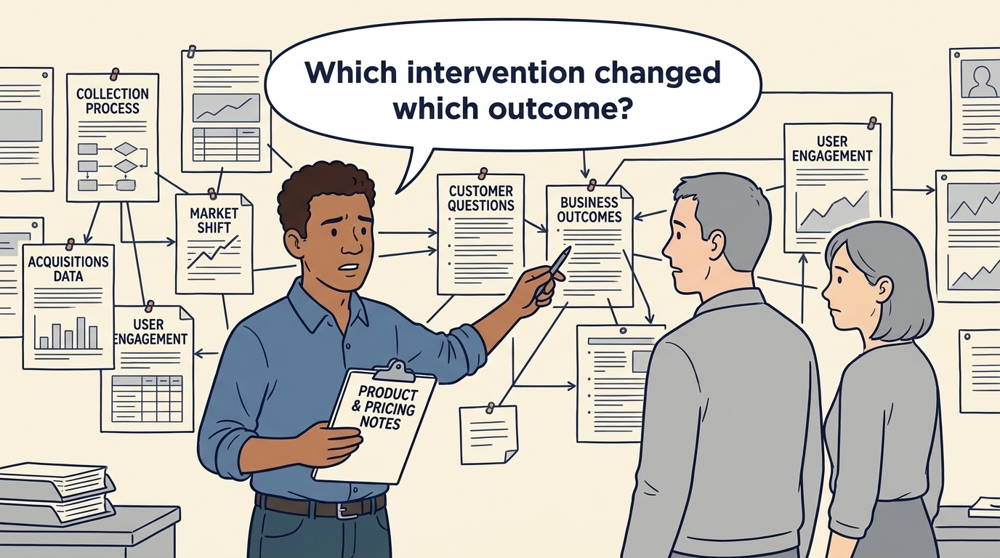
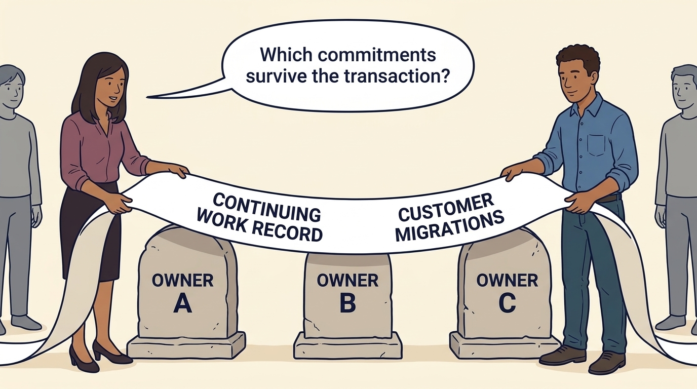

<!-- comic-style
{
  "cast": "MORGAN: a thoughtful investor technology adviser with short dark hair and a green jacket, used in the fund scenarios. ALEX: a practical CTO with curly hair and blue rolled-up sleeves. SAM: a CFO with round glasses and an amber cardigan. PRIYA: a product leader with straight dark hair and plum sleeves. INES: a CEO with short grey hair and a navy jacket. All are fictional; none represents a person in a real case.",
  "style": "Clean editorial explainer comic, dark ink outlines, restrained green, blue, and amber accents on warm white, generous space, readable short speech bubbles, expressive people and simple physical metaphors. No photorealism, logos, dense charts, or title text. Keep the same character appearances throughout the journal."
}
-->

**Comic.** Each change of owner creates a new financial starting point for the buyer, while the company’s product work carries on: **customer migrations** (moving customers and their data from an older product to a newer one), **integration work** (making acquired products, systems and teams work together) and dependencies on particular systems and people remain somebody’s responsibility. The panels follow what TeamSystem’s reported results show each new owner inheriting.

Morgan is an investor’s adviser in the fund scenarios; Alex leads technology, Priya leads product, and Sam leads finance. All are fictional. Comparative scenarios use separate assumptions. Historical cases are discussed through documents; the scenes do not reenact real events.

<!-- comic-panel
{
  "id": "01-scene",
  "status": "generated",
  "asset": "assets/images/29-teamsystem/comic-01-scene.jpeg",
  "aspect_ratio": "16:9",
  "prompt": "Panel 1 of an explainer comic. Morgan reads a historical TeamSystem file with successive ownership folders. Use one speech bubble with the exact words: \"Each owner starts somewhere different.\" Convey: TeamSystem is a business-software group that was bought and sold several times by investment firms. This case follows selected evidence from 2000 through 2017 across distinct ownership episodes; each owner starts at a new price while the company’s work continues.",
  "alt": "Comic panel: Morgan reads a historical TeamSystem file with successive ownership folders.",
  "caption": "TeamSystem is a business-software group that was bought and sold several times by investment firms. This case follows selected evidence from 2000 through 2017 across distinct ownership episodes; each owner starts at a new price while the company’s work continues.",
  "generation": {
    "model": "gemini-3-pro-image-preview",
    "reference_id": "owned-cast-20260913",
    "sha256": "da21b4569c4760c323498f43a0628506787a16f4a9a8c5b6b91e7c3b107fcf34"
  }
}
-->

**Panel 1:** TeamSystem is a business-software group that was bought and sold several times by investment firms. This case follows selected evidence from 2000 through 2017 across distinct ownership episodes; each owner starts at a new price while the company’s work continues.

*Dialogue:* “Each owner starts somewhere different.”

<!-- comic-panel
{
  "id": "02-scene",
  "status": "generated",
  "asset": "assets/images/29-teamsystem/comic-02-scene.jpeg",
  "aspect_ratio": "16:9",
  "prompt": "Panel 2 of an explainer comic. Alex follows product, pricing and collection notes toward different customer and business questions. Use one speech bubble with the exact words: \"Which intervention changed which outcome?\" Convey: Changing the products, changing prices, collecting unpaid customer bills faster and buying other businesses can each affect different results. A project the owner reports does not establish how much it contributed.",
  "alt": "Comic panel: Alex follows product, pricing and collection notes toward different customer and business questions.",
  "caption": "Changing the products, changing prices, collecting unpaid customer bills faster and buying other businesses can each affect different results. A project the owner reports does not establish how much it contributed.",
  "generation": {
    "model": "gemini-3-pro-image-preview",
    "reference_id": "owned-cast-20260913",
    "sha256": "88c9b5aa93098edb72775ff170232497815d865e9bffe8bf76b82e1fbc5fb649"
  }
}
-->

**Panel 2:** Changing the products, changing prices, collecting unpaid customer bills faster and buying other businesses can each affect different results. A project the owner reports does not establish how much it contributed.

*Dialogue:* “Which intervention changed which outcome?”

<!-- comic-panel
{
  "id": "03-scene",
  "status": "generated",
  "asset": "assets/images/29-teamsystem/comic-03-scene.jpeg",
  "aspect_ratio": "16:9",
  "prompt": "Panel 3 of an explainer comic. Sam separates received cash from a retained ownership certificate. Use one speech bubble with the exact words: \"This part remains invested.\" Convey: A partial exit sells part of an investment and keeps the rest. Money received and the estimated value of the part still held stay separate. A later agreed sale price, or the proceeds a seller reports before fees and other deductions, is still not the cash an investor finally receives.",
  "alt": "Comic panel: Sam separates received cash from a retained ownership certificate.",
  "caption": "A partial exit sells part of an investment and keeps the rest. Money received and the estimated value of the part still held stay separate. A later agreed sale price, or the proceeds a seller reports before fees and other deductions, is still not the cash an investor finally receives.",
  "generation": {
    "model": "gemini-3-pro-image-preview",
    "reference_id": "owned-cast-20260913",
    "sha256": "aca17a6546b1f3a783339bce9e806a73cf9a0e30dd5202faa875c3ee6edbe852"
  }
}
-->

**Panel 3:** A partial exit sells part of an investment and keeps the rest. Money received and the estimated value of the part still held stay separate. A later agreed sale price, or the proceeds a seller reports before fees and other deductions, is still not the cash an investor finally receives.

*Dialogue:* “This part remains invested.”

<!-- comic-panel
{
  "id": "04-scene",
  "status": "generated",
  "asset": "assets/images/29-teamsystem/comic-04-scene.jpeg",
  "aspect_ratio": "16:9",
  "prompt": "Panel 4 of an explainer comic. Sam aligns a short accounting calendar with a constructed full-year comparison. Use one speech bubble with the exact words: \"Are these periods comparable?\" Convey: Compare the same businesses over equivalent periods. TeamSystem changed hands in March 2016, so its 2016 accounts covered only March to December; set against the full 2017 year, revenue looked 37.7% higher. Against a 2016 reconstructed as a full year, which also counts the businesses bought during 2016 from January, the rise was 8.9%, and even that includes businesses newly bought in 2017, so it is not growth of the existing business alone.",
  "alt": "Comic panel: Sam compares short-period and full-year calendar grids in a report.",
  "caption": "Compare the same businesses over equivalent periods. TeamSystem changed hands in March 2016, so its 2016 accounts covered only March to December; set against the full 2017 year, revenue looked 37.7% higher. Against a 2016 reconstructed as a full year, which also counts the businesses bought during 2016 from January, the rise was 8.9%, and even that includes businesses newly bought in 2017, so it is not growth of the existing business alone.",
  "generation": {
    "model": "gemini-3-pro-image-preview",
    "reference_id": "owned-cast-20260913",
    "sha256": "84579980a3d633a5755640a5af5f090b34ba04749e6dc0fa928ad23a4f8a419c"
  }
}
-->

**Panel 4:** Compare the same businesses over equivalent periods. TeamSystem changed hands in March 2016, so its 2016 accounts covered only March to December; set against the full 2017 year, revenue looked 37.7% higher. Against a 2016 reconstructed as a full year, which also counts the businesses bought during 2016 from January, the rise was 8.9%, and even that includes businesses newly bought in 2017, so it is not growth of the existing business alone.

*Dialogue:* “Are these periods comparable?”

<!-- comic-panel
{
  "id": "05-scene",
  "status": "generated",
  "asset": "assets/images/29-teamsystem/comic-05-scene.jpeg",
  "aspect_ratio": "16:9",
  "prompt": "Panel 5 of an explainer comic. Alex carries development and integration work past an adjusted earnings board. Use one speech bubble with the exact words: \"The work still needs funding.\" Convey: The board shows adjusted earnings: profit worked out with selected costs left out. Under the accounting rules the same year was a loss, mostly because the accounts spread the cost of earlier purchases over several years and charge the cost of borrowing; the borrowing charge was larger than the interest actually paid. Spreading an asset’s cost over years is not the same as paying for it, and the development and integration work Alex carries still needs real money even though its costs sit outside the adjusted figure.",
  "alt": "Comic panel: Alex carries boxes labelled Development and Integration past a board headed Adjusted Earnings with a rising line.",
  "caption": "The board shows adjusted earnings: profit worked out with selected costs left out. Under the accounting rules the same year was a loss, mostly because the accounts spread the cost of earlier purchases over several years and charge the cost of borrowing; the borrowing charge was larger than the interest actually paid. Spreading an asset’s cost over years is not the same as paying for it, and the development and integration work Alex carries still needs real money even though its costs sit outside the adjusted figure.",
  "generation": {
    "model": "gemini-3-pro-image-preview",
    "reference_id": "owned-cast-20260913",
    "sha256": "95c843dab83d8b304ae11f8ba0cdd6e899465de04468c0e6f0cdd529cc79c8fc"
  }
}
-->

**Panel 5:** The board shows adjusted earnings: profit worked out with selected costs left out. Under the accounting rules the same year was a loss, mostly because the accounts spread the cost of earlier purchases over several years and charge the cost of borrowing; the borrowing charge was larger than the interest actually paid. Spreading an asset’s cost over years is not the same as paying for it, and the development and integration work Alex carries still needs real money even though its costs sit outside the adjusted figure.

*Dialogue:* “The work still needs funding.”

<!-- comic-panel
{
  "id": "06-scene",
  "status": "generated",
  "asset": "assets/images/29-teamsystem/comic-06-scene.jpeg",
  "aspect_ratio": "16:9",
  "prompt": "Panel 6 of an explainer comic. Priya and Alex hand a long continuing work record across three stone ownership markers lettered \"OWNER A\", \"OWNER B\" and \"OWNER C\", standing in a row on the floor; two unnamed supporting people in grey stand at the far left and far right. The record is one wide paper scroll draped over the markers, with two large clear upright labels printed on it in the same lettering: \"CONTINUING WORK RECORD\" and \"CUSTOMER MIGRATIONS\". Priya stands on the left and speaks; Alex stands on the right, both holding the scroll flat so no hand covers a label. Use one speech bubble with the exact words: \"Which commitments survive the transaction?\" Convey: Customer migrations and integration work can span several owners. Each new owner inherits the progress and the unfinished work; carry their costs and evidence into the next plan instead of restarting the operating history.",
  "alt": "Comic panel: Priya and Alex hold a long paper work record, labelled Continuing Work Record and Customer Migrations, draped across three markers for Owner A, Owner B and Owner C.",
  "caption": "Customer migrations and integration work can span several owners. Each new owner inherits the progress and the unfinished work; carry their costs and evidence into the next plan instead of restarting the operating history.",
  "generation": {
    "model": "gemini-3-pro-image-preview",
    "reference_id": "owned-cast-20260913",
    "sha256": "6d5d1dce239f6a9368934b61a9023aed6b663799a9f202b7d65c934113813d20",
    "note": "Re-rolled 2026-09-23 (review TS-10) for legible record labels via _research/regen-panel-teamsystem-20260923.py; previous image archived under _research/discarded-comic-variants/"
  }
}
-->

**Panel 6:** Customer migrations and integration work can span several owners. Each new owner inherits the progress and the unfinished work; carry their costs and evidence into the next plan instead of restarting the operating history.

*Dialogue:* “Which commitments survive the transaction?”
