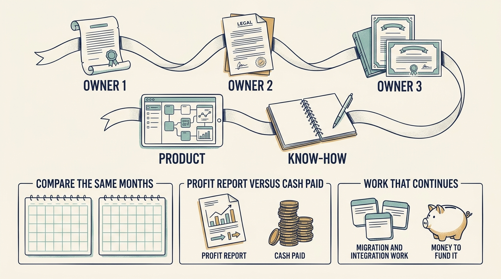

**TeamSystem**, an Italian business-software group, grew, reported positive **adjusted earnings** (profit recalculated after leaving out costs the company chooses to exclude, such as reorganization costs) and still reported a **statutory loss**, a loss under the accounting rules it must follow, in the same year. Each ownership change creates a new financial starting point, but customer moves between products, integration of acquired businesses and earlier commitments continue, so each new owner inherits both progress and unfinished work.

**Figure 1:** *The company passes from owner to owner while its product and know-how continue. Three checks follow: compare the same months, not a short year against a full one; set the profit report beside the cash actually paid; and fund the migration and integration work that carries on.*

Owners ran from Palamon's 2000 investment in a regional business through Bain Capital from 2004, HgCapital's 2010 purchase at an **enterprise value** of €565 million (a price for the whole business, not one shareholder's stake) and the sale to Hellman & Friedman completed in March 2016: distinct episodes at different prices, not one plan.

**Lesson one: compare equivalent periods.** The company changed hands in March 2016, so its 2016 accounts covered ten months, and dividing the two reported totals shows 37.7% revenue growth. Against a 2016 rebuilt as a full year, which also counts the businesses bought during 2016 from January, growth is 8.9%, and even that includes businesses newly bought in 2017. [S49: TeamSystem 2017 consolidated report](https://www.teamsystem.com/media/files/865_Consolidated%20Financial%20Statements%20as%20at%20and%20for%20the%20year%20ended%2031%20December%202017%20of%20TeamSystem%20Group.pdf)

**Lesson two: separate accounting earnings from payments.** The 2017 report lists the additions and subtractions that turn adjusted **EBITDA** of €113.0 million into a loss of €56.8 million. EBITDA is earnings before interest, taxes, depreciation and amortization: profit before borrowing costs, tax and the yearly charges that spread asset and acquisition costs over the years they are used. Two charges make up most of the gap. Depreciation and amortization of €72.5 million spread the cost of earlier purchases, largely software and customer relationships valued in the 2016 purchase; recording that charge itself moved no cash, and related payments must be checked separately. The €72.0 million net finance cost is the accounting cost of borrowing, not the bill: €52.1 million of finance costs was paid in the year, and other financing payments, such as loan fees and amounts owed to sellers of acquired companies, are reported separately. Recording €13.4 million of development as an asset deferred its cost in the accounts but **did not remove its cash cost**; the cash plan should follow payment dates.

**Lesson three: carry unfinished obligations across ownership changes.** Hg's 2016 sale was a partial exit, the sale of part of an investment. HgCapital Trust, whose own shares trade on the London stock exchange and which invests through **funds** (pools of investors' money managed by the investment firm Hg), received £39 million in cash and kept a stake valued at £6.1 million. [S48: HgCapital Trust 2015 results, p. 14](https://www.hgcapitaltrust.com/~/media/Files/H/Hgcapital-Trust-V2/documents/investors/financial-calendar/hgcapitaltrust-dec-2015-general.pdf) Cash received and the estimated value still held are different things. That stake was sold in 2021, when the Trust reinvested through a later Hg fund, and no later document states the net cash reaching its own shareholders. A new owner's financial starting point **does not erase earlier product obligations**: carry costs, commitments and results into the next ownership discussion and ask who funds the remaining burden, a proposed practice, not a result the history establishes.
