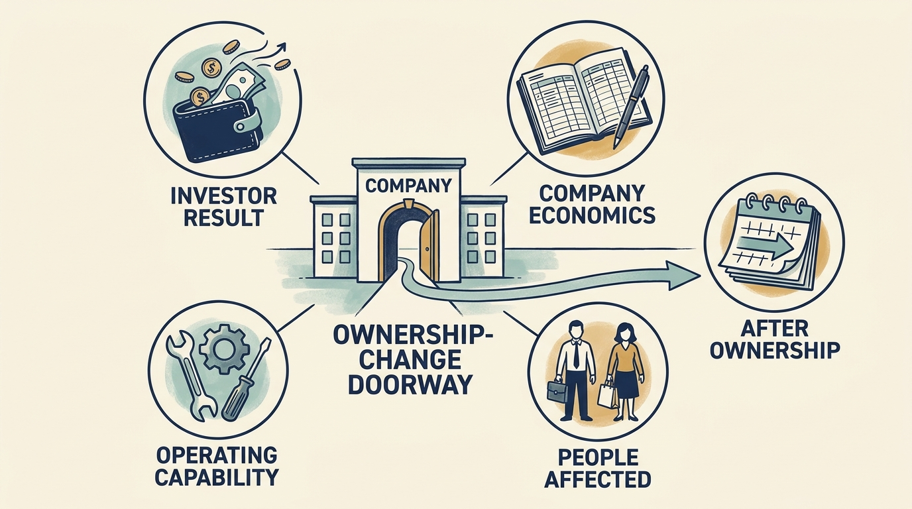

Durable success requires **more than a favorable funding valuation** or exit price. The book judges an ownership arrangement by whether the company can keep serving customers, fund its obligations, reinvest and explain what is unfinished, beside the investor’s result. An exit is a decisive reporting event for some investors, not their only horizon; remaining value and continued ownership are measured too. Customers, employees and suppliers live with the company afterwards.

**Figure 1:** *Assess what lasts beyond the transaction.*

The cases show why. Set side by side as investor result, company result, stakeholder evidence and what is not established, the transaction column is the most prominently reported but incomplete, the stakeholder column the thinnest, and the two diverge. Skype paired a valuable sale with a net loss and a later retirement; Toys R Us, operating earnings with a company that could not fund its trading; TeamSystem, adjusted earnings with a statutory loss under successive owners.

Applied to one fictional Larkspur decision, the standard makes a trade-off visible without removing it. A 90-day cut-off of a manual onboarding path would remove about €220,000 a year: €150,000 of specialist payroll, cash, and €70,000 of a support engineer’s time, capacity until hours or headcount change. Several of the thirty customers hold contracts running past that date, so the cut-off is a breach, not an option, and the board rejects it. A consent-based early migration is admissible but spends service credits and data work against the same saving, so the board chooses a two-quarter migration in months seven to twelve, after the data-quality step: the specialist stays to month twelve (about €75,000 one-off, plus eight engineer-weeks displacing a finance integration), and from year two payroll falls by €80,000 with a funded half-time data role. It funds the mitigation and records the disagreement, with the evidence that reopens it: effort above 50 hours after the step, or fewer than fifteen customers migrated at month nine. The decision goes into the handover record, so the next owner inherits the obligation, not only the saving.

Wider research tests an investor-only view. Davis and colleagues report two-year employment effects of about −12% after public-to-private and +15% after private-to-private buyouts, relative to comparison groups over 1980–2013: averages, not forecasts. [S08: Davis et al., 2024 revision](https://www.nber.org/system/files/working_papers/w26371/w26371.pdf) Hospital and nursing-home studies report adverse patient outcomes in specific populations, including 4.6 additional hospital-acquired conditions per 10,000 hospitalizations (a 25.4% relative increase), while another finds improvement on some quality measures; different outcomes cannot cancel. [S12: Kannan et al., adverse events](https://jamanetwork.com/journals/jama/fullarticle/2813379) [S39: Bruch et al., hospital measures](https://jamanetwork.com/journals/jamainternalmedicine/fullarticle/2769549) A small 2025 study finds lower margins after a second private equity sale of hospitals: a financial result, not a patient one. [S42: Kannan and Song, after sale](https://jamanetwork.com/journals/jama-health-forum/fullarticle/2837043) For software the point is a mechanism: where customers cannot observe quality or switch providers, financial incentives may not protect them.

Durable capability can include a continuing service the company chose, funded and can inspect. When the standard does not settle a question, name the authorized decision-maker, the groups that lose, the funded mitigation and the review date. The next team should inherit a company that can serve its customers, fund its obligations and explain what still needs to change.
