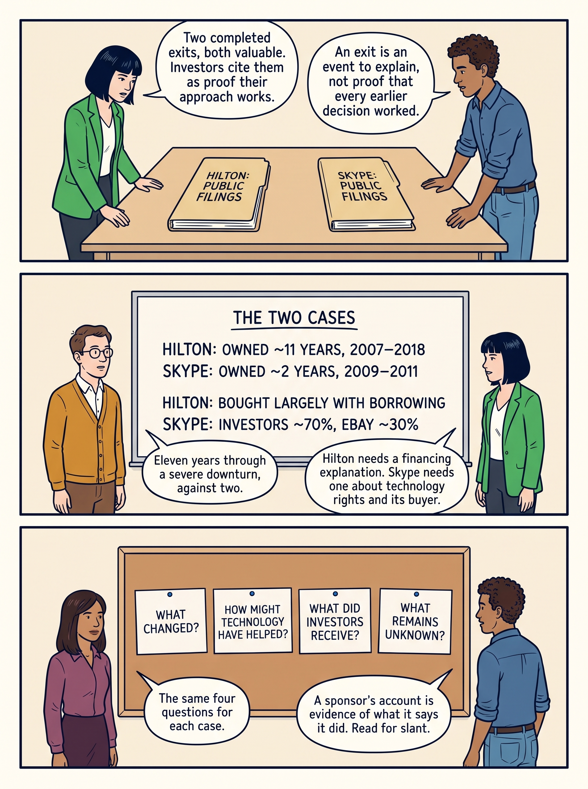

<!-- comic-style
{
  "cast": "MORGAN: a thoughtful investor technology adviser with short dark hair and a green jacket, used in the fund scenarios. ALEX: a practical CTO, a brown-skinned man with short, tight dark curls close to his head and blue rolled-up sleeves. SAM: a CFO, a man with short brown hair, round glasses and an amber cardigan. PRIYA: a product leader with straight dark hair and plum sleeves. INES: a CEO with short grey hair and a navy jacket. All are fictional; none represents a person in a real case.",
  "style": "Clean editorial explainer comic pages, each one image of three stacked full-width strips: navy ink outlines, restrained green, blue and amber accents on warm ivory, generous space, expressive people and simple physical props. Dialogue, short labels and the supplied amounts are lettered in the artwork, exactly as scripted. Money bags, coins and banknotes are plain and undecorated; the euro sign appears only inside supplied text, and arrows, documents and screens carry plain lines, never lettering. No photorealism, logos, titles or unsupplied text. Keep the same character appearances throughout the journal.",
  "reference": "_research/comic-cast-20260913.jpeg",
  "identity": {
    "Morgan": "MORGAN is a light-skinned WOMAN with a short, straight, JET-BLACK bob cut level with her jaw and a straight fringe across her forehead (never brown hair, never a side parting), and a bright green jacket over a white top, first person in the reference; her face must match the reference sheet exactly.",
    "Alex": "ALEX is a medium-brown-skinned MAN with a masculine face, broad shoulders and a straight masculine build, SHORT tight dark curls close to his head (not a large afro), a blue rolled-sleeve shirt and blue jeans, second person in the reference; fill his face, neck and hands with the same brown skin color in every strip.",
    "Sam": "SAM is a light-skinned MAN with a masculine face and SHORT brown hair cropped above his ears (never a bob, never chin-length hair, never a woman), round glasses and an amber cardigan over a white shirt, third person in the reference.",
    "Priya": "PRIYA is a brown-skinned WOMAN with straight shoulder-length dark hair and a plum blouse, fourth person in the reference.",
    "Ines": "INES is a light-skinned OLDER WOMAN with a short GREY bob (grey hair, never dark) and a navy jacket, fifth person in the reference."
  },
  "short": {
    "Morgan": "a light-skinned woman with a jet-black jaw-length bob and fringe, in a bright green jacket",
    "Alex": "a brown-skinned man with short tight dark curls, in a blue rolled-sleeve shirt",
    "Sam": "a light-skinned man with short brown hair and round glasses, in an amber cardigan over a collared white shirt",
    "Priya": "a brown-skinned woman with straight shoulder-length dark hair, in a plum blouse",
    "Ines": "an older light-skinned woman with a short grey bob, in a navy jacket"
  }
}
-->

**Comic.** Much of what investors ask for during ownership is justified by the sale they expect to make: the **exit**, in which the investor sells its ownership stake. Seven pages use two completed exits to show what a sale can and cannot tell a product or engineering leader about the technology work that preceded it, and why the two cases ask different questions: Hilton about financing and time, Skype about technology rights and what one buyer valued. Each page is three strips; the dated figures from the public filings are drawn into the artwork, and a transcript follows every page.

Morgan is an investor’s adviser in the fund scenarios; Alex leads technology, Priya leads product, and Sam leads finance. All are fictional. Historical cases are discussed through documents — the team reads and compares public filings, announcements and a sponsor’s own investor call — and the scenes do not reenact real events. A **sponsor** is the investment firm behind a transaction; a **fund** is money pooled from outside investors and managed by that firm. Where the artwork uses a shortened label, the caption beneath the page explains it.

<!-- comic-page
{
  "id": "01-two-exits-two-explanations",
  "title": "Two exits, two explanations",
  "asset": "assets/images/33-hilton-and-skype/comic-page-01-two-exits-two-explanations.jpeg",
  "aspect_ratio": "3:4",
  "cast": [
    "Morgan",
    "Alex",
    "Sam",
    "Priya"
  ],
  "strips": [
    {
      "scene": "A bare table with exactly two thick plain folders lying side by side with a clear gap, each with one large label on its cover. Morgan stands at the left of the table and Alex at the right; both look at the folders.",
      "labels": [
        "HILTON: PUBLIC FILINGS",
        "SKYPE: PUBLIC FILINGS"
      ],
      "label_notes": "One label on each folder cover, left to right.",
      "bubbles": [
        {
          "who": "Morgan",
          "text": "Two completed exits, both valuable. Investors cite them as proof their approach works."
        },
        {
          "who": "Alex",
          "text": "An exit is an event to explain, not proof that every earlier decision worked."
        }
      ]
    },
    {
      "scene": "A whiteboard hung high on the wall, above everyone's heads, with 5 lines of large, neat handwriting, each line fully visible, the first line a heading. Sam stands at the left of the board and Morgan at the right. Everyone stands to the side of the board, clear of it, hands at their sides; no head, hand, marker or speech bubble covers any of its lettering. The floor and the wall around the board are bare: no bags, coins, banknotes, papers, plants or furniture.",
      "labels": [
        "THE TWO CASES",
        "HILTON: OWNED ~11 YEARS, 2007–2018",
        "SKYPE: OWNED ~2 YEARS, 2009–2011",
        "HILTON: BOUGHT LARGELY WITH BORROWING",
        "SKYPE: INVESTORS ~70%, EBAY ~30%"
      ],
      "label_notes": "The heading, then the four lines beneath it.",
      "bubbles": [
        {
          "who": "Sam",
          "text": "Eleven years through a severe downturn, against two."
        },
        {
          "who": "Morgan",
          "text": "Hilton needs a financing explanation. Skype needs one about technology rights and its buyer."
        }
      ]
    },
    {
      "scene": "A pinboard hung high on the wall with exactly 4 large index cards pinned side by side in one row with clear gaps between them, every word fully visible. Priya stands at the left of the pinboard and Alex at the right. Everyone stands to the side of the board, clear of it, hands at their sides; no head, hand, marker or speech bubble covers any of its lettering. The floor and the wall around the board are bare: no bags, coins, banknotes, papers, plants or furniture.",
      "labels": [
        "WHAT CHANGED?",
        "HOW MIGHT TECHNOLOGY HAVE HELPED?",
        "WHAT DID INVESTORS RECEIVE?",
        "WHAT REMAINS UNKNOWN?"
      ],
      "label_notes": "One label per card, in this left-to-right order.",
      "bubbles": [
        {
          "who": "Priya",
          "text": "The same four questions for each case."
        },
        {
          "who": "Alex",
          "text": "A sponsor's account is evidence of what it says it did. Read for slant."
        }
      ]
    }
  ],
  "alt": "Comic page in three strips: two folders of public filings, one for Hilton and one for Skype, lie on a table; a board contrasts the two cases by years owned and how the purchases were funded; four cards give the questions asked of each case.",
  "caption": "Hilton operates a hotel business and brand network; Skype provided internet calling software. Both were owned for a time by private equity investors — firms that buy companies with money pooled from outside investors, own them for some years, and then sell — and both sales were valuable. An exit is the moment an investor sells its ownership stake, and much of what investors ask for during ownership is justified by the sale they expect to make; that is why the fictional team examines these two public records. Hilton was owned for about eleven years, 2007 to 2018, through a severe downturn, and bought largely with borrowed money; Skype was owned for about two years, 2009 to 2011, by an investor group that bought about 70% while the seller, eBay, kept about 30%. The cases need different explanations — Hilton a financing explanation, Skype one about technology rights and what one particular buyer valued — and the team asks the same four questions of each: what changed, how might technology have helped, what did investors receive, and what remains unknown? A sponsor, the investment firm behind a transaction, gives useful evidence of its stated actions and reported result, but may emphasize favourable interpretations. These scenes discuss the histories through documents; they do not reenact events.",
  "status": "generated",
  "generation": {
    "model": "gemini-3-pro-image-preview",
    "reference": "_research/comic-cast-20260913.jpeg",
    "sha256": "47097af105756ce41e0c31ee6541e851c7e5c1630d9661c78c382f01078e66c0"
  }
}
-->

**Page 1: Two exits, two explanations.** Hilton operates a hotel business and brand network; Skype provided internet calling software. Both were owned for a time by private equity investors — firms that buy companies with money pooled from outside investors, own them for some years, and then sell — and both sales were valuable. An exit is the moment an investor sells its ownership stake, and much of what investors ask for during ownership is justified by the sale they expect to make; that is why the fictional team examines these two public records. Hilton was owned for about eleven years, 2007 to 2018, through a severe downturn, and bought largely with borrowed money; Skype was owned for about two years, 2009 to 2011, by an investor group that bought about 70% while the seller, eBay, kept about 30%. The cases need different explanations — Hilton a financing explanation, Skype one about technology rights and what one particular buyer valued — and the team asks the same four questions of each: what changed, how might technology have helped, what did investors receive, and what remains unknown? A sponsor, the investment firm behind a transaction, gives useful evidence of its stated actions and reported result, but may emphasize favourable interpretations. These scenes discuss the histories through documents; they do not reenact events.

- *Strip 1.* **Morgan:** “Two completed exits, both valuable. Investors cite them as proof their approach works.” **Alex:** “An exit is an event to explain, not proof that every earlier decision worked.”
- *Strip 2.* **Sam:** “Eleven years through a severe downturn, against two.” **Morgan:** “Hilton needs a financing explanation. Skype needs one about technology rights and its buyer.”
- *Strip 3.* **Priya:** “The same four questions for each case.” **Alex:** “A sponsor's account is evidence of what it says it did. Read for slant.”

<!-- comic-page
{
  "id": "02-hilton-what-the-owner-put-in",
  "title": "Hilton: what the owner put in",
  "asset": "assets/images/33-hilton-and-skype/comic-page-02-hilton-what-the-owner-put-in.jpeg",
  "aspect_ratio": "3:4",
  "cast": [
    "Sam",
    "Alex",
    "Priya",
    "Morgan"
  ],
  "strips": [
    {
      "scene": "A whiteboard hung high on the wall, above everyone's heads, with 5 lines of large, neat handwriting, each line fully visible, the first line a heading and the last line with a line drawn above it, as in a sum. Sam stands at the left of the board and Alex at the right. Everyone stands to the side of the board, clear of it, hands at their sides; no head, hand, marker or speech bubble covers any of its lettering. The floor and the wall around the board are bare: no bags, coins, banknotes, papers, plants or furniture.",
      "labels": [
        "APRIL 2010: DEBT CUT $4.0BN",
        "OWNER'S $819M BOUGHT BACK $1.8BN",
        "OWNER CANCELLED ~$2.0BN+$87M LOANS",
        "HILTON'S OWN SET-ASIDE CASH: $76M",
        "= $4.0 BILLION"
      ],
      "label_notes": "The heading, then three lines, then the sum line at the bottom.",
      "bubbles": [
        {
          "who": "Sam",
          "text": "Loans bought back at 54% below what was owed. The whole amount owed disappears."
        },
        {
          "who": "Alex",
          "text": "About $3.9 billion of the four came from the owner's choice to keep supporting."
        }
      ]
    },
    {
      "scene": "A pinboard hung high on the wall with exactly 2 large index cards and one small card pinned alone beneath them pinned side by side in one row with clear gaps between them, every word fully visible. Priya stands at the left of the pinboard and Sam at the right. Everyone stands to the side of the board, clear of it, hands at their sides; no head, hand, marker or speech bubble covers any of its lettering. The floor and the wall around the board are bare: no bags, coins, banknotes, papers, plants or furniture.",
      "labels": [
        "3,843 HOTELS OWNED BY OTHERS",
        "157 OWNED BY HILTON",
        "OWNERS PAY FEES: BRAND, SYSTEMS"
      ],
      "label_notes": "The first two labels are the cards in the row; the third is the small card beneath them.",
      "bubbles": [
        {
          "who": "Priya",
          "text": "Most hotels carrying Hilton's brands belong to other people."
        },
        {
          "who": "Sam",
          "text": "They pay Hilton for the brand, the shared systems and, sometimes, management."
        }
      ]
    },
    {
      "scene": "A whiteboard hung high on the wall, above everyone's heads, with 4 lines of large, neat handwriting, each line fully visible, the first line a heading. Alex stands at the left of the board and Morgan at the right. Everyone stands to the side of the board, clear of it, hands at their sides; no head, hand, marker or speech bubble covers any of its lettering. The floor and the wall around the board are bare: no bags, coins, banknotes, papers, plants or furniture.",
      "labels": [
        "THREE CONNECTED SYSTEMS (FILING)",
        "ONE WORLDWIDE RESERVATION SYSTEM",
        "A GUEST-PROFILE SYSTEM",
        "ONQ: RUNNING EACH HOTEL'S DAY"
      ],
      "label_notes": "The heading, then the three lines beneath it.",
      "bubbles": [
        {
          "who": "Alex",
          "text": "The plausible mechanism is coordination: same rooms and prices everywhere, usable guest information."
        },
        {
          "who": "Morgan",
          "text": "An interpretation of the design the filing describes. Not a measured contribution."
        }
      ]
    }
  ],
  "alt": "Comic page in three strips: a board sums the April 2010 restructuring, the owner’s $819 million buying back $1.8 billion of loans, the owner cancelling about $2.0 billion plus $87 million of its own loans, and $76 million of Hilton’s cash, to $4.0 billion; two cards contrast 3,843 hotels owned by others with 157 owned by Hilton; a board lists the three connected systems the filing describes.",
  "caption": "Blackstone’s 2007 purchase of Hilton took a stock-market company into private ownership, paid largely with borrowed money; an industry retrospective describes a $26 billion transaction, a writedown during the downturn, more money from the owner, a debt restructuring and, later, the sale. Hilton’s 2013 registration statement — the document filed with the U.S. securities regulator before selling shares to the public — gives a firmer basis. The April 2010 restructuring cut what Hilton owed by $4.0 billion in three steps: the owner put in $819 million, which Hilton used to buy back $1.8 billion of loans at 54 percent below the amount owed; the owner cancelled the two most junior loans it held itself, about $2.0 billion plus $87 million of unpaid interest; and Hilton repaid $76 million of its mortgage loan from cash the loan agreement required it to keep in reserve. About $3.9 billion of the four came from the owner’s choice to keep supporting the company, not from the hotel business; the reduction lowered debt and interest cost and was not cash to spend on technology. The same filing counts 3,843 hotels owned by third parties that Hilton manages or licenses its brands to, against 157 it owns or leases; those owners pay fees for the brand and its shared systems. It describes three connected systems — one worldwide reservation system, a guest-profile system and OnQ, Hilton’s own system for running each hotel’s daily operations. The plausible technology mechanism is coordination; that is an interpretation of the operating design, not a measured estimate of value created.",
  "status": "generated",
  "generation": {
    "model": "gemini-3-pro-image-preview",
    "reference": "_research/comic-cast-20260913.jpeg",
    "sha256": "8c50b1ca53d4b789e7fd0216fef59ee4a214477dca9480d3a99c998319c623bf"
  }
}
-->

**Page 2: Hilton: what the owner put in.** Blackstone’s 2007 purchase of Hilton took a stock-market company into private ownership, paid largely with borrowed money; an industry retrospective describes a $26 billion transaction, a writedown during the downturn, more money from the owner, a debt restructuring and, later, the sale. Hilton’s 2013 registration statement — the document filed with the U.S. securities regulator before selling shares to the public — gives a firmer basis. The April 2010 restructuring cut what Hilton owed by $4.0 billion in three steps: the owner put in $819 million, which Hilton used to buy back $1.8 billion of loans at 54 percent below the amount owed; the owner cancelled the two most junior loans it held itself, about $2.0 billion plus $87 million of unpaid interest; and Hilton repaid $76 million of its mortgage loan from cash the loan agreement required it to keep in reserve. About $3.9 billion of the four came from the owner’s choice to keep supporting the company, not from the hotel business; the reduction lowered debt and interest cost and was not cash to spend on technology. The same filing counts 3,843 hotels owned by third parties that Hilton manages or licenses its brands to, against 157 it owns or leases; those owners pay fees for the brand and its shared systems. It describes three connected systems — one worldwide reservation system, a guest-profile system and OnQ, Hilton’s own system for running each hotel’s daily operations. The plausible technology mechanism is coordination; that is an interpretation of the operating design, not a measured estimate of value created.

- *Strip 1.* **Sam:** “Loans bought back at 54% below what was owed. The whole amount owed disappears.” **Alex:** “About $3.9 billion of the four came from the owner's choice to keep supporting.”
- *Strip 2.* **Priya:** “Most hotels carrying Hilton's brands belong to other people.” **Sam:** “They pay Hilton for the brand, the shared systems and, sometimes, management.”
- *Strip 3.* **Alex:** “The plausible mechanism is coordination: same rooms and prices everywhere, usable guest information.” **Morgan:** “An interpretation of the design the filing describes. Not a measured contribution.”

<!-- comic-page
{
  "id": "03-hilton-how-the-investors-sold",
  "title": "Hilton: how the investors sold, and what $14 billion establishes",
  "asset": "assets/images/33-hilton-and-skype/comic-page-03-hilton-how-the-investors-sold.jpeg",
  "aspect_ratio": "3:4",
  "cast": [
    "Morgan",
    "Sam",
    "Priya"
  ],
  "strips": [
    {
      "scene": "A long horizontal timeline drawn high on the wall, above everyone's heads: one straight line carrying exactly 5 tick marks and nothing else, one tick directly under each of the 5 labels written above the line, and no tick anywhere without a label over it. Morgan stands at the left below it and Sam at the right; Sam points up at the third tick.",
      "labels": [
        "OCT 2007: BOUGHT",
        "APRIL 2010: DEBT CUT $4.0BN",
        "2013: HILTON SELLS, FUNDS DON'T",
        "JUNE 2014: FUNDS SELL $2.3BN",
        "2018: LAST SHARES SOLD"
      ],
      "label_notes": "One label per tick, in this left-to-right order.",
      "bubbles": [
        {
          "who": "Morgan",
          "text": "In 2013 Hilton itself sold new shares to repay borrowing. No fund sold any."
        },
        {
          "who": "Sam",
          "text": "The listing put nothing in the funds. Their own sales came 2014 to 2018."
        }
      ]
    },
    {
      "scene": "Sam, at the left, holds a single printed document upright and facing the reader at chest height; it has one large heading and 3 plain lines beneath. Priya, at the right, reads it. A bare table stands between them.",
      "labels": [
        "SPONSOR'S INVESTOR CALL, 2018",
        "EXIT COMPLETED",
        "ABOUT 3.1 TIMES INVESTORS' CAPITAL",
        "ABOUT $14 BILLION OF PROFIT"
      ],
      "label_notes": "The first label is the heading on the document; the other three are its lines, top to bottom.",
      "bubbles": [
        {
          "who": "Sam",
          "text": "About $3.10 back for every dollar, counting the original dollar. The sponsor's own figures."
        },
        {
          "who": "Priya",
          "text": "A major success. It doesn't say how much came from running hotels better."
        }
      ]
    },
    {
      "scene": "A pinboard hung high on the wall with exactly 3 large index cards pinned side by side in one row with clear gaps between them, every word fully visible. Priya stands at the left of the pinboard and Morgan at the right. Everyone stands to the side of the board, clear of it, hands at their sides; no head, hand, marker or speech bubble covers any of its lettering. The floor and the wall around the board are bare: no bags, coins, banknotes, papers, plants or furniture.",
      "labels": [
        "FEES AND THE MANAGER'S SHARE",
        "THE FUND'S OTHER HOLDINGS",
        "PAYOUT TIMING: THE FUND AGREEMENT"
      ],
      "label_notes": "One label per card, left to right.",
      "bubbles": [
        {
          "who": "Priya",
          "text": "Three things separate a deal's result from an investor's."
        },
        {
          "who": "Morgan",
          "text": "The outside investors own a share of the whole fund, not of Hilton alone."
        }
      ]
    }
  ],
  "alt": "Comic page in three strips: a timeline runs from the October 2007 purchase through the 2010 debt cut, Hilton’s own 2013 share sale, the funds’ June 2014 $2.3 billion sale and the 2018 exit; Sam holds the sponsor’s 2018 investor-call figures, about 3.1 times capital and about $14 billion of profit; three cards name what separates a deal’s result from an investor’s.",
  "caption": "The 2013 public offering and Blackstone’s exit were different milestones. In the initial public offering Hilton itself sold new shares and planned to use the money to repay part of its borrowing; the offering document states that no Blackstone fund was selling shares or receiving cash. The listing made Hilton’s shares publicly traded but put no cash into the funds. Their own sales came later: in June 2014 funds affiliated with Blackstone sold 103.5 million shares for over $2.3 billion, in a sale from which Hilton received nothing, and the last shares were sold in 2018. In its second-quarter 2018 investor call Blackstone reported completing the exit, generating approximately 3.1 times investors’ capital and $14 billion of profit — about $3.10 back for every $1 invested, counting the original dollar. These are the sponsor’s own figures, not an independent calculation of what the outside investors received after all charges, and they do not say how much of the gain came from running the hotels better, from borrowing, from the restructuring, from decisions to sell or reuse hotels, or from the prices buyers were paying for hotel companies by 2018. Three things separate a deal’s result from an investor’s: the fund’s management fees and the manager’s contractual share of profits; the fund’s other investments, since investors own a share of the whole fund rather than of Hilton alone; and the fund agreement, not the sale of any one company, which sets when money is actually paid out.",
  "status": "generated",
  "generation": {
    "model": "gemini-3-pro-image-preview",
    "reference": "_research/comic-cast-20260913.jpeg",
    "sha256": "f1a02a1cab6c47a210bee0602421e01139fa68045ebd66dec4c09ccbe1f45409"
  }
}
-->

**Page 3: Hilton: how the investors sold, and what $14 billion establishes.** The 2013 public offering and Blackstone’s exit were different milestones. In the initial public offering Hilton itself sold new shares and planned to use the money to repay part of its borrowing; the offering document states that no Blackstone fund was selling shares or receiving cash. The listing made Hilton’s shares publicly traded but put no cash into the funds. Their own sales came later: in June 2014 funds affiliated with Blackstone sold 103.5 million shares for over $2.3 billion, in a sale from which Hilton received nothing, and the last shares were sold in 2018. In its second-quarter 2018 investor call Blackstone reported completing the exit, generating approximately 3.1 times investors’ capital and $14 billion of profit — about $3.10 back for every $1 invested, counting the original dollar. These are the sponsor’s own figures, not an independent calculation of what the outside investors received after all charges, and they do not say how much of the gain came from running the hotels better, from borrowing, from the restructuring, from decisions to sell or reuse hotels, or from the prices buyers were paying for hotel companies by 2018. Three things separate a deal’s result from an investor’s: the fund’s management fees and the manager’s contractual share of profits; the fund’s other investments, since investors own a share of the whole fund rather than of Hilton alone; and the fund agreement, not the sale of any one company, which sets when money is actually paid out.

- *Strip 1.* **Morgan:** “In 2013 Hilton itself sold new shares to repay borrowing. No fund sold any.” **Sam:** “The listing put nothing in the funds. Their own sales came 2014 to 2018.”
- *Strip 2.* **Sam:** “About $3.10 back for every dollar, counting the original dollar. The sponsor's own figures.” **Priya:** “A major success. It doesn't say how much came from running hotels better.”
- *Strip 3.* **Priya:** “Three things separate a deal's result from an investor's.” **Morgan:** “The outside investors own a share of the whole fund, not of Hilton alone.”

<!-- comic-page
{
  "id": "04-hilton-inherited-or-changed",
  "title": "Hilton: inherited, or changed by the owner?",
  "asset": "assets/images/33-hilton-and-skype/comic-page-04-hilton-inherited-or-changed.jpeg",
  "aspect_ratio": "3:4",
  "cast": [
    "Alex",
    "Priya",
    "Sam",
    "Morgan"
  ],
  "strips": [
    {
      "scene": "A long horizontal timeline drawn high on the wall, above everyone's heads: one straight line carrying exactly 4 tick marks and nothing else, one tick directly under each of the 4 labels written above the line, and no tick anywhere without a label over it. Alex stands at the left below it and Priya at the right; Alex points up at the first tick.",
      "labels": [
        "2003: ONQ INTRODUCED",
        "END 2005: VIRTUALLY ALL HOTELS",
        "OCT 2007: BLACKSTONE BUYS",
        "LATE 2012: SOFTWARE IN USE"
      ],
      "label_notes": "One label per tick, in this left-to-right order.",
      "bubbles": [
        {
          "who": "Alex",
          "text": "Both dates precede the purchase. The owner inherited OnQ; it didn't create it."
        },
        {
          "who": "Priya",
          "text": "Hilton's own earlier annual filings date it. Separate what it had from what changed."
        }
      ]
    },
    {
      "scene": "A pinboard hung high on the wall with exactly 3 large index cards pinned side by side in one row with clear gaps between them, every word fully visible. Priya stands at the left of the pinboard and Sam at the right. Everyone stands to the side of the board, clear of it, hands at their sides; no head, hand, marker or speech bubble covers any of its lettering. The floor and the wall around the board are bare: no bags, coins, banknotes, papers, plants or furniture.",
      "labels": [
        "INHERITED: DATED, 2003–2005",
        "DOCUMENTED CHANGE: 'STRENGTHENED AND EXPANDED'",
        "UNCERTAIN: WHAT IT ADDED"
      ],
      "label_notes": "One label per card, in this left-to-right order.",
      "bubbles": [
        {
          "who": "Priya",
          "text": "The 2013 narrative says the platform was strengthened. It names no specific change."
        },
        {
          "who": "Sam",
          "text": "Software spending was recorded as an asset. Dated evidence of software entering use only."
        }
      ]
    },
    {
      "scene": "A whiteboard hung high on the wall, above everyone's heads, with 3 lines of large, neat handwriting, each line fully visible. Sam stands at the left of the board and Morgan at the right. Everyone stands to the side of the board, clear of it, hands at their sides; no head, hand, marker or speech bubble covers any of its lettering. The floor and the wall around the board are bare: no bags, coins, banknotes, papers, plants or furniture.",
      "labels": [
        "OWNED-HOTEL ADJUSTED EARNINGS, MID-2013",
        "STILL BELOW 2008",
        "PARTS RECOVER AT DIFFERENT RATES"
      ],
      "label_notes": "The three lines on the board, top to bottom.",
      "bubbles": [
        {
          "who": "Sam",
          "text": "Adjusted earnings leave out interest, tax and the yearly charges for buildings and software."
        },
        {
          "who": "Morgan",
          "text": "A counterweight to a smooth transformation story, even though the investment performed."
        }
      ]
    }
  ],
  "alt": "Comic page in three strips: a timeline dates OnQ’s introduction in 2003 and system-wide installation by 2005 before the 2007 purchase, with software placed in use in late 2012; three cards separate the inherited capability, the documented change and the remaining uncertainty; a board notes that the owned hotels’ adjusted earnings in mid-2013 were still below 2008.",
  "caption": "Before crediting the owner with the technology, separate what the company already had from what changed. Hilton’s own annual filings date the platform: OnQ was introduced in 2003, and by the end of 2005 it was installed at virtually all hotels in the system. Both dates precede the October 2007 purchase, so Blackstone inherited OnQ rather than creating it. The 2013 management narrative says the platform was strengthened and expanded during a transformation it dates from 2007, and the filing records software spending carried as an asset, some of it placed into use during the fourth quarter of 2012 — dated evidence of software entering use, which does not identify which system changed, whether the change touched the inherited platform, or what it contributed to the result. The open question is not whether the owner inherited the platform, which it did, but what its later work added. The same filing offers a counterweight to a smooth transformation narrative: adjusted EBITDA — earnings before interest, tax and the accounting charges that spread the cost of buildings, equipment and software over the years they are used, with further items the company specifies removed — for the hotels Hilton itself owned or leased was, over the twelve months to June 2013, still below 2008 levels. Different parts of a business can recover at different rates even when the overall investment eventually performs well. The consulted evidence establishes no counterfactual of what Hilton would have achieved under a different owner.",
  "status": "generated",
  "generation": {
    "model": "gemini-3-pro-image-preview",
    "reference": "_research/comic-cast-20260913.jpeg",
    "sha256": "db3d0b92fac7e2c77bd6ae2c2953f560ec7e0a1c9ea17a57b38f1fc4af838ea4"
  }
}
-->

**Page 4: Hilton: inherited, or changed by the owner?.** Before crediting the owner with the technology, separate what the company already had from what changed. Hilton’s own annual filings date the platform: OnQ was introduced in 2003, and by the end of 2005 it was installed at virtually all hotels in the system. Both dates precede the October 2007 purchase, so Blackstone inherited OnQ rather than creating it. The 2013 management narrative says the platform was strengthened and expanded during a transformation it dates from 2007, and the filing records software spending carried as an asset, some of it placed into use during the fourth quarter of 2012 — dated evidence of software entering use, which does not identify which system changed, whether the change touched the inherited platform, or what it contributed to the result. The open question is not whether the owner inherited the platform, which it did, but what its later work added. The same filing offers a counterweight to a smooth transformation narrative: adjusted EBITDA — earnings before interest, tax and the accounting charges that spread the cost of buildings, equipment and software over the years they are used, with further items the company specifies removed — for the hotels Hilton itself owned or leased was, over the twelve months to June 2013, still below 2008 levels. Different parts of a business can recover at different rates even when the overall investment eventually performs well. The consulted evidence establishes no counterfactual of what Hilton would have achieved under a different owner.

- *Strip 1.* **Alex:** “Both dates precede the purchase. The owner inherited OnQ; it didn't create it.” **Priya:** “Hilton's own earlier annual filings date it. Separate what it had from what changed.”
- *Strip 2.* **Priya:** “The 2013 narrative says the platform was strengthened. It names no specific change.” **Sam:** “Software spending was recorded as an asset. Dated evidence of software entering use only.”
- *Strip 3.* **Sam:** “Adjusted earnings leave out interest, tax and the yearly charges for buildings and software.” **Morgan:** “A counterweight to a smooth transformation story, even though the investment performed.”

<!-- comic-page
{
  "id": "05-skype-rights-before-expansion",
  "title": "Skype: establish the rights before expanding",
  "asset": "assets/images/33-hilton-and-skype/comic-page-05-skype-rights-before-expansion.jpeg",
  "aspect_ratio": "3:4",
  "cast": [
    "Sam",
    "Alex",
    "Morgan",
    "Priya"
  ],
  "strips": [
    {
      "scene": "A whiteboard hung high on the wall, above everyone's heads, with 5 lines of large, neat handwriting, each line fully visible, the first line a heading. Sam stands at the left of the board and Alex at the right. Everyone stands to the side of the board, clear of it, hands at their sides; no head, hand, marker or speech bubble covers any of its lettering. The floor and the wall around the board are bare: no bags, coins, banknotes, papers, plants or furniture.",
      "labels": [
        "NOVEMBER 2009: VALUED AT $2.75BN",
        "INVESTOR GROUP: ~70%",
        "SELLER EBAY KEPT: ~30%",
        "EBAY: CASH PLUS BUYER'S NOTE",
        "EBAY ALSO LENT $50M"
      ],
      "label_notes": "The heading, then the four lines beneath it.",
      "bubbles": [
        {
          "who": "Sam",
          "text": "Not one buyer paying cash for all of a debt-free company."
        },
        {
          "who": "Alex",
          "text": "The seller stayed part-owner, took a note for part of the price, and lent."
        }
      ]
    },
    {
      "scene": "Alex, at the left, holds a single printed document upright and facing the reader at chest height; it has one large heading and 3 plain lines beneath. Morgan, at the right, reads it. A bare table stands between them.",
      "labels": [
        "SKYPE'S REGISTRATION FILING",
        "CORE TECHNOLOGY RIGHTS: JOLTID'S",
        "IN LEGAL DISPUTE AT SALE",
        "NOVEMBER 2009: SETTLED, RIGHTS BOUGHT"
      ],
      "label_notes": "The first label is the heading on the document; the other three are its lines, top to bottom.",
      "bubbles": [
        {
          "who": "Alex",
          "text": "A product working well for customers, while rights it couldn't run without lay elsewhere."
        },
        {
          "who": "Morgan",
          "text": "A code review or a load test would never have found that."
        }
      ]
    },
    {
      "scene": "A long horizontal timeline drawn high on the wall, above everyone's heads: one straight line carrying exactly 5 tick marks and nothing else, one tick directly under each of the 5 labels written above the line, and no tick anywhere without a label over it. Morgan stands at the left below it and Priya at the right; Priya points up at the fourth tick.",
      "labels": [
        "END 2009: 733 STAFF",
        "END 2010: 911 STAFF",
        "JAN 2011: GROUP VIDEO CALLING",
        "JAN 2011: QIK, ~$121M+~$29M",
        "MAR 2011: CITRIX PARTNERSHIP"
      ],
      "label_notes": "One label per tick, in this left-to-right order.",
      "bubbles": [
        {
          "who": "Morgan",
          "text": "Each date places an event inside the ownership window."
        },
        {
          "who": "Priya",
          "text": "It doesn't isolate that event's contribution to the sale price."
        }
      ]
    }
  ],
  "alt": "Comic page in three strips: a board sets out the November 2009 sale, $2.75 billion, the investor group’s 70% and eBay’s retained 30%, the buyer’s note and eBay’s $50 million loan; Alex holds the registration filing recording the disputed rights to the core calling technology settled in November 2009; a timeline dates staff growth, group video calling, the Qik purchase and the Citrix partnership.",
  "caption": "In November 2009 eBay completed a sale valuing Skype at $2.75 billion. An investor group led by Silver Lake controlled approximately 70% while eBay retained approximately 30%; eBay received cash and a buyer note — a written promise to pay part of the price later — and also bought $50 million of the debt securities issued to fund the deal, so it became a lender as well as a seller. The transaction cannot be understood as one buyer paying cash for 100% of a debt-free company. Skype’s later registration statement describes the purchase of rights to its core peer-to-peer technology — the software that connects users’ computers directly to one another — from a company called Joltid in November 2009, as part of an agreement that ended a legal dispute. The lesson for due diligence, the investigation before investing, is unusually concrete: a product can work well for customers while the legal rights to technology it cannot run without belong to someone else, and reviewing the software’s quality or testing whether it copes with more users would not uncover that. The filing also dates later developments: employees and long-term contractors grew from 733 at the end of 2009 to 911 at the end of 2010; group video calling launched in January 2011; in the same month Skype bought Qik, a mobile video software provider, for an initial cash payment of approximately $121 million with a further approximately $29 million promised to Qik employees for future service; a partnership with Citrix was announced in March 2011. A date places each event inside the ownership window; it does not isolate that event’s contribution to the sale price.",
  "status": "generated",
  "generation": {
    "model": "gemini-3-pro-image-preview",
    "reference": "_research/comic-cast-20260913.jpeg",
    "sha256": "3479fb7f0b12cc50a82c222b1c968417598cb5b609a19194c82d2858026212dd"
  }
}
-->

**Page 5: Skype: establish the rights before expanding.** In November 2009 eBay completed a sale valuing Skype at $2.75 billion. An investor group led by Silver Lake controlled approximately 70% while eBay retained approximately 30%; eBay received cash and a buyer note — a written promise to pay part of the price later — and also bought $50 million of the debt securities issued to fund the deal, so it became a lender as well as a seller. The transaction cannot be understood as one buyer paying cash for 100% of a debt-free company. Skype’s later registration statement describes the purchase of rights to its core peer-to-peer technology — the software that connects users’ computers directly to one another — from a company called Joltid in November 2009, as part of an agreement that ended a legal dispute. The lesson for due diligence, the investigation before investing, is unusually concrete: a product can work well for customers while the legal rights to technology it cannot run without belong to someone else, and reviewing the software’s quality or testing whether it copes with more users would not uncover that. The filing also dates later developments: employees and long-term contractors grew from 733 at the end of 2009 to 911 at the end of 2010; group video calling launched in January 2011; in the same month Skype bought Qik, a mobile video software provider, for an initial cash payment of approximately $121 million with a further approximately $29 million promised to Qik employees for future service; a partnership with Citrix was announced in March 2011. A date places each event inside the ownership window; it does not isolate that event’s contribution to the sale price.

- *Strip 1.* **Sam:** “Not one buyer paying cash for all of a debt-free company.” **Alex:** “The seller stayed part-owner, took a note for part of the price, and lent.”
- *Strip 2.* **Alex:** “A product working well for customers, while rights it couldn't run without lay elsewhere.” **Morgan:** “A code review or a load test would never have found that.”
- *Strip 3.* **Morgan:** “Each date places an event inside the ownership window.” **Priya:** “It doesn't isolate that event's contribution to the sale price.”

<!-- comic-page
{
  "id": "06-skype-a-sale-to-one-buyer",
  "title": "Skype: one buyer, and what the price does not calculate",
  "asset": "assets/images/33-hilton-and-skype/comic-page-06-skype-a-sale-to-one-buyer.jpeg",
  "aspect_ratio": "3:4",
  "cast": [
    "Sam",
    "Priya",
    "Morgan",
    "Alex"
  ],
  "strips": [
    {
      "scene": "A whiteboard hung high on the wall, above everyone's heads, with 4 lines of large, neat handwriting, each line fully visible, the first line a heading. Sam stands at the left of the board and Priya at the right. Everyone stands to the side of the board, clear of it, hands at their sides; no head, hand, marker or speech bubble covers any of its lettering. The floor and the wall around the board are bare: no bags, coins, banknotes, papers, plants or furniture.",
      "labels": [
        "SKYPE IN 2010 (FILING)",
        "REVENUE: ABOUT $860 MILLION",
        "ADJUSTED EARNINGS: ABOUT $264 MILLION",
        "NET LOSS: ABOUT $7 MILLION"
      ],
      "label_notes": "The heading, then the three lines beneath it.",
      "bubbles": [
        {
          "who": "Sam",
          "text": "Two earnings figures pointing opposite ways. The adjusted one leaves out the borrowing's interest."
        },
        {
          "who": "Priya",
          "text": "And a plan to grow paid use is a plan, not an achieved outcome."
        }
      ]
    },
    {
      "scene": "A pinboard hung high on the wall with exactly 3 large index cards pinned side by side in one row with clear gaps between them, every word fully visible. Morgan stands at the left of the pinboard and Alex at the right. Everyone stands to the side of the board, clear of it, hands at their sides; no head, hand, marker or speech bubble covers any of its lettering. The floor and the wall around the board are bare: no bags, coins, banknotes, papers, plants or furniture.",
      "labels": [
        "MAY 2011: MICROSOFT AGREES $8.5BN",
        "OCTOBER 2011: COMPLETED",
        "STRATEGIC BUYER: OWN-BUSINESS USE"
      ],
      "label_notes": "One label per card, left to right.",
      "bubbles": [
        {
          "who": "Morgan",
          "text": "Microsoft wanted Skype to work with its own products and devices."
        },
        {
          "who": "Alex",
          "text": "Evidence of a completed sale and stated reasons. Not that the hoped-for gains arrived."
        }
      ]
    },
    {
      "scene": "A whiteboard hung high on the wall, above everyone's heads, with 5 lines of large, neat handwriting, each line fully visible, the first line a heading. Alex stands at the left of the board and Sam at the right. Everyone stands to the side of the board, clear of it, hands at their sides; no head, hand, marker or speech bubble covers any of its lettering. The floor and the wall around the board are bare: no bags, coins, banknotes, papers, plants or furniture.",
      "labels": [
        "$8.5BN÷$2.75BN: NOT A RETURN",
        "THE FUND OWNED ONLY PART",
        "LENDERS ARE REPAID BEFORE OWNERS",
        "THE DEAL HAD COSTS",
        "MONEY MOVED ON DIFFERENT DATES"
      ],
      "label_notes": "The heading, then the four lines beneath it.",
      "bubbles": [
        {
          "who": "Alex",
          "text": "Both are values for the whole company at two dates."
        },
        {
          "who": "Sam",
          "text": "The value rose a great deal and sellers received cash. The exact return: unknown."
        }
      ]
    }
  ],
  "alt": "Comic page in three strips: a board gives Skype’s 2010 revenue, adjusted earnings and net loss; three cards record Microsoft’s $8.5 billion agreement in May 2011, completion in October and its strategic reasons; a board explains why dividing the two company values is not a fund return.",
  "caption": "The registration filing reports 2010 revenue — income from selling services before costs — of about $860 million, adjusted EBITDA of about $264 million, and a net loss of about $7 million. The two earnings figures point in opposite directions because the adjusted measure leaves out the interest on the borrowing used to buy Skype and the accounting charges for the assets that came with the purchase, both of which the net figure includes. The filing describes ambitions to grow paid use, win business customers and find new ways to earn money; a plan is not an achieved outcome. Microsoft announced the $8.5 billion acquisition agreement in May 2011 and its completion in October 2011, saying it wanted Skype to work with its own communications products and devices: a strategic buyer, one that values a company for what it can do inside the buyer’s existing business. The announcement is evidence of a completed transaction and of the buyer’s stated reasons, not evidence that the combined businesses later produced the sales and savings Microsoft hoped for. Dividing $8.5 billion by the $2.75 billion at which Skype was valued in 2009 does not calculate Silver Lake’s fund return: both are values for the whole company at two dates, the fund owned only part of it, lenders and other financiers had to be repaid before owners, the deal had costs, and money went in and came out on different dates. The record clearly shows that the company’s value rose a great deal and that the sellers received cash; the exact return after all deductions lies outside the verified evidence.",
  "status": "generated",
  "generation": {
    "model": "gemini-3-pro-image-preview",
    "reference": "_research/comic-cast-20260913.jpeg",
    "sha256": "bb8eac54845c32385f4eb060eb2f55266879ea0237f97b242192953de8703ed6"
  }
}
-->

**Page 6: Skype: one buyer, and what the price does not calculate.** The registration filing reports 2010 revenue — income from selling services before costs — of about $860 million, adjusted EBITDA of about $264 million, and a net loss of about $7 million. The two earnings figures point in opposite directions because the adjusted measure leaves out the interest on the borrowing used to buy Skype and the accounting charges for the assets that came with the purchase, both of which the net figure includes. The filing describes ambitions to grow paid use, win business customers and find new ways to earn money; a plan is not an achieved outcome. Microsoft announced the $8.5 billion acquisition agreement in May 2011 and its completion in October 2011, saying it wanted Skype to work with its own communications products and devices: a strategic buyer, one that values a company for what it can do inside the buyer’s existing business. The announcement is evidence of a completed transaction and of the buyer’s stated reasons, not evidence that the combined businesses later produced the sales and savings Microsoft hoped for. Dividing $8.5 billion by the $2.75 billion at which Skype was valued in 2009 does not calculate Silver Lake’s fund return: both are values for the whole company at two dates, the fund owned only part of it, lenders and other financiers had to be repaid before owners, the deal had costs, and money went in and came out on different dates. The record clearly shows that the company’s value rose a great deal and that the sellers received cash; the exact return after all deductions lies outside the verified evidence.

- *Strip 1.* **Sam:** “Two earnings figures pointing opposite ways. The adjusted one leaves out the borrowing's interest.” **Priya:** “And a plan to grow paid use is a plan, not an achieved outcome.”
- *Strip 2.* **Morgan:** “Microsoft wanted Skype to work with its own products and devices.” **Alex:** “Evidence of a completed sale and stated reasons. Not that the hoped-for gains arrived.”
- *Strip 3.* **Alex:** “Both are values for the whole company at two dates.” **Sam:** “The value rose a great deal and sellers received cash. The exact return: unknown.”

<!-- comic-page
{
  "id": "07-two-operating-questions",
  "title": "Two operating questions, one evidence limit",
  "asset": "assets/images/33-hilton-and-skype/comic-page-07-two-operating-questions.jpeg",
  "aspect_ratio": "3:4",
  "cast": [
    "Priya",
    "Alex",
    "Morgan",
    "Sam"
  ],
  "strips": [
    {
      "scene": "A pinboard hung high on the wall with exactly 2 large index cards and one small card pinned alone beneath them pinned side by side in one row with clear gaps between them, every word fully visible. Priya stands at the left of the pinboard and Alex at the right. Everyone stands to the side of the board, clear of it, hands at their sides; no head, hand, marker or speech bubble covers any of its lettering. The floor and the wall around the board are bare: no bags, coins, banknotes, papers, plants or furniture.",
      "labels": [
        "MAY 2025: MICROSOFT RETIRES SKYPE",
        "USERS DIRECTED TO OTHER PRODUCTS",
        "EXIT, PRODUCT LIFE: DIFFERENT PERIODS"
      ],
      "label_notes": "The first two labels are the cards in the row; the third is the small card beneath them.",
      "bubbles": [
        {
          "who": "Priya",
          "text": "The retirement doesn't prove the 2009–2011 owners destroyed value."
        },
        {
          "who": "Alex",
          "text": "And the 2011 sale doesn't prove users were served well afterwards. Moving costs customers."
        }
      ]
    },
    {
      "scene": "A whiteboard hung high on the wall, above everyone's heads, with 4 lines of large, neat handwriting, each line fully visible, the first line a heading. Morgan stands at the left of the board and Sam at the right. Everyone stands to the side of the board, clear of it, hands at their sides; no head, hand, marker or speech bubble covers any of its lettering. The floor and the wall around the board are bare: no bags, coins, banknotes, papers, plants or furniture.",
      "labels": [
        "TWO OPERATING QUESTIONS",
        "HILTON: FINANCING AND TIME?",
        "SKYPE: RIGHTS? WHAT BUYER VALUES?",
        "NEITHER READ FROM EXIT PRICE"
      ],
      "label_notes": "The heading, then the three lines beneath it.",
      "bubbles": [
        {
          "who": "Morgan",
          "text": "Hilton: what happens to the operating plan when financing and recovery time change?"
        },
        {
          "who": "Sam",
          "text": "Skype: at each sale, who holds the essential rights, and what's the product for?"
        }
      ]
    },
    {
      "scene": "A whiteboard hung high on the wall, above everyone's heads, with 4 lines of large, neat handwriting, each line fully visible, the first line a heading. Alex stands at the left of the board and Priya at the right. Everyone stands to the side of the board, clear of it, hands at their sides; no head, hand, marker or speech bubble covers any of its lettering. The floor and the wall around the board are bare: no bags, coins, banknotes, papers, plants or furniture.",
      "labels": [
        "ONE SHARED EVIDENCE LIMIT",
        "NO COMPLETE FUND CASH FLOWS",
        "NO SPLIT: OPERATIONS/FINANCING/MARKET/BUYER",
        "NO EMPLOYEE, CUSTOMER OUTCOMES COMPARED"
      ],
      "label_notes": "The heading, then the three lines beneath it.",
      "bubbles": [
        {
          "who": "Alex",
          "text": "The sources date the technology events. They don't allocate either gain."
        },
        {
          "who": "Priya",
          "text": "A sponsor's multiple and the headline values start the explanation. They don't end it."
        }
      ]
    }
  ],
  "alt": "Comic page in three strips: two cards note Skype’s retirement in May 2025 with a small card saying the exit and the product’s life are judged over different periods; a board states the two operating questions, Hilton’s about financing and time and Skype’s about rights and the buyer; a board lists the shared evidence limit.",
  "caption": "Microsoft retired Skype in May 2025 and directed users toward alternatives. That event belongs in the product’s history, but it does not retroactively prove that the 2009–2011 ownership period destroyed value, nor does the successful 2011 sale prove that users were served well indefinitely afterward; the moment an investor turns its stake into cash and the product’s longer life need to be judged over different periods, and having to move to another product is a real consequence for customers. Two operating questions follow. Hilton asks whether the company has financing and time for the operating plan — what happens to the plan when financing and the time needed for recovery change. Skype asks whether the company controls the rights the product depends on and what a particular buyer values — at each sale, who has authority, who holds the essential technology rights, and what the new owner intends the product to be for. Neither answer can be read from the exit price alone. One evidence limit is common to both: the consulted material dates the technology events but contains no complete fund cash flows, no independent allocation of either gain among operating, financing, market and buyer effects, and no comparison of employee and customer outcomes across the ownership periods. A sponsor’s reported multiple and the headline transaction values are the start of the explanation, not its end. The next case asks what a leader should recheck when one investor sells its stake to another and the familiar manager stays.",
  "status": "generated",
  "generation": {
    "model": "gemini-3-pro-image-preview",
    "reference": "_research/comic-cast-20260913.jpeg",
    "sha256": "cbe36924c0d3832a9d532207fefd88d1c4b35b6cfc6d2481110045fda58e1dab"
  }
}
-->

**Page 7: Two operating questions, one evidence limit.** Microsoft retired Skype in May 2025 and directed users toward alternatives. That event belongs in the product’s history, but it does not retroactively prove that the 2009–2011 ownership period destroyed value, nor does the successful 2011 sale prove that users were served well indefinitely afterward; the moment an investor turns its stake into cash and the product’s longer life need to be judged over different periods, and having to move to another product is a real consequence for customers. Two operating questions follow. Hilton asks whether the company has financing and time for the operating plan — what happens to the plan when financing and the time needed for recovery change. Skype asks whether the company controls the rights the product depends on and what a particular buyer values — at each sale, who has authority, who holds the essential technology rights, and what the new owner intends the product to be for. Neither answer can be read from the exit price alone. One evidence limit is common to both: the consulted material dates the technology events but contains no complete fund cash flows, no independent allocation of either gain among operating, financing, market and buyer effects, and no comparison of employee and customer outcomes across the ownership periods. A sponsor’s reported multiple and the headline transaction values are the start of the explanation, not its end. The next case asks what a leader should recheck when one investor sells its stake to another and the familiar manager stays.

- *Strip 1.* **Priya:** “The retirement doesn't prove the 2009–2011 owners destroyed value.” **Alex:** “And the 2011 sale doesn't prove users were served well afterwards. Moving costs customers.”
- *Strip 2.* **Morgan:** “Hilton: what happens to the operating plan when financing and recovery time change?” **Sam:** “Skype: at each sale, who holds the essential rights, and what's the product for?”
- *Strip 3.* **Alex:** “The sources date the technology events. They don't allocate either gain.” **Priya:** “A sponsor's multiple and the headline values start the explanation. They don't end it.”
