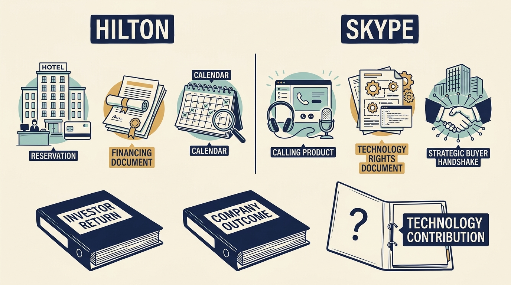

Hotel group **Hilton** and internet-calling product **Skype** were each owned for a time by private equity investors, firms that buy companies with pooled outside money and later sell them. Both sales, or **exits**, rewarded their investors, yet neither proves that any particular decision caused the return. Hilton needs a financing explanation; Skype needs one about technology rights and one buyer's wishes.

**Figure 1:** *Reconstruct each case and keep what investors received separate from claims about what caused it. The strategic buyer in the Skype column is Microsoft, which wanted Skype for use inside its business.*

Blackstone bought Hilton in 2007, paying largely with borrowed money. Hilton's shares returned to a stock market in 2013, and Blackstone's funds sold their shares from 2014 to 2018. A 2010 restructuring cut what Hilton owed by $4.0 billion, mainly because the owner put in money to buy back loans for less than the amount owed and cancelled loans it held itself, the ones that would have been repaid last. Hilton's 2013 filing lists OnQ, its own hotel-operations system, among its core systems. [S23: Hilton registration filing](https://www.sec.gov/Archives/edgar/data/1585689/000119312513364703/d593452ds1.htm) Earlier filings date OnQ to 2003, in virtually all hotels by end-2005, before the purchase. [S64: Hilton 2003 annual filing](https://www.sec.gov/Archives/edgar/data/47580/000104746904007535/a2128996z10-k.htm) [S65: Hilton 2005 annual filing](https://www.sec.gov/Archives/edgar/data/47580/000110465906016388/a06-2283_110k.htm) **The owner inherited the platform; what its later work added to the return is not measured.**

Blackstone later reported 3.1 times investors' money, about $3.10 back for every $1 invested including that dollar, and $14 billion of profit. [S24: Blackstone 2018 investor call](https://ir.blackstone.com/files/doc_events/BLACKSTONE-Second-Quarter-2018-Earnings-Investor-Call.pdf) These are the **sponsor's** figures, the investment firm's own, not what each outside investor in its fund received after fees and the manager's profit share. Recovery was uneven: for the hotels Hilton itself owned or leased, the company's own earnings measure was still below 2008 levels in mid-2013.

Skype's ownership lasted about two years. In 2009 eBay sold about 70% of it to an investor group at a $2.75 billion valuation, kept about 30% and accepted later payment of part of the price. The first dated technology change is a November 2009 legal settlement that gave the company the rights to its core **peer-to-peer** technology, the software connecting users' computers directly to one another. The filing also dates the January 2011 purchase of Qik, a mobile video company, and the group video calling launch, without measuring what either added. [S26: eBay Skype sale announcement](https://investors.ebayinc.com/investor-news/press-release-details/2009/EBay-Inc-Completes-Sale-of-Skype/default.aspx) [S27: Skype registration filing](https://www.sec.gov/Archives/edgar/data/1498209/000119312511096544/ds1a.htm) Microsoft, which wanted Skype for use inside its business, bought it for $8.5 billion in October 2011. [S28: Microsoft Skype completion](https://news.microsoft.com/source/2011/10/13/microsoft-officially-welcomes-skype/)

**Two company prices cannot give a fund's return.** Dividing $8.5 billion by the $2.75 billion 2009 valuation ignores the fund's partial ownership, the lenders repaid first, and the costs and dates between. Microsoft's reasons for paying also help explain the price; they do not prove operating changes alone made Skype worth that much.

Skype's retirement in May 2025 belongs to the **later product history**; it neither erases the 2011 investor outcome nor shows that earlier decisions caused it. [S29: Microsoft Skype retirement](https://support.microsoft.com/en-us/skype/22ccebb6-0cf9-4e1d-916f-aaf978e1b129)

Neither case supplies complete money-in-and-out records, an independent split of the gain, or a comparison of employee and customer outcomes across the ownership periods. **Hilton asks whether the company has financing and time for the operating plan. Skype asks whether it controls the rights the product depends on and what a particular buyer values.**
