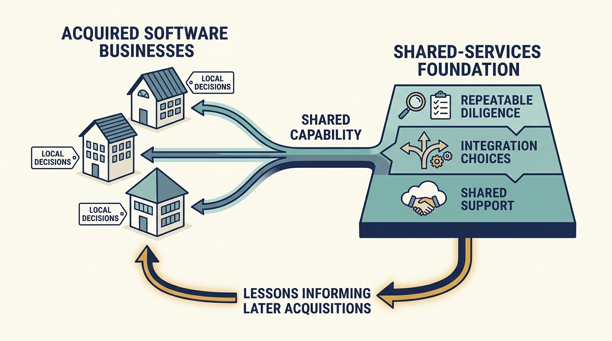

> **IN THIS SECTION, YOU WILL:** Learn to look behind a familiar investment firm to the funds and shareholders that actually own the company, and to check that two profit figures for the same year were calculated the same way before you budget for acquisitions and shared support.

> **WHY INVESTORS CARE:** When investors use a company’s earnings to judge what its shares are worth, they need the exact calculation behind that earnings figure, and the line-by-line link to the figure management plans its budget on. A stated earnings measure informs a negotiated price; it does not set the price on its own.

> **WHY YOU SHOULD CARE:** Suppose your owner announces that “Hg is continuing as majority shareholder.” Whether your three-year program to rebuild the systems several of your products share survives depends on which pool of money now holds the shares, and on whether the company itself received any. The familiar name answers neither, and a familiar profit label can hide a changed calculation in the same way.

> **KEY POINTS:**
>
> * **The firm can stay while the money behind it changes.** Hg’s own announcements name two different Hg funds, one investor’s announced complete exit and another’s partial sale. A long relationship is not one unchanged investment.
> * **Check how a figure is calculated.** Visma’s 2024 profit appears as €893 million in one report and €904 million in another. The two calculations differ because the second leaves out €11.665 million of costs of arranging acquisitions (advisers’ and lawyers’ fees, not the prices paid for the companies). Both are versions of a profit measure called EBITDA, explained below. The adjustment explains the gap and creates no cash.
> * **Budget the recurring cost of buying companies, and name who decides.** The case raises the shared-support question without proving the model. The practical response is a cash plan for the acquisition program and a named authority for the next purchase.

 
Your owner announces, after a transaction, that “Hg is continuing as majority shareholder”, meaning it still holds more than half the shares. Do you carry on as planned with the three-year platform program, a project to rebuild the systems that several of your products share, such as sign-in, billing and hosting? The answer depends on which fund (which pool of investors’ money) now holds the shares, what that fund’s investors expect and by when, and whether the company itself received any new money. The familiar name answers none of that.

The previous chapter examined completed investor exits by two different routes: Hilton’s owners sold their shares in stages after the company returned to the stock market, and Skype was sold to a single buyer, Microsoft. This chapter looks at a company whose investors changed while the investment firm stayed. It shows how to look behind the firm to the funds that own the company, how to check that two profit figures for the same year were calculated the same way, and how to budget for a recurring program of acquisitions with a named authority for the next purchase.

## Setting Up the Case: Visma and Its Changing Investors

Visma is a group of business-software companies. Its public accounts describe product development, acquisitions and shared support alongside changes in its investors. Individual investors have left and others have joined, but the same investment firm, Hg, has stayed involved throughout, and the money behind that familiar name has changed with each transaction.

A **share** is a unit of ownership in a company. Whoever holds shares is a **shareholder**, and the shareholder register is the list of who holds them. A **fund** is a pool of money collected from investors and used to buy shares in companies. Its investors are often pension schemes, which invest retirement savings, and insurers, which invest the premiums they collect. The fund, or a company set up to hold the investment, owns the shares. Where the text says **investment vehicle** or **holding vehicle**, it means that fund or legal entity, the one whose name appears on the shareholder register.

An **investment manager**, also called an investment firm, is the organization that runs the fund: it chooses what the fund buys and sells. It usually runs several funds over time, each with its own investors, its own rights and its own expected holding period, and the manager’s own money is usually a small part of the total, if any. In this chapter **Hg** is the manager. **Private equity** is this style of investing: buying ownership of companies outside the stock market through managed funds, holding them for some years, and then selling.

**Earnings** here means profit under a particular calculation. **EBITDA** stands for earnings before interest, taxes, depreciation and amortization: profit measured before the cost of borrowing (interest), before tax, and before the accounting charges that spread the cost of long-lived assets over the years they are used (depreciation for physical assets such as buildings and equipment; amortization for intangible ones such as purchased software or customer contracts). **Adjusted EBITDA** starts from that figure and leaves out further items the company specifies. A **reconciliation**, or bridge, is the line-by-line calculation from one figure to the other. Neither measure is the cash left after every company obligation.

## A Long Manager Relationship With Changing Investors

Visma’s December 2023 announcement describes a **secondary sale**: existing shareholders sold shares to other investors. In a secondary sale the money goes to the selling shareholders, not to the company. The announcement says the transaction values Visma at €19 billion. A **valuation** is the price a transaction implies for the whole company; it is neither cash paid out to investors nor cash received by Visma.

Around 20 new investors would join the shareholder register with over €1 billion of **equity** investment; equity is ownership capital, money paid to hold shares rather than lent. They include Altaroc, Jane Street, NPS (South Korea’s National Pension Service, which invests the country’s state pension savings) and NYC Retirement System (New York City’s public pension funds). Existing shareholders, including Hg, the investment firms ICG and TPG, and Visma’s management, would make around €3 billion of new investment. Hg would continue what the announcement calls a 17-year investment with a **majority stake**, meaning more than half of the shares.

The announcement also describes what the company sells: standardized **software as a service (SaaS)** products, accessed as an ongoing service rather than bought once, after selling activities outside that focus. [S30: Visma 2023 transaction](https://www.visma.com/newsroom/visma-attracts-new-investors-for-further-international-expansion-in-a-transaction-valuing-the-company-at-eur-19-billion-59703d9f)

Money used to buy an existing shareholder’s stake does not fund product development. And continued involvement by a manager does not mean the same fund has held the same shares for the whole period. The table checks the title’s claim against two documents only: Visma’s 2023 announcement and Hg’s June 2017 buyout announcement (a **buyout** is a purchase of a controlling share of a company). Cells those documents do not fill are marked “not stated”; nothing is inferred from the length of the relationship.

| Event | Hg fund named | Shareholders entering or increasing | Shareholders leaving or reducing | New money for Visma itself |
| --- | --- | --- | --- | --- |
| 2006 investment | Hg5, £101 million | Hg | Not stated | Not stated |
| 2014 reinvestment | Hg7 | Hg, alongside KKR and Cinven | Not stated | Not stated |
| June 2017 buyout | Not named; Hg adds £238 million | Hg, to 41% of the shares; GIC (Singapore’s state investor), Montagu and ICG; management keeps 7% | KKR sells its entire stake; Cinven sells 40% of its own holding and keeps about 17% of Visma | Not stated |
| December 2023 secondary sale | Not named | About 20 new investors, over €1 billion; existing shareholders including Hg, ICG, TPG and management, about €3 billion | Sellers not named | Not stated |

Notes on the map:

- **Where the cells come from.** The 2006 and 2014 fund names and amounts, and every 2017 figure, come from Hg’s own announcement of June 26, 2017. The 2023 row comes from Visma’s announcement. Both are interested accounts of announced terms, not audited records or verified closing events.
- **2017 was announced, not shown completed.** Hg’s announcement makes completion subject to regulatory approval. It gives an **enterprise value** of NOK 45 billion (Norwegian kroner; about $5.3 billion). Enterprise value is a measure of the whole business, roughly the value of all its shares plus its net borrowing; it is not the price paid for the shares that changed hands and not cash received by Visma. The buying group invested about £1.4 billion of equity in total.
- **Cinven’s sale is partial.** The 40% is 40% of Cinven’s own shareholding, not 40 percentage points of Visma. After the sale Cinven was to keep about 17% of the company.
- **Entry dates are missing.** When KKR, Cinven and TPG first bought in is not stated; the 2017 announcement describes KKR’s holding as seven years old. Whether the Hg5 fund sold when Hg7 invested in 2014 is not stated.
- **No row shows money reaching Visma.** The announcements describe equity invested as part of each transaction, not how much, if any, went to the company rather than to selling shareholders. Money a company receives by issuing new shares is called **primary proceeds**; neither announcement states any. The 2023 announcement links the sale to supporting growth, but a secondary sale by definition pays sellers.

Sources: [S30: Visma 2023 transaction](https://www.visma.com/newsroom/visma-attracts-new-investors-for-further-international-expansion-in-a-transaction-valuing-the-company-at-eur-19-billion-59703d9f) and [S62: Hg 2017 Visma announcement](https://hgcapital.com/insights/hg-leads-usd5-3bn-buyout-of-visma). The map records what was announced, not what was later confirmed to have completed.

The manager’s name is constant from 2006 to 2023. Behind it, Hg names two different funds for its 2006 and 2014 investments; one investor’s complete exit and another’s partial sale are announced in 2017; others enter in 2017 and 2023; and Hg’s own share moves from a stated 41% in 2017 to an unstated majority in 2023 by a route the documents do not describe. Nothing in either document says that the majority sits in a single fund. A manager’s combined stake can be spread across several funds or holding companies, each with its own investors, its own rights and its own **investment horizon**, the period its investors expect to wait before the fund sells.

What the map cannot show is equally important: the cash each fund paid in and took out, the net return any fund actually realized (what its investors got back relative to what they put in, after costs), the conflicts examined in each transaction, and how much of any round reached the company as new funding rather than paying departing shareholders. The €19 billion valuation is not cash distributed to investors, and it is not cash for the company.

**Figure 1:** *Continuity of familiar people does not establish that the investment and decision rights are unchanged.*

## Thirty-Three Acquisitions in a Single Year

In its March 2025 account of 2024, Visma describes local businesses with substantial autonomy, meaning the acquired and local companies make many of their own product and market decisions, supported by shared infrastructure (common technical foundations, such as hosting and security services that many products use) and shared knowledge. It reports 33 acquisitions during 2024, an average of 2.75 a month, and says it spends close to 20% of revenue (its sales) on product development while also buying other businesses. These are company-reported descriptions and measures, not independent proof that the model works. [S32: Visma annual-report announcement](https://www.visma.com/newsroom/visma-releases-annual-and-sustainability-reports-for-2024-7f5c9f37)

The described mechanism, keeping local product and market knowledge while sharing capabilities that would be expensive to assemble separately, resembles the boundaries examined in the chapter [[acquisition-adds-work-first]]. The consulted sources contain no documented intervention, with a local decision, a support action, its cost and an observed customer outcome, so this chapter treats the operating model as **a question the case raises**, not as a demonstrated success mechanism. Visma is a corporate group: it owns the businesses it supports. An investment manager offering shared support across separate portfolio companies, the different companies its funds own, has different authority and different economics. And “autonomy” can describe useful accountability or insufficient integration, while “shared capability” can describe valuable expertise or an expensive central service. The label alone cannot decide.

The acquisition count establishes a reason to read the earnings definitions closely. Buying a company has costs of its own beyond the purchase price: finding it, checking it, negotiating and completing the deal, typically with fees to advisers, lawyers and accountants. A strategy of buying dozens of companies a year makes those costs a standing part of the group’s activity. The count says nothing about when in the year each purchase happened; it says that the cost of buying is not a one-off.

## Two Sources, Two Numbers, One Year

The report for the fourth quarter (**Q4**, the last three months of the year) of 2024 gives full-year revenue of €2,804 million and EBITDA of €893 million. For Q4 it reports 13.6% revenue growth and 10.0% organic growth against the same quarter a year earlier. It reports **net debt / EBITDA of 2.5×**, read “two and a half times”: borrowings minus the cash the report counts against them, divided by the report’s defined annual earnings measure (gross debt would be the borrowings before subtracting that cash). It describes borrowing arrangements that **mature**, meaning fall due for repayment or renewal, in 2028. The ratio depends on those definitions; it should not be compared directly with a ratio using gross debt, another EBITDA basis or a different business. These are figures and definitions at that reporting point, not current financing terms. [S31: Visma Q4 2024 report](https://cdn.prod.website-files.com/69787181d8720ea08c1f22fe/69787181d8720ea08c1f4589_Visma%202024%20Q4.pdf)

The report defines **organic growth** as growth measured as if the group had owned the same businesses in both periods: acquired companies are included in both the reporting period and the comparison period, and results are converted at **constant currency**, the same exchange rates in both periods, so currency movements do not drive the figure. “Organic” therefore does not mean simply subtracting the revenue acquired during the year. [S31: Visma Q4 2024 report](https://cdn.prod.website-files.com/69787181d8720ea08c1f22fe/69787181d8720ea08c1f4589_Visma%202024%20Q4.pdf)

The report defines its **free cash flow** as cash flow from operations (the cash generated by running the business) before tax, after investment in research and development on its own software and in tangible and intangible assets. A before-tax free-cash-flow measure is not cash available after every obligation.

Its **ARR** means **annualized repeatable revenue**: an estimate, expressed at a yearly rate, of revenue from customer relationships that are contractually recurring, such as subscriptions, or “structurally repeatable”, such as a charge per payslip or per electronic invoice processed. A per-payslip charge repeats only while payslips are produced; it is not the same as a signed subscription. [S31: Visma Q4 2024 report](https://cdn.prod.website-files.com/69787181d8720ea08c1f22fe/69787181d8720ea08c1f4589_Visma%202024%20Q4.pdf)

The investor webpage, inspected in September 2026, presents a 2024 figure of €904 million under a heading referring to adjusted EBITDA. [S33: Visma financials page](https://www.visma.com/investors/financials) The annual reports explain the difference. The 2024 report’s EBITDA is €892.646 million. The 2025 report’s reconciliation adds back €11.665 million, on a line it labels **M&A expenses** (mergers and acquisitions: the costs of carrying out deals), to reach €904.311 million of adjusted EBITDA for 2024. Rounded to whole millions, these are the €893 million and €904 million presentations. [S43: Visma 2024 annual report, pp. 50 and 52](https://cdn.prod.website-files.com/69787181d8720ea08c1f22fe/69787181d8720ea08c1f460b_Visma-Annual-Report-2024.pdf) [S44: Visma 2025 annual report, p. 96](https://cdn.prod.website-files.com/69787181d8720ea08c1f22fe/69bb9fc407e856cb8d6f7726_Visma%20Annual%20Report%202025.pdf)

| Bridge for the same 2024 period | € million |
| --- | ---: |
| EBITDA, 2024 annual report | 892.646 |
| Add back M&A expenses (2025 annual report’s reconciliation) | 11.665 |
| Adjusted EBITDA for 2024, 2025 annual report | 904.311 |

An **add-back** works like this. The €11.665 million was recorded as an expense of 2024 and deducted on the way to the €892.646 million. Recording an expense is not the same as paying the cash: the reports present the line as a cost of the year and give no separate figure for when the cash went out. Adjusted EBITDA excludes the expense from the comparison, so the calculation adds the amount back on paper. No money returns to the company; the measure answers a different question: what the businesses earned before the cost of buying companies.

First, the line is not the purchase price of the 33 companies. Under the report’s accounting policy the price paid for a business is recorded as an investment, not as an expense, while acquisition-related costs are expensed as incurred and included in other operating expenses, which is where the M&A line sits. Second, the report does not itemize what the line contains, so read it as the cost of carrying out acquisitions, not as a measure of integration work and not as the acquisition budget.

The 2025 report defines adjusted EBITDA as earnings excluding other income, before interest, M&A expenses, **share-based compensation** (pay given as shares or rights to shares rather than as cash), one-off costs of a potential **initial public offering (IPO)**, a company’s first sale of shares to the public, tax, depreciation and amortization. For 2024 the only adjustment shown is the M&A line.

The later number is a differently defined earnings measure for the same year, not evidence that an additional €11.665 million of business improvement occurred in 2024. **Nor does the adjustment itself create cash.**

## If You Buy Companies Every Year, Is Buying Them Exceptional?

The reconciliation raises a better question than whether one headline is right and the other wrong: which measure helps answer the decision at hand? An adjusted measure can help examine earnings before the expense of particular transactions, which is useful when comparing the operating businesses. A cash plan for a group that intends to keep acquiring companies must also account for the money and people needed to execute that strategy. **Costs can be exceptional for one transaction while recurring across a continuing program.** This is an analytical distinction, not a finding that the reported adjustment is inappropriate; the expense’s relevance depends on the question.

Suppose the leaders of a fictional group like this one are setting next year’s plan and intend to keep buying companies at a similar rate.

- **The decision.** How much to set aside next year for buying and integrating companies, and whether the shared platform and security teams that serve the acquired products keep their funding.
- **What the adjusted measure tells them.** What the businesses earned before deal costs: one basis for comparing operating performance across product lines, to be read alongside the full cost of the strategy.
- **What it does not tell them.** Whether next year’s deal costs will again be around €11.665 million; whether the work of integrating last year’s purchases (connecting systems, moving customers, aligning contracts) is funded and staffed at all; and which earnings definition the lenders apply when they test net debt against earnings. An earnings measure records past expenses; it cannot budget future work. If a group’s adjusted measure also excluded integration expenses, the same caution would apply to them, but that is a separate question from this bridge: Visma’s reported line covers M&A expenses, and its report does not say that integration costs are excluded.
- **What the decision needs instead.** A cash plan: the expected number of transactions, the cost of each, the integration capacity in **engineer-weeks** (one engineer working for one week, a measure of effort rather than of calendar time), the interest and repayment obligations from the chapter [[obligations-before-budget]], and the defined earnings measure in the loan agreement.
- **Who owns it.** A named leader accountable for the integration budget, and a stated authority, usually the board or a committee it appoints, for approving the next acquisition.

None of this is an assertion about Visma’s internal planning; it is the decision any reader of the two numbers still must make.

An integration team can be charged to a central acquisition program while local **product margins**, each product’s revenue minus the costs charged to it, exclude its cost. That may help local accountability, but a decision to expand the program still needs the total cost. Conversely, assigning all central costs to a newly acquired product immediately can make a useful transition look unviable before its benefits arrive. These are possible reporting designs, not assertions about Visma’s internal allocations. The company’s product and technology leaders should agree with the chief financial officer (CFO) on a short description attached to each important measure: the **business included**, the **period** and whether comparative acquisitions are treated consistently, the **calculation** with its inclusions and exclusions, the **decision** the measure supports and the obligations it leaves outside, and the **evidence** needed to reproduce it.

The chapter [[teamsystem]] adds a different angle on the same measurement problem: a later owner inheriting accumulated acquisition work and a partial reporting period.

**Figure 2:** *When acquisitions recur, their support and integration demands belong in the operating model and its cash plan. “Repeatable diligence” in the figure means the checks a buyer runs on a company before purchase, reused from deal to deal.*

## What the Documents Cannot Establish

The disclosed combination of software investment, recurring or repeatable revenue and acquisition activity is consistent with a business building and buying software capability over time. It challenges the simplistic claim that private equity ownership necessarily eliminates product investment. It does not show how much of the growth came from better products rather than from acquisitions, pricing, market demand or customer mix; an organic-growth measure does not isolate the effect of engineering, and spending on development does not establish that the spending was effective.

Local autonomy may preserve founder knowledge; shared capabilities may help employees develop and give customers stronger services. Acquisition and product transition can also create losses: duplicated work, changed responsibilities, pricing changes or the retirement of a product customers depend on. The consulted material provides no consistent independent series of employee outcomes, of the cost to customers of moving from a retired product to another, or of the experiences of acquired companies that fit the model poorly, and **a successful aggregate can conceal unsuccessful components**. A stronger assessment would connect individual product changes to adoption (customers starting to use a product), retention (customers continuing to pay for it) and the revenue each product leaves after its own direct costs; examine discontinued products and migration costs; and compare shared support with plausible alternatives. This draft does not elevate launch announcements or management descriptions of customer time savings into verified outcomes.

## One Authority-and-Budget Check

For a product leader, continuity of the investment manager is useful relationship information. It does not remove the need to understand a new transaction’s funding, participants and expectations. After a transaction like the ones in the map, recheck three things:

1. **Who holds the shares now, and what do they expect?** Which funds or holding companies hold the shares, how their rights are exercised (which decisions they can approve or block), and which of their horizons affect long-running platform work. Do not assume one fund holds the majority; the map leaves Hg’s 2023 vehicles unnamed.
2. **Is the shared work still funded, and by whom?** Whether the shared-service budget and the integration capacity survive the transaction, and who owns each of them.
3. **Which earnings definition does each party use?** The board, the lenders and the operating plan may each use a different measure for the same year. Get the reconciliation between them.

The comparable check in a **minority funding round**, where new investors buy less than half of the company, is whether a familiar **lead investor**, the one that sets the terms others follow, now works alongside different shareholders and rights. In a corporate group, it is whether the same local executives operate under a changed mandate, the scope of what they may decide. These are applications of the ownership-map method, not findings established by Visma’s history about those other arrangements.

Visma supports a narrower, more defensible conclusion than “private equity makes software companies better.” It shows a publicly described model combining sustained software investment, acquisition, shared support, local discretion and repeated investor transactions, and it shows exactly how a year’s earnings can be restated under a different definition. Its transferable lesson is to inspect the **level at which reuse creates value** and to keep every measure’s definition beside the number. Shared security expertise might travel well across products; a single customer workflow might not. Common financial definitions might help comparison; one engineering ratio applied to every business, such as engineers per million euros of revenue, might obscure it, because a payroll product and an invoicing product need different kinds of work.

Visma’s documents show a group that kept buying while investors entered and left behind a continuing manager, with positive reported earnings under either definition. The next case asks the harder question the adjusted number cannot answer: what happens when a company reports positive operating earnings (profit from running the business, before interest and tax) but the cash left after interest and capital spending (money put into long-lived assets such as equipment and software) is too small to fund the technology plan: [[toys-r-us]].

## Questions to Consider

1. *If your investment manager stays but the fund or investors behind it change, what have you rechecked: funding, decision rights, expectations and shared services?*
2. *Which two figures for the same period in your company’s reporting differ, and can you reconcile them line by line?*
3. *Are acquisition, integration or transformation costs (the cost of a major change to systems or organization, such as merging two billing platforms) excluded from an adjusted measure your company reports? Do they recur, and who funds them in the cash plan?*
4. *At which level does shared capability create value in your group, whose costs are charged to a central program while local margins exclude them, and does anyone see the total?*

## To Probe Further

- **[ESMA Guidelines on Alternative Performance Measures](https://www.esma.europa.eu/document/esma-guidelines-alternative-performance-measures)** — European Securities and Markets Authority, 2015; applying from July 2016. *Alternative performance measures are figures such as adjusted EBITDA that a company defines itself, outside the accounting standards. These guidelines provide a useful model for explaining them, the discipline behind this chapter’s €893 million to €904 million bridge. Their formal scope depends on the issuer (the company whose shares or bonds are involved), the securities (the financial instruments in question, such as shares or bonds; a bond is a tradable loan to the company) and where the figures are disclosed; private share ownership alone does not establish an exemption.*
- **[HgCapital and the Visma Transaction (A)](https://store.hbr.org/product/hgcapital-and-the-visma-transaction-a/214018)** — Paul A. Gompers, Karol Misztal and Joris Van Gool, Harvard Business School case 214-018, 2013. *A paid teaching case on the 2006 delisting, the removal of Visma’s shares from stock-exchange trading, that began the manager relationship discussed here. It covers whether to bid against a strategic buyer, an operating company buying for its own business rather than as an investment, and how to finance the purchase.*
- **[Visma](https://hgcapital.com/portfolio/case-studies/visma)** — Hg, undated portfolio case study. *The manager’s own account of the relationship since 2006, useful for what Hg says it did with software as a service and acquisitions, not as independent evidence of results.*
- **[Hg leads $5.3bn buyout of Visma](https://hgcapital.com/insights/hg-leads-usd5-3bn-buyout-of-visma)** — Hg, June 26, 2017. *The manager’s own announcement of the 2017 round, and the source of the fund names, stakes, KKR exit and Cinven partial sale in this chapter’s transaction map; it is an interested account of stated terms, not an audited record.*
- **[Continuation Funds: Considerations for Limited Partners and General Partners](https://ilpa.org/industry-guidance/principles-best-practices/continuation-funds/)** — Institutional Limited Partners Association, May 2023, with an updated draft issued for comment in 2026. *A continuation fund is a new fund, run by the same manager, that buys a company from one of the manager’s older funds. Limited partners are the investors who put money into a fund; the general partner is the manager that runs it. The investors’ body sets out what they negotiate in such a sale, which the chapter treats as a reason to recheck authority and funding.*
