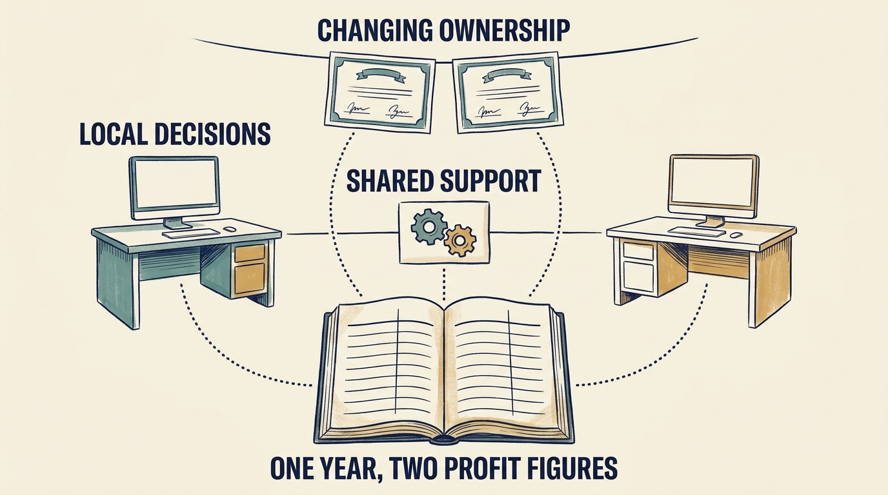

In December 2023, business-software group **Visma** announced a sale of existing owners' **shares**, units of ownership, valuing the company at €19 billion. About 20 new investors would put in over €1 billion and existing investors around €3 billion. **Hg**, involved since 2006, would keep a **majority**, more than half the shares. This was a **secondary sale**, which pays selling owners. [S30: Visma 2023 transaction](https://www.visma.com/newsroom/visma-attracts-new-investors-for-further-international-expansion-in-a-transaction-valuing-the-company-at-eur-19-billion-59703d9f)

**Figure 1:** *Three things to examine separately: who owns the shares after each transaction, how local decisions and shared support are organized, and how each of the year’s two profit figures was calculated.*

A **fund** pools investors' money to buy shares; an **investment manager** such as Hg runs it. One manager can run several funds with different investors, rights and holding periods, the time before they expect to sell. The funds or holding companies own the shares. Hg's 2017 announcement names different funds for its 2006 and 2014 investments. It also announced KKR's complete sale and Cinven's sale of 40% of its own holding, subject to approval; Hg would hold 41% of Visma. [S62: Hg 2017 Visma announcement](https://hgcapital.com/insights/hg-leads-usd5-3bn-buyout-of-visma)

The announcements do not identify the 2023 sellers, which Hg funds held the shares afterward, or how much money, if any, reached Visma itself. **Continuity of the manager does not establish continuity of funding.**

Visma describes local decision-making, shared infrastructure (technical foundations such as hosting and security), product investment and 33 acquisitions in 2024, nearly three a month. [S32: Visma annual-report announcement](https://www.visma.com/newsroom/visma-releases-annual-and-sustainability-reports-for-2024-7f5c9f37) The sources document no intervention with its cost and customer outcome; the model is a question, not proof.

**Check the numbers too.** **EBITDA** is profit before interest (borrowing costs), taxes, and depreciation and amortization (charges spreading asset costs over years of use). Visma’s 2024 annual report shows EBITDA of €892.646 million; its 2025 report adds back €11.665 million of “M&A expenses” (mergers and acquisitions: fees for carrying out deals, not the companies’ purchase prices), to reach **adjusted EBITDA** of €904.311 million for the same year. [S43: Visma 2024 annual report](https://cdn.prod.website-files.com/69787181d8720ea08c1f22fe/69787181d8720ea08c1f460b_Visma-Annual-Report-2024.pdf) [S44: Visma 2025 annual report, p. 96](https://cdn.prod.website-files.com/69787181d8720ea08c1f22fe/69bb9fc407e856cb8d6f7726_Visma%20Annual%20Report%202025.pdf) An **add-back** removes a recorded expense from the comparison; no cash comes back; the later figure is a changed measure, not extra performance.

**Costs can be exceptional for one transaction while recurring across a continuing program.** A group that keeps acquiring must plan cash and engineer-weeks (one engineer for one week) to buy the next companies and integrate the last ones, know which earnings measure its lenders apply, and name who approves the next purchase.

After such a transaction, recheck: which funds or holding companies hold the shares and what they expect, without assuming one fund holds the majority; whether the shared-service budget and integration capacity (people and time to connect acquired systems and move customers) are still funded, and by whom; and which earnings definition the board, lenders and plan each use. Independent customer, employee and acquired-company evidence is missing.
