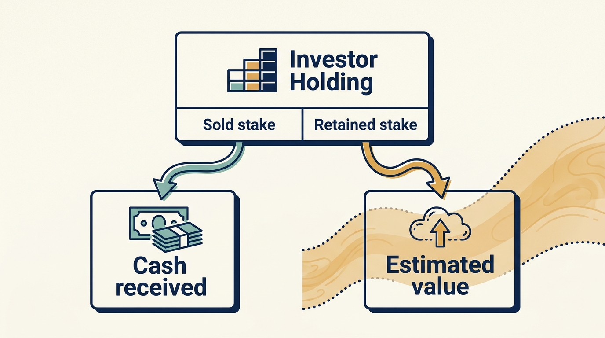

> **IN THIS SECTION, YOU WILL:** Follow TeamSystem, an Italian business-software group, through a chain of owners, and learn how the period a report covers and the earnings measure it uses change what the results appear to say.

> **WHY INVESTORS CARE:** Each new investor pays a new price for progress the earlier owners already made, and measures its own return from that price. Before paying, it needs to know which unfinished work and which of the company's financing obligations come with the price.

> **WHY YOU SHOULD CARE:** The buyer's plan starts on the day of the sale; the company's work does not. A leader who cannot separate the new owner's starting point from the continuing workload misreads both the results and the work still to do.

> **KEY POINTS:**
>
> * **A change of owner is a new financial starting point, not a new company.** The buyer measures its return from the price it paid. The company's products, knowledge and dependencies carry across the sale, and so do its unfinished work and obligations; whether customers and employees were better off requires separate evidence.
> * **Compare like periods.** TeamSystem's 2016 accounts covered only ten months because the company changed hands in March, so a 37.7% rise in revenue (sales recorded before any costs) shrinks to 8.9% once 2016 is reconstructed as a full year that also counts the businesses bought during 2016 from January.
> * **Compare like measures, and read both beside the cash.** The company's **adjusted earnings**, a profit figure calculated with specified costs left out, were positive in 2017 while its result under the accounting rules was a loss. The gap is mostly charges that spread the cost of earlier purchases over several years and a borrowing charge larger than the interest actually paid; neither figure shows the money actually paid.

 
TeamSystem provides business software, including products used by accountants and smaller companies in Italy. Since 2000 it has been bought and sold several times by investment firms. Its history raises a useful question: how can a software group grow, keep developing products, report positive adjusted earnings and still report a loss under the accounting rules it must follow? Answering it means asking what changed in the operating business, what was bought, how the purchases were financed, and which costs each measure includes.

**Revenue** is the value of sales recorded for a period, before any costs are subtracted. **Profit** is what remains after subtracting costs. Different measures include different costs, so one year can have several profit figures. Adjusted earnings is one of them: a profit figure the company calculates with specified costs left out. The reconciliation later in this chapter shows which costs. **Cash** is the money actually received or paid, and its timing differs from both: a sale can be recorded before the customer pays, and a cost can be recorded years after the money left.

Across those sales, product work carried on. **Customer migrations** (moving customers and their data from an older product to a newer one), **integrations** (making acquired products, systems and teams work together) and dependencies on particular systems and people remained somebody's responsibility whoever held the shares. TeamSystem is the case that most directly tests the chapter [[acquisition-adds-work-first]]: successive purchases of software businesses, carried on across several owners. The chapter follows selected evidence from a regional Italian software company in 2000 through its 2017 financial report, then adds a shorter follow-up on how one early investor sold down its interest between 2021 and 2024. It examines distinct ownership episodes, not one continuous investment by an interchangeable “private equity” owner, and it isn't an assessment of the company's current value.

**Private equity** firms buy ownership stakes in companies whose shares are not traded on a stock exchange, using money pooled from investors, and aim to sell those stakes later at a higher value. A **buy-and-build** strategy expands a group through further purchases of businesses. **Statutory results** are those prepared under the accounting rules the company must follow; adjusted figures are management's modifications of them. The sources have different strengths: investor accounts explain their stated ambitions and what they say they received, while company financial statements expose operating measures, investment and financing. Neither shows what any single management decision caused.

## The Ownership Episodes

**Enterprise value** is a price for the whole operating business, counting together what belongs to its shareholders and what it owes to its lenders, whichever mix of the buyers' own money and borrowed money pays for it. It is not the price of one shareholder's stake, and it is not the price of all the shares either: what the shareholders as a group receive is, broadly, enterprise value minus the company's debt plus its cash, subject to adjustments agreed in the transaction. **EBITDA** stands for earnings before interest, taxes, depreciation and amortization: profit from operations before the cost of borrowing, before tax, and before the yearly charges that spread the cost of equipment, software and acquired businesses over the years they are used. Because it leaves those costs out, it is usually higher than profit and is never the cash left over. A **multiple** expresses one figure relative to another: 11.3× EBITDA means the price equals 11.3 times that year's EBITDA. A **majority** owner holds more than half of the shares and normally controls the company; a **minority** investor holds less than half.

Hg, earlier called HgCapital, is an investment manager. It invests through **funds**: pools of money committed by many investors, which Hg manages and invests on their behalf. HgCapital Trust plc (**plc** is a public limited company) is a separate company listed on the London stock exchange with shareholders of its own; it invests in Hg's funds and therefore holds a slice of each investment those funds make, including TeamSystem. The sterling amounts quoted below are the Trust's slice, not the price of the whole company. Money from a company sale reaches the fund first; what the Trust reports as gross proceeds comes before performance fees (the manager's share of gains) and other deductions, and the Trust's own shareholders receive cash only through a further step. [S71: HgCapital Trust 2024 report, PDF pp. 46–47](https://www.hgcapitaltrust.com/~/media/Files/H/Hgcapital-Trust-V2/documents/investors/publications/2024/hgt-fy-2024-report-and-accounts.pdf) The chapter [[fund-economics]] explains fees and distributions in more detail.

The first four rows are the chapter's operating-history window, 2000 to 2017, for which the company's own financial report is examined below. The last three rows are a follow-up on investment ownership and proceeds after that window, resting on transaction announcements and the Trust's annual reports rather than on company financial statements. The detailed 2021–2024 sequence is given once, in the partial-exit section. Reported multiples are left out of the table because they concern different entry prices (the price each investor paid), dates, currencies and ownership positions and would not rank the owners.

| Owner or investor | Documented event | Date and status | What the evidence establishes |
| --- | --- | --- | --- |
| Palamon Capital Partners | Investment in a founder-led regional business; later sale to Bain Capital | June 2000 investment; December 2004 sale (the webpage's summary field gives a conflicting exit year; its narrative and Bain's later statement support 2004) | The investor's own later account: about 28,000 clients and 200 employees at entry, €58 million revenue and more than 450 employees at the 2004 sale. Reported, not independently verified. [S45](https://www.palamon.com/teamsystem) |
| Bain Capital | Majority ownership | 2004 to 2010, per Bain's statement in the 2015 sale announcement | Ownership period only; no operating evidence from this owner was consulted. [S47](https://www.hgcapitaltrust.com/news-insights/news/archive/12072015) |
| HgCapital | Agreement to acquire a majority stake at an enterprise value of €565 million, 11.3× EBITDA for the 2010 financial year | Announced August 2010; completion anticipated for September 2010 | Announced terms and reasoning, not audited closing amounts. [S46](https://www.hgcapitaltrust.com/news-insights/news/archive/08032010) |
| Hellman & Friedman, with HgCapital retaining a minority | Sale of TeamSystem by HgCapital; retained minority interest | Announced December 2015; described as completed in the March 2016 results presentation | £39 million of cash proceeds to HgCapital Trust plc and a retained stake valued at £6.1 million; the Trust's slice, not the whole price. [S47](https://www.hgcapitaltrust.com/news-insights/news/archive/12072015) [S48](https://www.hgcapitaltrust.com/~/media/Files/H/Hgcapital-Trust-V2/documents/investors/financial-calendar/hgcapitaltrust-dec-2015-general.pdf) |
| Hellman & Friedman (a later fund) and Hg (a later fund) | Hg's earlier fund sells its minority; HgCapital Trust invests about £14.3 million of new money through a later Hg fund | Announced January 2021; the Trust's 2021 annual report records both steps as completed in February 2021 | The Trust's holding changed, so the 2016 stake cannot be traced unchanged to later dates; amounts in the partial-exit section. [S66](https://www.hgcapitaltrust.com/news-insights/news/2021/18-01-2021-131229553) [S67: HgCapital Trust 2021 report, PDF pp. 45, 48 and 51](https://www.hgcapitaltrust.com/~/media/Files/H/Hgcapital-Trust-V2/documents/investors/publications/2021/hgt-annual-report-and-accounts-2021.pdf) |
| Silver Lake | Agreement to buy a €600 million minority stake from Hellman & Friedman, which would remain the majority shareholder | Announced May 2023, with closing expected around the end of 2023 subject to conditions; completion not verified here | Buyer's announcement only; if completed, it would add a further minority owner. Separately, the Trust announced a partial sale of its own holding in August 2023 (see the partial-exit section). [S68](https://www.silverlake.com/silver-lake-to-make-e600m-strategic-investment-in-teamsystem/) [S69: HgCapital Trust 2023 report, PDF pp. 45–46](https://www.hgcapitaltrust.com/~/media/Files/H/Hgcapital-Trust-V2/documents/investors/publications/2023/hgt-annual-report-and-accounts-2023-v1.pdf) |
| Hellman & Friedman | Agreed purchase of HgCapital Trust's remaining investment | Announced July 2024, completion subject to closing conditions (requirements that must be met before the sale takes effect); the Trust's 2024 annual report lists TeamSystem among the full realizations (complete sales of a holding) made during 2024 | An announced value of £24.3 million and a different, gross proceeds figure in the annual report; neither is net cash to the Trust's shareholders, and neither is the 2016 stake turned into cash. Amounts in the partial-exit section. [S70](https://www.hgcapitaltrust.com/news-insights/news/2024/08-07-2024) [S71: HgCapital Trust 2024 report, PDF pp. 46–47](https://www.hgcapitaltrust.com/~/media/Files/H/Hgcapital-Trust-V2/documents/investors/publications/2024/hgt-fy-2024-report-and-accounts.pdf) |

The company's own results are analysed only for the 2000–2017 window; the later rows are followed as far as the Trust's published documents allow.

National expansion changes more than sales coverage: a founder may no longer be able to resolve every product exception, customer dispute and investment priority personally, so developing management capacity can be part of product value creation. That's an interpretation of the proposed mechanism, not proof that each recruitment caused the observed growth, and headcount growth doesn't establish a better employee experience.

The 2010 announcement emphasized business software used by accountants and smaller companies, recurring demand, and opportunities for **organic growth** (growth of the businesses already owned) and acquisitions (buying further businesses). [S46: TeamSystem acquisition announcement](https://www.hgcapitaltrust.com/news-insights/news/archive/08032010) Software supporting customers' recurring administrative work may offer attractive repeat demand, but the seller can already charge for that attraction in the **entry price**, the price the investor pays and from which its own return is measured. A good company doesn't automatically become a good investment at every price; the chapter [[valuation-is-an-estimate]] develops that connection.

## What the Owners Say They Changed

HgCapital's March 2016 results presentation attributes several initiatives to its involvement: product strategy, pricing, financial reporting, cash collection (getting customers to pay what they owe) and the acquisition process. It links a 2013 refinancing, in which the company replaced its existing borrowing with newly issued bonds (tradable loans sold to investors), to financing flexibility, and it reports eleven acquisitions during the ownership period. This is the account of the **financial sponsor**, the investment firm that organised and led the investment, of its own contribution. [S48: HgCapital Trust 2015 results, p. 14](https://www.hgcapitaltrust.com/~/media/Files/H/Hgcapital-Trust-V2/documents/investors/financial-calendar/hgcapitaltrust-dec-2015-general.pdf)

These interventions work through different mechanisms: better reporting can expose a problem without solving it, faster collection can release cash without changing a product, and acquisitions can add capability immediately while creating integration work that continues for years. The useful task is to reconstruct the chain between an intervention and its intended result:

| Proposed intervention | Possible business mechanism | Evidence that would test it |
| --- | --- | --- |
| Change the set of products offered | Concentrate investment on valuable customer work | Adoption (whether customers use the product), retention (whether they keep using and paying for it) and the profit contributed by affected customer groups after the cost of serving them; discontinued commitments |
| Change pricing or how features are bundled | Charge for useful value or reduce costly exceptions | Customer response, support burden, cancellations and cash collected, as well as revenue recorded in the accounts |
| Improve billing and collection | Reduce disputed invoices and time until payment | Dispute causes and actual collection times, separated from one-off recovery of old balances |
| Acquire another software business | Add customers, domain knowledge or functionality | Growth after removing the businesses bought during the period, integration costs and outcomes for existing and acquired customers |

The table is an assessment framework, not an assertion that TeamSystem measured these outcomes or that every initiative succeeded.

## A Partial Exit Has a Cash Part and a Valuation Part

An **exit** is the sale of an investment; a **partial exit** sells part of it and keeps the rest; investors call turning a holding into sale proceeds a **realization**. In December 2015, HgCapital announced an agreement to sell TeamSystem to Hellman & Friedman while retaining a minority interest. The March 2016 presentation then described the transaction as completed and reported £39 million of cash proceeds to HgCapital Trust plus a retained stake valued at £6.1 million. It presented a 1.8× investment return: an **investment multiple** compares the value returned and still held with the money originally invested, and is a different ratio from the EBITDA multiple used to price the company in 2010. [S47: TeamSystem sale announcement](https://www.hgcapitaltrust.com/news-insights/news/archive/12072015) [S48: HgCapital Trust 2015 results, p. 14](https://www.hgcapitaltrust.com/~/media/Files/H/Hgcapital-Trust-V2/documents/investors/financial-calendar/hgcapitaltrust-dec-2015-general.pdf)

The £45.1 million combined figure therefore contains two different things: money received and **retained investment value**, the estimated value of an interest still exposed to future results. Calling all of it realized cash would remove the remaining risk from the story. Nor does the presentation reconstruct every fee, payment into the fund and payment out of it that would be needed to calculate a net return for an ultimate investor, the person or institution at the end of the ownership chain.

What happened to the retained interest later illustrates the same distinction, and each later document answers a different question.

| When | What happened to the Trust's holding | Source and what it establishes |
| --- | --- | --- |
| January 2021 | The Trust announced that Hg's earlier fund was selling its minority holding, while the Trust itself invested about £14.3 million of new money through a later Hg fund. The announcement valued the Trust's existing investment at £21.3 million. | Announcement: announced values only. [S66: Hg invests in TeamSystem, January 2021](https://www.hgcapitaltrust.com/news-insights/news/2021/18-01-2021-131229553) |
| February 2021 | Both steps completed, with £21.4 million of **gross proceeds** (proceeds before deductions) from the earlier fund. The holding after this date is a new investment at a new cost, not the 2016 stake. | The Trust's 2021 annual report: completion and gross proceeds. [S67: HgCapital Trust 2021 report, PDF pp. 45, 48 and 51](https://www.hgcapitaltrust.com/~/media/Files/H/Hgcapital-Trust-V2/documents/investors/publications/2021/hgt-annual-report-and-accounts-2021.pdf) |
| August 2023 | The Trust announced a partial sale of that later holding, with about £8 million estimated to come back and the holding valued at about £33.3 million; the 2023 report lists it among realizations expected after the year end. At 31 December 2023 the holding's **carrying value**, the value at which the Trust recorded it in its accounts, was £31.9 million. | The Trust's 2023 annual report: expected realization and carrying value. [S69: HgCapital Trust 2023 report, PDF pp. 45–46](https://www.hgcapitaltrust.com/~/media/Files/H/Hgcapital-Trust-V2/documents/investors/publications/2023/hgt-annual-report-and-accounts-2023-v1.pdf) |
| July 2024 | The Trust announced an agreed sale of its remaining investment to Hellman & Friedman at a value of £24.3 million against a carrying value of £22.1 million, with completion subject to **closing conditions**, requirements that must be met before an agreed sale takes effect. | Announcement: agreed value, not cash received. [S70: Sale of remaining investment in TeamSystem, July 2024](https://www.hgcapitaltrust.com/news-insights/news/2024/08-07-2024) |
| During 2024 | The 2024 annual report lists TeamSystem among the full realizations made during 2024 with £34.189 million of gross proceeds, and the adjacent account says £34.2 million was returned to the Trust. | The Trust's 2024 annual report: reported gross realization. [S71: HgCapital Trust 2024 report, PDF pp. 46–47](https://www.hgcapitaltrust.com/~/media/Files/H/Hgcapital-Trust-V2/documents/investors/publications/2024/hgt-fy-2024-report-and-accounts.pdf) |

The 2024 report is stronger evidence than the announcement, but it is a different figure with a different scope. The table covers gross realizations for the whole year, before performance fees, deductions connected with the fund's borrowing arrangements, and any timing gap between the company sale and the fund's payment to its investors. It does not say whether the year's figure includes the proceeds of the 2023 partial sale, and the report does not explain the difference from the July value.

Completion is also stated less firmly than a realizations table suggests. The report's narrative still describes the sale as agreed rather than completed, and the table's footnote warns that a “full” realization can coexist with a stake retained through another Hg fund, although for TeamSystem the report describes the sale of the remaining investment.

Three numbers therefore have to be kept apart: an agreed transaction value, gross proceeds as reported by the Trust, and the net cash an ultimate investor receives, which none of these documents states. The question this chapter raises about the 2016 retained investment value is not closed by any of them; a documented cash-and-holdings history would be needed to close it.

Palamon reports a 4.1× return for its earlier ownership episode. [S45: Palamon TeamSystem case](https://www.palamon.com/teamsystem) These reported multiples don't rank the two owners' operating skill; they concern different entry prices, dates, ownership positions and stages of development.

A **buyout** is the purchase of a controlling stake in a company; a **secondary buyout** sells a company from one private-equity owner to another. For management, it creates another distinction: the company continues, but the new shareholder's investment starts at a new price. Earlier operational progress is part of the asset the buyer purchases and can't simply be counted again as new value creation. The incoming investment plan needs its own credible future improvements and the money to pay for them.

**Figure 1:** *Separate money already received from the estimated value of ownership that remains.*

## Growth Depends on Which Year You Compare

TeamSystem Holding's 2017 **consolidated** report, the accounts that add up the parent company and every business it controls as if they were one, is the company's own financial cross-section after the 2016 change of control. Because the group was acquired in March 2016, its 2016 income statement (the statement of revenue and costs for the period) under the accounting rules included operations only from the acquisition date, not a full comparable calendar year. This shortened comparison is specific to TeamSystem's disclosed change of control; an ownership change does not automatically restart a company's reporting period.

Management also supplied a **pro forma** comparison, a constructed presentation built on stated assumptions, and two of them matter here. First, the March 2016 acquisition of the group is treated as if it had happened on 1 January 2016, which restores January and February. Second, the companies the group itself bought during 2016 are treated as if it had owned them from 1 January 2016 as well, so the base is larger than adding two months to the statutory figure would make it.

On the pro forma base, 2016 total revenue was about €290 million, compared with about €229 million in the statutory presentation, and 2017 total revenue of €316 million was 8.9% higher. Simply dividing the two statutory totals would give about 37.7% growth. The arithmetic is correct, but the comparison is unsuitable for describing a full year's operating improvement. Even the 8.9% comparison isn't an isolated measure of organic growth: the directors attribute part of it to businesses that entered the group's accounts for the first time in 2017. [S49: TeamSystem 2017 report, PDF pp. 10–11 and 23](https://www.teamsystem.com/media/files/865_Consolidated%20Financial%20Statements%20as%20at%20and%20for%20the%20year%20ended%2031%20December%202017%20of%20TeamSystem%20Group.pdf)

If a new acquisition adds both revenue and engineers, revenue per engineer may move **without any change in delivery effectiveness**. If a product enters the group's accounts partway through a year, annual support costs and annual revenue may cover different intervals. Finance and technology teams need a shared definition of the business and period being compared before discussing productivity.

## From Adjusted EBITDA to the Statutory Loss

The same report shows adjusted EBITDA of €113.010 million and a consolidated loss for the year of €56.788 million. The gap of about €169.8 million is not a mystery and not a cash payment to one recipient; the report **reconciles** it, listing the additions and subtractions that turn one figure into the other. The table follows the company's reconciliation and income statement, in millions of euros, consolidated, for the year ended December 31, 2017, with a plain-language note on each line. [S49: TeamSystem 2017 report, PDF pp. 10–11, 23 and 45](https://www.teamsystem.com/media/files/865_Consolidated%20Financial%20Statements%20as%20at%20and%20for%20the%20year%20ended%2031%20December%202017%20of%20TeamSystem%20Group.pdf)

| Step, 2017 consolidated | € million | What the line means |
| --- | ---: | --- |
| Adjusted EBITDA, the company's adjusted measure | 113.010 | The company's preferred earnings figure, before every item below |
| Less costs management classes as non-core (components listed below the table) | −20.342 | Costs the company did incur but leaves out of adjusted EBITDA as unrelated to normal operations |
| Less allowance for bad debts | −3.896 | An estimate of customer invoices unlikely to be collected |
| Less other provisions for risks and charges | −7.028 | Estimated future costs of obligations whose amount or timing is uncertain; a charge, not money set aside in an account |
| Less impairment of non-current assets | −0.150 | A reduction in a long-lived asset's recorded value because it is expected to earn back less than that value |
| Less depreciation and amortization of non-current assets | −72.459 | Yearly charges spreading the cost of equipment, software and acquired businesses over the years they are used; recording the charge moves no cash, and when the assets were paid for is a separate question |
| **Operating result** (as reported; the components are rounded) | **9.137** | Profit from operations before financing and tax |
| Less net finance cost, an accounting charge: finance income 7.618, finance cost 79.674, share of associates 0.016 | −72.039 | The accounting cost of financing the group, not the interest paid; components below. Associates are companies the group part-owns and can influence without controlling |
| **Loss before income taxes** | **−62.903** | |
| Plus income tax, a net credit: current tax −5.971, deferred tax +12.086 | +6.115 | An accounting tax benefit that reduces the reported loss; not a refund (explained below) |
| **Loss for the year, consolidated** | **−56.788** | |
| Of which attributable to owners of the company (after 0.346 attributable to non-controlling interests) | −57.134 | Outside shareholders of partly owned subsidiaries had a profit share of 0.346, so the loss belonging to the group's own owners is larger than the total |

The non-core total of €20.342 million is made up of the following components.

| Cost management classed as non-core, 2017 | € million |
| --- | ---: |
| Advisory expenses for reorganization and cost-saving projects | 5.937 |
| Personnel redundancy, the cost of cutting jobs | 2.826 |
| Agreed payments to settle claims by clients and sales agents | 2.416 |
| Information-technology costs of joining and changing systems | 1.866 |
| Strategic marketing | 1.720 |
| A program to help staff adopt new ways of working | 1.696 |
| Changing and closing locations | 1.376 |
| Costs of buying and combining companies | 1.282 |
| Four smaller items | 1.223 |
| **Total classed as non-core** | **20.342** |

Two lines carry most of the gap, and neither is a cash payment of the amount shown. Depreciation and amortization of €72.5 million spreads the cost of assets acquired earlier, including **intangible assets** (assets without physical form, such as software, brands and customer relationships) that were recognized when the 2016 purchase price was allocated across the things the buyer had bought. The charge itself involves no cash payment in 2017, and it says nothing about when, or how, those assets were paid for. The pro forma comparison in the growth section also adjusts its 2016 figures for the amortization of intangible assets expected once the purchase prices of the subsidiaries bought in 2016 were allocated, so the charge affects the comparison of results as well as the statutory loss.

Net finance cost of €72.0 million is the accounting charge for financing the group, and it is not the interest bill. Notes 7 and 8 to the financial statements show that it includes items with no cash movement, listed in the supporting table. The **vendor loan** is the report's name for amounts still owed to the sellers of acquired companies, including payments that depend on those businesses' later results and the price of buying out the sellers' remaining shares; because the amount is an estimate, the accounts re-estimate it each year, and an increase is charged to profit.

| Non-cash item inside net finance cost, 2017 | € million | What it is |
| --- | ---: | --- |
| Remeasurement of the vendor loan (charge) | 15.3 | The estimate of amounts owed to sellers of acquired companies went up |
| Discounting charges on the same liability | 5.4 | Future payments are recorded at today's lower value, and the difference is charged as the payment date approaches or the rate used to discount it changes |
| Amortized financing fees | 6.9 | Costs of arranging borrowing, charged to profit over the life of the loans rather than when paid |
| Remeasurement gain recorded in finance income | −7.5 | The estimate of another amount owed went down |

Note 10 to the statements reports what was paid, and the main lesson sits in one comparison: **€52.1 million of finance costs was paid in 2017, against the €72.0 million charge**. Most of the payment, €49.8 million, was interest on the group's **notes**, bonds sold to investors that pay interest until they are repaid; the rest was mainly other interest and bank charges. The supporting table lists the components the note discloses, together with the year's borrowing movements.

| Finance costs paid and borrowing movements, 2017 (note 10) | € million | What it is |
| --- | ---: | --- |
| Interest on the €150 million senior notes | 13.5 | **Senior** means these lenders rank ahead of lenders with lower-ranking claims if the company cannot pay everyone |
| Interest on the €570 million senior secured notes | 36.3 | **Secured** means the lenders can claim specific assets if the company does not pay |
| Other interest and bank charges | 1.9 | Described in the note as mainly interest and bank charges; the itemized components sum to €51.7 million, and the remaining €0.4 million is not itemized |
| **Finance costs paid** | **52.1** | The payment category the note discloses |
| New senior secured notes issued | +80.0 | New borrowing, which must be repaid later |
| Drawn on a credit line | +34.5 | A **credit line** lets the company borrow up to an agreed limit as needed, with repayments governed by the lending agreement; this one was a €65 million facility maturing in September 2021 (note 19) |
| Repayments on the credit line | −81.5 | Money returned to the lenders |
| Other debt settled | −1.2 | Mainly debt of companies that joined the group in the prior year |
| **Net loan proceeds after repayments** | **31.8** | Borrowing movements, not a cost: 80 + 34.5 − 81.5 − 1.2 |

The cash-flow statement, which records money received and paid, does not show interest paid on its face: its financing line nets the €52.1 million paid against the €31.8 million of net loan proceeds after repayments, which is why note 10 is needed to see the payment at all. Net loan proceeds are not a cost. They are money that must be repaid later, raised in 2017 from an €80 million issue of new notes and from a credit line that was drawn and repaid during the year.

Removing the four non-cash items from the net charge leaves about €52.0 million, close to the €52.1 million paid; that is the chapter's rough check, not a reconciliation the company provides. Neither substitution is safe: the €72.0 million charge overstates the year's interest payments, and the €52.1 million paid is not every financing cash outflow, because €2.0 million of financing fees and €11.1 million of vendor-loan payments appear on separate lines. The directors' own explanation names the two large items: the loss was mainly attributable to the amortization of intangibles arising from the purchase-price allocation and to finance costs on a higher level of debt, both consequences of the 2016 change of control. [S49: TeamSystem 2017 report, PDF pp. 11, 26 and 48–49](https://www.teamsystem.com/media/files/865_Consolidated%20Financial%20Statements%20as%20at%20and%20for%20the%20year%20ended%2031%20December%202017%20of%20TeamSystem%20Group.pdf)

The other charges in the reconciliation are also not payments. Recording a provision, an impairment or a bad-debt allowance moves no cash by itself. Whether anything was paid on the underlying obligations during the year has to be read from the cash-flow statement, not from the charge.

The tax line separates the same two things. It shows a credit of €6.1 million that reduces the reported loss, yet the company paid €15.7 million of income tax in cash. The credit is an accounting benefit, not a refund. It arises because **deferred tax**, the tax effect expected in future years from differences between accounting rules and tax rules, moved €12.1 million in the company's favour, more than the €6.0 million of tax charged for the year itself.

Cash flows from operating activities, the money the business itself generated, were €61.8 million after that tax payment. That figure comes before €25.3 million of **capital expenditure** (spending on assets used over several years, such as software development recorded as an asset) and before the €52.1 million of finance costs paid, which the statement places under financing activities. [S49: TeamSystem 2017 report, PDF p. 26](https://www.teamsystem.com/media/files/865_Consolidated%20Financial%20Statements%20as%20at%20and%20for%20the%20year%20ended%2031%20December%202017%20of%20TeamSystem%20Group.pdf)

A loss alone doesn't establish that customers received worse software; most of it is amortization of the price paid when the group changed hands, and the cost of the debt that funded it. Adjusted EBITDA alone doesn't establish that the ownership structure leaves enough cash for reinvestment; it sits above about €52 million of finance costs actually paid, €25 million of capital expenditure and €20 million of costs the company incurred and classed as non-core in the year. Keeping the reconciliation visible is more useful than choosing the number that best supports a preferred story.

## Investment Continues, but Its Classification Matters

The capital expenditure above includes about €13.4 million of **capitalized development** in 2017 (development work recorded as an asset rather than as an immediate expense), split between personnel and service costs. The report also describes an additional €80 million issue of secured notes, new borrowing through bonds backed by specific assets, part of whose proceeds repaid a €20 million loan from the company's parent, the entity through which its owners hold it. These are evidence of investment and financing activity, not measurements of the resulting customer benefit. [S49: TeamSystem 2017 report, PDF pp. 9, 14–15 and 26](https://www.teamsystem.com/media/files/865_Consolidated%20Financial%20Statements%20as%20at%20and%20for%20the%20year%20ended%2031%20December%202017%20of%20TeamSystem%20Group.pdf)

Capitalizing qualifying development records it as an asset to be charged against profit over several years rather than as an expense in the year the work is done. Capitalization does not eliminate the underlying cash cost; it changes when the cost reaches profit, not whether it is paid, so the cash plan should use the payment dates, which contracts and the timing of invoices can move across a period end. The accounting distinction is explained in the chapter [[obligations-before-budget]]; the disclosed capitalized amount isn't a measure of all research and development effort.

The reconciliation also shows €1.9 million of information-technology integration and transformation costs and €1.3 million of acquisition and merger costs treated as non-core in 2017, after €13.6 million of acquisition costs in the 2016 statutory period. Whether such costs are exceptional or a recurring requirement of a strategy that keeps buying companies is the question the chapter [[visma]] examines with a precisely reconciled example; that chapter owns the lesson. Here the narrower point is that an integration cost excluded from an adjusted measure is still work the operating team must do and cash the company must find.

## What Remains Unknown About Customers and Employees?

The consulted records support a history of expansion, ownership transactions, investment and financial change. They provide much less independent evidence about the people using and building the products. A customer can renew because the software is valuable, because switching is difficult, or both; the share of customers or revenue that stays from one year to the next can't distinguish those situations. For employees, aggregate growth doesn't reveal how responsibilities, workload, professional development or bargaining power changed.

These limitations prevent a verdict that every ownership episode created durable mutual benefit. They also prevent the opposite shortcut: treating heavy borrowing or a statutory loss as proof that all operating development was illusory. The company, investors and individual stakeholders need separate assessments.

## What Each New Owner Inherits

The periods examined here involve successive transactions and continuing acquisition work. For the leader inheriting that work, a new owner's starting point in a financial model isn't the beginning of the product's obligations. Customer migrations, development commitments and dependence on particular people's knowledge can span several ownership periods, and each new owner buys the progress already made together with the work still unfinished.

The proposed application is to carry a consistent record of commitments, costs and actual outcomes across the handover, in the form the chapter [[handover-of-obligations]] describes. Ask the incoming shareholder which assumptions in its plan depend on work already under way and whether it has funded the remaining burden. Ask the chief financial officer which earnings definition matters to valuation, which cash flows fund the plan and which costs recur across acquisitions. As product and technology leaders, say which customer capabilities the next acquisition adds and what existing work it displaces. Then agree on a few observations that can change the plan: customer migration failures, acquired products that don't fit, savings that stay unreleased, or an integration team whose workload exceeds its capacity. A plan that can't be revised in response to such evidence isn't being managed as a hypothesis.

That method can also help through another round of new investment or entry into a corporate group. TeamSystem's disclosed history doesn't establish results for those settings; it gives a concrete reason to ask **what operating work survives the transaction**. This is a proposed leadership practice, distinct from the observed company history.

**Figure 2:** *Each investor starts with a new investment question, while company responsibilities continue.*

The final chapter brings the cases together and asks the question the ownership episodes leave open: when owners, prices and reporting bases keep changing, what would a lasting improvement mean for each group affected, and who received the gains and carried the costs? Continue with the chapter [[success-for-whom]]. What TeamSystem shows on its own is what a group accumulates across its owners: useful products and knowledge, but also obligations, dependencies and continuing work.

## Questions to Consider

1. *Which improvements in your company does the current owner's entry price already assume, and which new improvements does its plan require?*
2. *If your company has been through more than one ownership period, which operating commitments span them, and did each new owner fund the remaining burden?*
3. *What is your company's statutory result, which reported lines reconcile it to the adjusted earnings measure investors discuss, and which of those lines consume cash this year? For the finance charge, what was actually paid?*
4. *When you compare growth or productivity across periods, are the businesses and intervals consistent? What would acquisition timing do to the comparison?*

## To Probe Further

- **[Inorganic growth strategies and the evolution of the private equity business model](https://ideas.repec.org/a/eee/corfin/v45y2017icp31-63.html)** — Benjamin Hammer, Alexander Knauer, Magnus Pflücke and Bernhard Schwetzler, Journal of Corporate Finance, 2017. *Peer-reviewed evidence from 9,548 buyouts that add-on acquisitions (further businesses bought by a company an investor already owns) raise the chance of exit to another investor, which places TeamSystem's sequence of acquisitions and owners in a wider pattern.*
- **[On Secondary Buyouts](https://corpgov.law.harvard.edu/2015/11/10/on-secondary-buyouts/)** — François Degeorge, Jens Martin and Ludovic Phalippou, Harvard Law School Forum on Corporate Governance, 2015; the paper appeared in the Journal of Financial Economics, 2016. *The authors' summary of their finding that secondary buyouts produced higher returns for the buyer when the buyer's and seller's skills complemented one another, that is, worked well together, gives a way to ask what each new owner of TeamSystem brought.*
- **[Hg invests in TeamSystem](https://www.hgcapitaltrust.com/news-insights/news/2021/18-01-2021-131229553)** — HgCapital Trust plc, January 18, 2021. *The trust's announcement that one Hg fund was selling its minority holding while the trust invested about £14.3 million of new money through a later fund; it shows the holding changed after 2016, so the 2016 retained stake cannot be assumed to run unchanged to later announcements.*
- **[Silver Lake to Make €600M Strategic Investment in TeamSystem](https://www.silverlake.com/silver-lake-to-make-e600m-strategic-investment-in-teamsystem/)** — Silver Lake, May 19, 2023. *The buyer's interested announcement of a €600 million minority stake, documenting another owner buying into the company's accumulated progress after the period this chapter examines.*
- **[Sale of remaining investment in TeamSystem](https://www.hgcapitaltrust.com/news-insights/news/2024/08-07-2024)** — HgCapital Trust plc, July 8, 2024. *The seller's announcement of an agreed sale to Hellman & Friedman valuing the trust's investment at £24.3 million, with completion subject to closing conditions. It reports an agreed value, not cash received. The holding sold was not the 2016 stake: Hg's earlier fund sold that stake in February 2021, and the Trust invested new money through a later fund. The Trust's 2024 annual report (S71 in the bibliography) later lists the realization with a different, gross figure.*
- **[Annual Reports](https://www.teamsystem.com/en/investors/annual-reports-eng/)** — TeamSystem investor relations, consolidated financial statements for 2015 to 2025. *The company's own consolidated statements let a reader repeat the chapter's 2017 exercise of reconciling adjusted EBITDA to the statutory result, after checking which entity each year covers.*
