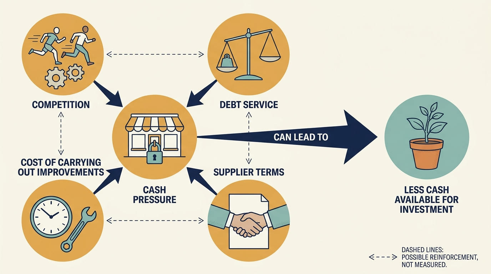

> **IN THIS SECTION, YOU WILL:** Learn how positive operating earnings, a reported net loss and a supplier cash shock combined, and what a technology transition needed before it could be funded.

> **WHY INVESTORS CARE:** Borrowing used to buy a company creates payment obligations that can limit later investment. Refinancing (replacing one loan with another) and later decisions change those obligations. When cash is committed elsewhere, the transition the investor is counting on gets squeezed.

> **WHY YOU SHOULD CARE:** Before agreeing to a transition timetable, a technology leader needs to know whether the company can fund its existing obligations and the transition until the improvement pays off. This case shows what that question looks like when suppliers want their money sooner.

> **KEY POINTS:**
>
> * **Positive operating earnings are not cash available for reinvention.** In fiscal 2016 the company reported $460 million of operating earnings (the accounting profit from running the business, before interest and tax), a net loss (the result after interest, tax and other items) and roughly zero operating cash flow (cash actually received from customers minus cash actually paid to run the business). Name the measure, its scope and its period before drawing a conclusion from any of them.
> * **A supplier cash shock can arrive faster than any transition.** Management reported that concern about survival led suppliers to demand earlier payment, which raised the immediate cash need and left less room to fund the work that was meant to restore the business.
> * **Consequences extend beyond shareholders.** Shareholders are the owners of a company's shares, and the investor outcome is theirs. What employees faced and what suppliers lost need their own account rather than being inferred from that outcome.

 
Toys “R” Us was a large toy and baby-products retailer, and its US business failed during the ownership episode examined here. That history is often reduced to a short explanation: debt killed the company, online competition killed it, or management failed to adapt. Each points to a possible mechanism. None alone is a complete explanation.

The documents consulted describe technology gaps and proposed investment alongside severe pressure from debt and from bills falling due. They show why a transition needed funding, but not that the proposed work would have restored competitiveness. The chapter therefore asks a narrower question than “what killed Toys R Us”. What did the company have to pay before any technology plan could produce a result, and what happened when suppliers wanted their money sooner?

The previous cases examined investments that ended in a successful sale, and a software group that kept growing under successive owners. This one examines a failure. It begins with the purchase, then follows the technology plans, the reported financial position, the supplier shock and the consequences of the US shutdown. The chapter [[valuation-is-an-estimate]] introduces the financial measures; the chapter [[obligations-before-budget]] shows how to find the cash behind a technology budget.

## Setting Up the Case: Earnings, Cash and a Supplier Shock

In September 2017, management told the bankruptcy court that news of a possible filing had led nearly 40% of suppliers to tighten payment terms. Some demanded payment in advance or on delivery. The same stock of toys and baby products then needed cash sooner, and a multi-year technology program could not help with that week's payments. Following that shock requires keeping a few financial measures apart.

**Operating earnings** are the company's reported accounting result from operating the business, before interest on borrowing and before income tax. They start from sales minus the cost of the goods sold and the cost of running the stores and websites. They also include other operating income and expenses, such as a gain from selling a brand, so they are not always profit from ordinary trading alone. A **net loss** is what remains after interest, tax and any other items are counted: a negative result means the year's counted expenses exceeded its counted income. **Operating cash flow** is different in kind. It is the cash actually received from customers during the period minus the cash actually paid out to run the business, including, in this company's presentation, the interest it paid.

Accounting earnings and cash differ because of timing. A sale is recorded as revenue when it is made, with the cost of the goods recorded against it, but the cash can move at a different time. In particular, stock may be paid for before or after it is sold, depending on the supplier's terms. As an illustration, a supplier that allows 60 days to pay lets the retailer sell many of the toys before paying for them, while a supplier that requires payment on delivery must be paid before the first one is sold. Some accounting charges, such as spreading the cost of a store fit-out over the years it is used, take no cash at all in the year they are recorded.

**Working capital** is the money tied up in that timing: stock on the shelves plus amounts owed by customers, less the bills not yet paid to suppliers. When suppliers demand earlier payment, working capital rises and cash falls even though nothing about the products has changed. That is the mechanism behind the supplier shock described later. **Capital expenditure** is spending on durable assets, such as store equipment, warehouses or software, that will be used for years. **Debt service** is the cash needed for interest and the scheduled repayment of borrowing. **Liquidity** is the ability to meet payments when they fall due. An earnings measure can be positive while liquidity is inadequate.

## The Transaction and Its Stated Ambition

In March 2005, Toys “R” Us announced an agreement to be bought by companies associated with three investment firms: KKR, Bain Capital and Vornado. The announcement described a $6.6 billion share transaction, meaning the buyers would purchase all the company's shares, the units of ownership, for that total, plus **assumption of debt**, meaning taking on the company's existing borrowing as part of the deal. It emphasized improving the businesses and brands. The acquisition was announced as completed on July 21, 2005. These releases establish the transaction and its stated ambitions; they don't reveal the buying investment firms' own forecasts or the profit they expected to make. [S40: Toys R Us acquisition agreement announcement](https://www.sec.gov/Archives/edgar/data/1005414/000119312505057773/dex991.htm) [S41: Toys R Us acquisition completion](https://www.sec.gov/Archives/edgar/data/899689/000110465905033479/a05-13329_1ex99d1.htm)

The starting point was an established global retailer undergoing a strategic review, so the task differed from funding a young product company: existing stores, suppliers, customer behavior, seasonal trading and financial obligations constrained the available routes to improvement. A complete case would reconstruct the borrowing at purchase, every later **refinancing** (replacing one loan with another), the money paid out to the owners, the fees charged and the capital investment made across the whole period. That isn't attempted here. The evidence below comes from the last two years of the ownership episode, and no assumed investor gain or loss is used as evidence.

## The Company Had a Technology Plan

The fiscal 2016 disclosures discussed the transition of US e-commerce operations and the risks of implementing a new platform. [S34: Toys R Us annual filing excerpts](https://www.sec.gov/Archives/edgar/data/1005414/000100541417000011/tru201610k.htm) The company's April 2017 earnings release reported 11% growth in **consolidated e-commerce sales**, online sales across the businesses included in the group accounts, for fiscal 2016, alongside a 2.2% decline in consolidated net sales, sales after deductions such as returns and discounts. [S35: Toys R Us fiscal 2016 results](https://www.sec.gov/Archives/edgar/data/1005414/000100541417000010/truq4-16earningsreleaseexh.htm)

This record contradicts an unqualified claim that the company simply ignored online selling. It doesn't show that the digital strategy was early enough, competitively strong enough or profitable enough to secure the business. An online channel can grow while the reasons customers choose the retailer weaken; the release itself attributes part of a decline in gross margin (sales minus the cost of the goods sold) to higher shipping costs from e-commerce growth. The whole system of retail work must succeed, not just the website.

The chief executive's declaration filed at the start of the September 2017 bankruptcy proceedings adds a specific account of a missing capability. David Brandon said the earlier technology platform had prevented subscription deliveries of baby products, with a service then being introduced. He also described a proposed $90.4 million of technology investment for 2018–2021. These are management's sworn explanations and plans, not findings that the projects were completed or that their expected benefits were achievable. [S50: Brandon declaration, paragraphs 60, 74 and 94](https://profhayesuwla.com/wp-content/uploads/2017/09/toys-r-us-first-day-dec-chairman.pdf)

The subscription example links how the software is organized, its architecture, to customer behavior more precisely than “the website was outdated.” A recurring-delivery feature is only useful if the business can reliably make the recurring delivery, which needs coordinated ordering, payment, stock and delivery. The record establishes a reported capability gap; it doesn't identify which component was responsible or how much revenue a different design would have retained. An announced future investment therefore can't be treated as an accomplished turnaround. A review of technology strategy must **keep proposed work, delivered capability**, customer adoption and economic results separate.

## Positive Operating Earnings, a Net Loss and Almost No Operating Cash

The following measures come from the April 2017 release for fiscal 2016, the company's accounting year ended January 28, 2017 (a fiscal year need not match the calendar year). They are historical company-reported **consolidated** figures, meaning the combined accounts of the parent company and the businesses it controlled, in millions of US dollars. [S35: Toys R Us fiscal 2016 results](https://www.sec.gov/Archives/edgar/data/1005414/000100541417000010/truq4-16earningsreleaseexh.htm)

Every line is an accounting result, not cash received or paid.

| Earnings measures (fiscal 2016, consolidated, US$ million) | Amount |
| --- | ---: |
| Operating earnings | 460 |
| Interest expense (the accounting cost of the year's borrowing) | −457 |
| Interest income (interest earned on the company's own cash) | +2 |
| Income tax expense | −34 |
| Net loss, consolidated | −29 |
| Earnings belonging to outside owners of partly owned subsidiaries (noncontrolling interests) | −7 |
| Net loss attributable to Toys “R” Us, Inc. | −36 |

Read down the column: $460 million − $457 million + $2 million − $34 million = −$29 million, and −$29 million − $7 million = −$36 million. The consolidated figure covers every business in the group accounts; the attributable figure removes the share of earnings belonging to outside shareholders of some **subsidiaries**, companies the group controlled but did not fully own. The release's headline used the attributable $36 million.

The $460 million itself was not all profit from ordinary retail trading. The release reaches it as gross margin of $4,108 million, less $3,480 million of selling and administrative costs and $317 million of accounting charges for long-lived assets, plus $149 million of other income, net: $4,108 million − $3,480 million − $317 million + $149 million = $460 million. That other income included a one-time $45 million gain on the sale of the FAO Schwarz brand, which would not recur in a later year.

Either way, a year that produced $460 million of operating earnings ended in a loss once interest and tax were counted. This reconciliation is an earnings calculation; it says nothing yet about cash.

The release also reported two secondary measures that investors often quote. **EBITDA** is earnings before interest, taxes, depreciation and amortization. Depreciation and amortization are accounting charges that spread the cost of long-lived assets (store fittings and warehouses for depreciation; software and acquired brand rights for amortization) over the years they are used. The company's own calculation starts from the net loss attributable to Toys “R” Us, Inc. and adds back income tax expense, net interest expense (interest expense less interest income) and depreciation and amortization: −$36 million + $34 million + $455 million + $317 million = $770 million. Because it starts from the attributable loss, that figure leaves out the $7 million of earnings belonging to outside owners; operating earnings plus depreciation and amortization would give $777 million instead.

**Adjusted EBITDA** is EBITDA further changed by items the company chose to add back or leave out, listed in its own reconciliation; those items included that $7 million, and the result was $792 million. Neither is spendable cash: both still must cover interest, tax, investment and the cash tied up in stock.

The second table is the cash side of the same year.

| Cash measures (fiscal 2016, consolidated, US$ million) | Amount |
| --- | ---: |
| Net cash used in operating activities (operating cash flow) | −1 |
| Capital expenditures | 252 |
| Cash and cash equivalents at year end (a balance, not a flow) | 566 |

The company's cash-flow statement already includes interest paid and tax paid and adjusts for working-capital movements, and it ends at roughly zero: the operating business generated no net cash. Meanwhile $252 million of capital expenditure was being spent. The cash balance is a different measure again: an amount held on one date, not money generated during the year. The company still held $566 million of cash and equivalents (cash plus holdings that can be turned into cash almost immediately) at year end and reported $1.5 billion of total liquidity, a figure that adds agreed borrowing it had not yet drawn, available only subject to the lenders' conditions. The point is not that the cash had run out in fiscal 2016 but that a year of operations added nothing to it while investment continued.

The tables don't calculate the company's financing needs by subtracting interest from operating cash flow: under this presentation, cash interest paid is already inside operating cash flow, so that would count it twice. Together they show why positive operating earnings or adjusted EBITDA can't be read as unrestricted cash for reinvention, and why an unqualified label such as “profitable retailer” misleads. Working capital, cash interest, investment and the timing of obligations decide survival.

The figures alone don't establish which proposed investments were refused or whether a different product intervention would have succeeded. They establish a constrained financial context that any credible reinvention plan had to address.

## The Supplier Feedback Loop

Brandon's declaration listed about $5.265 billion of **funded debt**, borrowing outstanding as distinct from unpaid bills, immediately before the filing, spread across different companies in the group and different loan agreements, and described roughly $400 million of annual cash debt service. The proposed technology program was a different kind of figure, so the two are set out with their periods and scopes rather than netted against each other. [S50: Brandon declaration, paragraphs 10, 11, 23 and 94](https://profhayesuwla.com/wp-content/uploads/2017/09/toys-r-us-first-day-dec-chairman.pdf)

| Figure from the declaration | Amount | Period and scope |
| --- | ---: | --- |
| Funded debt | about $5,265 million | Balance at the September 2017 filing date, across several borrowing companies in the group and several loan agreements |
| Cash debt service | about $400 million | Management's description of one year's cash debt service, as stated in September 2017 |
| Proposed technology investment | $90.4 million | One specified program across 2018–2021, in total; not all technology spending |
| Additional liquidity need if cash-on-delivery terms became widespread | more than $1,000 million | Management's estimate at the filing date of the extra cash needed to keep buying the same stock |

Debt service is an annual cash demand in this account; the technology figure is the total of one proposed program across four years. No ratio of debt to earnings is calculated from these figures: the debt balance and the fiscal 2016 earnings measures come from different dates and definitions, so the result would not be comparable to the ratio reported for Visma in the chapter [[visma]].

A maturity date tells management when the principal, the amount of borrowing still owed, must be repaid or refinanced. It isn't the only deadline that matters. Interest and operating payments continue before maturity, and borrowing capacity may depend on **collateral**, assets pledged to secure a loan, and on contractual conditions and on which company in the group needs the cash. A group can therefore have assets and a plausible long-term strategy while being unable to finance next month's trading.

The declaration describes how that position tightened through supplier terms. Its account runs as a chain, and each link is management's report rather than a court finding:

1. Reports of a possible bankruptcy in early September 2017 raised suppliers' concern about being paid.
2. Nearly 40% of suppliers tightened terms, including demands for payment in advance or on delivery.
3. The same stock then had to be funded before it was sold rather than after, so the immediate cash need rose; management estimated that widespread cash-on-delivery terms could add more than $1 billion of liquidity need.
4. Cash committed to stock and debt service was cash no longer available for the transition the technology plan described.

This is the company's own account, as the debtor applying to the court, of the pressure supporting its application. It is not a complete causal model of the failure, and it does not show that the loop would have been avoidable with a different plan. [S50: Brandon declaration, paragraph 11](https://profhayesuwla.com/wp-content/uploads/2017/09/toys-r-us-first-day-dec-chairman.pdf)

The mechanism holds even without accepting every estimate: the product on the shelf is unchanged, but the cash needed to put it there has grown. Suppliers needn't be irrational or malicious for the loop to develop; they have their own employees, obligations and losses to consider.

A product improvement expected to pay off over several years can't supply cash for stock next week. Technology leaders should make the different clocks visible rather than accept one “transition timeline” that treats customer adoption, debt service, supplier payments and product delivery as interchangeable. In an engagement, that means a joint operating and cash review: which customer-critical projects can still finish, **which commitments can be reduced safely**, which suppliers are indispensable, and what evidence would trigger a change of plan.

**Figure 1:** *A valuable future capability cannot fund the payments required to reach it.*

## From Bankruptcy Proceedings to US Liquidation

**Chapter 11** is a US bankruptcy process that can let a business keep operating under court supervision while it reorganizes its obligations. **Liquidation** means selling assets and winding down the business.

Toys “R” Us, Inc. and a number of its US subsidiaries filed for Chapter 11 on September 18, 2017. Some subsidiaries did not file and traded normally, and the Canadian business entered a separate parallel process in Canada. [S36: Toys R Us bankruptcy note](https://www.sec.gov/Archives/edgar/data/1005414/000100541417000047/R9.htm)

The company's own financial-statement notes record that the court authorized, but did not require, a combined package of new borrowing for the bankruptcy period of up to $3,125 million, after hearings on September 19 and October 24, 2017 that produced an interim and then a final order. The package combined several **financing facilities**, agreed borrowing arrangements each with its own limit and conditions, for different companies in the group, and the total included the Canadian business: a $2,300 million facility for the US and Canadian trading companies; a separate $450 million **term loan** (a fixed amount borrowed and repayable on agreed dates) for the main US trading company; and $375 million of **notes** (written promises to repay borrowed money with interest, issued to investors) by another group company. [S118: Toys R Us bankruptcy financing note](https://www.sec.gov/Archives/edgar/data/1005414/000100541417000047/R10.htm)

Each figure is a ceiling on what could be borrowed, not cash in hand. Part of the largest facility was used to repay earlier loans in full, so the headline total was not all additional operating cash. Under the court orders and the loan terms, the new lenders received two kinds of rights. The first was a right to be repaid. The second was **security**: rights over specified company assets, such as stock or property, that could be sold to repay the lender if the company could not pay. Repayment order mattered because a bankrupt company rarely has enough to pay everyone in full, so the orders set out who would be paid first. For specified assets, the new lenders would be paid before specified earlier lenders; which assets, and which earlier lenders they ranked ahead of, differed from facility to facility and from asset to asset. None of it was money the company could spend freely. [S36: Toys R Us bankruptcy note](https://www.sec.gov/Archives/edgar/data/1005414/000100541417000047/R9.htm) [S118: Toys R Us bankruptcy financing note](https://www.sec.gov/Archives/edgar/data/1005414/000100541417000047/R10.htm)

The court also authorized, but did not require, payment of certain amounts owed from before the filing, including employee wages and benefits, taxes, critical suppliers and customer programs, which the company said were designed to preserve the value of the business. [S36: Toys R Us bankruptcy note](https://www.sec.gov/Archives/edgar/data/1005414/000100541417000047/R9.htm)

On that basis the company kept its stores and websites trading during the proceedings, managing its own affairs under court supervision as a “debtor in possession.”

Management told the court that the new financing was meant to restart the supply chain, rebuild stock for the holiday season and fund the proceedings while a reorganization plan was negotiated with lenders. [S50: Brandon declaration, paragraphs 98 and 99](https://profhayesuwla.com/wp-content/uploads/2017/09/toys-r-us-first-day-dec-chairman.pdf) That financing bought time for an attempted reorganization; it did not settle whether the business could be sustained. Reuters reported in March 2018 that the company was seeking liquidation of its US stores after failing to find a buyer or agree a restructuring, with roughly 33,000 full- and part-time US employees affected by the planned shutdown. It also reported separate efforts concerning international operations. [S37: Reuters US liquidation report](https://www.business-standard.com/article/reuters/toys-r-us-to-close-doors-leaving-void-for-toy-lovers-118031500236_1.html)

Two failures should therefore be kept apart. The first was the September 2017 supplier cash shock, which in management's account made the filing necessary. The second, six months later, was the failure to find a buyer or agree a plan that would keep the US business trading. The financing during bankruptcy connects them without making the second inevitable.

This is evidence of a failure to sustain the US operating business in that ownership episode. It shouldn't be broadened into a claim that every international business disappeared or that every later use of the brand represents the same company and obligations. Employee consequences were substantial; customers lost a retail option; suppliers faced the loss of an important channel. The precise long-term outcomes for each group need evidence beyond an announcement of store closure. The total of lost employment over time, how much suppliers eventually recovered of what they were owed, and how any financial help for former employees was distributed aren't calculated here.

Hasbro's 2018 annual report provides a separate supplier-side financial observation. It recorded $60.4 million of costs associated with the Toys R Us bankruptcy, including **bad-debt expense** (an accounting charge for money owed that is no longer expected to be collected), royalty costs (payments for licensed brands and characters), a write-down of stock (a reduction in the recorded value of goods that could no longer be sold as planned), and other costs. Its financial-statement notes identify approximately $49 million of related bad-debt expense within that year's result. The latter is part of the broader $60.4 million, not an additional amount to add to it. [S51: Hasbro 2018 annual report, printed pp. 38 and 67](https://www.annualreports.com/HostedData/AnnualReportArchive/h/NYSE_HAS_2018.pdf)

An unpaid **receivable**, money a customer owes a supplier, can lose value if payment is no longer expected. Stock sold off in a liquidation can affect later ordering and pricing. Those effects can continue after a store closes, and they can fall on businesses that didn't choose the retailer's financing structure. Hasbro remains an interested participant, and its report discusses other pressures on its business. Those charges are accounting losses recorded in one year, not necessarily cash paid out, and they shouldn't be treated as the full economic loss to suppliers or as a precise estimate of the effect of ownership by private-equity firms, investment firms that buy ownership stakes in businesses outside ordinary stock-market trading, often taking control (here, they bought the whole company). They are a documented consequence at one supplier.

## How the Pressures Reinforced One Another

Debt service reduces room for other uses of cash, all else equal. Competition can reduce sales or the profit earned on each sale. Execution failures can waste investment. These mechanisms can reinforce each other: a company with less room to experiment may struggle to adapt, and weak adaptation may make its financing less sustainable.

The case evidence supports investigating that interaction. It doesn't prove that removing debt would have guaranteed success, that a better digital product would have overcome every constraint, or that the retailer was inevitably doomed regardless of ownership. The original financing and each later choice about refinancing, stores, technology and cost reductions were decisions made under uncertainty; judging them requires the expectations and alternatives at the time, not just knowledge of the outcome. The useful analytical questions are comparative: what investment was required to compete, could the company fund it if sales fell or payments arrived late, and which choices preserved options rather than consuming them?

**Figure 2:** *Four pressures can reduce the cash available for investment; the dashed links are possible reinforcements, not measured causes.*

## A Funded Transition Is Necessary, Not Sufficient

This is the history of a retailer bought with borrowed money under one particular set of loans. It isn't evidence that a young software company waiting for its next investment faces the same causes of failure, or that a larger parent company will fund or withdraw from a product in a similar way. The decision question a leader can take elsewhere is narrower: can the company fund its existing obligations and the transition until the proposed improvement produces a useful result?

Four practices follow from the mechanism, not from a claim that they would have saved this company.

- **Ask for the cash and financing context before committing to a transformation timetable.** Use the bridge from earnings to available cash in the chapter [[obligations-before-budget]]: start from operating cash flow, check whether interest paid and working-capital movements are already inside it (here they were), then subtract capital expenditure and the scheduled repayments of principal or other financing payments not already counted. Each payment enters the calculation once. A technically feasible plan may be financially infeasible during its transition.
- **Test the plan against a change in payment terms.** Suppliers and customers can move cash needs by months without any change in the product. The chapter [[the-financing-slipped]] works through a dated cash plan when expected money arrives late; the same method applies when cash is demanded early.
- **Define the full customer outcome.** Digital sales growth isn't the same as a competitive, profitable business whose stores and online services work together. Measure what the online channel earns after its own costs, such as shipping, and what it depends on in stores, warehouses and systems, rather than treating a new sales channel as a sufficient answer.
- **Distinguish a necessary intervention from a sufficient rescue.** A platform improvement may be worth doing while still unable to make the whole business pay. Leaders should say where that boundary lies, and keep the consequences of failure for employees and suppliers visible in the decision record.

The next case turns from a company that ran out of cash to one that kept changing owners. When a software group is sold from one investor to the next, what does each new owner inherit, and how do reporting periods and adjusted measures change the apparent result? Continue with the chapter [[teamsystem]].

## Questions to Consider

1. *If your company's earnings are positive, what is its operating cash flow for the same period, does that figure already include interest paid and working-capital movements, and how much capital expenditure is then required? Could earnings and cash diverge as they did here?*
2. *How would a change in supplier or customer payment terms affect your company's cash, and how quickly? Which technology plans would need continued funding through that shortage, and which could be paused safely?*
3. *Which clocks in your transformation plan are treated as interchangeable: customer adoption, debt service, supplier payments and product delivery?*
4. *Who beyond shareholders would bear the consequences if your company's plan failed, and is that visible in the decision record?*

## To Probe Further

- **[Chapter 11 - Bankruptcy Basics](https://www.uscourts.gov/court-programs/bankruptcy/bankruptcy-basics/chapter-11-bankruptcy-basics)** — Administrative Office of the U.S. Courts, undated guide. *A neutral official guide to what happens in Chapter 11: how a company keeps running its own business under court supervision, what a reorganization plan is, and how a case can turn into a straight sale of assets under Chapter 7.*
- **[Toys "R" Us, Inc., et al. — case information](https://case.stretto.com/toyscommittee/caseinfo)** — Official Committee of Unsecured Creditors, case 17-34665, U.S. Bankruptcy Court for the Eastern District of Virginia, 2017 to 2019. *The site of the committee representing unsecured creditors, suppliers and others owed money with no collateral behind their claims, takes a reader beyond the chief executive's first-day declaration to the court record of plans and settlement orders.*
- **[America for Sale? An Examination of the Practices of Private Funds](https://financialservices.house.gov/calendar/eventsingle.aspx?EventID=407498)** — U.S. House Committee on Financial Services, hearing of November 19, 2019. *A congressional hearing record that places a former employee, a critic of buyouts (purchases of a controlling ownership stake in a company) and the industry's lobbyist side by side, so it holds the competing accounts as advocacy rather than court findings.*
- **[Pirate Equity: How Wall Street Firms are Pillaging American Retail](https://pestakeholder.org/reports/pirate-equity-how-wall-street-firms-are-pillaging-american-retail/)** — Private Equity Stakeholder Project with the Center for Popular Democracy, United for Respect, Americans for Financial Reform and Hedge Clippers, July 2019. *A labor-aligned advocacy report that uses Toys R Us as its leading example of retail job losses, read for the employee-side account with its estimates checked against its stated method.*
- **[KKR and Bain Capital Establish $20 Million TRU Financial Assistance Fund](https://www.baincapital.com/news/kkr-and-bain-capital-establish-20-million-tru-financial-assistance-fund)** — Bain Capital, November 20, 2018. *The investors' own statement on the $20 million fund for former US employees (TRU is Toys R Us), the investor-side account of the consequences this chapter says need their own evidence.*
