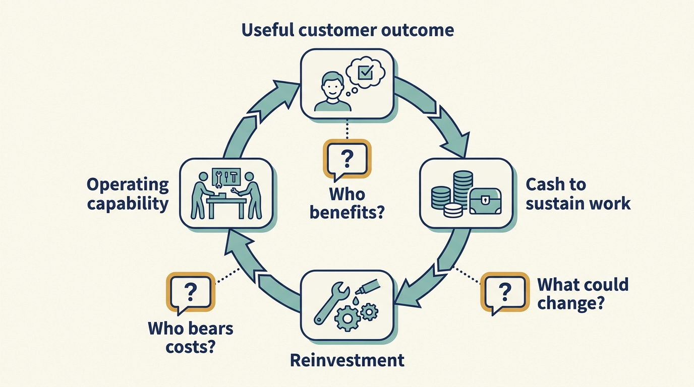

> **IN THIS SECTION, YOU WILL:** Learn to bring the book’s cases together, apply a durable-success standard to one final company decision, and keep investor returns, stakeholder consequences and the evidence in scope.

> **WHY INVESTORS CARE:** If Larkspur is sold again, the buyer’s investigation of the business before it commits, its **due diligence**, will ask about customer contracts, continuing services and recorded disagreements, and a careful seller discloses them. A saving booked by breaking a customer contract can then come back as a lower price, or as a **warranty claim**: a claim that a promise the seller made in the sale agreement was untrue, if the agreement contains such a promise. What happens depends on the sale agreement, on what the buyer accepts and on whether a sale occurs at all. A saving that survives that scrutiny remains worth more than one that does not.

> **WHY YOU SHOULD CARE:** Transaction headlines are the most prominently reported outcome, and they answer the fewest questions. A leader who measures success only that way cannot answer for the customers, employees and suppliers the decisions affected.

> **KEY POINTS:**
>
> * The book’s cases **report transaction results more prominently than anything else**, and even those are incomplete. Company results, consequences for customers, employees and suppliers, and what remains unknown each need their own column, and an unknown cell stays unknown.
> * **Durable success is this book’s proposed standard, not an accounting measure**: a company that can keep serving customers, fund its obligations and reinvest, judged alongside the investor’s result, the money the investor gets back and the value it still holds compared with what it put in. An exit, the sale through which an investor receives value, is a decisive reporting event for some investors, not the only horizon anyone should use.
> * When the standard **does not settle a decision**, name who is authorized to decide, whose interests lose, what mitigation is funded and when the disagreement is reviewed. Evidence narrows the argument, but it does not remove the trade-off.

 
The four case chapters examined five companies. Two were sold in deals that the investment firms behind them, their **financial sponsors**, reported as major successes. One failed. Two continue under changing investors. This final chapter puts those histories side by side, states what durable success would mean, applies that standard to one last fictional Larkspur decision and then asks what wider research adds.

The book proposes **durable success** as its standard: a company can continue creating useful outcomes after the immediate intervention and, where relevant, after the current investors leave. It covers enough income and funding to keep operating, the ability to reinvest, operating capability and the distribution of benefits and burdens among **stakeholders**. Stakeholders are the people affected by the business, such as customers, employees, suppliers and later owners, most of whom did not choose the current investor. Durable success is an evaluative standard, not a neutral accounting measure. It does not assume that every stakeholder benefits from every decision, or that a difficult reorganization of the business is always avoidable.

An **exit**, a sale through which investors receive value, is a decisive reporting event for some investors: it turns an estimate into **realized proceeds**, money actually received. It is not their only measurement horizon. The chapter [[three-different-returns]] showed that remaining estimated value and continued ownership are also measured and reported, and Visma and TeamSystem show sponsors that stay invested across transactions. The difference is that product and engineering leaders, customers, employees and suppliers live with the company through and after each of those events, whether or not any investor reports a result at that moment.

## What the Cases Establish and Leave Unknown

The table separates four things the case chapters kept apart: the investor’s reported result, the company’s reported result, the evidence about people affected, and what the consulted sources do not establish. Cells are filled only from those chapters, and they keep only the facts this chapter goes on to use; the case chapters hold the full accounts. Where the evidence is missing, the cell says so rather than inferring an answer. Amounts are in the currency each source reports: US dollars ($), euros (€) or pounds sterling (£).

A **return multiple** such as 3.1× compares the cash an investor received plus the value it still holds with what it put in: $3.10 for each $1 invested, counting the original dollar. A **fund** pools money from outside investors; the sponsor manages it and publishes the headline, and what those fund investors receive after fees and costs is usually not in it. A **valuation** is an estimate of what a holding, an ownership share in a company, is worth. A **secondary sale**, in which existing owners sell part of their holdings to other investors, therefore produces a price for the shares sold and an estimate for the rest, not cash to every investor.

**Revenue** is income from sales before any costs are taken off. **EBITDA** stands for earnings before interest, taxes, depreciation and amortization: profit before borrowing costs, tax and the accounting charges that spread the cost of long-lived assets over their years of use; **adjusted EBITDA** also leaves out items the company chooses to exclude. **Operating earnings** are profit from ordinary trading after those accounting charges but before borrowing costs and tax. None of these is cash left after every obligation, which is why a company can report a healthy EBITDA beside a **net loss**, meaning that once every cost is counted, borrowing costs and tax included, costs exceeded income, or beside **operating cash flow**, the cash its ordinary trading actually brought in or paid out, of about zero.

| Case | Investor result | Company result | Stakeholder evidence | Not established |
| --- | --- | --- | --- | --- |
| Hilton ([[hilton-and-skype]]) | Blackstone reported about 3.1× the money invested at the 2018 exit; sponsor-reported, not what each fund investor received after fees | Borrowing cut by $4.0 billion in a 2010 renegotiation of its loans; adjusted EBITDA from its owned and leased hotels still below 2008 when it returned to the stock market in 2013 | No independent comparison of employee or guest outcomes in the consulted material | How the gain divides among operating improvement, financing and market recovery; what each fund investor received after fees |
| Skype ([[hilton-and-skype]]) | 2009 sale valuing the company at $2.75 billion; Microsoft paid $8.5 billion in 2011; the fund’s return cannot be calculated from those two headlines | Rights to its core technology secured in a 2009 settlement; 2010 revenue about $860 million and adjusted EBITDA about $264 million beside a net loss of about $7 million | Product retired in May 2025, requiring users to move; employee outcomes not in the record | The share of value from the rights settlement versus product, market and buyer-specific factors; long-run customer experience |
| Visma ([[visma]]) | December 2023 secondary sale valuing the company at €19 billion, with Hg continuing as majority owner, holding more than half; a valuation, not cash paid out to all investors | 2024 revenue €2,804 million and EBITDA €893 million, company-reported; 33 company purchases in 2024 | No consistent independent series on employee outcomes or customer migration costs | Which of Hg’s funds paid and received what over the years; whether every acquired business and group of customers benefited |
| Toys R Us ([[toys-r-us]]) | Not reconstructed; the chapter uses no assumed sponsor return as evidence | Operating earnings of $460 million in its 2016 accounting year (its own reporting year, not the calendar year) beside operating cash flow of about −$1 million; about $5.3 billion of borrowing and roughly $400 million a year of interest and repayments before its 2017 bankruptcy, the court process for a business that cannot pay its debts; the US business closed in 2018 | About 33,000 US employees affected; nearly 40% of suppliers demanded stricter payment terms, such as earlier payment; Hasbro recorded $60.4 million of costs, including about $49 million it no longer expected to collect | How long the lost jobs would otherwise have lasted, what suppliers eventually recovered, whether a differently funded plan would have survived; the sponsors’ full financing and distribution history |
| TeamSystem ([[teamsystem]]) | Palamon reports 4.1× for 2000–2004; HgCapital Trust reported 1.8× on its 2016 sale, from £39 million of cash plus a retained stake, the ownership share it kept, valued at £6.1 million, which is the Trust’s own share, not the whole price; its later sales and reinvestments are in the case chapter; neither multiple is what fund investors received | 2017 revenue €316 million and adjusted EBITDA €113 million beside a net loss of €56.8 million in the formal accounts | Much less independent evidence about customers and employees than about transactions | What the ultimate investors received after fees; whether customers renew for value or for lack of alternatives; what each new owner funded of the inherited work |

The investor column is the most prominently reported, because sponsors and buyers publish transaction headlines; it is not the most complete, since several cells hold a valuation or a sponsor-reported multiple and the record of money in and money out behind them is explicitly missing. The stakeholder column is the thinnest, and it is filled mainly by the failure: Toys R Us supplies employee and supplier evidence because a court process and a supplier’s annual report recorded them. And the investor and company columns do not move together. Skype paired a valuable sale with a 2010 net loss and a later retirement. Toys R Us paired positive operating earnings with a company that could not fund its trading. TeamSystem paired positive adjusted earnings with a loss in its formal accounts, while successive owners each inherited the last owner’s progress and unfinished work.

## What Durable Success Requires

Applying the standard means asking, for each event and for continued ownership, whether the company can still do four things: serve the customers it has committed to, meet the obligations it has signed, reinvest enough to stay useful, and explain which work is unfinished. Investor return sits beside those questions rather than above them.

**Operating capability** in that sense does not mean ending every external dependency. Part III allowed a deliberately funded continuing specialist service as a legitimate outcome of getting help: the chapter [[useful-engagement]] required that the service be chosen, funded and reviewed, not that every specialty be internalized. Capability left with the company means the company can decide, fund and inspect the service it depends on. Dependence that nobody authorized, funded or can inspect is the problem.

The table below keeps each stakeholder group’s outcome separate. It also distinguishes investor cash already received, the realized proceeds, from an estimate of unsold holdings.

| Perspective | Evidence of progress | A question that can overturn the story |
| --- | --- | --- |
| Investors | Realized proceeds, results after fees and costs, understood risk | How much remains a valuation, and how much money had to be put in to get it? |
| Company | Sustainable cash and ability to reinvest | What spending or obligation was postponed? |
| Customers | Useful outcomes, reliability, fair transitions | Who lost value or became more dependent? |
| Employees | Viable work, capability, fair treatment | Who bore transition costs without sharing benefits? |
| Suppliers | Payment reliability; continuing obligations honored; terms that hold under stress | Who was paid late or not at all, and what did that cost them? Toys R Us shows the shape of the evidence: suppliers tightening their payment terms, then a supplier writing off money it was owed |
| Next owner | Inspectable capability and disclosed obligations | Which claims fail outside the sale presentation? |

These columns are not an additive score. A gain for one group **does not mathematically offset harm** to another. Some decisions require choosing between conflicting interests. The people authorized to decide should explain whose interests take priority, why, and how the resulting harm will be addressed.

**Figure 1:** *An attractive investment result does not answer every question about who benefited or bore the cost.*

## One Final Larkspur Decision

Larkspur and its numbers are fictional. The scenario continues the chain from the chapters [[diligence-corrects-the-plan]] and [[first-hundred-days]]. **Onboarding** is the work of setting a new customer up to use the product. Larkspur’s older way of doing it is a **manual-configuration path**: an implementation specialist enters each customer’s settings by hand and cleans up its data. The pilot built a setup step that replaces most of that work and cut the average effort per customer from 80 to 62 hours; about 40% of the remaining hours traced to customer data quality. At the day-100 review the board funded a **data-quality step**, a check and correction of each customer’s data before setup, at €40,000 and four **engineer-weeks** (one engineer’s work for one week; the unit measures effort, not elapsed time), drawn from the **reserve**, the part of the board’s first-hundred-days spending limit held back for later decisions. Thirty existing customers still run on the manual path: the specialist maintains their configurations and handles their changes, so their service depends on that one role. **Migration** in this chapter means moving one of those customers from its hand-maintained settings onto that newer setup step.

**The calendar.** Months are counted from day zero, the start of the first hundred days. Day 100 falls early in month four. The data-quality step is built in months four to six, and the next onboarding **cohort**, the group of new customers set up in the same period and measured together, is measured against it at about month six. The board takes up the thirty customers at its next meeting, late in month four, a few weeks after day 100.

Sam, the chief financial officer, brings an option that is financially attractive and cleanly measurable. **Option A** ends the manual path 90 days from the meeting, at the close of month seven; customers not migrated by then lose the service. About €220,000 a year leaves the plan, in two kinds of money. The implementation specialist’s role costs €150,000 a year: one full-time person at the €75-an-hour, 2,000-hour planning basis from the chapter [[roadmap-to-revenue]], a **fully loaded** cost that covers pay, employer charges, benefits and tools, not pay alone. Ending the role stops that money leaving the company, before any redundancy payment, money owed to someone whose job is eliminated, which this scenario does not price. The other €70,000 is roughly half of a support engineer’s time now spent on manual-path support requests, at the same rate; unless that engineer’s hours or the number of staff change, it is **released capacity**, time freed for other work, not a payment avoided. The deferred hiring of two specialists becomes unnecessary. Morgan, the investor’s technology adviser, notes that this is the fastest route to the onboarding volume assumed in the **investment thesis**, the investor’s account of why the purchase should succeed.

Priya, accountable for the customer commitments, sets out who loses and why the option cannot be chosen as written. Ten to twelve of the thirty customers have nonstandard data and cannot move by the date without doing data work themselves, and several of their contracts run past it and name the manual path as the service supplied. Customer contracts are protected obligations in this scenario, as in the chapters [[the-financing-slipped]] and [[prove-you-can-restore]], so a cut-off that ends the service before they allow is not an alternative the board can weigh; it is a breach, and a saving built on it is not a saving.

Sam and Morgan accept the point and restate the option. **Option A′** is a consent-based accelerated migration: each customer whose contract runs past the date is asked to move early in exchange for a **service credit**, a reduction on its future bills; Larkspur does the data work for the ten to twelve at its own cost; and a customer that declines keeps the manual path until its contract allows, served by the specialist as now. A′ is admissible, but it is not the €220,000 option, and its saving does not arrive customer by customer. The specialist’s role ends only when the last customer has left the manual path; while even one account declines, Larkspur keeps the role or pays for cover. So the €150,000 becomes avoidable only if all thirty consent or the last non-consenting contract ends within the year, the support engineer’s time is released only as requests fall away, and the credits and the data work come out of the same year’s saving, none of which can be priced until the consents are in. Priya’s objection to A′ is narrower but stands: the migration and the data-quality build would land on the same support team in the same quarter, the specialist whose knowledge made the pilot possible would leave with the manual path, and the date depends on consents Larkspur does not control.

**Option B** migrates the thirty customers in the two quarters after the month-six review, months seven to twelve, keeping the specialist full-time to the end of month twelve. The migration starts in month seven only if the next cohort passes the two tests set in the chapter [[roadmap-to-revenue]]: an average of 50 hours or less per setup (total hours divided by customers), counting every hour of data work by anyone, and a **median** wait of eight weeks or less. The wait runs from the day a customer signs its contract to the day it first schedules real work in the product; the median is the middle wait when customers are ordered from shortest to longest, so one very slow customer does not distort it, and unfinished customers stay in the count. Passing lets Priya request the next onboarding stage; it approves nothing, and the migration is a separate decision, taken now. If either test fails, or unfinished customers could still change the result, the migration does not start.

**If the start is delayed.** That delay costs nothing beyond B’s plan inside the year, because B already keeps the specialist full-time to the end of month twelve and no saving was scheduled before month thirteen. What it costs is the year-two saving: every month after month twelve in which full-time coverage, €12,500 in total, replaces the planned half-time service, €6,250, costs €6,250 more than planned and cuts the €75,000 by that amount; twelve such months remove it. The board reopens the choice between fixing the step, narrowing the target and revisiting the financing.

**B’s cost is a calendar, not a promise.** Option A would have ended the role at the close of month seven; B keeps it for five months longer, months eight to twelve, a one-off of about €62,500 (five months at €12,500) paid from the operating budget where the role already sits. From year two, month thirteen onward, the role becomes a deliberately funded half-time data-preparation service for customers whose data will always need work: the same person on the same cost basis at half the hours, 1,000 hours at €75, or €75,000 a year. That cuts the company’s cash cost by €75,000 a year (€150,000 to €75,000), if the specialist accepts the half-time role. If they decline, the €75,000 buys the same 1,000 hours from an outside data-preparation provider, and anything it costs above that comes off the saving. The support engineer’s €70,000 of time is released as the migration proceeds and stays a capacity figure until it is converted into work the plan needs or a hire it avoids.

**What it displaces.** The migration takes eight engineer-weeks from the first migration quarter’s allocation, pushing the connection between the product and the finance reports that Sam had asked for into the quarter after. Beyond the retained months there is no separate migration cash line: the data work is done inside the specialist’s hours and those eight weeks, which is why naming what the weeks displace is the honest statement of the cost.

**Month twelve is a target, not a guarantee.** Priya’s check of the thirty contracts, done before the meeting, found none that names the manual path beyond month twelve, and each contract’s earliest permissible end date is recorded against its account, so the plan breaks no contract. What can still slip is the data work. A customer that has not moved by month twelve keeps the manual path, served from the half-time role’s hours, since these are exactly the customers whose data needs work. The condition is capacity: if the accounts still waiting and the continuing data work need more than the role’s 1,000 hours, the board funds full-time coverage for the extra months. Full-time costs €12,500 a month in total and the half-time service €6,250, so each such month costs €6,250 more than planned and the year-two saving falls by €6,250; twelve of them would remove it. Whoever holds the continuing role supplies the coverage: the specialist, or the outside provider if they decline, and a provider’s price above the €75 rate comes off the saving in the same way. The saving moves with the obligation, not with the plan’s date.

**Option C**, keeping both paths indefinitely, is rejected in its own right: it preserves the dependency on one person that finding D-3 of the buyer’s pre-purchase investigation identified (the chapter [[diligence-corrects-the-plan]]), and the onboarding volume the plan assumes cannot be reached while it stands.

The board chooses Option B over A′. This is a company decision about the plan and its funding, so the Larkspur board, the directors who oversee the company’s major decisions, is the authorized body; Morgan advises, and the fund’s investment committee, the group at the investment firm that approves the fund’s transactions, is not involved, because no investment terms change. Priya is accountable for the customer commitments and the migration count; Alex, who leads technology, for the eight engineer-weeks, taken from the plan rather than from overtime; Sam for a cash plan, the expected receipts and payments month by month, that keeps the released time on a separate line from the payment avoided. Mitigation is funded, not promised: each of the thirty customers gets a named contact and a data-preparation checklist, each contract’s earliest permissible end date is recorded, and the specialist gets a defined continuing role instead of a redundancy.

Sam and Morgan record that Option B pays about €62,500 to keep the specialist five months longer, keeps €75,000 a year of employment cost from year two that Option A would have removed, and defers the cash reduction to month thirteen, where A′ could have brought it forward if every customer consented. Priya records that A′ rests on consents Larkspur does not control and on data work in the same quarter as the data-quality build. Both positions survive the evidence; they weight different columns of the table. What the board refused was to count the breach as a saving. The record states the trade-off and sets the evidence that will revisit it.

| Decision record | Content |
| --- | --- |
| Chosen | Option B: data-quality step in months four to six; migration in months seven to twelve, starting only if the next cohort passes both month-six tests; specialist retained full-time to the end of month twelve, then a funded half-time data service from month thirteen |
| Rejected | Option A as written (90-day cut-off at the close of month seven; breaches protected customer contracts, so inadmissible); Option A′ (consent-based accelerated migration; its saving starts only when the last customer leaves the path, depends on consents, loads the support team in the data-quality quarter and loses the specialist); Option C (both paths indefinitely; the one-person dependency preserved) |
| Cash and capacity | One-off: about €62,500 of the specialist’s fully loaded cost for the five months Option A would have cut (months eight to twelve). From year two: €75,000 a year less cash cost (€150,000 to €75,000, if the specialist accepts the half-time role; otherwise the €75,000 buys the hours outside and any excess comes off the saving); about €70,000 a year of support-engineer time released as capacity, not cash, until hours or the number of staff change |
| Scarce capacity | Eight engineer-weeks from the first migration quarter’s allocation, displacing the finance-reporting integration by one quarter; the specialist’s time protected through the migration |
| Authorized | The Larkspur board; Priya accountable for customer commitments and migration, Alex for engineering capacity, Sam for the cash plan; Morgan advises |
| Reopened if the month-six tests fail | The next cohort fails either test (average effort above 50 hours counting all data work, or a median wait above eight weeks), or unfinished customers could still change the result: the migration does not start. The specialist stays full-time as already funded to month twelve; each full-time month after that costs €6,250 more than the half-time plan and cuts the year-two saving by €6,250 until the step is fixed or the target narrowed |
| Reopened if fewer than fifteen have moved by month nine | The board either funds full-time coverage beyond month twelve (€6,250 a month above the half-time plan, the saving cut by the same amount) or narrows the target to the customers with standard data and keeps the rest on the manual path, inside the half-time role if their continuing work fits its 1,000 hours and otherwise with the same funded extra coverage. The specialist supplies that coverage, or the outside provider if they decline, with any price above the €75 rate coming off the saving; the date does not slip unfunded |
| Changed if the migration finishes early | The half-time role and the saving start earlier |
| Recorded disagreement | Cost and timing (Sam, Morgan) against contractual feasibility and team load (Priya); reviewed at month nine with the migration count and the contract check |

The decision, the migration count, the continuing service and the released time also go into the company’s handover record, so whoever owns Larkspur next inherits the obligation and not only the saving: the chapter [[handover-of-obligations]].

### When the Standard Does Not Settle the Question

A broader scorecard does not align interests by itself; it makes the conflict visible. Name the decision-maker authorized under the company’s actual governance (see the chapter [[decide-who-decides]]), not an adviser or an investment committee that approves transactions. Name the affected groups and say plainly whose interests lose. Fund the mitigation or state that it is unfunded. Set the review date and the evidence that reopens the decision. Evidence narrows a disagreement; it rarely ends one, and a record that pretends otherwise will be contradicted at the next review.

## What Wider Studies Add

Research on many **buyouts**, purchases that give the buyer control of a business, tests whether an investor-only view of success is enough. These studies compare the businesses bought with a **comparison group**, similar businesses that were not, to estimate what might have happened without the ownership change; the researchers observe events that occurred rather than assigning ownership changes by chance. Statistical adjustments improve the comparison; they do not remove every difference, and investors choose which companies to buy.

Davis and colleagues’ April 2024 revision studies United States buyouts from 1980–2013 and finds substantial variation by transaction type and economic conditions. Its reported two-year employment effects are approximately −12% for **public-to-private buyouts**, purchases that take a business whose shares trade on a stock exchange into private hands, and +15% for **private-to-private buyouts**, purchases of already privately owned businesses, relative to their comparison groups. These are estimated average differences for studied groups, not predictions for an individual company. [S08: Davis et al., 2024 revision](https://www.nber.org/system/files/working_papers/w26371/w26371.pdf) Their earlier work distinguishes jobs lost at individual sites from jobs created, bought and sold at the level of the whole firm, so a statement about “jobs after buyouts” changes meaning with the boundary measured. [S09: Davis et al., jobs study](https://www.nber.org/papers/w19458) That is a reason to identify who loses work and who gains it, not a reason to ignore the losses.

Bernstein, Lerner, and Mezzanotti find greater investment and more new money raised around the 2008 crisis among United Kingdom firms owned by **private equity** investors, investment firms that buy stakes in companies with money from their funds, usually outside the stock market, than among comparison firms, particularly where sponsors had more resources. [S10: Bernstein et al., crisis study](https://www.nber.org/system/files/working_papers/w23626/w23626.pdf) That challenges the assumption that borrowed money and sponsor ownership necessarily prevent support in a downturn, without establishing that support is universal.

Healthcare evidence is the sharper test, because it shows outcomes that earnings cannot represent. Gupta and colleagues’ 2023 revision studies US nursing homes and reports higher death rates for a subset of patients after private equity ownership. Its method uses an outside factor, how far patients lived from an acquired home, that influenced which patients ended up in acquired homes, to separate the effect of the ownership change from the choice of which homes to buy; the result holds only if that factor affected patients through no other route, and it is not an estimate for every care setting. [S11: Gupta et al., nursing homes](https://www.nber.org/system/files/working_papers/w28474/w28474.pdf)

Kannan, Bruch, and Song’s 2023 study compares 51 hospitals acquired by private equity owners with 259 similar hospitals that were not and reports, after adjusting for measured differences between them, 4.6 more **hospital-acquired conditions**, harms that arise during a stay such as falls and infections, per 10,000 hospital stays by Medicare patients (Medicare is the United States public insurance programme mainly for people aged 65 and over), equivalent to 25.4% of the rate at those hospitals before acquisition. That percentage is the adjusted excess, about five conditions per 10,000 stays measured against the comparison hospitals, expressed as a share of the acquired hospitals’ pre-acquisition rate of about 18 per 10,000. It is not the raw change observed at the acquired hospitals on their own, and it is not a 25-point rise in any patient’s risk. [S12: Kannan et al., adverse events](https://jamanetwork.com/journals/jama/fullarticle/2813379)

An earlier study by Bruch, Gondi, and Song found higher financial measures and improvements in some quality indicators at acquired hospitals. [S39: Bruch et al., hospital measures](https://jamanetwork.com/journals/jamainternalmedicine/fullarticle/2769549) These findings do not cancel one another; they examine different outcomes and samples, and improvement on one measure cannot establish the absence of harm on another.

For a software company the relevance is a mechanism, not an analogy between service inconvenience and clinical harm. Where customers cannot readily observe quality or change providers, financial incentives may not protect them. The leadership question is who bears the cost of reduced service and whether the people affected can respond. Historical averages from other settings and periods should shape that question; they are not forecasts for a present-day group of software companies.

## Follow Outcomes Beyond the First Exit

Kannan and Song’s 2025 research letter compares 18 hospitals sold to a second private equity owner with 18 sold to other for-profit owners and finds lower **operating margins**, operating profit as a share of revenue, after the second private equity sale, associated with higher expenses rather than simple cost cutting. The small sample, and the fact that the researchers observed sales rather than assigning them, limit generalization, and financial measures do not establish patient outcomes. [S42: Kannan and Song, after sale](https://jamanetwork.com/journals/jama-health-forum/fullarticle/2837043) Its value is that it makes the next ownership period an object of study, while warning that a lower margin is not self-evident deterioration: additional spending can have different purposes.

Skype’s valuable sale and later retirement can both be true without one explaining the other. TeamSystem’s obligations spanned successive owners, each starting from a new price while the migration and integration work continued. The lesson is to **keep the observation window explicit**, and to carry the record of commitments, costs and outcomes across each handover rather than restarting it: the chapter [[handover-of-obligations]].

The same measures apply under continued ownership and to other events. A **funding round**, one episode of raising investment, that issues new shares, new units of ownership sold to investors, supplies resources under agreed terms; it does not prove the product is useful or that the next round will happen. A corporate integration milestone can be completed while customers still face migration problems. Treat the investor’s next milestone as one constraint and one result within a longer operating responsibility.

**Figure 2:** *A durable plan explains how useful work can continue and what evidence would justify changing course. Operating capability enables useful customer outcomes; the cash they bring in sustains the work and funds reinvestment, which renews capability. At each stage, ask who benefits, who bears the costs and what could change.*

## What You Can Change as a Company Leader

The Larkspur decision is small, and nothing in it guarantees that Larkspur succeeds. What makes it durable is not the scorecard. It is that an authorized body refused the option that broke a commitment, chose between the feasible ones, said whose interests lost, separated the cash it would save from the time it would free, funded and dated the transition, and wrote down what would reopen the question. Every earlier chapter has been practice for that: establishing the money behind an announcement, the authority behind a request, the capacity behind a roadmap, the evidence behind a claimed benefit, and the obligations that survive a transaction.

As a product or technology leader, you cannot control the availability and price of investment and borrowing, remove every conflict or guarantee that everyone benefits. You can explain what the company can deliver and what it needs, expose unfunded dependencies, propose feasible alternatives, keep a record of outcomes, bring decisions to the people authorized to make them, and develop the people who will sustain the work.

The book began with how a company gets money. The closing question is whether its ownership arrangement helps it serve customers, fund necessary work and meet its obligations over time. That is answered with evidence about investor returns, company cash and capability, and the people affected, never with one alone. The [[toolkit]] provides the records for that work, and the [[glossary]] the terms.

The next team should inherit a company that can serve its customers, fund its obligations and explain what still needs to change.

## Questions to Consider

1. *For your company’s own case matrix, investor result, company result, stakeholder evidence and what is not established, which cells could you fill from evidence today, and which would you be filling by inference?*
2. *Which decision in your current plan is financially attractive because its cost falls on customers, employees or suppliers, which of its savings are cash and which are released time, and who is authorized to decide it?*
3. *Where can your customers not readily observe quality or change providers, and what protects them if financial incentives do not?*
4. *If the recorded disagreement in your last decision were reviewed today, what evidence would you bring, and would the decision survive it?*

## To Probe Further

- **[Private Equity at Work: When Wall Street Manages Main Street](https://www.russellsage.org/publications/book/private-equity-work)** — Eileen Appelbaum and Rosemary Batt, Russell Sage Foundation, 2014. *A book-length account by critics of the buyout model, read for the stakeholder side of the post's table and checked against the studies the post cites.*
- **[Evaluating trends in private equity ownership and impacts on health outcomes, costs, and quality: systematic review](https://pmc.ncbi.nlm.nih.gov/articles/PMC10354830/)** — Alexander Borsa, Geronimo Bejarano, Moriah Ellen and Joseph Dov Bruch, BMJ, July 2023. *A systematic review, a study that searches for and grades earlier studies under stated rules, of 55 studies whose searches closed in April 2023; it maps the earlier literature on private equity in health care and predates the December 2023 hospital study and the 2025 hospital-sale letter the post cites, so it does not synthesize them.*
- **[Sources of Value Creation in Private Equity Buyouts of Private Firms](https://academic.oup.com/rof/article-abstract/26/2/257/6516584)** — Jonathan B. Cohn, Edith S. Hotchkiss and Erin M. Towery, Review of Finance, 2022. *Complementary evidence on buyouts of already private firms, the transaction type behind the +15% employment estimate the post takes from Davis and colleagues; it finds value from easier access to money and improved performance at weaker firms, with a limited role for changes to how the purchase is financed rather than how the business runs.*
- **[Mastering 'Metrics: The Path from Cause to Effect](https://press.princeton.edu/books/paperback/9780691152844/mastering-metrics)** — Joshua D. Angrist and Jörn-Steffen Pischke, Princeton University Press, 2015. *Read its chapters on the two comparison methods behind the nursing-home and hospital findings, using an outside influence to separate cause from selection, and comparing change over time in an affected group with change in a comparison group, before deciding how much weight those findings can bear.*
- **[Grow the Pie: How Great Companies Deliver Both Purpose and Profit](https://www.cambridge.org/core/books/grow-the-pie/D4A79452BAD1B9058ED25E19D0183197)** — Alex Edmans, Cambridge University Press, 2020. *It offers a way to reason about the post's success-for-whom table without treating it as an additive score across customers, employees and investors.*
