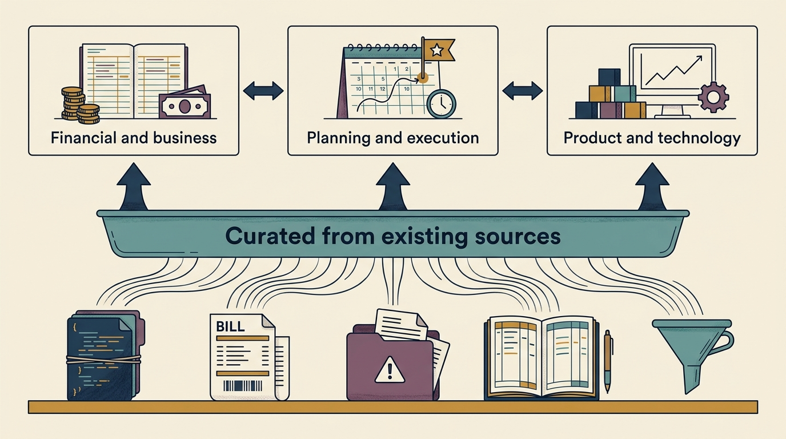

**Shared data does not produce agreement; it makes disagreement useful** — people reading the same defined, sourced, dated figures can find exactly where their views diverge, instead of arguing about what is true.

**Figure 1:** *One curated layer, built from sources the company already keeps, supports three areas of evidence. The areas are connected to each other, not ranked.*

**Start from what you already have.** The author's Lightweight Architectural Analytics practice, from *Grounded Architecture*, builds a picture of a company's systems from sources that already exist — the code repositories where software and its change history are kept, the bills for computing rented from an outside supplier, the records of service failures that reached customers, finance data — rather than buying a platform. [S106: Lightweight Architectural Analytics](https://grounded-architecture.io/analytics) Extending it to the investor relationship is this book's proposal, not a measured result. This chapter distils five qualities from it: each measure is **curated** (someone answers for its accuracy), **current**, **credible** (traceable to its source), **actionable** (used in real decisions) and **accessible**.

**Three questions, one foundation.**

- *Is the business making money, and on what assumptions?* Revenue — the money earned from supplying products or services, whenever the customer pays — by product and customer type, what remains after costs, the cash actually received and paid, the volume and price assumed in every forecast.
- *Is the company doing what it said it would?* Where money and people's time go, and what was promised against what arrived.
- *Can the product and the systems carry the plan?* Who uses the product, where past shortcuts slow change, how often systems fail, what technology costs, whether the team depends on one person.

A sales forecast means little without the plan meant to produce it and evidence that the systems can carry it.

**Define once, own by name, refresh on a schedule.** Record each measure's definition, source, named owner, refresh frequency and boundaries. Keep the set small. Give every figure its context — the earlier value, the expected value, how much weight it carries, the decision it informs — and agree thresholds *before* the result is known. A threshold settles the recommendation; the board still approves the money.

**Label what kind of number it is.** At the fictional Larkspur's day-100 board review, the hours measure customer **onboarding**: the setup work before a new customer can use the product. Eight pilot customers took 496 hours in all, an average of 62, against about 80 before — 18 fewer hours per customer. That average is an **actual**. Fifty hours was the **target**. One group averaging fewer hours is a difference, not a trend, and not yet proof of its cause.

The €135,000 a year in the papers is a **forecast**: 100 setups a year × 18 hours × €75 an hour, the planning cost of an hour of staff time. Three **assumptions** carry it: the 100, the €75, and the belief that the 18-hour difference seen in eight customers will hold for the next hundred. Printed identically, a projection reads as a result.

And freed staff time does not raise the bank balance. Money arrives only when a payment is actually avoided — a contract not extended, the salaries of a planned hire never paid — or when extra customers pay in more than serving them costs.

**Assign the work.** It falls between roles, so it lands on whoever is free before a board meeting. **Product operations**, as Melissa Perri and Denise Tilles describe it, formed around this gap; its three pillars — business data and insights, customer and market insights, process and governance — map onto the three questions above. [S109: Perri and Tilles](https://melissaperri.com/book) It supplies evidence and takes no decisions.

**Share deliberately.** An investor's **information rights** are the reports the investment agreement entitles it to; law can add entitlements, and everything beyond them is a choice. A director the investor appointed receives board papers as a director; whether they may pass them to the investor depends on the arrangement, so a board seat is not the investor's own access. Hold the working detail — per customer, per person, per incident — internally; share totals and averages that travel with their definition. When raw access to a system is requested, ask what question it answers; usually it is a measure you can define properly.

Build in the order that changes decisions soonest: start from the next decision, find where the evidence already lives, write the definition before the first number, establish the baseline honestly, agree thresholds, and automate the refresh, never the interpretation. [Tool 15](toolkit.html#tool-15) gives the measure record; [[cannot-fund-everything]] then uses the evidence to choose among things the company cannot all afford.
