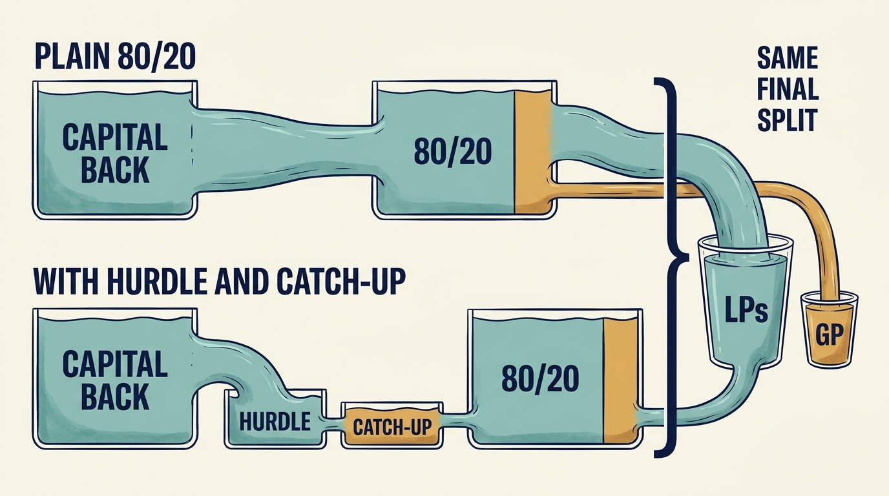
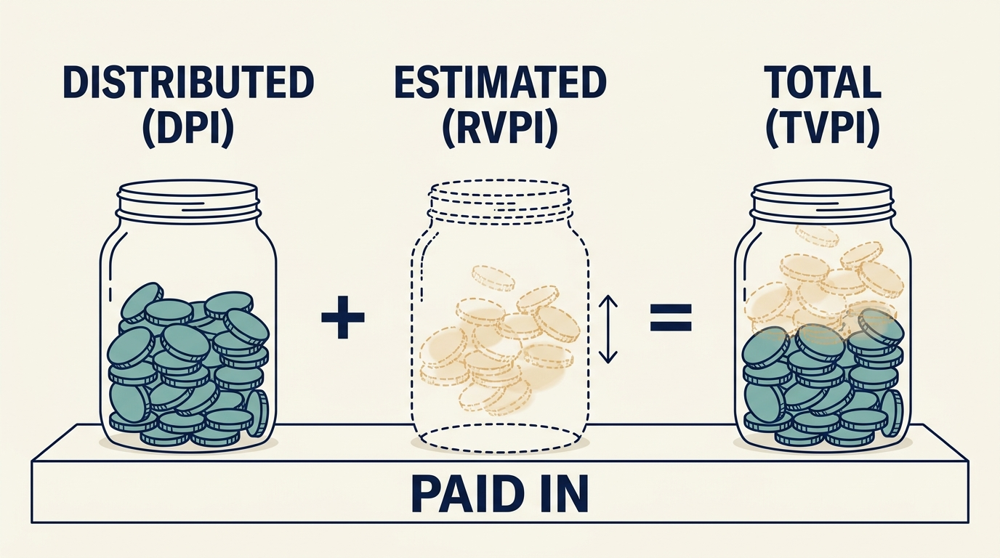
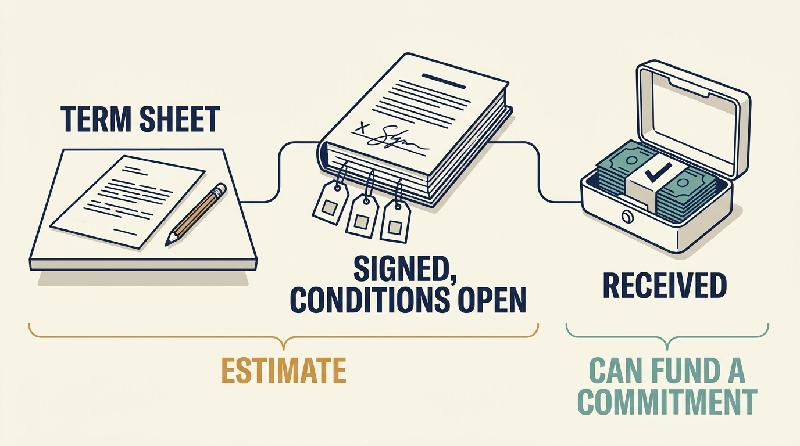

> **IN THIS SECTION, YOU WILL:** Learn how a fund’s manager and investors are paid, how a fund performance report separates what has been distributed from estimated value still held, and what that means for the requests a company receives.

> **KEY POINTS:**
>
> * A fund's manager is paid through **a management fee and a share of profits**. The distribution waterfall sets the order in which proceeds are paid out; a preferred return, catch-up and clawback are terms of the agreement, not guarantees. A slower catch-up changes when the manager is paid, not necessarily how much.
> * A fund performance report **separates what has been distributed from estimated value still held**: DPI counts distributions (all cash in this page's example), RVPI the remaining net value at its current estimate, and TVPI adds the two. Gross, net and borrowing-adjusted figures differ.
> * For a company leader, these mechanics explain **the timing and kind of requests** a company receives. A higher valuation is not itself a cash distribution; ask whether a reported result was received or estimated.

 
This page is optional depth behind the chapters [[announcement-is-not-a-budget]] and [[three-different-returns]] in Part I: what a fund's investors and its manager are paid, and how a fund reports its results. Nothing here is needed to follow the main chapters; the [[glossary]] defines each term in one line. The examples are deliberately simple, and every rate is an illustrative assumption rather than a typical or recommended term.

## How Fees and Profit Sharing Work

A fund's investors are its **limited partners (LPs)**: they commit money and pay it in when the fund calls for it. The firm that runs the fund is its **general partner (GP)**, the "manager" in everyday use. The GP is paid in two ways.

A **management fee** supports the manager's business under the agreed fee basis; the basis (committed capital, invested capital or another measure) and the period it applies to are set in the fund agreement. **Carried interest**, or carry, is a contractual share of investment profits allocated to the GP or other entitled recipients. Carry is different from a company's executive bonus and different again from management's shares in that company.

A **distribution waterfall** sets the order in which money coming out of a fund is paid. One example runs through this page. The LPs **committed** €100 and the fund called all of it, so **contributed capital** is also €100 (in a live fund the two differ for years, because capital is called as needed). The money was invested in one company for one year and the company was sold for €160: a **profit** of €60, with **carry** at 20% of profit. Fees, fund expenses and taxes are ignored, so nothing leaks out of the €160. In the simplest arrangement the LPs get their capital back before any profit is shared:

| Step | Who gets it | Amount |
| --- | --- | ---: |
| 1. Return the capital | LPs get their €100 back first | €100 |
| 2. Split the €60 profit | 20% carry to the GP | €12 |
| | remainder to the LPs | €48 |
| | **LPs receive in total** | **€148** |

Actual agreements can distribute profits at different stages. They may include a **preferred return**, a threshold before specified profit sharing begins; a **catch-up**, a rule allowing the GP a larger share of the next payments; or a **clawback**, a requirement to return excess profit distributions. The preferred return is not a guaranteed investment return.

### How the Three Terms Change the Example

Suppose the agreement gives the LPs an 8% **preferred return**. On €100 contributed for one year the hurdle is €8, so in every case below the first €108 goes to the LPs and the question is how the remaining €52 is shared.

- **No catch-up.** The €52 is shared 80/20: €41.60 to the LPs and €10.40 to the GP. The LPs end with €100 + €8 + €41.60 = €149.60 and the GP with €10.40, which is 17.3% of the €60 profit. The hurdle has moved money from the manager to the investors.
- **Full (100%) catch-up.** After the hurdle, the GP receives all of the next distributions until it holds 20% of the profit paid out so far. That takes €2, because €2 is 20% of the €10 of profit then distributed (the €8 hurdle plus the €2 catch-up). The remaining €50 is shared 80/20: €40 to the LPs and €10 to the GP. Totals: LPs €100 + €8 + €40 = €148; GP €2 + €10 = €12, again 20% of the profit.
- **Partial (80%) catch-up.** Many agreements, including ILPA's whole-of-fund model, give the GP less than all of each catch-up payment but keep the same end condition, 20% of cumulative profit. [S73: ILPA whole-of-fund model LPA, §14.3.3–14.3.4](https://ilpa.org/wp-content/uploads/2019/10/ILPA-Model-Limited-Partnership-Agreement-October-2019.pdf) At 80% the catch-up band has to be €2.67 rather than €2: the GP takes 80% of it, €2.13, the LPs €0.53, and €2.13 is 20% of the €10.67 of profit distributed so far (€8 + €2.67). The remaining €49.33 is shared 80/20: €39.47 to the LPs and €9.87 to the GP. Totals: LPs €100 + €8 + €0.53 + €39.47 = €148; GP €2.13 + €9.87 = €12. The slower catch-up changed the route the money took, not the final split.

| Arrangement, same €160 on €100 | LPs | GP | GP share of the €60 profit |
| --- | ---: | ---: | ---: |
| Capital back, then 80/20 | €148.00 | €12.00 | 20% |
| 8% preferred return, no catch-up | €149.60 | €10.40 | 17.3% |
| 8% preferred return, 100% catch-up | €148.00 | €12.00 | 20% |
| 8% preferred return, 80% catch-up | €148.00 | €12.00 | 20% |

**Figure 1:** *A preferred return and a catch-up change the route the proceeds take; a catch-up that completes ends at the same final split as the plain arrangement.*

Keep apart the **rate during the catch-up** and the **final entitlement**: the rate sets how quickly the GP reaches its share; the end condition sets what that share is. Two things do change the final split: no catch-up at all, as in the second row, or a catch-up that never completes because proceeds run out inside the band. Had the company sold for €109, the LPs would take €108 and the €1 left would go entirely to the GP under a full catch-up: 11% of the €9 profit, not 20%, because there was not enough profit to finish catching up.

**Clawback.** Under a **deal-by-deal** waterfall the steps above are applied to each investment as it is sold, so the GP can receive carry years before the fund's overall result is known; under a **whole-fund** waterfall the GP's share is measured against the fund's cumulative result. ILPA publishes model agreements for both; neither is the rule for every fund. [S74: ILPA deal-by-deal model LPA](https://ilpa.org/resources-tools/resource-library/deal-by-deal-model-limited-partnership-agreement-pdf/) Where carry is paid deal by deal, later losses can show that early interim carry exceeded 20% of the fund's total profit. A clawback obliges the GP to return the excess at the point the agreement specifies, often the end of the fund, reconciling interim carry with the whole-fund entitlement. How it is secured and whether it is calculated before or after tax are terms to read, not assume.

The implication for a reader of company plans: the manager's profit share depends on realized proceeds, on their timing relative to the hurdle, and on the fund's whole result rather than one company's. Fees, allocation of shared expenses and related-party services also create conflicts; the SEC's guide discusses the possibility that the manager's interests differ from those of its funds. [S01: SEC investor guide](https://www.investor.gov/introduction-investing/investing-basics/investment-products/private-investment-funds/private-equity) Ask who funds an operating intervention and whether the provider has a financial interest in the recommendation. Useful support can still involve a conflict that needs to be understood.

## Reading a Fund Performance Report

The chapters in Part I concern one company at a time. A fund holds several and sells them at different times, so its investors need to separate what the fund has actually distributed to them from the estimated value of what it still holds. Three ratios do that, all measured against what the investor has paid in.

Take an investor who has put in €100, has received €60 back in cash, and whose share of the fund's remaining net value is currently estimated at €90:

| Measure | Here | What it counts |
| --- | ---: | --- |
| **DPI** — distributions to paid-in | 0.6× | Distributions received; all cash in this example |
| **RVPI** — residual value to paid-in | 0.9× | Remaining net value, an estimate |
| **TVPI** — total value to paid-in | 1.5× | The two combined |

**DPI measures distributions relative to paid-in capital; in this example all distributions are cash. RVPI measures remaining net value.** A fund may also distribute securities, so ask what a reported distribution consisted of; residual value is the fund's remaining net asset value, not only a price put on unsold holdings. [S73: ILPA whole-of-fund model LPA, §14.4.1](https://ilpa.org/wp-content/uploads/2019/10/ILPA-Model-Limited-Partnership-Agreement-October-2019.pdf) All three figures are ratios, and the €90 estimate may rise or fall before sale. A high total alongside little distributed therefore contains more unrealized value; it doesn't demonstrate the same outcome as a completed sale.

**Figure 2:** *A fund report adds two different kinds of value: distributions that were received and remaining value that is still an estimate.*

A **gross return** is measured before specified fees and other deductions; a **net return** after them. State which investor receives the return and which deductions apply, and identify the currency, valuation date and treatment of borrowing. A **subscription line**, or subscription facility, is a loan to the fund that can cover the period before its investors supply cash. The Institutional Limited Partners Association (ILPA) provides performance guidance that separates the effects of this borrowing. [S05: ILPA performance guidance](https://ilpa.org/industry-guidance/templates-standards-model-documents/ilpa-templates-hub/ilpa-performance-template/) The loan delays cash calls, and a higher measured **IRR**, the internal rate of return calculated from the amounts and dates of payments, can result from that changed timing without establishing additional company value. The chapter [[three-different-returns]] explains IRR and the multiple on invested capital for a single investment.

## What This Means for the Company Leader

**Fund incentives can shape the timing and kind of requests.** A fund near the end of its term, or a manager whose carry depends on a realization that has not yet cleared the hurdle, has reasons to prefer work that shows up in a sale price soon, such as earnings improvements, over longer-dated capability work. A fund early in its investment period may accept spending that raises the estimated value of a holding before any cash returns. Which applies is a matter of fact, not of label: ask which fund owns the company, where it is in its life and what its agreements say. The chapter [[different-bets]] compares the incentives of different investors; the chapter [[announcement-is-not-a-budget]] gives the one-page record for locating the payer and the approver.

**A higher valuation is not itself a cash distribution.** The year-three row in the announcement chapter's capital-call timeline and the RVPI ratio here are the same fact seen from two sides: an estimate can rise without anyone receiving money. When told that the investment "is performing well", ask whether the statement rests on distributions or on residual value. Keep three states apart: a term sheet sets out proposed terms and does not by itself establish an unconditional commitment to fund (which provisions bind depends on the document); a signed sale or investment agreement is a contractual commitment, usually with conditions, until completion and payment; only then is the value received. Never describe an announced or agreed figure as received.

**Figure 3:** *A term sheet, a signed agreement with open conditions and cash received are three different states; only the last can fund a commitment now.*

**Received value and estimated value in your own plans.** A plan that depends on an expected exit, a future funding round or an announced valuation is financed by an estimate; what can fund a commitment now is the cash the company holds and the facilities it is authorized to draw. State which commitments rest on received cash or authorized facilities, which on a contractual commitment with conditions, and which on an expectation, and revisit the plan when one of those states changes. The chapter [[three-different-returns]] shows why the same company performance produces different investor returns, one more reason to keep the company's evidence of what it can do separate from the fund's report of what it is worth.
