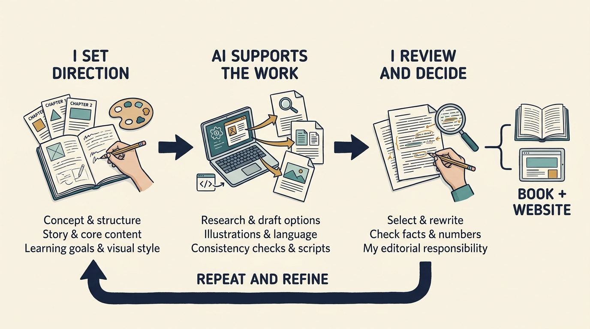

> **IN THIS SECTION, YOU WILL:** Learn what this book is for, which route to take for the decision in front of you, and how to read fictional examples and historical evidence.

> **KEY POINTS:**
>
> * Ownership changes the **conditions in which you lead**. Find out which money, decisions and expectations your product and engineering commitments depend on.
> * Different arrangements require **different choices**. Raising money from investors, a buyout (in which an investor buys the power to direct the company), and a purchase by another business can put the same roadmap—the plan of what the team builds next—under different constraints.
> * You remain **responsible for the company’s work**. Challenge assumptions, make feasible commitments and explain consequences for customers and teams.

 
Your company has new investors. The announcement promises growth and support. Within weeks, you are asked to hire faster, demonstrate a new product, reduce costs or connect to the owner’s systems. Each request may sound reasonable. Together, they can exceed the company’s money, authority and ability to deliver.

**OWNED: Product & Engineering Leadership Under Investors** is for product and engineering leaders in companies whose investors affect their funding, authority and expectations, including those who inherit an arrangement they didn’t choose. It assumes no finance training and explains the financial terms needed to question a plan, budget or ownership claim. It does assume an interest in detailed questions about how software is built and released, systems are structured, teams are organized and evidence is judged: these are the areas where investor expectations land. Founders, finance colleagues and investor advisers may find it useful as a shared vocabulary.

Under any ownership arrangement, **you still need to exercise judgment and take responsibility for your decisions**. Sometimes you can approve a change yourself. Sometimes you must negotiate funding, challenge a target or ask the board—the directors who oversee the company on its owners’ behalf—to choose between incompatible outcomes. The book helps you distinguish those situations and make the consequences clear.

## Why This Book Exists, and How It Is Written

There is ample material on term sheets (documents proposing an investment’s main conditions), valuations (estimates of a company’s worth), fund structures (how pooled investor money is organized and managed) and deal mechanics (the steps that complete an investment or purchase). In my experience as a technology leader and adviser, far less has been written about **what external investment does to product and engineering**: the commitments it creates, the money and authority teams can count on, and how roadmaps, software design or hiring plans should change with ownership.

The same experience suggests what the gap costs. Inside companies it breeds **confusion** and **costs them opportunities** because leaders who cannot read an arrangement cannot use it. It also **invites misuse**: a sentence beginning “investors want us to…” can carry an agenda nobody in the room has examined, sometimes without anyone knowing what the investors require or whether they were asked.

This book responds from the company leader’s perspective: vocabulary to read the arrangement, methods to test such claims and worked examples of commitments a team can keep.

The next post, [[where-investment-goes-wrong]], names recurring mistakes and missed opportunities—such as Spending the Press Release and The Dusty Address Book—and links them to the relevant parts. Use it to recognize a situation in your company before choosing where to read in depth.

This book is a living journal that I revise as I learn more through [my work](https://obren.io). Chapters change as better evidence, sharper examples and reader questions arrive. Each chapter’s “View spec” link opens the specification it was written against; its changelog records what changed and why. Read the book as current thinking with its limits stated, not as a finished text.

## Start With the Decision in Front of You

The eight parts form a learning sequence for a first reading. If a decision is already waiting, pick the matching row, read the chapter in the **Start with** column and return to Part I when a financial term is unfamiliar. The **Then** column offers optional further reading in a suggested order.

Some chapter titles use terms explained in Part I. For now:

- **Money words.** **Revenue** is the money a company earns from selling its product, before costs. **Profit** is what remains after costs. **Cash** is the money actually available to spend; it can run short even when revenue and profit look healthy. **Cash flow** is money moving into and out of the company over time. **Operating earnings** are a profit figure from the company’s ordinary business, calculated under accounting rules; they are not cash in the bank. A **lender** provides money that must be repaid, usually with **interest**, the charge for borrowing it.
- **Ownership words.** **Equity** means ownership; an owner’s equity is its share of the company. **Carry**, short for carried interest, is the share of investment profits that the firm managing a fund can receive under the fund’s agreed conditions, separate from what the fund’s own investors earn. **Diligence** is short for due diligence, the investigation of a business before investing in or buying it. An **exit** is an investor selling or otherwise cashing in its investment; it is not the company closing.
- **People and systems words.** **Headcount** is the number of employees; **capacity** is the amount of work those people can actually handle, which is not the same thing. **Resilience** is the ability of the company’s systems to withstand and recover from disruption, and a **backup** is a saved copy of data or software kept for that recovery. **Cloud costs** are the charges for computing services rented from an outside provider.

The [[glossary]] covers the rest.

| Your immediate need | Start with | Then |
| --- | --- | --- |
| A promised investment must become a budget | [[understand-funding-control]] | [[understand-cash-flow]], [[clarify-authority]], [[set-priorities]], [[manage-funding-delays]] |
| A change to how the business works needs a credible case | [[set-priorities]] | [[test-revenue-assumptions]], [[assess-capability]], the Part IV, V or VI chapter for your area, and the [[toolkit]] records of an initiative and its outcome |
| The investor has its own technology adviser (a “technology operating partner”) or a specialist in artificial intelligence (AI): software that generates text or makes predictions from patterns in data | [[technology-operating-partners]] | [[clarify-adviser-role]], [[set-terms-of-help]] |
| Agree or reset how we work with the investor | [[plan-investor-support]] | [[clarify-authority]], [[set-terms-of-help]] |
| Investor help is on offer | [[clarify-adviser-role]] | [[choose-right-help]], [[set-terms-of-help]] |
| Explore the investor’s network: its events, and the leaders of the other companies it has invested in | [[learn-through-investors-network]] | the [[toolkit]] learning brief, then [[choose-right-help]] when a specific need emerges |
| The investor wants better reporting, or we keep arguing about what a number means | [[have-your-numbers-ready]] | the [[toolkit]] measure record, then [[test-revenue-assumptions]] for the benefit arithmetic |
| The investor wants to oversee technology across all the companies it has invested in (its portfolio) | [[grounded-architecture-portfolio]] | [[plan-investor-support]], [[have-your-numbers-ready]] |
| The company is about to be bought, or to take new investment | [[use-diligence]] | [[first-hundred-days]], [[manage-handover]] |
| Owners want more growth or profit than the team can support | [[understand-funding-choices]] | [[set-priorities]], [[scale-the-team-up]] |
| Investor requests compete with customer needs | [[test-revenue-assumptions]] | [[clarify-authority]], [[assess-investor-fit]], [[success-for-whom]] |
| A business that has invested in us wants to connect its systems to ours, or wants access to our data | [[plan-acquisitions-separations]] | [[build-test-resilience]], [[set-terms-of-help]] |
| The investor wants a leadership change | [[clarify-authority]] | [[scale-the-team-up]], [[choose-right-help]], [[clarify-adviser-role]] |
| We must reduce the number of employees | [[manage-funding-delays]] | [[scale-the-team-down]], then [[compare-incentives-stakes]] on how three different rewards shape what people push for: the managers’ ownership shares, the fund manager’s carry and employees’ jobs; then the [[toolkit]] workforce-decision record |

## Owners, Rights, Funding, and Change

This book focuses mainly on **private companies**, whose shares (units of ownership) are not traded on a public stock exchange, working with **outside investors**: people or organizations outside the company who commit money expecting a **financial return**, the gain they hope to make, and accepting the risk of loss.

An investor’s money can go to two places, and a deal sometimes combines both. When the company issues new shares, the investor pays the company, which receives funding to spend. When the investor buys shares from existing owners, the money goes to those sellers; the company receives nothing to spend: ownership changes, but the budget does not.

Two cases sit outside that main scope. A founder funding the company from their own resources serves as a comparison. Public stock markets appear where they influence financing or ownership changes, but leadership in publicly traded companies, whose shares anyone can buy on an exchange, is not covered in detail.

To understand the impact of any outside investment, keep **four questions** separate: who the owners are, what rights they have, how the company is funded, and what is changing.

An owner’s **stake** is the share of the company it holds, usually stated as a percentage. **Control** is the power to direct the company’s main decisions, such as appointing its leaders or approving its budget. Holding more than half the shares normally brings control, but the agreed investment rights can shift it.

Most investor labels describe who the owners are. A **venture investor** typically funds a young company still proving its product or how it earns money, though venture funds also invest in later **funding rounds** (occasions when a company raises money from investors on agreed terms) of companies already scaling an established product. A **growth investor** funds the expansion of a business with established demand; the venture and growth labels overlap at that stage, and the round’s terms matter more than its name. A **buyout investor** purchases control: it buys enough of the company, on terms that give it the power to direct its main decisions. A **corporate investor** is another operating business investing for financial or commercial reasons; it may hold a **minority stake** (less than half the company) or acquire it outright, a corporate **acquisition**.

These labels suggest an investor type; they do not answer the other three questions. **Rights** don’t automatically follow from **stake size**: a minority investment can carry important **approval rights** without conferring control. An investor holding a fifth of the shares may, for example, have the agreed right to say no to new borrowing above a set amount or to a sale of the company, while having no say in day-to-day decisions. **Funding** doesn’t follow from deal type: borrowing (money that must be repaid, usually with interest) is a way to raise money and isn’t confined to buyouts. The nature of the **change** is separate again: a **carve-out** takes a business out of a larger company, a **turnaround** fixes serious business problems, and either can involve any of these owner types.

An investment’s practical impact depends on its actual terms, **established case by case**: the investor’s rights, the financing, the support available and how long the investor expects to remain involved. The events a leader faces, from a first funding round to a sale or continued ownership, can arrive in any order; use the reading routes to find the relevant part.

**Figure 1:** *Keep the four questions separate before a commitment: who the owners are, what rights they have, how the company is funded and what is changing, for instance a business leaving a larger company or a struggling business being fixed.*

## How the Parts Build on Each Other

- **Part I** supplies the financial tools to understand your owners and the cash you can actually count on.
- **Part II** establishes who has the authority to decide, which rewards and pressures shape those decisions (the incentives), and the working relationships around them.
- **Part III** connects the investor–company working arrangement with useful help, the agreements that define an adviser’s or specialist’s work and authority, and the people who provide that support.
- **Part IV** turns expectations into choices about product, engineering, people and AI, and revises them when expected money is late. It is the center of the book.
- **Part V** changes the company’s size and shape deliberately: expanding or reducing the team, changing systems for expected growth, and buying or separating a business.
- **Part VI** keeps the technology the company already runs worth its cost: evaluating a lower cloud bill and testing whether backups restore the service.
- **Part VII** follows the events around a funding or ownership change: the investigation before an investment, the first hundred days, and the handover to the next owners.
- **Part VIII** examines historical cases and closes with the book’s standard for success.

Each part introduction explains its chapters and their order. Chapters build on earlier terms: [[understand-valuation]] explains how a company’s worth is estimated, and [[plan-for-growth]] later applies those concepts to a design choice once the product and engineering foundations are in place.

The eight parts work together around one purpose: **commitments the company can keep**. Funding and obligations (the payments and duties the company must fulfil) set the conditions; authority and incentives shape decisions; the working arrangement with the investor adds capability; those decisions become feasible work, deliberate changes of size and a technology estate kept worth its cost. Funding and ownership events require renewed commitments, and evidence from other companies helps you question the assumptions throughout.

![Eight parts form a connected framework around commitments the company can keep: I Understand money and obligations; II Align authority and incentives; III Collaborate for useful help and capability; IV Commit to feasible work; V Scale the team, the systems and the company deliberately; VI Sustain the technology you run, worth its cost; VII Lead through funding and ownership changes; VIII Learn from evidence about other companies. A clockwise path connects the parts and returns from learning to understanding.](assets/images/introduction/owned-eight-part-framework.jpeg)
**Figure 2:** *The eight parts share one leadership purpose. Read I–VIII to build the foundations, then revisit the relevant part as conditions and evidence change.*

## Meet the Fictional Company

**Larkspur** sells scheduling software to maintenance businesses. Its customers organize appointments and assign people to work. A recurring challenge is **customer onboarding**: the setup and help needed before a customer can use the product successfully.

Ines is the **chief executive officer (CEO)**, leading the company. Alex is the **chief technology officer (CTO)**, leading technology. Sam is the **chief financial officer (CFO)**, leading finance. Priya leads product. Morgan is the investor’s technology adviser in the scenarios where an investment fund, a pool of investors’ money run by a management firm, owns part or all of Larkspur.

The chapters place Larkspur in alternative situations: learning with limited cash, expanding with growth funding, operating after a buyout, or working with a corporate owner. These are fictional decision exercises, not a single company history. Each example states its own assumptions; its figures do not combine into one set of financial records.

The main shared example is an exception. It follows one finding—that onboarding depends on one specialist’s manual work—through six stages, nine chapters and the toolkit, using the same identifiers:

1. the investigation before the investment, [[use-diligence]], in which the buyer examines the business before committing;
2. the funded early plan, [[first-hundred-days]], which sets one approved budget and allocation of staff time for the first hundred days, and [[set-priorities]], which chooses within that budget to run a **pilot** (a limited trial of automated onboarding before any larger commitment) and revises the choice when a test fails;
3. the recovery test funded beside the pilot, [[build-test-resilience]], which checks that a failed system and its data can be restored;
4. the investor’s support for the pilot, [[choose-right-help]] and [[set-terms-of-help]];
5. the pilot’s measured outcome and the decision it supports, [[test-revenue-assumptions]], and how those numbers are defined, owned and labelled, [[have-your-numbers-ready]];
6. the handover of what was paid, owed and left undone, [[manage-handover]].

The [[toolkit]] shows the record those chapters write, stage by stage.

The delayed-financing chapter ([[manage-funding-delays]]) and the staff-reduction chapter that continues it ([[scale-the-team-down]]) form a separate, connected example. They show how a dated **cash forecast**—a month-by-month estimate of money coming in, going out and the balance left—changes commitments when expected money arrives late. They also show when a staff reduction requires payments and when its savings begin. This example has its own cash figures, spending rate, people and dates; its figures do not add to the main example’s. “€m” means millions of euros.

## Choose a Reading Format

All thirty-nine main chapters provide an **Article**, a short **TL;DR** summary and an illustrated **Comic**, with captions and dialogue transcripts. TL;DR means “too long; didn’t read.” Summaries aim for 300–500 words; some current drafts run longer. Most comics are pages of stacked strips with dialogue drawn into the artwork; the three case comics on Visma, Toys R Us and TeamSystem use single-scene panels. The eight part introductions, the appendix and the reference pages use only the Article format. These counts reflect the files at the time of writing and are rechecked as chapters are revised.

For a shorter first pass, read the part introductions and chapter summaries. The formats are companions rather than substitutes: each aims to explain the same decision and preserve the conditions that could change it. The article provides the fullest calculations, source discussions and alternative cases. The summaries and comics of this September 2026 revision are still being reconciled chapter by chapter; where a short format and the article disagree, use the article.

## Read the Evidence With Its Limits

This manuscript was drafted and revised in September 2026. Its historical cases examine specified periods at Hilton, Skype, Visma, Toys R Us and TeamSystem. The evidence concentrates on **private equity**—investment in companies whose shares are not publicly traded, usually made through funds of pooled investor money and often taking control—and related ownership transitions. It doesn’t establish how all venture, growth or corporate investors behave or perform.

Guides published by regulators and public development banks—publicly backed institutions that support business or economic development—underpin the descriptions of other arrangements. The comparative Larkspur exercises are my illustrations of decisions under stated assumptions. Company filings (documents formally submitted to a regulator or public registry), investors’ own accounts of events and research answer different questions; none establishes an unobserved customer or employee outcome.

The [[bibliography]] records consultation scope and evidence limits. The chapter-end “To Probe Further” lists offer optional further reading; the bibliography identifies which resources were also used as evidence. A chapter’s argument rests only on the sources cited inline.

## Contents

- [[where-investment-goes-wrong]] — an opening guide to the problems the eight parts address.

### Part I — UNDERSTAND: Financing and Ownership

- [[part-1]] — part introduction
- **1.** [[understand-expectations]]
- **2.** [[understand-funding-control]]
- **3.** [[understand-valuation]]
- **4.** [[understand-investor-returns]]
- **5.** [[understand-funding-choices]]
- **6.** [[understand-cash-flow]]

### Part II — ALIGN: Clarify Who Decides and What Is at Stake

- [[part-2]] — part introduction
- **7.** [[clarify-authority]]
- **8.** [[compare-incentives-stakes]]
- **9.** [[assess-investor-fit]]

### Part III — COLLABORATE: Get Useful Help From Your Investors

- [[part-3]] — part introduction
- **10.** [[plan-investor-support]]
- **11.** [[learn-through-investors-network]]
- **12.** [[choose-right-help]]
- **13.** [[set-terms-of-help]]
- **14.** [[clarify-adviser-role]]
- **15.** [[technology-operating-partners]]

### Part IV — COMMIT: Turn Expectations Into Work You Can Deliver

- [[part-4]] — part introduction
- **16.** [[adopt-outcome-thinking]]
- **17.** [[have-your-numbers-ready]]
- **18.** [[set-priorities]]
- **19.** [[test-revenue-assumptions]]
- **20.** [[clarify-ai-strategy]]
- **21.** [[assess-capability]]
- **22.** [[manage-funding-delays]]

### Part V — SCALE: Change the Team, the Systems and the Company Deliberately

- [[part-5]] — part introduction
- **23.** [[scale-the-team-up]]
- **24.** [[scale-the-team-down]]
- **25.** [[scale-the-team-with-ai]]
- **26.** [[plan-for-growth]]
- **27.** [[plan-acquisitions-separations]]

### Part VI — SUSTAIN: Keep the Technology You Run Worth Its Cost

- [[part-6]] — part introduction
- **28.** [[manage-technical-debt]]
- **29.** [[build-test-resilience]]
- **30.** [[evaluate-cloud-costs]]
- **31.** [[evaluate-ai-costs]]

### Part VII — LEAD: Manage Funding and Ownership Changes

- [[part-7]] — part introduction
- **32.** [[use-diligence]]
- **33.** [[first-hundred-days]]
- **34.** [[manage-handover]]

### Part VIII — LEARN: Lessons From the Field

- [[part-8]] — part introduction
- **35.** [[hilton-and-skype]]
- **36.** [[visma]]
- **37.** [[toys-r-us]]
- **38.** [[teamsystem]]
- **39.** [[success-for-whom]]

### Appendix

- [[grounded-architecture-portfolio]] — my Grounded Architecture framework applied across a portfolio, the set of companies one investor holds: reuse the shared data and people foundations, adapt the way decisions and responsibilities are organized in each company.

### Reference Material

- [[toolkit]] — practical decision and support records, with one finding followed all the way through.
- [[fund-economics]] — optional depth on how an investment fund’s money flows: the fees its manager charges, distributions (money the fund pays out to its own investors, which is not funding for the company) and reports on investment performance.
- [[glossary]] — plain-language definitions and an alphabetical index.
- [[bibliography]] — sources, consultation dates and evidence limits.

## A Note on the Writing Process and AI Assistance

I developed, revised and reviewed this book over multiple iterations, using artificial intelligence (AI) to support the writing and editing.

My contributions include the book’s concept, structure, storyline and core chapter content. I also defined the chapter format and learning goals, developed the visual style—including key visuals and icons—and conducted a rigorous editorial review.

I used AI for:

- Supporting in-depth research.
- Generating illustrations.
- Generating alternative drafts that develop my core ideas.
- Checking consistency across chapters, continuity within stories and numerical accuracy.
- Improving English, grammar and clarity.
- Developing scripts for the website and book-publishing workflow.

The scripts and AI skills I developed for this work are freely available in the [book’s GitHub repository](https://github.com/zeljkoobrenovic/spec-driven-journals).

AI was an essential tool supporting this process. The book’s creative direction, editorial decisions and final content remained my responsibility.

**Figure 3:** *I set the direction, use AI to develop and check the work, then review and revise it through repeated iterations. The published book and website remain my editorial responsibility.*
