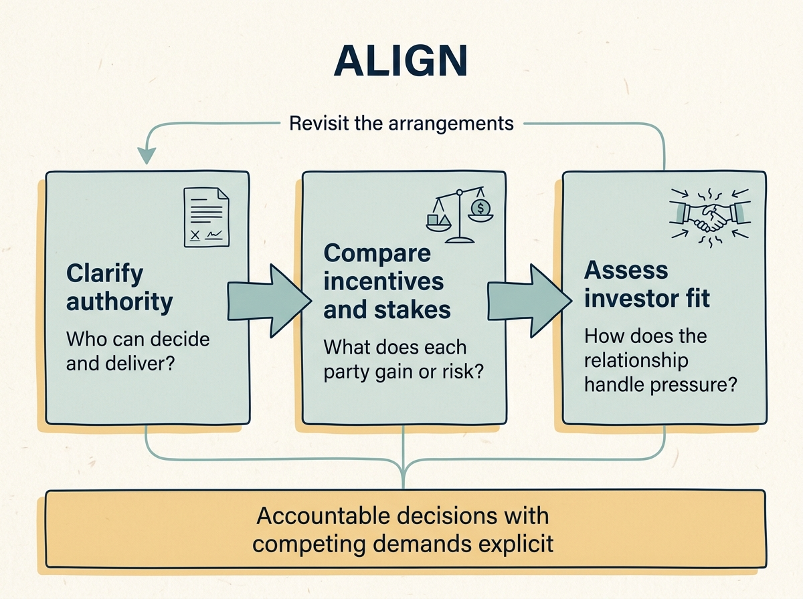

> **IN THIS SECTION, YOU WILL:** Get an introduction to Part II, How Investor Ownership Changes Decisions, and an overview of its four chapters: who can authorize the work, what each party stands to gain or lose, how to judge an investor when a plan comes under pressure, and the evidence all three depend on.

 
Everyone agrees the company should grow. One investor wants growth metrics that will support a higher valuation at the next funding round, another wants spending cut, and the founder wants to keep control of the product. Part I established whose money is involved. This part establishes who decides, what each party stands to gain or lose, and how the relationship behaves when the plan comes under pressure.

Four ideas organize it. **Governance** is the arrangements for deciding and overseeing work. **Incentives** are the rewards and consequences that steer people towards particular choices. **Investor fit** is the relationship that determines whether disagreement becomes useful or corrosive. **Shared evidence** is the defined, sourced data all three rely on: without it, a disagreement about priorities becomes a contest of assertion, and the person with more authority wins it.

Influence takes different forms. Shares, a board seat, a lending condition and an advisory role can carry different rights or influence, and an adviser may have access and weight without any decision right. For each, identify the agreement, delegation or applicable rule that establishes the right, and establish what authority, if any, accompanies the role; a job title settles nothing. A minority investor, a controlling sponsor and a corporate parent each require a different map of who decides what. Your practical task is to identify the decisions you are authorized to make, **the approvals you need** and the person who can resolve incompatible demands. You may inherit the investor relationship rather than choose it, but you can still bring evidence, request a decision and **make the cost of a chosen course explicit**.

## The Learning Path

**Figure 1:** *Authority establishes who decides; incentives explain the competing stakes; investor fit tests the working relationship. Evidence under pressure can send you back to the decision arrangements.*

- [[decide-who-decides]] shows how to establish decision rights around one filled decision record, and what to do when the approval does not arrive in time.
- [[different-bets]] examines how equity, fund carry and employee jobs expose people differently, through one consolidation decision in which those interests pull apart.
- [[investor-under-pressure]] helps you assess the partnership, whether you are comparing two offers or already working with an investor, and shows how evidence changes one commitment.
- [[data-foundations-for-alignment]] assembles the financial, planning and technology evidence the relationship runs on: built from sources you already have, defined once, owned by name, and labelled so a forecast is never read as a result.

By the end, you should be able to explain how a consequential decision gets made, who is accountable, what you would do if the original expectations prove unrealistic, and which evidence everyone involved would use to settle it.

Begin with the chapter [[decide-who-decides]]. Part III then uses these decision arrangements to choose and deliver product and technology investments.
