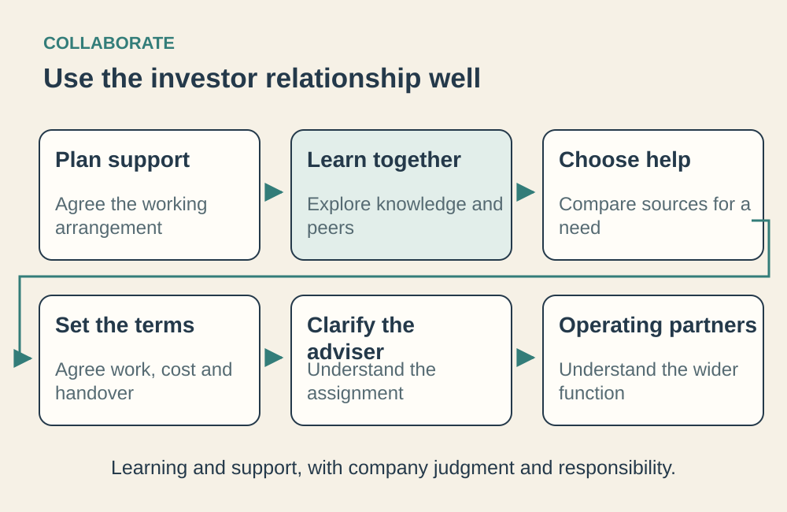

> **IN THIS SECTION, YOU WILL:** Connect the working arrangement with your investor to learning, useful help, engagement terms and the people who provide support.

 
Part III connected investor expectations to work the company can deliver. Your plan may still need experience, a trusted specialist or access to prospective customers. You may also need encounters that challenge the assumptions behind the plan. Investors can sometimes provide these through their people and relationships; peers and independent sources can also help.

Start by agreeing **how the investor and company will work together**. Explore what you can learn through the relationship, including possibilities you have not yet recognized. For a specific capability gap, compare sources of help and establish **what the company must contribute in return**. Learning experiences, specialist assignments and ongoing services require different commitments.

The aim is a stronger company, or a deliberately funded continuing service whose costs and dependencies are understood. Keep a way to question an offer, reshape it or choose another source of help.

## The Learning Path

**Figure 1:** *The six chapters connect learning and support with company judgment, accountability and understood commitments.*

The six chapters move from the working arrangement through learning and specific engagements to the people supporting them.

- [[operating-model-blueprints]] connects investor involvement with company organization and offers four blueprints to adapt to the work, authority and resources available.
- [[learn-through-investors-network]] explores knowledge sharing, events, peer communities and visits, then follows the learning back into the company.
- [[help-that-changes-capability]] compares sources of help for one capability gap, including sources outside the investor’s network, and ends with a written request.
- [[useful-engagement]] turns that request into an engagement charter, follows a scope change and tests the handover or continuing service.
- [[investors-adviser]] explains the individual adviser’s assignment, influence and reporting relationship, including changes from coaching to assessment or delivery.
- [[tech-operating-partner]] examines the wider operating function, its relationship with company leaders, its contribution to hiring and the role of AI.

By the end, you should be able to choose a working arrangement, use learning opportunities, request useful help and agree how to review it. Company leaders retain responsibility for what becomes work.

Begin with [[operating-model-blueprints]]. Part V then follows your responsibilities through funding and ownership events, building on the financial, decision and support foundations already established.
