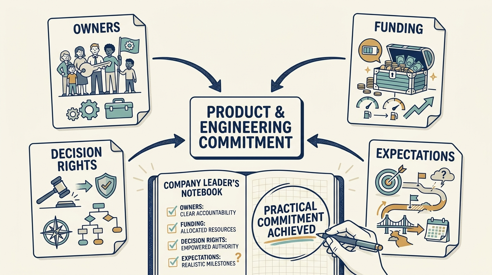
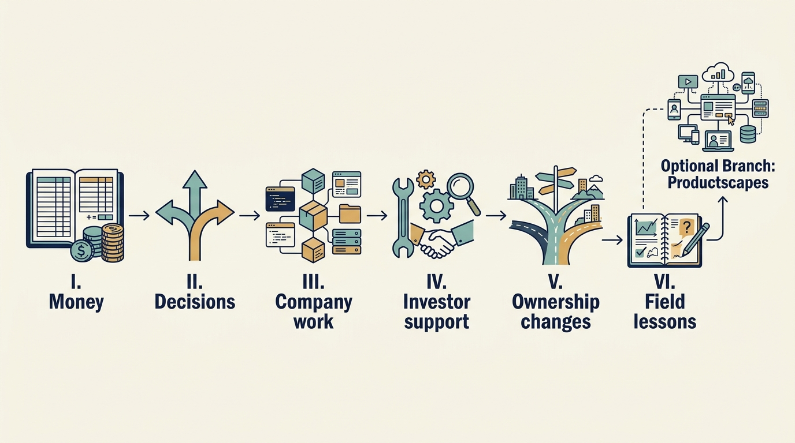

> **KEY POINTS:**
>
> * Ownership changes the **conditions in which you lead**. Find out which money, decisions and expectations your product and engineering commitments depend on.
> * Different arrangements require **different choices**. A funding round, a buyout and a corporate acquisition can put the same roadmap under different constraints.
> * You remain **responsible for the company’s work**. Challenge assumptions, make feasible commitments and explain consequences for customers and teams.

 
Your company has new investors. The announcement promises growth and support. Within weeks, you are asked to hire faster, demonstrate a new product, reduce costs or connect to the owner’s systems. The requests may each sound reasonable. Together, they can exceed the company’s money, authority and ability to deliver.

**OWNED: Product & Engineering Leadership Under Investors** is about doing your job in that situation. Its primary reader leads product or engineering inside the company, including someone who has joined an arrangement they didn’t choose. Understanding the investor matters because it changes the decisions you must make, the commitments you can support and the arguments you need to bring to the people who decide.

The company’s ownership setting doesn’t remove your judgment or responsibility. Sometimes you can approve a change yourself. Sometimes you must negotiate funding, challenge a target or ask the board to choose between incompatible outcomes. The book helps you distinguish those situations and make the consequences clear.

## Owners, Rights, Funding, and Change

This book focuses mainly on private companies working with **outside investors**. Founder self-funding serves as a point of comparison, and public markets come up where they influence financing or ownership changes, but leadership in public companies is not covered in detail.

To understand the impact of any **outside investment**, keep **four questions** separate: who the owners are, what rights they have, how the company is funded, and what is changing.

The first question, who the owners are, is where most of the labels and jargon come from. A **venture investor** funds a young company still searching for a repeatable business. A **growth investor** funds the expansion of a business with established demand. A **buyout investor** purchases control. A **corporate investor** is another operating business investing for financial or commercial reasons; it may hold a minority stake or acquire the company outright.

These labels tell you roughly what kind of investor you’re dealing with, but not the answers to the other three questions. Rights don’t automatically follow from stake size: a minority investment can carry important approval rights without conferring control. Funding doesn’t follow from deal type: borrowing is a way to raise money and isn’t confined to buyouts. And the nature of the change is separate again: a **carve-out** takes a business out of a larger company, a **turnaround** fixes serious business problems, and either can involve any of the owner types above.

The practical impact of any investment therefore depends on its actual terms, **established case by case**: the investor's rights, the financing, the support available and the time horizon.

**Figure 1:** *A company commitment depends on actual owners, funding, decision rights and expectations.*

## How to Read This Book

This book aims to build a **shared understanding** of how outside investment works so that everyone involved can collaborate more concretely. Part I supplies the financial tools to understand your owners and your available cash. Part II establishes authority, incentives and working relationships. Part III turns expectations into choices about product, engineering and people. Part IV helps you obtain useful investor support. Part V prepares you for funding and ownership changes. Part VI examines historical cases and what remains after a transaction.

No accounting or technical background is required. On a first pass, read the chapters in order, since each builds on terms introduced earlier. For example, [[valuation-is-an-estimate]] teaches financial valuation, and [[growth-into-design]] later applies those concepts to technical choices once the product and engineering foundations are in place.

**Figure 2:** *The reading sequence builds the foundations before applying them to work, support and changing ownership.*

The parts are **ordered for learning**, not by a company's timeline. The events a leader actually faces make up the **ownership cycle**, and they can arrive in any order. Each raises its own question and sends you to different parts of the book:

| Event | The company leader's question | Where to look |
| --- | --- | --- |
| A first or further funding round | What evidence justifies new money, which rights change, and what can we still fund if it arrives late? | Parts I and V |
| A purchase of control | Which decisions, obligations and operating commitments change? | Parts II and V |
| Early work after funding or a transaction | Which promises have money, capacity and an accountable owner? | Parts II and III |
| A missed target, refinancing or revised investor plan | Which assumptions failed, and which commitment or constraint must change? | Parts I, III and IV |
| A sale, partial investor exit or corporate integration | Who decides next, and what must keep working through the transition? | Parts V and VI |
| Continued ownership | What remains worth doing if no transaction happens on the expected date? | Parts IV and VI |

## Meet the Fictional Company

**Larkspur** sells scheduling software to maintenance businesses. Its customers organize appointments and assign people to work. A recurring challenge is **customer onboarding**: the setup and help needed before a customer can use the product successfully.

Ines is the **chief executive officer (CEO)**, leading the company. Alex is the **chief technology officer (CTO)**, leading technology. Sam is the **chief financial officer (CFO)**, leading finance. Priya leads product. Morgan is the investor’s technology adviser in fund-backed scenarios.

The chapters place Larkspur in alternative situations: learning with limited cash, expanding with growth funding, operating after a buyout, or working with a corporate owner. These are fictional decision exercises, not a single company history. Each example states its own assumptions; its figures do not combine into one set of accounts. “€m” means millions of euros.

## Choose a Reading Format or Route

The 29 main chapters each provide an **Article**, a 300–500-word **TL;DR** summary, and a six-panel **Comic**. TL;DR means “too long; didn’t read.” The comics are illustrated, with captions and dialogue transcripts. The six part introductions and four guide/reference pages have no TL;DR or comic.

For a shorter first pass, read the introductions and summaries. For a current decision, use the routes below and return to Part I when a financial term is unfamiliar.

| Your situation | Start with                                                                           |
| --- |--------------------------------------------------------------------------------------|
| A funding round has changed targets or decision rights | [[announcement-is-not-a-budget]] [[decide-who-decides]] [[different-bets]]                          |
| New funding may arrive after your current cash runs short | [[obligations-before-budget]] [[cannot-fund-everything]] [[the-financing-slipped]]           |
| Owners want more growth or earnings than the team can support | [[raise-what-you-need]] [[cannot-fund-everything]] [[fix-decisions-before-hiring]]        |
| Investor requests compete with customer needs | [[roadmap-to-revenue]] [[decide-who-decides]] [[investor-under-pressure]]                                  |
| A corporate investor wants integration or access to data | [[acquisition-adds-work-first]] [[prove-you-can-restore]] [[useful-engagement]] |
| The investor offers expertise or introductions | [[investors-adviser]] [[help-that-changes-capability]] [[useful-engagement]]              |
| A transaction or ownership transition is approaching | [[part-5]], then its three chapters in order                                         |

## Read the Evidence With Its Limits

This living manuscript was first drafted in September 2026. Its historical cases examine specified periods at Hilton, Skype, Visma, Toys R Us and TeamSystem. The evidence concentrates on private equity and related ownership transitions, and doesn’t establish how all venture, growth or corporate investors behave or perform.

Institutional funding guides support descriptions of other arrangements. The comparative Larkspur exercises are the author’s illustrations of decisions under stated assumptions. Company filings, investor accounts and research answer different questions; none makes an unobserved customer or employee outcome known.

The [[bibliography]] records consultation scope and evidence limits.

## Contents

### Part I — Understanding Financing and Ownership: Money, Authority and Returns

Identify your owners’ expectations and the money and decisions you can rely on.

- [[part-1]] — part introduction
- **1.** [[customers-lenders-investors]]
- **2.** [[announcement-is-not-a-budget]]
- **3.** [[valuation-is-an-estimate]]
- **4.** [[three-different-returns]]
- **5.** [[raise-what-you-need]]
- **6.** [[obligations-before-budget]]

### Part II — How Investor Ownership Changes Decisions

Establish who decides, what each party wants and how to resolve competing demands.

- [[part-2]] — part introduction
- **7.** [[decide-who-decides]]
- **8.** [[different-bets]]
- **9.** [[investor-under-pressure]]

### Part III — Turning Investor Expectations into Commitments

Turn investor expectations into feasible commitments to customers, systems and teams.

- [[part-3]] — part introduction
- **10.** [[cannot-fund-everything]]
- **11.** [[roadmap-to-revenue]]
- **12.** [[can-the-team-deliver]]
- **13.** [[growth-into-design]]
- **14.** [[cheaper-cloud-bill]]
- **15.** [[prove-you-can-restore]]
- **16.** [[ai-strategy-three-questions]]
- **17.** [[fix-decisions-before-hiring]]
- **18.** [[acquisition-adds-work-first]]

### Part IV — Beyond Money: Using Investor Support to Build Capability and Accelerate Progress

Ask for help the company can use and agree the cost, authority and continuing dependence.

- [[part-4]] — part introduction
- **19.** [[investors-adviser]]
- **20.** [[help-that-changes-capability]]
- **21.** [[useful-engagement]]

### Part V — Leading Through Funding and Ownership Changes

Lead through funding and ownership changes, including delays and continued ownership.

- [[part-5]] — part introduction
- **22.** [[diligence-corrects-the-plan]]
- **23.** [[first-hundred-days]]
- **24.** [[the-financing-slipped]]

### Part VI — Lessons from the Field

Test leadership judgments against specific histories while keeping the evidence in scope.

- [[part-6]] — part introduction
- **25.** [[hilton-and-skype]]
- **26.** [[visma]]
- **27.** [[toys-r-us]]
- **28.** [[teamsystem]]
- **29.** [[success-for-whom]]

### Reference Material

- [[toolkit]] — practical decision and support records.
- [[glossary]] — plain-language definitions.
- [[bibliography]] — sources, consultation dates and evidence limits.
