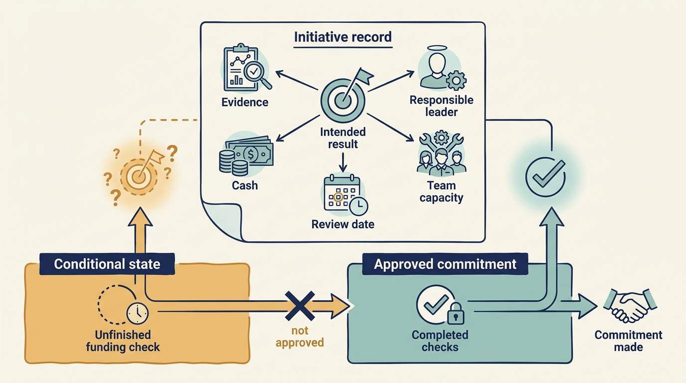
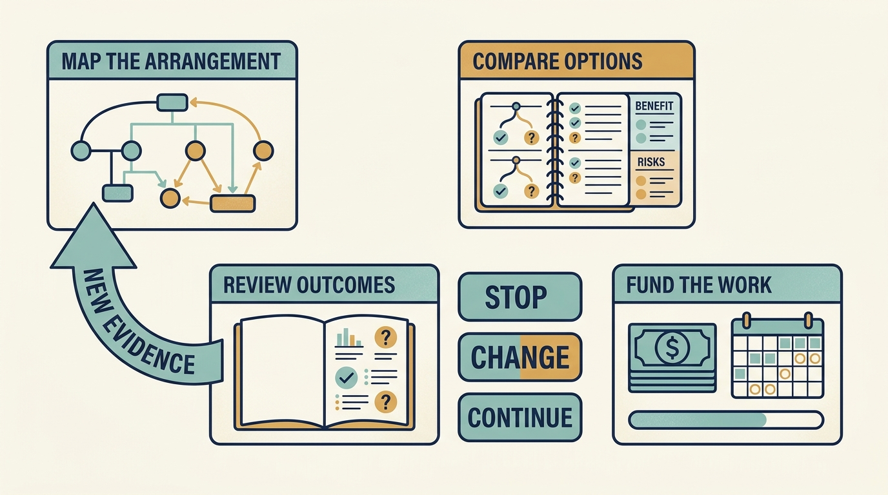

> **IN THIS SECTION, YOU WILL:** Learn which record fits the decision in front of you, and follow one finding through evidence, options, an authorized initiative, an observed result and a handover.

> **KEY POINTS:**
>
> * Use the records to make a **real decision concrete**. Start with the smallest record that changes the decision in front of you, and add fields only when a later stage needs them.
> * Record **cost, responsibility and uncertainty** alongside ambition. A template is useful when it changes a decision or preserves evidence, not merely when every field is filled.
> * **Follow one finding through**: evidence → options → an authorized initiative → an observed result → a revised decision → a handover. The fictional Larkspur chain below shows what each stage adds.

 
These are **proposed working tools** for company leaders applying the book’s financial, decision and support concepts. They haven’t been validated as a universal operating standard. Start with the smallest record that improves a real decision, and drop fields that add work without changing understanding or accountability.

## Minimum Use

You don’t need twelve documents. The smallest adequate record answers five questions in one place: what we know and how we know it; which options were compared; what was committed (cash by period, team time, the accountable company leader, the review date and who can decide); what was observed against the baseline; and what remains open. A small company can keep all of that on **one evolving page** per finding or initiative, adding a section at each stage. The tools below describe the fields each stage needs; they are not separate forms to copy into. Use the same finding or initiative identifier (D-3, ONB-1) throughout, so a reader can trace a number back to its evidence.

## Find the Record for Your Decision Stage

The tools keep their original numbers because chapters and earlier readers cite them. This table arranges them by decision stage; “see Tool N below” refers to the numbered section on this page.

| Stage | Your immediate question | Record | Teaching chapter |
| --- | --- | --- | --- |
| **Map** | Who receives the investment money, and who can approve the work? | Ownership, funding and decision map — see Tool 1 below | [[announcement-is-not-a-budget]], [[decide-who-decides]] |
| **Investigate** | What should we check before an investment, and how do we record what we found? | One-page technology thesis — see Tool 2 below; material finding — see Tool 3 below | [[diligence-corrects-the-plan]] |
| **Compare options** | Which combination of improvements can we fund and staff at once? | Investment choices and capacity — see Tool 12 below | [[cannot-fund-everything]] |
| **Compare options** | A financial target is driving a design proposal; which design alternative? | Valuation-to-architecture record — see Tool 11 below | [[growth-into-design]] |
| **Commit** | Can we fund and deliver this one improvement, and who is accountable? | Funded initiative record — see Tool 5 below | [[first-hundred-days]] |
| **Obtain help** | What exactly will the adviser or specialist help us do, at what cost, for how long? | Support engagement — see Tool 4 below | [[useful-engagement]], [[help-that-changes-capability]] |
| **Obtain help** | Should we work with this investor at all? | Investor-fit interview — see Tool 8 below | [[investor-under-pressure]] |
| **Measure** | Did the work help, and is the benefit capacity or cash? | Outcome and contribution ledger — see Tool 6 below; small scorecard — see Tool 7 below | [[roadmap-to-revenue]], [[cheaper-cloud-bill]] |
| **Revise or hand over** | We are combining or separating businesses; what must continue? | Integration or separation plan — see Tool 9 below | [[acquisition-adds-work-first]] |
| **Revise or hand over** | Funding or ownership is changing; what evidence and obligations must travel with the work? | Funding or ownership handover — see Tool 10 below | [[handover-of-obligations]], [[the-financing-slipped]] |

Tool 12 (choose the combination) comes before Tool 5 (commit to one initiative) in this order: each initiative can be feasible on its own while the combination is not.

A few labels are used throughout. An **initiative** is a defined piece of improvement work. A **baseline** records the starting situation. A **dependency** is something required before other work can proceed. A **material finding** is important enough to affect a decision. For responsibility, the records use **accountable company leader**: the person who is authorized to make the operating decision and answers for its result. **Shareholder** is reserved for ownership of the company. A person is never the “owner” of a decision in these records.

Restrict distribution according to the engagement and company permissions. A filled template doesn’t establish that its claims are true: preserve dates, definitions, evidence links and disagreement.

## One Finding, Followed Through

Everything in this section is **fictional**. Larkspur, its people and every figure are teaching examples shared with [[diligence-corrects-the-plan]], [[first-hundred-days]], [[useful-engagement]] and [[handover-of-obligations]]; the scenario states its own assumptions and does not reconcile with the annual cash bridge in [[obligations-before-budget]]. The chain uses the existing tools only. Read it once to see what each stage adds; then use only the stage you need.

The scenario: a growth investment whose investment thesis is that Larkspur can double onboarding volume without proportional growth in implementation staff. Morgan, the investor’s technology adviser, records the finding below during diligence. On the one-page thesis (Tool 2), the “main constraint” line points at this finding rather than repeating it.

### Stage 1 — The Finding (Tool 3)

| Field | D-3: Onboarding depends on one specialist’s manual configuration |
| --- | --- |
| Finding ID / dimension | D-3; organization and economics (product is affected) |
| Claim and scope | New-customer onboarding depends on one implementation specialist’s manual configuration. Scope: one country, the last two quarters; five of the last twelve implementations sampled. |
| Evidence and access | Morgan’s sample of five implementations, effort records for each, interviews with Alex (CTO) and the implementation specialist. Access limited to one country’s records. |
| Kind of claim | **Observed:** in three of the five, configuration needed the same specialist’s manual work; average effort ≈ 80 hours per implementation, matching the teaching model in [[roadmap-to-revenue]]. **Reported (Alex):** roughly 40% of the effort comes from poor customer data rather than product limitations. **Inferred (Morgan):** the dependency is structural and will not scale with more sales. **Not established:** representativeness across customer types; the actual split between data quality and product limitation. |
| Business consequence | The thesis assumes onboarding volume doubles with the same implementation team. If the dependency holds, additional bookings do not become timely revenue. |
| Alternatives | Alex’s data-quality explanation versus Morgan’s structural explanation. Distinguishing evidence: the measured effort split in a pilot cohort. |
| Confidence / importance | Evidence: moderate (small sample, one country, two quarters). Importance: high — it changes the first-year volume assumption. |
| Agreed response | The investment proceeds. First-year onboarding-volume assumption revised from 2× to 1.5×; second-country expansion moved out of year one and made conditional on pilot evidence; a funded onboarding pilot becomes a condition of the early operating plan. Approvers: the fund’s investment committee for the transaction terms; the Larkspur board for the plan and its funding. |
| Company handoff | Priya (product leader) is the accountable company leader. She records acceptance within ten days of closing; first review at day 90. |

Compare this with “architecture maturity: amber.” The record exposes the economic assumption, the evidence limit and the disagreement that the next stage must resolve.

### Stage 2 — The Options (Tool 12)

The board cannot fund every response, so the options are compared on cash and team time separately before anything is committed. These are the option rows of a Tool 12 record; existing payroll sits in the operating budget and is not added again.

| Option | Expected result | Additional cash | Team time | Continuing cost | Consequence of delay |
| --- | --- | ---: | ---: | ---: | --- |
| 1. Hire two implementation specialists | More onboarding capacity; the dependency on manual configuration remains | ≈ €300,000 a year, recurring | Hiring and onboarding effort | ≈ €300,000 a year | Fastest if candidates are available; cost scales with volume |
| 2. Fund one reusable setup step as a pilot | Tests whether effort per implementation falls, and measures the data-versus-product split | €180,000 to build | 12 engineer-weeks | €30,000 a year | Result uncertain until the cohort is measured; evidence arrives at day 90 |
| 3. Narrow the first-year target to customers with standard data | Less manual effort without building anything; lower first-year volume | €0 | Little | None | Does not remove the dependency; postpones the question |

**Combination proposed and authorized:** option 2 is funded as initiative ONB-1 within the first-hundred-days envelope (up to €300,000 additional cash and 24 engineer-weeks for the period, alongside KNW-1 and REC-1, leaving a reserve of €40,000 and 4 engineer-weeks). Option 1 is deferred, with the decision recorded, until the pilot evidence exists. Option 3 is not adopted as a policy, but the revised 1.5× volume assumption and the deferred second-country expansion reduce the exposure it was meant to remove. Authority: the Larkspur board. Evidence that would change the combination: the pilot cohort’s effort per implementation and its measured split between data quality and product limitation.

### Stage 3 — The Initiative, Pending and Authorized (Tool 5)

The same initiative record is shown twice. The left column is the state many plans stop at: a sensible proposal that still asks someone else to supply the money, the name and the date. The right column is what the board actually authorized. The difference between the columns is the decision.

| Field | ONB-1 — pending | ONB-1 — authorized |
| --- | --- | --- |
| Linked finding | D-3 | D-3 |
| Problem | Each new customer requires repeated manual setup before using the scheduling product. | Unchanged. |
| Proposed change | Test one reusable setup step with a comparable group of customers. | One reusable setup step, tested on a cohort of new customers in the first hundred days. |
| Baseline | The teaching model assumes 100 implementations a year at 80 hours each; confirm whether the actual customer records support that. | Baseline taken from actual customer records by day 20 (prerequisite); the model’s 80 hours is the working assumption until then. |
| Intended result | Effort falls toward 50 hours without increasing customer waiting, errors or support work. | Unchanged; customer waiting time, error rate and support tickets are the quality guardrails and are measured with the cohort. |
| Funding | To examine: the pilot example assumes €180,000 to build and €30,000 a year to maintain; approval still needs a funding source. | €180,000 committed by the Larkspur board from the first-hundred-days envelope; about €90,000 expected to be spent within the period; €30,000 a year to maintain thereafter. |
| Team capacity | To agree with the team. | 12 of the 24 engineer-weeks authorized for the period. |
| Accountable company leader | To be named. | Priya, with Ines (CEO) as executive backing; Alex provides the engineers. |
| Options rejected | Not recorded. | Hiring two specialists (≈ €300,000 a year) deferred pending evidence; narrowing the target alone rejected because it leaves the dependency in place. |
| Review and authority | Set a review date before expanding. | Day-90 cohort review. The board decides expansion, hiring and second-country expansion on that evidence. |
| Board approval | Not obtained. | Recorded at the board meeting that authorized the first-hundred-days envelope; Priya’s acceptance recorded within ten days of closing. |
| Evidence that would change the decision | Not stated. | Effort not falling in the cohort; waiting time or error rate rising; the measured effort split showing data quality rather than the product as the binding constraint. |
| Financial limit | Fewer hours are capacity; count cash savings only when spending is actually reduced or avoided. | Unchanged. |

The pending column is still useful: it is the preparation described in [[roadmap-to-revenue]]. It does not demonstrate a funded initiative until the right column exists. The pilot is a smaller alternative to that chapter’s earlier €1 million program, not additional spending already approved alongside it.

The specialist support that helped build the setup step is a separate record (Tool 4): ten specialist days over six weeks, six days of company engineering effort, Priya accountable, an investor-side sponsor named by role, review at week six — see [[useful-engagement]].

### Stage 4 — The Observed Result (Tool 6)

At the day-100 review the ledger entry for ONB-1 reads:

| Field | ONB-1 at day 100 |
| --- | --- |
| Baseline and definition | 80 hours of implementation effort per customer, confirmed from actual customer records by day 20; one country. |
| Intervention and actual cost | Reusable setup step delivered; about €90,000 of the €180,000 commitment spent by day 100; engineer time drawn against the 12 allocated weeks; €30,000 a year maintenance begins. |
| Observed result and period | Cohort of eight customers onboarded with the new step; average effort 62 hours, not the 50 assumed. About 40% of the remaining hours traced to customer data quality. |
| Quality guardrails | Customer waiting time unchanged; no rise in errors or support tickets reported for the cohort. |
| Capacity bridge | About 18 hours released per implementation, measured from effort records; 144 hours across the cohort. No spending changed, so the benefit is **capacity, not cash**. If the cohort result held across 100 implementations a year it would release about 1,800 hours — a projection, not an observation. |
| Financial bridge | No cost line or cash flow changed. The avoided hiring is not a saving: the hires were never committed. |
| Explanation of the result | Alex’s data-quality explanation is partly supported by the measured split; Morgan’s structural explanation is partly supported by the effort that remains. Competing explanations still open: cohort selection and learning effects on a small cohort. Confidence: moderate. |
| Valuation implication | None claimed. |

### Stage 5 — The Revised Decision

The board decision at day 100, recorded against ONB-1: fund a data-quality step from the reserve (€40,000 and 4 engineer-weeks, which uses the whole reserve); keep second-country expansion deferred one more quarter; hiring stays deferred. Alternatives rejected: expanding the setup step to all customers now (the 62-hour result is short of target and the data-quality share is unresolved) and hiring immediately. Authority: the Larkspur board, with Priya accountable for the added step. Evidence that would change the decision: the effort split in the next cohort after the data-quality step, and any rise in customer waiting time.

### Stage 6 — The Handover Entry (Tool 10)

When funding or ownership next changes, the handover record carries D-3/ONB-1 forward rather than restarting it:

| Field | D-3 / ONB-1 carried forward |
| --- | --- |
| Evidence | Baseline 80 hours (actual records, day 20); observed 62 hours on a cohort of eight; about 40% of remaining hours from customer data quality; waiting time unchanged; definitions and sources linked. |
| Funding | €180,000 committed, about €90,000 spent to day 100; €30,000 a year maintenance; data-quality step €40,000 authorized from the reserve. |
| Continuing customer work | Onboarding of the cohort and subsequent customers with the new step; Priya accountable. |
| Technical and people dependencies | The setup step’s maintenance; the implementation specialist’s remaining manual configuration for non-standard data. |
| Open work | Data-quality step (4 engineer-weeks); expansion decision next quarter; hiring decision pending; disagreement between the data-quality and structural explanations partly resolved. Next decision: the board, on the next cohort’s evidence. |
| Changed authority | None yet; record any new approval thresholds when the event completes. |

A new shareholder’s reporting format should not erase this entry. The original cost, the shortfall against target and the open work are the operating history the next team inherits — see [[handover-of-obligations]].

### What Each Stage Added

Only new information was added at each stage; nothing was copied between records. The finding added evidence, the kind of claim and the disagreement. The options record added cash, team time and continuing cost per option. The authorized initiative added committed cash by period, allocated capacity, the accountable company leader, the review date and who decides. The ledger added the confirmed baseline, actual cost, observed result and the honest capacity-not-cash bridge. The revision added the decision taken and the alternatives rejected. The handover added the open work and any changed authority. A small company can keep all six on one page under the heading “D-3 / ONB-1”.

## 1. Map the Shareholders, Funding and Decision

Use before translating an ownership announcement into an operating promise. See [[announcement-is-not-a-budget]], [[obligations-before-budget]] and [[decide-who-decides]]. Complete this for the actual arrangement, rather than assuming every investor has a fund or controls the company.

| Field | Record |
| --- | --- |
| Operating company and relevant entities | Which entity holds the cash, debt, contract or asset needed for this decision? |
| Shareholders and their roles | Founder, fund, corporate or other shareholders; distinguish the manager from the actual investing entity where relevant |
| Event | New share issue, sale of existing shares, control acquisition, refinancing, separation, or continued ownership |
| Money and conditions | Amount paid to the company, amount paid elsewhere, fees, restrictions, payment dates and conditions before further money arrives |
| Expectations | The outcome each relevant investor seeks; record disagreement rather than averaging incompatible targets |
| Authority | Who proposes, approves, funds and implements; source of the right, decision threshold and escalation route |
| Time | Cash forecast, minimum operating reserve, debt dates, funding or group-budget decision and the latest safe date to change course |
| Support | Named provider, available capacity, information boundaries, costs and continuing dependence |
| Company commitment | What you can deliver with confirmed resources, and what remains conditional |
| Consequences | Customer, employee and supplier effects of delay, failure or the chosen trade-off |
| Review | Evidence that would change the plan, the accountable company leader and the next review date |

For fictional Larkspur, “hire two engineers after €2m arrives and the board approves the plan” is a different commitment from “hire now because an investor is interested.” Record which one the company has actually authorized. Tool 10 reuses the map’s Authority, Money and Time rows at a funding or ownership event; update the map rather than copying them.

## 2. Write a One-Page Technology Thesis

Use when investigating a proposed investment, then revise with the company leaders responsible for the plan after the transaction completes. See [[diligence-corrects-the-plan]]. The thesis summarizes and links the findings (Tool 3); it does not repeat them.

**Company and date:** [fill in]. **Ownership and rights:** [shareholders, control and approvals]. **Funding or transaction:** [new shares, sale, refinancing, separation or continued ownership]. **Decision and accountable company leader:** [fill in].

**The business must be able to:** [customer or operating capability, at the required scale and quality].

**The proposed value mechanism is:** [revenue, retention, margin, cash, risk, resilience, or flexibility; explain the chain].

**For this to work, the following must be true:** [list the few assumptions that could change the investment, funding, or timetable].

**What we observed:** [source, date, scope, and any sampling limit]. **What management reports:** [separate assertions]. **What we infer:** [reasoning and confidence]. **What remains untested:** [material gaps].

**Required operating change:** [people, process, product, architecture, or contractual change]. **Cash and capacity:** [implementation, ongoing cost, work displaced, and who commits the cash]. **Dependencies:** [what must happen first].

**Decision implication:** [proceed; change terms or resources; defer pending evidence; decline; consciously accept uncertainty]. **What would change this recommendation:** [specific evidence or scenario].

A thesis is useful if a decision-maker can explain **what would make it fail**. Rewording a growth ambition in technical language doesn’t achieve that.

## 3. Record a Material Diligence Finding

The seven dimensions are a coverage aid: product, architecture, engineering, data and AI, security and resilience, organization, and economics. Don’t average their scores into false precision. See [[diligence-corrects-the-plan]]. The D-3 record above is a completed example.

| Field | Record |
| --- | --- |
| Finding ID / dimension | Stable identifier and relevant dimension(s) |
| Claim and scope | What is being claimed, for which product, system, customer cohort, or period |
| Evidence and access | Documents, observations, interviews, sample selection, dates, and access limits |
| Kind of claim | What we observed, what someone reported, what we infer, what we propose to test, or what remains unknown |
| Business consequence | Effect on the thesis, customers, cost, cash, risk, timing, or strategic options |
| Alternatives | Other explanations and evidence that would distinguish them |
| Confidence / importance | How strong is the evidence, and how much could the issue affect the decision? Explain each separately. |
| Agreed response | Investment implication, required condition, funded initiative, accepted residual risk, or further investigation |
| Company handoff | Named accountable company leader, acceptance date, resources, and next evidence check |

“Three observed onboarding engagements required the same specialist’s manual configuration; we have not established how representative they are” is stronger than “architecture maturity: amber” because it exposes the economic assumption and the evidence limit.

## 4. Agree an Investor Support Engagement

Use when agreeing a specific source of investor support, whether a short assignment or a continuing specialist service. See [[help-that-changes-capability]], [[useful-engagement]] and [[investors-adviser]].

Record the question, the expected useful output, the **investor-side sponsor** (the person within the investment firm who backs the engagement and can secure agreed support or resolve a resource issue) and the **accountable company leader** (who remains responsible for the operating result unless a different formal assignment has been made). Add participants, scope, exclusions and the end date or review cadence. Name the adviser’s or specialist’s authority: advice, or a delegated decision, and if delegated, by whom. Define the time commitment, specialist budget, who pays it, availability during deal peaks, and the escalation path if resources change.

Specify information access and permitted recipients. Distinguish confidential coaching from work that feeds a governance report. Explain which material matters require escalation and through what process. Agree how the company can challenge, revise, or end the support.

For a **continuing service** (a fractional security lead, a data specialist retained across releases, a shared platform team), add four fields: the recurring cost per period and which budget carries it; the accountable company leader for the service’s results; the review date and the evidence reviewed (cost, company effort, decisions changed); and an **exit or continuity plan** — what the company retains in knowledge, access, contracts and documentation if the provider, the investor or the engagement ends. A deliberately funded continuing specialist service is a legitimate outcome. Define success as a decision or capability left with the company, which does not require internalizing every specialty.

Review service cost and company effort along with satisfaction. Before extending the engagement, ask what additional useful outcome requires continued involvement. The fictional ONB-1 support in [[useful-engagement]] shows a short engagement whose week-three discovery — data quality, not the setup step, was the binding constraint — changed the scope through the agreed review.

## 5. Build a Funded Initiative Record

Use for an early operating plan or later intervention. See [[first-hundred-days]]. The pending and authorized versions of ONB-1 above show the level of detail to start with, and what has to be added before the record describes funded work.

| Field | Record |
| --- | --- |
| Initiative ID and linked findings | Trace back to the thesis and evidence |
| Problem and affected users | Describe the constraint without assuming the solution |
| Intended mechanism | Intervention → operating/customer change → economic consequence |
| Baseline and target | Definition, period, source, who maintains the measure, uncertainty, and quality guardrail |
| Accountable company leader | Person who can make the operating decision, with executive backing where needed |
| Work and dependencies | Milestones, sequencing, specialists, contracts, and required access |
| Resources | Cash by period, people and skills, management attention, and displaced work |
| Options considered | Minimum continuity, staged improvement, larger investment, or another feasible choice (link the Tool 12 comparison rather than repeating it) |
| Downside and continuity | What happens if delivery, benefits, or financing disappoint |
| Review / stop / expand conditions | Observable evidence and authority to act on it |
| Accepted obligations | Risks, customer commitments, and future costs remaining after completion |

A collection of records must still fit total company capacity. Adding realistic estimates to each initiative doesn’t make their sum feasible.

### If Funding Is Still Conditional

Record the amount and date required, who can commit it, the conditions and what the team may do before it arrives. Include the last date at which hiring, contracts or customer promises can still change affordably. Review that date alongside delivery milestones.

Distinguish cash received, a contractual commitment with understood conditions, an approval still pending and an expression of interest. Show the plan using currently available resources and the additional work that becomes possible if funding arrives. Label the record **pending** until the committed state exists.

**Figure 1:** *Use the record to expose and resolve the conditions needed for the work — the move from the pending column to the authorized column.*

## 6. Keep an Outcome and Contribution Ledger

Use to prevent an activity, a capacity gain, and a financial result from becoming the same claim. See [[roadmap-to-revenue]], [[cheaper-cloud-bill]], and [[three-different-returns]]. The ledger holds one initiative’s result; the scorecard (Tool 7) selects a few measures across initiatives. The ONB-1 entry above is a completed example.

Record the original baseline and its definition; the intervention and actual cost; the observed result and period; relevant customer or service quality; demand and mix changes; acquisition effects; and other initiatives. Link the underlying evidence rather than copying uncontrolled numbers around.

**Capacity bridge:** What time or resource was released? How was it measured? Where did the capacity go? If no spending changed, describe the benefit as capacity or capability, not a cash saving.

**Financial bridge:** Which line or cash flow changed? Is it gross or net of implementation and ongoing cost? Is it observed, annualized, projected, or realized? Which accounting definitions and currency are used? Has finance reconciled the claim? Have benefits already been counted elsewhere?

**Explanation of the result:** What comparison is available? What competing explanations remain? Does the evidence support saying the work caused the result, helped alongside other changes, or only happened at the same time? State confidence and what evidence would improve it.

**Valuation implication, if used:** Show the assumptions separately, including earnings basis, multiple, financing, timing, and uncertainty. Do not add a speculative equity-value estimate to realized cost savings as if they were independent benefits.

## 7. Use a Small Outcome Scorecard

Choose measures around the thesis, each with a named accountable leader and a definition. The rows below are examples of questions, not a mandatory portfolio dashboard.

| Perspective | Outcome question | Possible evidence | Necessary guardrail |
| --- | --- | --- | --- |
| Customer | Are customers reaching and retaining useful value? | Onboarding cohorts, retention, service performance | Mix, contract terms, and quality must remain visible |
| Delivery | Can the company make useful changes reliably? | Lead time (name its start and end points), recovery, rework, representative work samples | Avoid individual rankings from activity counts |
| Economics | Have unit economics or cash generation improved? | Cost per successful outcome, reconciled spending and cash | Include transition cost, volume, and quality |
| Risk and resilience | Can critical services withstand or recover from relevant failure? | Tested recovery, material exposure, accepted exceptions | Absence of reported incidents is not proof of safety |
| Organization | Can the company sustain and adapt the work? | Knowledge dependencies, decision delays, retention context | Employee evidence and displaced work matter |
| Support service | Did the support engagement help at a reasonable cost? | Decision changed, outcome record, company effort and feedback | Adoption and satisfaction alone do not establish value |

For each selected measure, record its baseline, accountable leader, reporting period, decision trigger, and next review. Remove a metric when nobody can identify **a decision it informs**. Investigate a surprising change before attaching an incentive to it.

## 8. Interview for Investor Fit

Use before and during an engagement. See [[investor-under-pressure]]. Ask for evidence and concrete examples rather than assurances.

- Describe a case where the original thesis was wrong. What changed, and who decided?
- Show how an operating investment was funded when the base case deteriorated.
- Which support people would actually work with this company, for how much time, and at whose cost?
- What happens when a CEO or CTO declines an offered intervention?
- Give an example of a technology standard that was deliberately adapted to company context.
- How are leadership changes investigated and implemented? Which operating conditions are examined alongside the person?
- Which outcomes are tracked after exit? What evidence is available from employees, customers, and suppliers?
- How are management equity, reporting, information access, and decision rights documented?

Compare the answers across participants and permitted references. An absent document may be fixable; repeated contradictions about authority, funding or consequences need a more substantial response. The aim is a realistic engagement, not a personality verdict.

## 9. Plan Acquisition Integration or Separation

Use alongside the transaction timetable, with appropriate legal and financial specialists. See [[acquisition-adds-work-first]].

Identify the value mechanism that requires each integration: reporting, commercial collaboration, shared capability, or product convergence. Record the customer impact, permitted data flows, license and intellectual-property rights, identity and access boundaries, product commitments, supplier dependencies, and the people who hold critical knowledge.

For a carve-out, separate Day 1 continuity from the final independent state. List each transition service, the accountable leader for its contract, duration, cost, service expectation, dependency, and exit condition. Build standalone cost from required capabilities rather than accepting the seller’s historical allocation.

Sequence changes around customer continuity and scarce expertise. Show dual-running costs, rollback options where feasible, migration acceptance, and the point at which the business can operate independently. A synergy target should include the expense and time needed to realize it.

## 10. Prepare a Funding or Ownership Handover

Use for another round, a sale, corporate integration or a material change in authority. See [[handover-of-obligations]] for what must travel with the work, and [[the-financing-slipped]] for the delayed-event plan; [[diligence-corrects-the-plan]] shows what the next investor will look for. A new fundraise and an investor selling existing shares need different cash explanations. The D-3/ONB-1 entry above is a completed row.

| Field | Record |
| --- | --- |
| Event and decision | What changes, who decides and when authority transfers or funding becomes available |
| Evidence | Original baseline, current result, definitions, sources and unresolved uncertainty (from the Tool 6 ledger) |
| Funding | Cash received or contractually committed, conditions, obligations and funding needed to finish the plan |
| Continuing customer work | Service commitments, migrations, support obligations and accountable leaders |
| Technical and people dependencies | Systems, contracts, knowledge and shared services that must continue |
| Changed authority | New approvals, delegated decisions and escalation routes (update the Tool 1 map) |
| Open work | Remaining costs, risks, accepted limitations and who is accountable for the next decision |
| Delayed-event plan | What continues, what changes and when to act if the event is postponed or cancelled |

**Preserve the operating history across the transition**. A new shareholder’s reporting format should not erase the original cost, the uncertain result or the obligation left with the next team.

## 11. Connect Valuation to Architecture

Use this companion to the initiative record when a financial target is driving a technology proposal. Its main application is choosing between design alternatives under stated constraints — see [[growth-into-design]]. [[valuation-is-an-estimate]] supplies the financial vocabulary.

| Record | Questions to answer together |
| --- | --- |
| Value assumption | Which growth, earnings, cash or risk expectation makes this proposal important? Which period and financial definition apply? |
| Business capability | What must become easier, safer or cheaper for customers or the company? |
| Design alternatives | What could a small boundary change, configuration improvement, consolidation or larger redesign achieve? Include retaining the present design where credible. |
| Transition | Who does the work, what cash is needed, what runs in parallel and what gets postponed? |
| Outcome and limits | What observable result justifies the work, what might offset it, and what triggers revision? |

A valuation ratio is context for this conversation. It doesn’t replace the customer, operating and technical evidence needed to choose the design.

## 12. Compare Investment Choices and Capacity

Use before approving a combination of projects. See [[cannot-fund-everything]]. This record complements the individual initiative record in Tool 5: each project can be feasible on its own while the combination is not. The option rows for D-3 above are a completed example.

| Field | Record |
| --- | --- |
| Decision and period | The combination of work being chosen, the planning period and the person authorized to decide |
| Required commitments | Existing customer, operating or other obligations, and the minimum result the company has agreed to provide |
| Available money | Cash that can be committed after existing obligations; distinguish new funding from money paid to selling shareholders |
| Available team capacity | People, skills and time available after current work; identify specialists shared across proposals |
| Options | Expected result, evidence, cash, team time, dependencies, continuing cost and the consequence of delay for each option |
| Combination proposed | Selected work, total cash and capacity, sequencing, work deferred or stopped and resources left uncommitted |
| Uncertainty and first stages | What a smaller commitment can test, and what must remain workable if later work does not proceed |
| Review decision | Evidence, date and authority for continuing, changing, expanding or stopping |

Calculate cash and team time separately. Identify overlapping benefits and costs, as well as prerequisites that prevent projects from running in parallel. A resource estimate should say what it includes; don’t add existing payroll to a proposal a second time if the budget already contains it.

Record the reason for the selected combination in ordinary language. A score can organize estimates, but the accountable decision-maker must still explain the trade-off and what evidence would change it.

## Combining and Revising Records

The records overlap by design, and that is the reason not to copy fields between them. Tools 2, 3 and 5 all mention evidence, resources and responsibility: the thesis links findings, a finding holds the evidence, and the initiative holds the commitment. Reference the finding by its identifier from the other two. Tools 6 and 7 both define outcomes: the ledger explains one initiative’s result, the scorecard chooses the few measures the board watches. Tool 10 reuses the map’s Authority, Money and Time rows and the ledger’s evidence; update those and point to them.

A small company can keep a finding, its initiative and its outcome on one evolving page. Revise the page when evidence arrives, keeping the earlier state visible: the pending version, the authorized version, the observed result and the revised decision are the history a later reader — or a later shareholder — needs. What matters is not the number of documents but whether the next decision can see the last one’s evidence.

**Figure 2:** *The records are useful when evidence from the work changes the next decision — as the D-3 finding, the ONB-1 result and the day-100 revision show above.*
