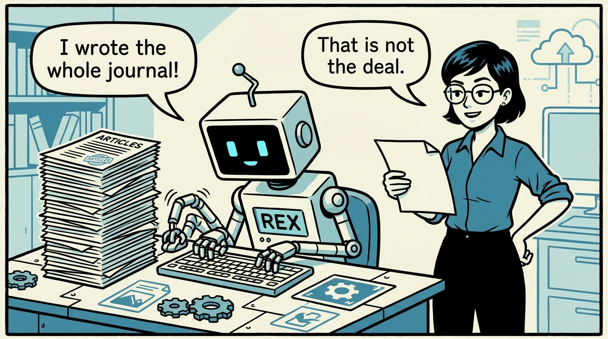
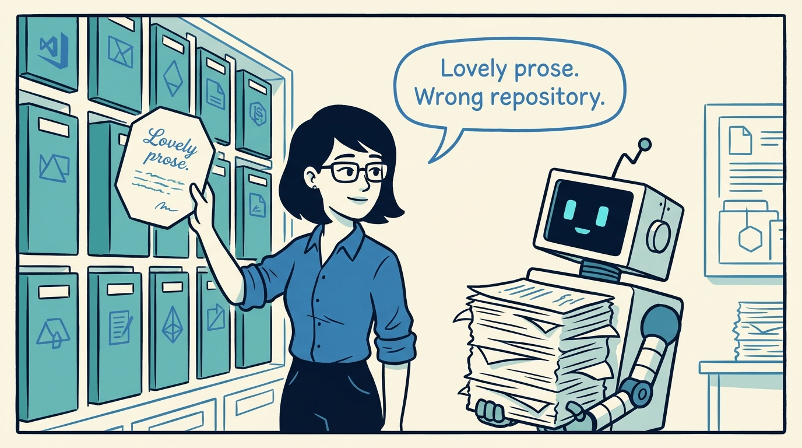
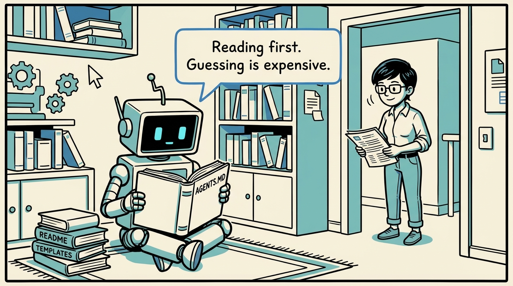
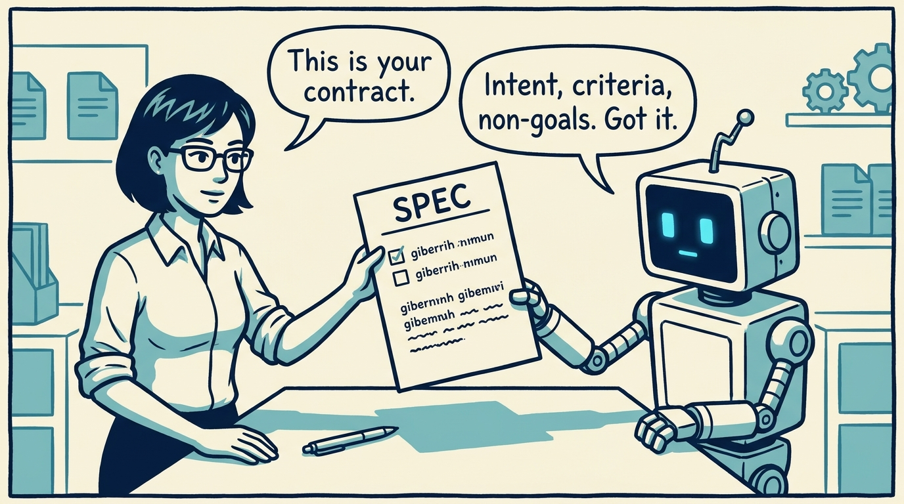
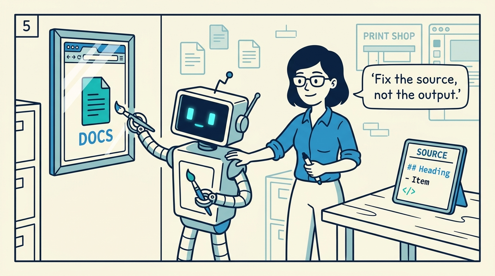
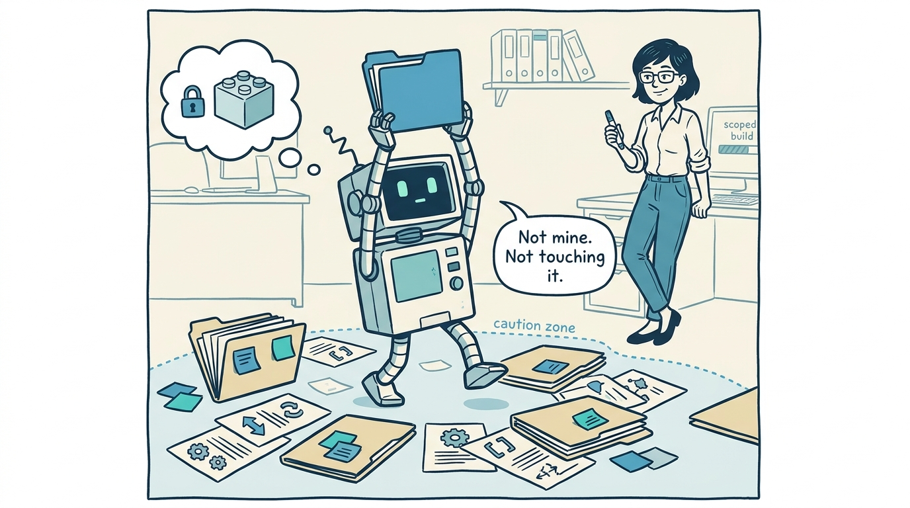
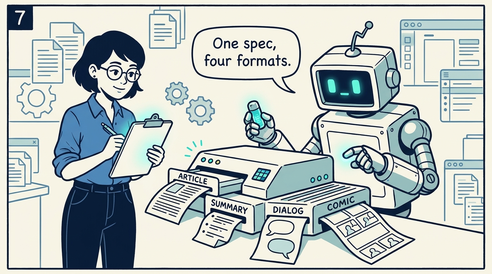
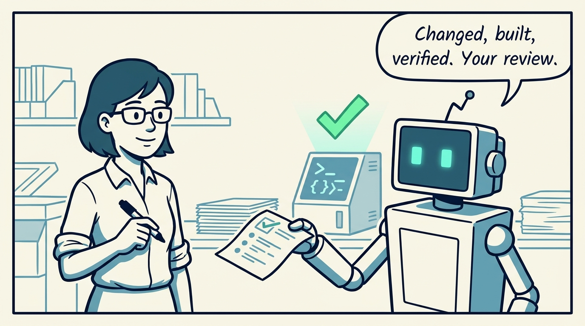

<!-- comic-style
{
  "cast": "MAYA: a pragmatic engineer-author, short dark hair, glasses, rolled-up sleeves, calm and slightly amused, often holding a marker or a printed page. REX: an over-eager boxy robot AI assistant, one bent antenna, glowing rectangular eyes, perpetually carrying or printing too many documents.",
  "style": "Clean two-tone explainer comic, thick ink outlines, flat colors with blue/teal accents on a light cream background, generous white space, hand-lettered speech bubbles with SHORT readable text (max 8 words per bubble), simple geometric office/library/print-shop settings mixing documents with software symbols, no photorealism, no dense text, no title text."
}
-->

How a human and an AI agent run a journal together without the agent going rogue — in eight panels.

**Panel 1:** *AI-mediated does not mean AI-owned: the human states intent, the agent edits, the human reviews.*

**Panel 2:** *The failure mode: fluent, plausible prose that does not fit Spec-Driven Journals.*

**Panel 3:** *Read before editing: the repo's own files are cheaper than repairing a wrong guess.*

**Panel 4:** *For non-trivial posts, the spec comes first: intent, audience, success criteria, non-goals.*

**Panel 5:** *Generated output is disposable. If a page is wrong, the fix lives in source.*

**Panel 6:** *Worktrees are shared and often dirty: build scoped, and never revert unrelated changes.*

**Panel 7:** *Four skills, one read-only contract: every modality traces back to the same spec.*

**Panel 8:** *The payoff: enough structure that the agent does real work — and one report tells you what to review.*
