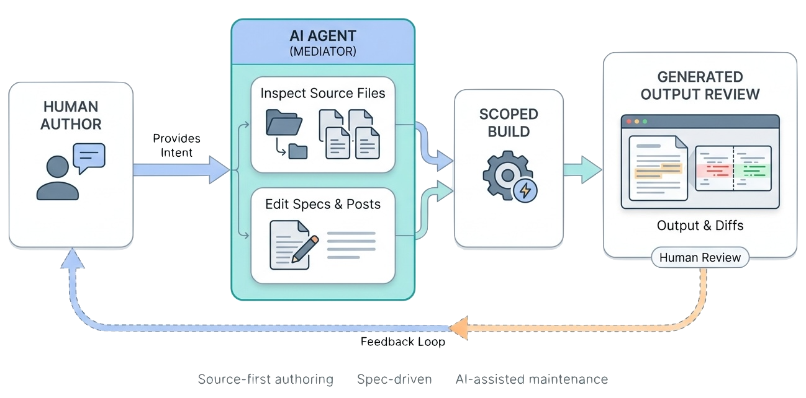

> AI agents are useful journal collaborators when they treat the Spec-Driven Journals repository as source, read the local contract before editing, update specs before substantial posts, build scoped output, and leave a clear verification trail.

[Spec-Driven Journals](https://github.com/zeljkoobrenovic/spec-driven-journals) assumes AI-mediated authoring for substantive work.

That does not mean "AI writes the journal." It means a human describes intent, an agent edits the Spec-Driven Journals source, and the human reviews the diff and generated output. The durable rationale is captured in [[ai-mediated-authoring]]. This article describes the operating behavior inside Spec-Driven Journals.

## The Human-Agent Split

The split is pragmatic:

| Human responsibility | Agent responsibility |
| --- | --- |
| State the intent. | Inspect Spec-Driven Journals guidance and current source. |
| Decide whether the direction is good. | Draft specs, posts, config, and template changes. |
| Provide missing context. | Preserve existing conventions and stable permalinks. |
| Review the generated output. | Run scoped builds and report verification. |
| Accept or redirect the work. | Avoid reverting unrelated changes. |

The agent helps move the work through source files. It does not own the editorial judgment.

*Illustration placeholder: `ai-mediated-journal-session-flow.png` should show a human providing intent, an AI agent inspecting source and editing specs/posts, a scoped build, and the human reviewing generated output and diffs.*

## What A Good Session Looks Like

A good AI-mediated journal session follows a predictable shape:

1. Read the user's request.
2. Inspect relevant configs, posts, specs, templates, and scripts.
3. Update specs first when the post intent changes.
4. Edit source files, not generated HTML.
5. Run a scoped build when possible.
6. Check generated output for unresolved links or obvious rendering issues.
7. Report what changed and what was verified.

The point is not to slow down. The point is to prevent the agent from writing plausible prose that does not fit Spec-Driven Journals.

## Read Before Editing

Agents should first ask Spec-Driven Journals what it already does.

The primary source context is the [official Spec-Driven Journals repository](https://github.com/zeljkoobrenovic/spec-driven-journals). The [generated Spec-Driven Journals site](https://zeljkoobrenovic.github.io/spec-driven-journals/) is useful for reader-facing review, but source edits belong in source.

Useful files include:

| File | What it teaches |
| --- | --- |
| `README.md` | Spec-Driven Journals purpose, quick start, current journal map. |
| `AGENTS.md` | Detailed build, authoring, and rendering contract. |
| `_journals/README.md` | Journal folder layout and front matter. |
| `_wiring/README.md` | Build scripts and maintenance helpers. |
| `_templates/post.html` | Supported client-side Markdown and custom renderers. |
| existing `config.yaml` files | Local section and post ordering patterns. |
| existing posts and specs | Tone, shape, and cross-link conventions. |

Reading these files is cheaper than repairing a model that guessed wrong.

## Work With Dirty Trees

The worktree may already contain changes from the user, another agent, or a previous session.

The operational rule is strict: do not revert unrelated changes.

That affects builds. A full `python3 _wiring/build.py` can regenerate every journal, including ones with unrelated dirty output. During scoped work, a journal-specific build can be safer because it updates only the affected generated site.

The agent should still say what it built. Silent verification is not useful to the reviewer.

## Keep Generated Output Disposable

Agents should not edit `docs/<journal>/*.html` directly.

Generated files are useful for verification and publication. They are not the source of the article. If an image does not render, the fix belongs in the markdown path, the asset location, or the build logic. If a cross-link is unresolved, the fix belongs in the source permalink or the link target.

This is one of the easiest ways to evaluate agent quality. A good agent returns to source.

## Use Specs As The Agent Contract

For non-trivial posts, the spec should be the first source file the agent creates or updates.

The spec gives the agent a compact contract:

- intent
- audience
- success criteria
- non-goals
- open questions
- decision log
- sources
- changelog

Without that contract, the agent may optimize for fluent prose. With that contract, it can optimize for a specific article outcome.

## What Agents Should Avoid

AI-mediated authoring fails when the agent becomes casual about source.

Watch for:

- editing generated HTML instead of source
- changing permalinks unnecessarily
- adding posts without wiring `config.yaml`
- writing an article that does not match its spec
- skipping the build
- ignoring unresolved double-bracket links
- overwriting user changes in unrelated journals
- inventing Spec-Driven Journals behavior instead of inspecting scripts
- treating specs as polished documentation rather than working contracts

These are not abstract risks. They are the practical failure modes of AI-assisted documentation systems.

## What To Report At The End

A useful final report should include:

- source files changed
- generated output rebuilt
- verification commands run
- known limitations or skipped checks
- unrelated dirty files noticed but not touched

The user does not need a transcript of every action. They need enough to review the result and continue confidently.

## The Payoff

AI agents are valuable here because Spec-Driven Journals is structured enough for them to reason about.

The combination of markdown source, sibling specs, stable config, deterministic build, and generated review surfaces gives the agent guardrails. The agent can do real editorial and implementation work without turning every session into a fresh context negotiation.

That is the operating promise of spec-driven journals.

At this point, the authoring model has covered structure, content mechanics, workflow, and AI-mediated collaboration. The next article, [[build-pipeline-and-rendering-model]], opens the implementation side of the system.
