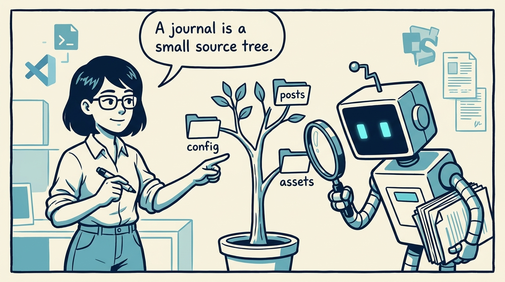
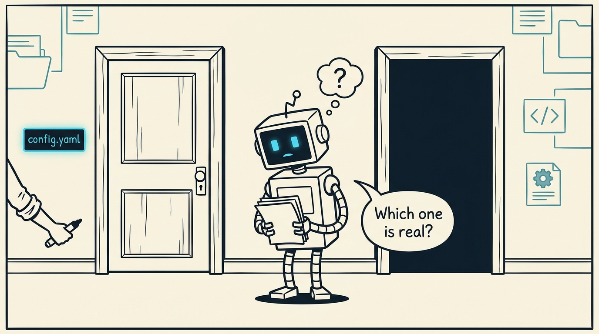
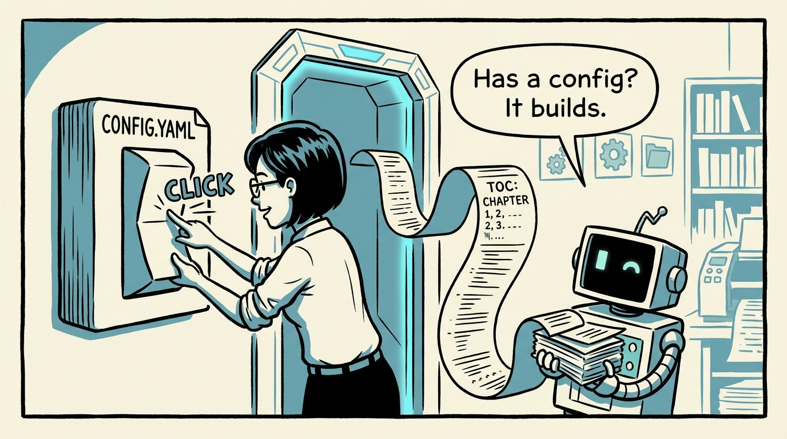
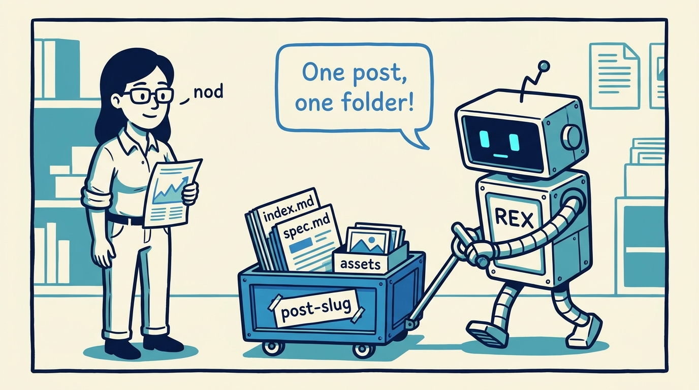
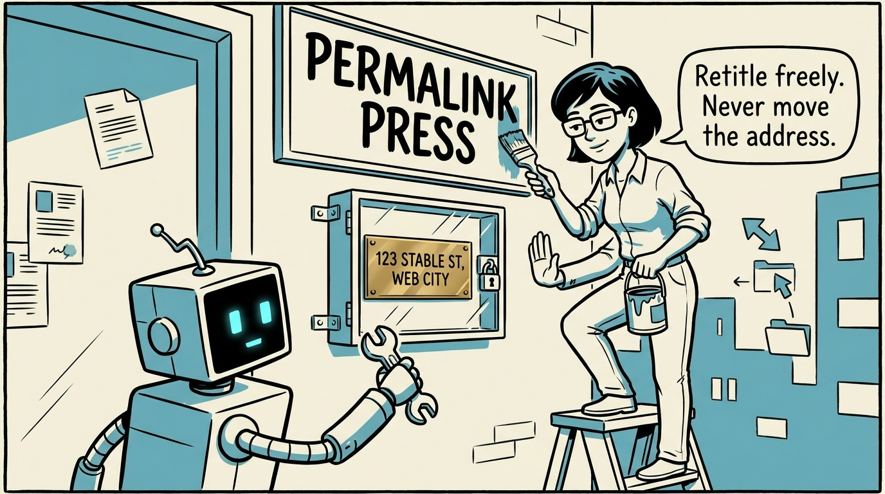
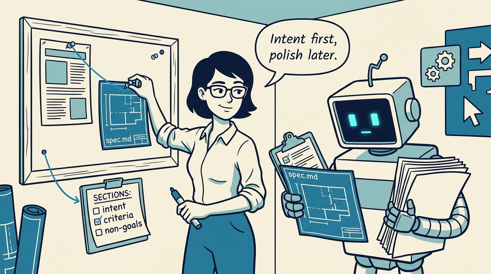
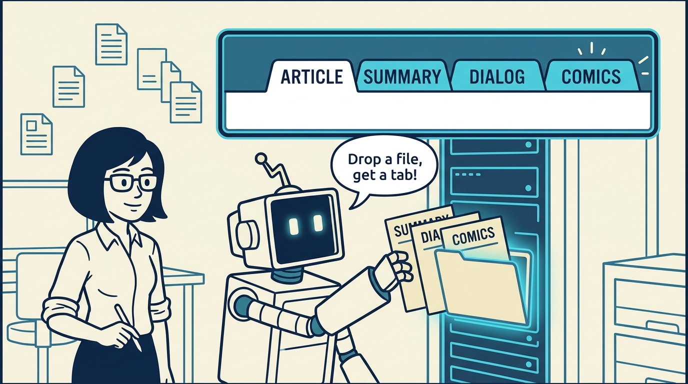
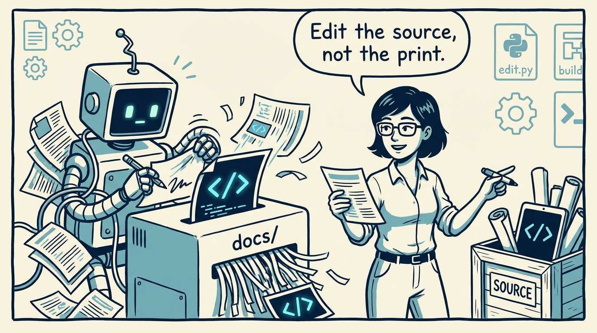

<!-- comic-style
{
  "cast": "MAYA: a pragmatic engineer-author, short dark hair, glasses, rolled-up sleeves, calm and slightly amused, often holding a marker or a printed page. REX: an over-eager boxy robot AI assistant, one bent antenna, glowing rectangular eyes, perpetually carrying or printing too many documents.",
  "style": "Clean two-tone explainer comic, thick ink outlines, flat colors with blue/teal accents on a light cream background, generous white space, hand-lettered speech bubbles with SHORT readable text (max 8 words per bubble), simple geometric office/library/print-shop settings mixing documents with software symbols, no photorealism, no dense text, no title text."
}
-->

A journal is a small source tree you can read like a map — in eight panels.

**Panel 1:** *One config file, a posts folder, optional assets — that is the whole anatomy.*

**Panel 2:** *Two directories can look the same — only one is a journal.*

**Panel 3:** *config.yaml turns a folder into a journal and fixes the reading order.*

**Panel 4:** *The per-post folder: article, spec, and media travel as one unit.*

**Panel 5:** *Front matter drives the page — and the permalink is a promise.*

**Panel 6:** *spec.md is not polish — it is the contract published beside the post.*

**Panel 7:** *Summary, dialog, comic: discovered by file presence, no config changes.*

**Panel 8:** *docs/ is rebuilt every time — the journal lives in its source tree.*
