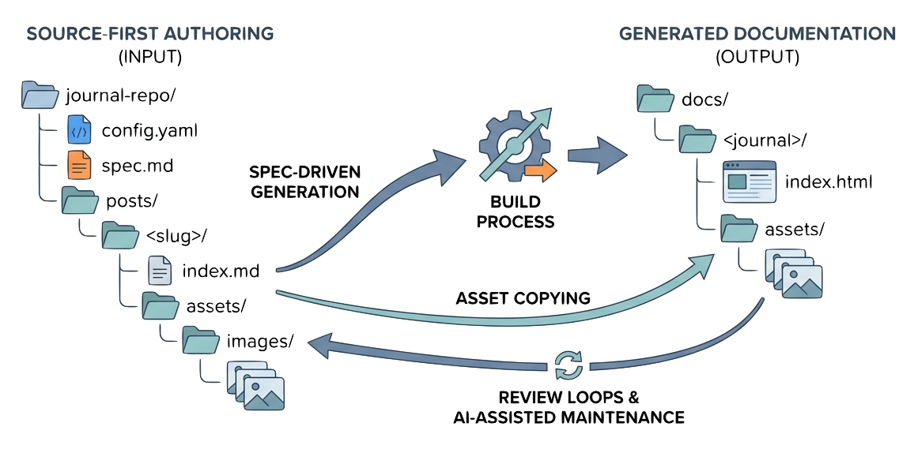

> A journal is a small source tree: one config file, a posts folder, optional assets, and per-post folders that keep the article, its spec, and its media together.

Every generated journal starts as a directory under `_journals/`.

If that directory has a `config.yaml`, the build treats it as a journal. If it does not, the build skips it. That makes it safe to leave placeholder directories around, but a publishable journal needs a config and posts.

## Journal Folder

The usual shape is:

```text
_journals/<journal>/
  config.yaml
  assets/
  posts/
```

`config.yaml` is the table of contents. `posts/` contains the source articles. `assets/` is optional journal-level media.

Generated output goes to:

```text
docs/<journal>/
```

The generated directory is removed and recreated during a build of that journal, so it should never be treated as the editing surface. In [Spec-Driven Journals](https://github.com/zeljkoobrenovic/spec-driven-journals), source lives in the official project repository, while the generated reading surface is [zeljkoobrenovic.github.io/spec-driven-journals](https://zeljkoobrenovic.github.io/spec-driven-journals/).

## Config File

The config file gives the journal its identity and order:

```yaml
title: Spec-Driven Journals
description: "A field guide to Spec-Driven Journals."

sections:
  - title: Foundations
    description: "The core ideas."
    posts:
      - what-are-spec-driven-journals/index.md
```

Post paths are relative to `_journals/<journal>/posts/`.

The generator sorts posts by basename, but with the per-post folder layout every post path ends in `index.md`. Python's stable sort preserves the config order, so the YAML order remains the reading order.

## Per-Post Folder

Current journals use this layout:

```text
posts/<slug>/
  index.md
  spec.md
  assets/
    images/
    icons/
```

`index.md` is the published article source.

`spec.md` is the working contract for non-trivial articles. When present, it is rendered as `docs/<journal>/<permalink>.spec.html`, and the post page gets a "View spec" link in its byline.

Per-post `assets/` are merged into the generated journal-level `assets/` folder. That lets body content use simple paths such as:

```markdown

```


*Illustration placeholder: `journal-folder-anatomy.png` should show `config.yaml`, `posts/<slug>/index.md`, `spec.md`, per-post `assets/images/`, and the generated `docs/<journal>/` output, including asset copying.*

## Front Matter

Posts start with front matter:

```markdown
---
title: "Anatomy of a Journal"
date: 2026-05-22
author: by Željko Obrenović (obren.io)
permalink: anatomy-of-a-journal
timetoread: 8 min
excerpt: "A short index-card summary."
tags: journal structure, config, posts
icon: assets/icons/anatomy-of-a-journal.png
logo: assets/images/anatomy-of-a-journal/logo.jpeg
logo_credit: Image generated by Google Gemini
---
```

The most important fields are:

| Field | Role |
| --- | --- |
| `title` | Used in post pages, index cards, browser titles, and cross-link text. |
| `permalink` | Stable output slug. The page becomes `docs/<journal>/<permalink>.html`. |
| `excerpt` | Summary shown on the journal index card. |
| `tags` | Comma-separated chips on the post page. |
| `icon` | Optional index-card image. |
| `logo` | Optional post hero image. |

For already-published posts, `permalink` should be stable. Rewording a title is normal; changing a permalink breaks links.

## Specs

A spec has small front matter and a predictable body:

```markdown
---
status: draft
revised: 2026-05-22
---

# Spec: Anatomy of a Journal

## Intent
...
```

The important spec sections are:

- Intent
- Audience
- Success criteria
- Non-goals
- Open questions
- Decision log
- Sources
- Changelog

Specs are not public polish. They are working documents. Their job is to make intent visible before the article text hardens.

## Journal-Level Assets

Some assets belong to the journal as a whole:

```text
_journals/<journal>/assets/
```

These are copied directly into `docs/<journal>/assets/`.

Per-post assets are better when the image or file belongs to a specific article. Journal-level assets are better for shared icons, shared images, or a journal logo.

## What To Check When Adding A Post

Before considering a post wired correctly, check:

- The folder exists under `_journals/<journal>/posts/<slug>/`.
- `index.md` has front matter with a stable `permalink`.
- A non-trivial post has a sibling `spec.md`.
- The post path appears in `config.yaml`.
- Any images use `assets/...` paths.
- The scoped journal build writes `docs/<journal>/<permalink>.html`.
- The generated page has a "View spec" link if the spec exists.

That is the basic anatomy. The next article, [[cross-links-assets-and-blocks]], explains how content inside those post folders becomes links, images, diagrams, and richer rendered blocks.
